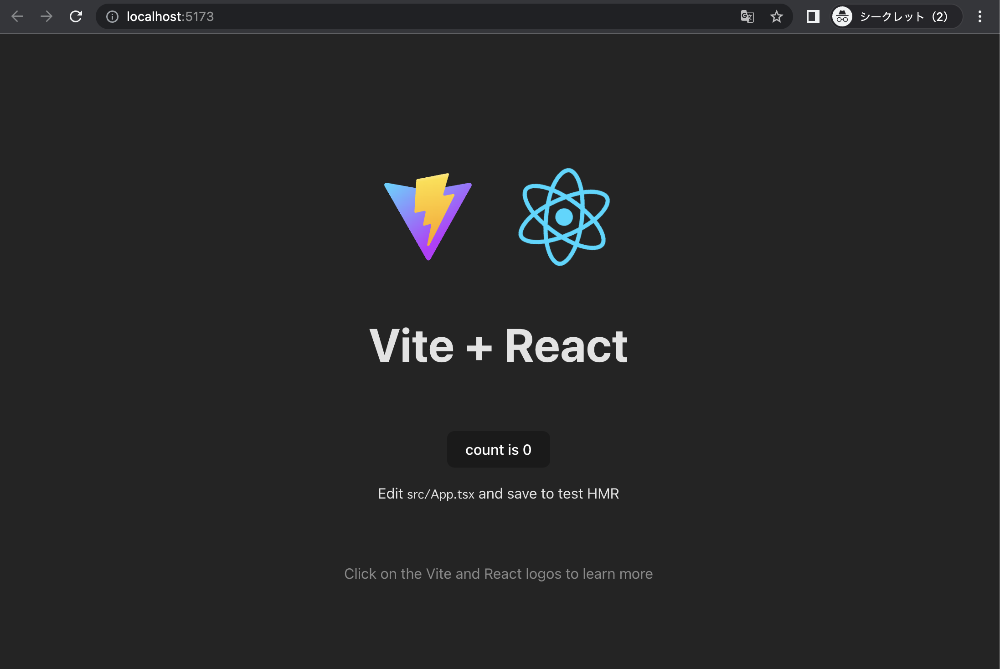
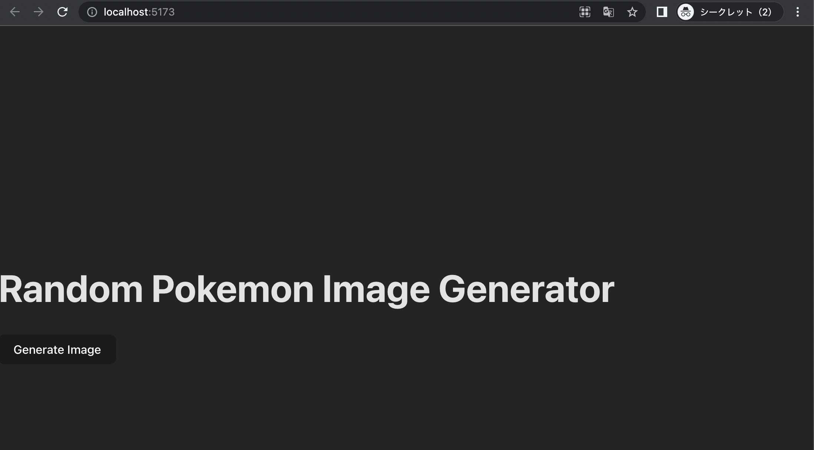
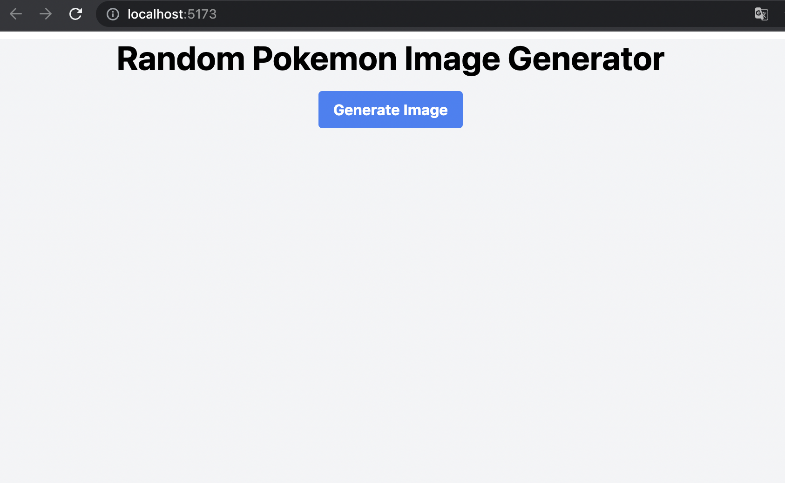
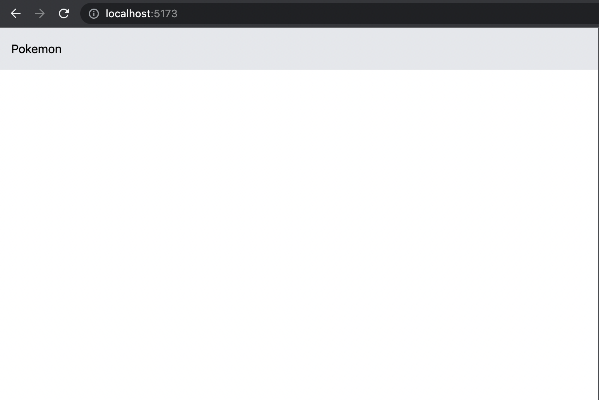

# Hands-on to develop simple & easy UI

## 0. はじめに

このハンズオンは、モダンなWebアプリケーション開発の初心者を対象としています。この資料で知識を学ぶことが目的ではなく、実際に開発を体験することで、モダンなWebアプリケーション開発やそれに必要なスキルや知識に興味を持ってもらうことを目的としています。  
このため、プログラミング言語、ツール、ライブラリ、コードについてはあまり説明しません。あくまでも、実際に動くWebアプリを開発することを体験していただくことを優先します。
参考となるWebサイトへのリンクは、必要に応じて提供します。

### 作るもの

外部APIを呼び出し、その情報を画面に表示するシンプルなUIを構築します。

**注意事項**:  
今回のハンズオンで使用する外部APIは、[PokéAPI](https://pokeapi.co/)です。この資料を書いている時点では利用可能ですが、ハンズオンを行う際にその利用可否は保証できません。もし、利用できない場合は、他のAPIに置き換えて実装してください。

### 主な技術スタック

- [Javascript](https://developer.mozilla.org/en-US/docs/Web/JavaScript)/[Typescript](https://www.typescriptlang.org/)
- [React](https://react.dev/)
- [Vite](https://vitejs.dev/)

---
- TIPS:
- 初心者向けハンズオンでTypeScriptが選ばれた理由、そしてJavaScript初心者でもTypeScriptをやるべき理由
    - JavaScript初心者が、JavaScriptと一緒にTypeScriptを学ぶべき理由はいくつかあります。
      - TypeScriptはJavaScriptのスーパーセットなので、JavaScriptの知識があれば、すぐにTypeScriptを習得することができます。
      - TypeScriptは静的型付け言語であるため、JavaScriptよりもエラーを検出しやすいです。そのため、開発効率の向上やバグの防止が期待できます。
      - TypeScriptは型定義ファイルを利用することで、コードの再利用を容易にすることができます。そのため、コードの保守性を向上させることができます。
    - このように、TypeScriptは学習コストが低く、開発効率や保守性を向上させ、JavaScriptの初心者にも向いている優れた言語です。さらに、TypeScriptは現在、開発の現場ではデファクトスタンダードとなっています。
    - JavaScriptを学ぶなら、ぜひTypeScriptも学んでみてください。
- UIフレームワーク/ライブラリ
    - Reactは、UIフレームワーク/ライブラリの一つです。その他、[Vue.js](https://vuejs.org/)、[Svelte](https://svelte.dev/)、[Angular](https://angular.io/)があります。
    - Next.js、Nuxt.js、SvelteKitもUIフレームワーク/ライブラリの一つです。これらはそれぞれReact、Vue、Svelteをベースに、SSRや便利なツールなどの追加機能をパッケージ化したものです。
  - Viteを使う理由
    - Viteは、高速で効率的なフロントエンド開発を促進するビルドツールです。
    - Viteは、高速な起動時間、ホットモジュールの即時置換、合理的なバンドルとリロードを提供することにより、高効率で楽しい開発者体験を提供し、スムーズで生産的な開発ワークフローを実現します。
      - (当初、本ハンズオンはReactのみで作成しましたが、より快適に楽しんでもらうために、Viteを追加しました。)

## 1. Setup

### 前提条件

- Node.js 16 or above
- Code Editor (e.g., Visual Studio Code)

**注意事項**：  
ここに記載されている必要なソフトウェアのインストール手順は、PowershellやWSLも使用しないWindowsユーザーを対象としています。
これは、このハンズオンの最初のターゲットユーザーが、PowershellやWSLを使用しないWindowsユーザーであるためです。実際にソフトウェアをインストールする際には、ご自身の環境に応じたインストール手順で行ってください。

### Windowsユーザー向けの詳細な手順

- Node.jsのインストール
  - [Node.jsのウェブサイト](https://nodejs.org/en/)にアクセスし、最新のLTS（Long-Term Support）バージョンのWindows用のNode.jsをダウンロードします。インストーラーを実行し、プロンプトに従ってNode.jsをインストールします。
  - コマンドプロンプトを開き、以下のコマンドを実行して、Node.jsとnpm（Node Package Manager）が正しくインストールされていることを確認します：
  ```sh
  node --version
  npm --version
  ```
  - どちらのコマンドも、お使いのシステムにインストールされているそれぞれのバージョンを表示するはずです。
- Visual Studio Code(VS Code)のインストール
  - [Visual Studio Codeのウェブサイト](https://code.visualstudio.com/)にアクセスし、最新版のWindows用のVisual Studio Codeをダウンロードしてください。インストーラーを実行し、画面の指示に従ってVisual Studio Codeをインストールします。
- VS Codeの拡張機能のインストール
  - Visual Studio Codeをインストールしたら、以下の拡張機能をインストールして、Webアプリの開発体験を向上させることをお勧めします：
  - Visual Studio Codeを起動します。
  - 左サイドバーの四角いアイコンをクリックするか、Ctrl+Shift+Xを押して、Extensionsサイドバーを開きます。
  - 以下の拡張機能を検索し、各拡張機能の横にある「インストール」ボタンをクリックします：
    - ESLint
    - Prettier
    - ES7 React/Redux/GraphQL
    - JavaScript (ES6) code snippets
    - **技術は常に進化しており、この情報はいつでも古くなる可能性があることにご留意ください。**
- (オプション)VSCodeでオートフォーマット機能を有効にする
  - **備考**：Prettierを使用すると、VSCodeに保存する際に、自動的にファイルをフォーマットすることができます。煩わしいフォーマッティングを自動で行ってくれます。
  - **注意事項**: この手順の説明は、VScodeの表示設定が英語です。日本語の場合は読み替えてください。
  - "Default Formatter"("defaultFormatter")の設定変更
    - VSCodeの設定（File > Preferences > Settings）を開くか、ショートカット（Ctrl+,）を使用します。
    - 設定の中で「Default Formatter」または「defaultformatter」を検索し、デフォルトフォーマッタとして「Prettier - Code formatter」を選択します。
  - "Editor: Format On Save"の設定変更
    - VSCodeの設定（File > Preferences > Settings）を開くか、ショートカット（Ctrl+,）を使用します。
    - 設定の中で、「Editor: Format On Save」または「Save」を検索します。このオプションは、ファイルを保存する際に、コードを自動的にフォーマットします。
  - Prettierが自分の好みに合わせてコードをフォーマットするように設定することができます。[詳しくはこちらをご覧ください](https://marketplace.visualstudio.com/items?itemName=esbenp.prettier-vscode)

## 2. メインパート(UI作成)

### 新しいReactプロジェクトの初期化

#### 1. create-viteコマンドを使用して新しいReactプロジェクトの作成

以下のコマンドを実行し、Create Viteツールを使用して新しいReactプロジェクトを初期化します：

```sh
npm create vite@latest first-app -- --template react-ts
```

#### 2. インストールが完了すると、プロジェクトにReact+Viteの標準テンプレートがセットアップされます。

以下のコマンドを実行すると、プロジェクトが起動し、確認することができます。

```sh
cd first-app
npm install
npm run dev
```

このコマンドは、Node.jsサーバーを起動し、アプリを表示する新しいブラウザウィンドウを起動します。



コマンドラインで「Ctrl + c」でReact+Viteアプリの実行を停止することができます。

#### 3. HTTP リクエストを行うための axios ライブラリのインストール：

```sh
npm install axios
```

Reactアプリの実行を止めずに、別のターミナルを開いて上記コマンドを実行することも可能です。

### ランダムなポケモンを表示するコンポーネントの作成

#### 1. src/App.tsxファイルを開き、その内容を以下のコードに置き換えます：


```jsx
import { useState } from "react";
import axios from "axios";

// APIから返されるポケモンオブジェクトの形を表すPokemonインタフェースを定義します。
interface Pokemon {
  name: string;
  imageUrl: string;
}

function App() {
  // useStateフックを使って、ポケモンのステートを定義します。
  const [pokemon, setPokemon] = useState<Pokemon | null>(null);
  
  // 「Generate Image」ボタンがクリックされたときに呼び出されるhandleClick関数を定義します。
  const handleClick = async () => {
    try {
      // 現在、約1000匹のポケモンがいるようなので、ポケモンIDを1〜1000の中からランダムに生成します。
      const randomId = Math.floor(Math.random() * 1000) + 1;
      // axiosライブラリを使って、そのIDのポケモンデータを返す外部APIにGETリクエストを行います。
      const response = await axios.get(
        `https://pokeapi.co/api/v2/pokemon/${randomId}`
      );
      // レスポンスデータは、setPokemon関数でポケモンステートに格納されます。
      setPokemon({
        name: response.data.name,
        imageUrl: response.data.sprites.front_default,
      });
    } catch (error) {
      console.error("Error fetching Pokemon:", error);
    }
  };

  // アプリのUIは、headerと「Generate Image」ボタン、ボタンをクリックしたときに表示されるポケモンの画像と名前（ある場合）で構成されています。
  // ポケモンのステートは、&&演算子を使って条件付きでポケモンの画像と名前を表示するために使われます。ポケモンがNULLでない場合、画像と名前はimgとp要素を使って表示されます。
  return (
    <div>
      <h1>Random Pokemon Image Generator</h1>
      <button onClick={handleClick}>Generate Image</button>
      {pokemon && (
        <div>
          
          {pokemon.imageUrl && <p>{pokemon.name}</p>}
        </div>
      )}
    </div>
  );
}

export default App;
```

- **備考**：
  - コードの解説をコードのコメントに書きました。参考程度なので、コードの説明がよくわからなくても大丈夫です。
- TIPS：
  - コンポーネントについて
    - Reactのコンポーネントを端的に説明すると、再利用可能なUI要素です。
    - コンポーネントという概念は、Vue.js、Svelte、Angularなど、他のモダンなUIフレームワークやライブラリでも共通する概念です。

#### 2. ブラウザを開き、http://localhost:5173にアクセスし、アプリケーションを表示します。「Get Random Pokémon」ボタンをクリックすると、PokeAPIからランダムにポケモンを取得し、名前と画像を表示します。

アプリを停止している場合は、以下のコマンドを実行します。  。
カレントディレクトリが、作成したReactプロジェクトの直下にあることを確認してください。

```sh
npm run dev
```



- **注意事項**：
  - テンプレートCSSが適用されています。少し変ですが、後のステップで少しデザインを施しますので、そのままにしておきます。

### リファクタリング

コードを書くときには、整理して読みやすくすることが大切です。リファクタリングとは、既存のコードの動作を変えずに、その中身（構造）を改善するプロセスです。これにより、コードの理解、維持（保守）、将来の拡張を容易にすることができます。

今回のケースでは、さしあたりポケモンの画像処理とコンテンツをApp.tsxに直接書き込んでいます。しかし、アプリが複雑になるにつれて、コードを整理してモジュール化するために、別のコンポーネントとして独自のファイルに抽出するのは良いアイデアです。

- TIPS
  - コンポーネントのリファクタリングについて
    - コードの各パーツをコンポーネント化することで、再利用性、関心の分離、保守性が促進されます。コンポーネント化のレベルを決めるのは、アプリケーションのサイズ、複雑さ、特定の要件に依存します。

#### 1. App.tsxのランダム画像表示処理に関わる全てをApp.tsxの別関数として定義

**注意事項**:  
コードをおいやすくするため（わかりやすいように）、リファクタリングは、同じファイル内で一度行います。  
このステップは、次のステップまで省略することができます。

##### src/App.tsxファイルを開き、その内容を以下のコードに置き換えます：

```jsx
// App.tsx

import { useState } from "react";
import axios from "axios";

// PokemonContainerコンポーネントを定義する。
// App.tsxのランダム画像表示の処理に関連するものは全てこのコンポーネントに定義されています。
function PokemonContainer() {
  interface Pokemon {
    name: string;
    imageUrl: string;
  }

  const [pokemon, setPokemon] = useState<Pokemon | null>(null);
  
  const handleClick = async () => {
    try {
      const randomId = Math.floor(Math.random() * 1000) + 1;
      const response = await axios.get(
        `https://pokeapi.co/api/v2/pokemon/${randomId}`
      );
      setPokemon({
        name: response.data.name,
        imageUrl: response.data.sprites.front_default,
      });
    } catch (error) {
      console.error("Error fetching Pokemon:", error);
    }
  };

  return (
    <div>
      <h1>Random Pokemon Image Generator</h1>
      <button onClick={handleClick}>Generate Image</button>
      {pokemon && (
        <div>
          
          {pokemon.imageUrl && <p>{pokemon.name}</p>}
        </div>
      )}
    </div>
  );
}

// PokemonContainerコンポーネントを使います（呼びます）
function App() {
  return (
    <div>
      <PokemonContainer />
    </div>
  );
}

export default App;
```

##### ブラウザを開き、アプリケーションの動作に変化がないかを確認します。

#### 2. App.tsxからPokemonContainerコンポーネントを分割

##### src/PokemonContainer.tsxファイルを作成し、その内容を以下のコードに置き換えます：

```jsx
// PokemonContainer.tsx

// App.tsxのうち、PokemonContainerコンポーネントに関連する部分をすべてこのファイルに移動します。
import { useState } from "react";
import axios from "axios";

function PokemonContainer() {
  interface Pokemon {
    name: string;
    imageUrl: string;
  }
  const [pokemon, setPokemon] = useState<Pokemon | null>(null);
  
  const handleClick = async () => {
    try {
      const randomId = Math.floor(Math.random() * 1000) + 1;
      const response = await axios.get(
        `https://pokeapi.co/api/v2/pokemon/${randomId}`
      );
      setPokemon({
        name: response.data.name,
        imageUrl: response.data.sprites.front_default,
      });
    } catch (error) {
      console.error("Error fetching Pokemon:", error);
    }
  };

  return (
    <div>
      <h1>Random Pokemon Image Generator</h1>
      <button onClick={handleClick}>Generate Image</button>
      {pokemon && (
        <div>
          
          {pokemon.imageUrl && <p>{pokemon.name}</p>}
        </div>
      )}
    </div>
  );
}

// 他のコンポーネントから呼び出すことができるようにします。
export default PokemonContainer;
```

##### src/App.tsxファイルを開き、その内容を以下のコードに置き換えます：

```jsx
// App.tsx

// 不要になったimport文の削除しました。
// App.tsx で使用するために PokemonContainerコンポーネントをインポートしています。
import PokemonContainer from "./PokemonContainer";

function App() {
  return (
    <div>
      <PokemonContainer />
    </div>
  );
}

export default App;
```

##### ブラウザを開き、アプリケーションの動作に変化がないか確認します。

#### 3. 画像や名前の表示に関する処理を、PokemonContainer.tsxから別コンポーネントとして分割します。

- **注意事項**：
  - コードをおいやすくするため（わかりやすいように）、リファクタリングは、同じファイル内で一度行います。このステップは、次のステップまで省略することができます
  - 実際のアプリケーションでここまでリファクタリングするかどうかは、アプリケーションの規模、コードの複雑さ、コンポーネントの再利用の有無などによって判断する必要があります。

##### src/PokemonContainer.tsx ファイルを開き、その内容を以下のコードに置き換えます：

```jsx
// PokemonContainer.tsx
import { useState } from "react";
import axios from "axios";

interface Pokemon {
    name: string;
    imageUrl: string;
}

// PokemonDisplayPropsインターフェイスを定義します。これらは、PokemonDisplayコンポーネントに渡すpropsです。
interface PokemonDisplayProps {
    pokemon: Pokemon | null;
}

// PokemonDisplayコンポーネントを定義します。
// PokemonContainerコンポーネントからポケモンの画像と名前の表示に関する処理を取り出し、このコンポーネントに定義します。
function PokemonDisplay({pokemon}: PokemonDisplayProps ) {
    return (
        <div>
            {pokemon && (
        <div>
          
          {pokemon.imageUrl && <p>{pokemon.name}</p>}
        </div>
      )}
        </div>
    )
}

function PokemonContainer() {
  
  const [pokemon, setPokemon] = useState<Pokemon | null>(null);
  
  const handleClick = async () => {
    try {
      const randomId = Math.floor(Math.random() * 1000) + 1;
      const response = await axios.get(
        `https://pokeapi.co/api/v2/pokemon/${randomId}`
      );
      setPokemon({
        name: response.data.name,
        imageUrl: response.data.sprites.front_default,
      });
    } catch (error) {
      console.error("Error fetching Pokemon:", error);
    }
  };

  // PokemonDisplayコンポーネントを使用します（呼び出します）。
  return (
    <div>
      <h1>Random Pokemon Image Generator</h1>
      <button onClick={handleClick}>Generate Image</button>
      <PokemonDisplay pokemon={pokemon} />
    </div>
  );
}

export default PokemonContainer;
```

##### ブラウザを開き、アプリケーションの動作に変化がないか確認します。

#### 4. PokemonDisplayコンポーネントをPokemonContainer.tsxから分割します。

##### src/PokemonDisplay.tsxファイルを作成し、その内容を以下のコードに置き換えます：


```jsx
// PokemonDisplay.tsx

// PokemonContainer.tsxのPokemonDisplayコンポーネントに関連する部分をすべてこのファイルに移動します。

// 「export」を付加し、他のコンポーネントから呼び出すことができるようにします。
// これは、PokemonContainerでもPokemonインターフェイスが使われているためです。
export interface Pokemon {
    name: string;
    imageUrl: string;
}

interface PokemonDisplayProps {
    pokemon: Pokemon | null;
}

function PokemonDisplay({pokemon}: PokemonDisplayProps ) {
    return (
        <div>
            {pokemon && (
        <div>
          
          {pokemon.imageUrl && <p>{pokemon.name}</p>}
        </div>
      )}
        </div>
    )
}

// 他のコンポーネントから呼び出せるようにします。
export default PokemonDisplay;
```

##### src/PokemonContainer.tsx ファイルを開き、その内容を以下のコードに置き換えます：

```jsx
// PokemonContainer.tsx
import { useState } from "react";
import axios from "axios";
import PokemonDisplay, { Pokemon } from "./PokemonDisplay";

function PokemonContainer() {
  
  const [pokemon, setPokemon] = useState<Pokemon | null>(null);
  
  const handleClick = async () => {
    try {
      const randomId = Math.floor(Math.random() * 1000) + 1;
      const response = await axios.get(
        `https://pokeapi.co/api/v2/pokemon/${randomId}`
      );
      setPokemon({
        name: response.data.name,
        imageUrl: response.data.sprites.front_default,
      });
    } catch (error) {
      console.error("Error fetching Pokemon:", error);
    }
  };

  return (
    <div>
      <h1>Random Pokemon Image Generator</h1>
      <button onClick={handleClick}>Generate Image</button>
      <PokemonDisplay pokemon={pokemon} />
    </div>
  );
}

export default PokemonContainer;
```

##### ブラウザを開き、アプリケーションの動作に変化がないか確認する。

#### 5. PokemonDisplayコンポーネントの名前を一般的な名前に変更します。

PokemonDisplayコンポーネントは、ポケモン以外のキャラクターでも使えるように、より一般的な名前にすることにします。

##### src/PokemonDisplay.tsx を src/ItemDisplay.tsx にリネームして、その内容を以下のコードに変更します：

**注意事項:** ファイル名を変更した際、VS Codeからのインポートを変更するかどうか尋ねられます。今回の場合、「No」を選択します。

```jsx
// ItemDisplay.tsx

export interface Item {
    name: string;
    imageUrl: string;
}

interface ItemDisplayProps {
    item: Item | null;
}

function ItemDisplay({ item }: ItemDisplayProps) {
  return (
    <div>
      {item && (
        <div>
          
          {item.imageUrl && <p>{item.name}</p>}
        </div>
      )}
    </div>
  );
}

export default ItemDisplay;
```

##### src/PokemonContainer.tsx ファイルを開き、その内容を以下のコードに置き換えます：

```jsx
// PokemonContainer.tsx
import { useState } from "react";
import axios from "axios";
import ItemDisplay, { Item } from "./ItemDisplay";

function PokemonContainer() {
  
  const [pokemon, setPokemon] = useState<Item | null>(null);
  
  const handleClick = async () => {
    try {
      const randomId = Math.floor(Math.random() * 1000) + 1;
      const response = await axios.get(
        `https://pokeapi.co/api/v2/pokemon/${randomId}`
      );
      setPokemon({
        name: response.data.name,
        imageUrl: response.data.sprites.front_default,
      });
    } catch (error) {
      console.error("Error fetching Pokemon:", error);
    }
  };

  return (
    <div>
      <h1>Random Pokemon Image Generator</h1>
      <button onClick={handleClick}>Generate Image</button>
      <ItemDisplay item={pokemon} />
    </div>
  );
}

export default PokemonContainer;
```

##### ブラウザを開き、アプリケーションの動作に変化がないか確認します。

### (オプション)デザインを適用する

CSSライブラリを導入して、ほんの少し見栄えを良くします。

- TIPS：
  - CSS/コンポーネントライブラリについて
    - 一般的に、フロントエンド開発において、CSSライブラリとコンポーネントライブラリは異なる役割を果たします。
    - Tailwind CSSのようなCSSライブラリは、HTML要素のスタイル設定に使えるスタイルやクラスがあらかじめ用意されています。
    - Bootstrapのようなコンポーネントライブラリは、一貫性のあるプロフェッショナルなユーザーインターフェイスを作成するために使用でき、あらかじめ構築されたUIコンポーネントを提供します。
    - この2つのどちらを選ぶかは、プロジェクトの要件、個人の好み、必要なカスタマイズのレベルによって決まります。

#### 1. Tailwind CSSのセットアップ

##### アプリの停止

コマンドラインで「Ctrl + c」を使い、React+Viteアプリの実行を停止します。

##### Tailwind CSSのインストール

カレントディレクトリが作成したReactプロジェクトの直下にあることを確認し、以下のコマンドを実行します：

```sh
npm install -D tailwindcss postcss autoprefixer
npx tailwindcss init -p
```

##### tailwind.config.jsファイルに、すべてのテンプレートファイルのパスを追加します。

src/tailwind.config.jsファイルを開き、その内容を以下のコードに置き換えます：

```js
/** @type {import('tailwindcss').Config} */
export default {
  content: [
    "./index.html",
    "./src/**/*.{js,ts,jsx,tsx}",
  ],
  theme: {
    extend: {},
  },
  plugins: [],
}
```

##### CSSにTailwindディレクティブを追加する

src/index.cssファイルを開き、その内容を以下のコードに置き換えます：

```css
@tailwind base;
@tailwind components;
@tailwind utilities;
```

#### 2. CSSの適用

##### src/PokemonContainer.tsx ファイルを開き、その内容を以下のコードに置き換えます：

```jsx
// PokemonContainer.tsx
import { useState } from "react";
import axios from "axios";
import ItemDisplay, { Item } from "./ItemDisplay";

function PokemonContainer() {
  
  const [pokemon, setPokemon] = useState<Item | null>(null);
  
  const handleClick = async () => {
    try {
      const randomId = Math.floor(Math.random() * 1000) + 1;
      const response = await axios.get(
        `https://pokeapi.co/api/v2/pokemon/${randomId}`
      );
      setPokemon({
        name: response.data.name,
        imageUrl: response.data.sprites.front_default,
      });
    } catch (error) {
      console.error("Error fetching Pokemon:", error);
    }
  };

  return (
    <div className="flex flex-col items-center justify-start h-screen bg-gray-100 my-2">
      <h1 className="text-4xl font-bold mb-4">Random Pokemon Image Generator</h1>
      <button
        className="bg-blue-500 hover:bg-blue-700 text-white font-bold py-2 px-4 rounded cursor-pointer"
        onClick={handleClick}
      >
        Generate Image
      </button>
      {pokemon && <ItemDisplay item={pokemon} />}
    </div>
  );
}

export default PokemonContainer;
```

以下、CSS設定前と設定後の違いです。ご参考まで。
**コードのコピー＆ペーストはしないでください。**  
"-"は変更前、"+"は変更後を意味します。

```jsx
-    <div>
-      <h1>Random Pokemon Image Generator</h1>
-      <button onClick={handleClick}>Generate Image</button
-      <ItemDisplay item={pokemon} />
+    <div className="flex flex-col items-center justify-start h-screen bg-gray-100 my-2">
+      <h1 className="text-4xl font-bold mb-4">Random Pokemon Image Generator</h1>
+      <button
+        className="bg-blue-500 hover:bg-blue-700 text-white font-bold py-2 px-4 rounded cursor-pointer"
+        onClick={handleClick}
+      >
+        Generate Image
+      </button>
+      {pokemon && <ItemDisplay item={pokemon} />}
```

##### src/ItemDisplay.tsx ファイルを開き、その内容を以下のコードに置き換えます：


```jsx
// ItemDisplay.tsx

export interface Item {
    name: string;
    imageUrl: string;
}

interface ItemDisplayProps {
    item: Item | null;
}

function ItemDisplay({ item }: ItemDisplayProps) {
  return (
    <div>
      {item && (
        <div className="mt-4">
          
          <p className="text-sm text-gray-500 text-center mt-2">{item.name}</p>
        </div>
      )}
    </div>
  );
}

export default ItemDisplay;
```

以下、CSS設定前と設定後の違いです。ご参考まで。
**コードのコピー＆ペーストはしないでください。**  
"-"は変更前、"+"は変更後を意味します。

```jsx
-        <div>
-          
-          {item.imageUrl && <p>{item.name}</p>}
+        <div className="mt-4">
+          
+          <p className="text-sm text-gray-500 text-center mt-2">{item.name}</p>
```

##### npm run dev でビルドプロセスを実行します。

カレントディレクトリが作成したReactプロジェクトの直下にあることを確認し、以下のコマンドを実行します：

```sh
npm run dev
```

##### ブラウザを開いて、CSSが適用されたアプリケーションを確認してください。

**備考**： 表示は以下のように変化します。



### (Option)もう少しSPAっぽくする

navbarを導入して、ポケモンだけでなく犬のメニューも追加して、もう少しSPAっぽくしてみましょう。

#### 1. react-routerのセットアップ
##### react-routerのインストール
カレントディレクトリが作成したReactプロジェクトの直下にあることを確認し、以下のコマンドを実行します：

```sh
npm install react-router-dom
```

- TIPS:
  - react-router, ルーティングについて
    - React Routerは、Reactアプリケーションのための人気のあるルーティングライブラリです。
      - 他のライブラリやフレームワークには、独自のルーティングソリューションがあります。例えば、AngularにはAngular Routerがあり、VueにはVue Routerがある、といったように。
    - ルーティングは、React以外にも様々なライブラリやフレームワークにも当てはまる概念です。
      - Web開発のコンテキストにおいて、ルーティングは、異なるURLやパスを処理し、アプリケーション内の特定のコンポーネントやアクションにマッピングすることを意味します。

**注意事項:**   
執筆時点のReact routeのバージョンはv6です。上記のようにインストールすればv6を利用できるはずです。バージョンを指定してインストールする場合は、v5とv6で設定が異なるので注意してください。

#### 2.navbarの導入

メニューは今のところポケモンしかありませんが、navbarを導入します。

##### src/App.tsxファイルを開き、その内容を以下のコードに置き換えます：

```jsx
// App.tsx
import PokemonContainer from "./PokemonContainer";
import { BrowserRouter as Router, Routes, Route, Link } from "react-router-dom";

function App() {
  return (
    <Router>
      <div>
        <nav className="bg-gray-200 p-4">
          <ul className="flex">
            <li className="mr-4">
              <Link to="/pokemon">Pokemon</Link>
            </li>
          </ul>
        </nav>

        <Routes>
          <Route path="/pokemon" element={<PokemonContainer />} />
        </Routes>
        
      </div>
    </Router>
  );
}

export default App;
```

##### ファイルを保存し、ブラウザを開いて http://localhost:5173 にアクセスし、アプリケーションを表示します。上部navbarの「Pokemon」をクリックし、「Get Random Pokemon」画面が表示されることを確認します。



#### 3. 犬メニューの追加

ポケモンだけでなく、犬の画像をランダムに表示するメニューを追加します。

##### src/DogContainer.tsx ファイルを作成し、その内容を以下のコードに置き換えます：

DogContainer.tsxでは、PokemonContainer.tsxと同様に犬の画像がランダムに取得されます。
デザインも同じです。  。
リファクタリングしてコンポーネント化したItemDisplay.tsxは、DogContainer.tsxとPokemonContainer.tsxの両方で使用されています。

```jsx
// DogContainer
import { useState } from "react";
import axios from "axios";
import ItemDisplay, { Item } from "./ItemDisplay";

function DogContainer() {
  const [dog, setDog] = useState<Item | null>(null);

  const handleClick = async () => {
    try {
      const response = await axios.get(
        "https://dog.ceo/api/breeds/image/random"
      );
      setDog({
        name: "dog image",
        imageUrl: response.data.message,
      });
    } catch (error) {
      console.error("Error fetching dog:", error);
    }
  };

  return (
    <div>
      <div className="flex flex-col items-center justify-start h-screen bg-gray-100 my-2">
        <h1 className="text-4xl font-bold mb-4">Random Dog Image Generator</h1>
        <button
          className="bg-blue-500 text-white font-bold py-2 px-4 rounded cursor-pointer"
          onClick={handleClick}
        >
          Generate Image
        </button>
        {dog && <ItemDisplay item={dog} />}
      </div>
    </div>
  );
}

export default DogContainer;
```

##### src/App.tsxファイルを開き、その内容を以下のコードに置き換えます：

```jsx
// App.tsx
import PokemonContainer from "./PokemonContainer";
import DogContainer from "./DogContainer";
import { BrowserRouter as Router, Routes, Route, Link } from "react-router-dom";

function App() {
  return (
    <Router>
      <div>
        <nav className="bg-gray-200 p-4">
          <ul className="flex">
            <li className="mr-4">
              <Link to="/pokemon">Pokemon</Link>
            </li>
            <li className="mr-4">
              <Link to="/dog">Dog</Link>
            </li>
          </ul>
        </nav>

        <Routes>
          <Route path="/pokemon" element={<PokemonContainer />} />
          <Route path="/dog" element={<DogContainer />} />
        </Routes>
      </div>
    </Router>
  );
}

export default App;
```

##### ファイルを保存し、ブラウザを開いて http://localhost:5173 にアクセスし、アプリケーションを表示します。

「Pokemon」の横のnavbarに「Dog」メニューが追加されました。「Dog」メニューを押して、「Pokemon」と同じように画面の表示や処理ができることを確認してください。

## 3. 終わりに
これでハンズオンは終了です。お疲れ様でした。完全なコードは[こちら](https://github.com/minakamoto/pschs2023/tree/main/src/webapp/handson-for-catchup/src/1th/first-app)から確認できます。  
[](https://stackblitz.com/github/minakamoto/pschs2023/tree/main/webapp/handson-for-catchup/src/1th/first-app)

TOP画面がない、デザインが極端に悪い（ダサいデザインは意図的です！）など、修正すべき点は多々あります。ぜひ、あなたのアイデアでこのUIの改善や機能追加にチャレンジしてみてください。

### フロントエンド開発に興味がある人へのアドバイス

私見ですが、独学でフロントエンドの技術力を高めるには

1. Javascript/Typescript、HTML、CSSの基本を学ぶ。
1. 作りたいアプリケーションを考え、自分で開発してみる。
1. 作りたいアプリケーションが思いつかない場合、ハンズオンで学びたいUIやアプリケーションを探すか、Web上からコピーして真似して実装する(もちろんコピーは勉強のためだけです。)
1. 自分に足りない2.や3.の知識やスキルを把握し、深堀りする。

## 4. Links

- see [0th's Links](0th.md#3-links)
- Other well-known general sites
  - [freeCodeCamp](https://www.freecodecamp.org/)
  - [w3schools](https://www.w3schools.com/)
  - [scrimba](https://scrimba.com/)
- UI frameworks/libraries
  - UIフレームワークやライブラリを勉強したい方は、まず各フレームワークやライブラリの公式サイトにあるチュートリアルを試すことをお勧めします。
    - e.g.
      - [React tutorial](https://react.dev/learn/tutorial-tic-tac-toe)
      - [Svelte tutorial](https://svelte.dev/tutorial/basics)

