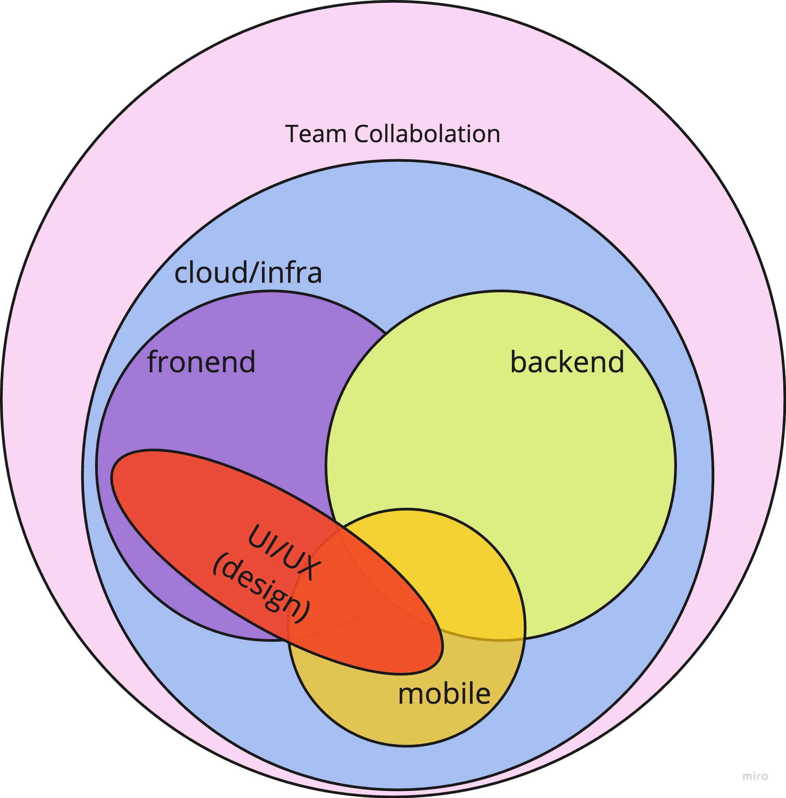

# Webアプリに関わる技術スタックの概要

## 0.はじめに

モダンなWebアプリと従来のWebアプリのアーキテクチャの違いや、モダンなWebアプリ開発に必要な技術スタックを参照するためのセッションです。
  - 表示されている情報を見て、他の参加者と話したり、興味のあることを見つけてみてください。モダンなWebアプリ開発とはどのようなものなのか、感じてみてください。
  - 初めて見たときは何が何だかわからないかもしれませんが、大丈夫です。従来のWeb開発とモダンなWeb開発は大きく違うこと、モダンなWeb開発で必要となる技術スタックの量と幅が広いことを知っていれば十分です。
  - ハンズオンなどをした後に、もう一度見に来てみると参考になるかもしれません。

## 1. Webアプリに関わる技術スタックの進化の概要

### 約20年前と現在のWebアプリ技術スタックの違い

#### multiple HTML pages(multi page application)とSPAアプリの比較にフォーカス：

次の図を見て、この仕組みのイメージをなんとなくつかんでみてください。詳細は次章で説明します。

#### 約20年前と現在のWebアプリの技術スタックの全体的な違い

この表は、約20年前のWebアプリ開発と現在のWebアプリ開発の主な違いをまとめたものです：

|          Aspect         | 20 Years Ago | Today                      |
|:-----------------------:|:------------:|:--------------------------:|
|    Application Architecture | Multiple HTML pages | Single-page apps |
|       Backend Architecture | Monolithic	| Monolithic, Microservices|
|    Frontend Technology Stack | Simple HTML, CSS, JavaScript | Advanced HTML, CSS, JavaScript(include library/framework like React, Angular, Vue.js, etc.) |
|       Backend Technology Stack | PHP, Perl, etc. |  JavaScript(Node.js), Python, Go, Rust, etc.|
|         Database           | RDB	| RDB, NoSQL| 
|        User Interface     | Static, page-based | Dynamic, interactive |
|        User Experience    | Not a priority | Responsive, intuitive, user-friendly |
|     Mobile-first approach | Not common | Optimized for mobile devices first |
|         Data Handling     | Server-side rendering | Client-side rendering |
|         Data Transfer     | Limited | GraphQL, RestAPI |
|          Performance      | Slow load times, page refreshes | Fast load times, smooth transitions |
|         Collaboration     | Mostly solo | Team-based using Git, Jira, Slack, etc. |
|   Development Process     | Waterfall model | Agile development methodologies |
|       Cloud Computing     | Physical servers | AWS, Azure, Google Cloud, etc. |
|          Deployment       | Manual deployment | Continuous deployment and delivery |

注目すべき違いとして、以下のようなものがあります：

- multiple HTML pages(multi page application)とSPAアプリの比較：
  - 20年ほど前のWebアプリ開発の標準では、multiple HTML pagesを使用し、各ページは別のHTMLファイルであり、ユーザーはページ間を移動するためにページ全体を再読み込みする必要がありました。そのため、読み込み時間が遅くなり、スムーズなユーザーエクスペリエンスではありませんでした。これに対して、モダンなWebアプリ開発では、シングルページアプリ（SPA）の人気です。SPAは高速で、よりシームレスなユーザーエクスペリエンスを提供し、パフォーマンスも優れています。しかし、開発が複雑になり、React、Vue、Angularといったより高度な技術が必要になる場合があります。また、SPAはSEO対策に問題がある場合もあります。SPAへの移行は、ユーザーエクスペリエンスとパフォーマンスを優先するWebアプリケーションの構築という大きな流れを反映していますが、より高度な開発スキルと検討が必要です。
- AJAX： 
  - AJAX（Asynchronous JavaScript and XML）は、Webアプリケーションがページ全体を再読み込みすることなくコンテンツを動的に更新することを可能にする技術です。AJAXは、Webページのユーザーエクスペリエンスを向上させるために使用できる、強力な技術です。AJAXは、現代のWebアプリケーション開発には欠かせない技術です。
- レスポンシブデザイン： 
  - かつて、Webアプリケーションは、異なる画面サイズに適応しない固定レイアウトで設計されるのが一般的でした。現在ではレスポンシブデザインが主流であり、Webアプリケーションはデスクトップ、タブレット、スマートフォンなどさまざまなデバイスで見栄えがよく、うまく機能することが求められています。
- モバイルファーストデザイン： 
  - スマートフォンやタブレット端末の普及に伴い、今日の多くのWebアプリケーションは、モバイルファーストのアプローチで設計されています。つまり、デザインはモバイルデバイスに最適化されており、デスクトップやタブレットのレイアウトは、モバイルデザインをベースに構築されます。
- セキュリティ 
  - サイバー脅威の増加により、セキュリティはWebアプリケーションの最大の関心事となっています。今日、Webアプリケーションは、SSL暗号化、二要素認証、クロスサイトスクリプティング（XSS）保護などのセキュリティ機能とともに設計されています。
- クラウドコンピューティング： 
  - 以前は、Webアプリケーションは物理的なサーバーにホストされ、開発チームによって保守・運用されるのが一般的でした。今日、クラウドコンピューティングはWebホスティングに革命をもたらし、Webアプリケーションをクラウドでホストすることがより簡単に、より手頃な価格で可能になりました。

## 2. モダンなWebアプリケーションの技術スタック

### モダンなWebアプリケーションを構築するために必要な技術スタックの概要と相関関係の説明

モダンなWebアプリケーションに必要な技術スタックは、フロントエンド、バックエンド、モバイル、UI/UX、インフラストラクチャなどの異なるレイヤーで構成され、それらが連携してシームレスなユーザーエクスペリエンスを実現します。組織の規模などによってチームの構成は異なりますが、アプリケーションの開発とデプロイを成功させるには、チームメンバーとクライアントやユーザーなどの外部ステークホルダーとの効果的な連携とコミュニケーションが必要不可欠です。アジャイル、XP、TDD、Git、そしてJira、Asana、Trelloなどの各種プロジェクト管理ツールは、このコラボレーションと管理を支援することができます。

#### モダンなWebアプリ開発における各技術レイヤーの簡単な説明：

- フロントエンド： 
  - HTML、CSS、JavaScriptやReact、Vue、Angularなどの各種フロントエンドフレームワークなどの技術を使用して、アプリケーションのユーザーインターフェースとユーザーエクスペリエンスを構築するレイヤーです。
- バックエンド： 
  - アプリケーションのビジネスロジックとデータストレージを扱うレイヤーです。Node.js、Python、Ruby、Javaなどのプログラミング言語や、Express.js、Nest.js、Django、FastAPI、Spring、Ruby on Railsなどの各種フレームワークといったサーバーサイド技術を使用します。
- モバイル 
  - Webアプリケーションと連動するモバイルアプリケーションの開発を担当するレイヤーです。Swift、Kotlin、Javaなどのネイティブアプリ開発フレームワークや、React Native、Flutterなどのクロスプラットフォーム開発フレームワークが使用されます。
- UI/UX： 
  - アプリケーションを視覚的に魅力的でシームレスなユーザーエクスペリエンスにさせるレイヤーです。Sketch、Figma、Adobe XDなどのデザインツールを使用します。
- インフラストラクチャー： 
  - アプリケーションのデプロイ、拡張、管理を担当するレイヤーです。AWS、Azure、GCPなどのクラウドプラットフォームや、Docker、Kubernetes、Ansible、TerraformなどのDevOpsツールを使用します。

各レイヤーにはそれぞれ異なるスキルと専門知識が必要であり、アプリケーションの開発とデプロイを成功させるためには、異なるチーム間のコラボレーションが不可欠です。

## モダンなWebアプリケーションに必要な技術スタックの詳細な名称（例としてのみ）を付箋に書き出した図

モダンなWebアプリケーション開発に必要な技術スタックの詳細な名称を付箋に例示しています。これらはあくまで例であり、筆者が執筆時にパッと思いついた技術スタックの名称を付箋に貼っています。技術は常に進化しており、この情報はいつでも古くなる可能性があることにご留意ください。

## 3. Links
- [MDN Web Docs](https://developer.mozilla.org/en-US/docs/Learn)
  - Web技術に関する情報が集められています。初心者のためのチュートリアルもあります。
- [microsoft/Web-Dev-For-Beginners](https://microsoft.github.io/Web-Dev-For-Beginners/#/)
  - マイクロソフトが提供するWeb開発初心者のためのカリキュラムです。
    - 上記カリキュラムの[追加コンテンツ](https://learn.microsoft.com/en-us/users/wirelesslife/collections/p1ddcy5jwy0jkm) 
      - 上の内容に加えて, さまざまなコンテンツが[Microsoft Learn](https://learn.microsoft.com/en-us/training/)にあります。
- [web.dev](https://web.dev/)
  - Google提供のモダンなWebアプリ開発のガイダンスです。
- [Developer Roadmaps](https://roadmap.sh/)
  - Webアプリ開発のさまざまな道筋を学習者に案内するロードマップ集を提供しています。さらに、ロードマップは定期的に更新され、この分野の最新のトレンドや技術に対応しています。
- [The State of JS](https://2022.stateofjs.com/en-US/)
  - 毎年、世界中のWebアプリ開発者から集めたアンケートをまとめたサイトです。JavaScriptを取り巻く動向や状況を知る上で参考になります。なお、URLは毎年変わっています。
