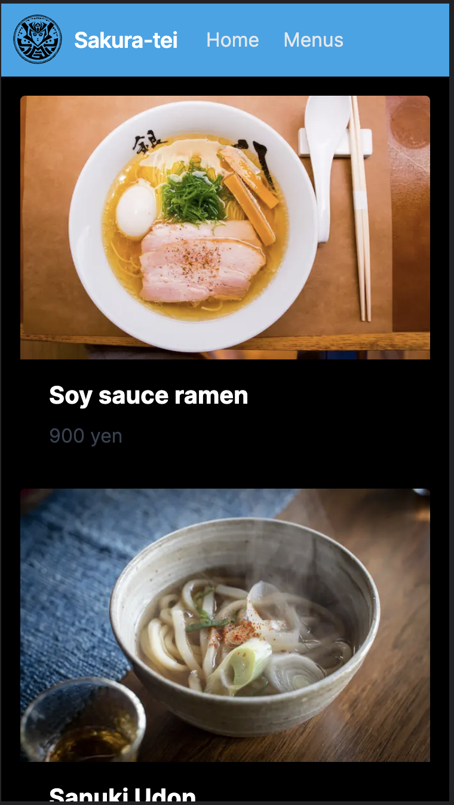
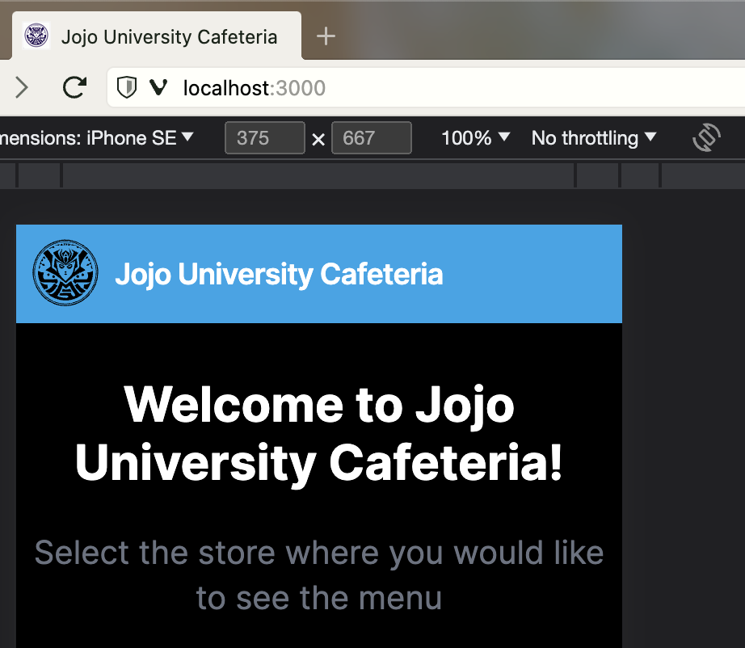
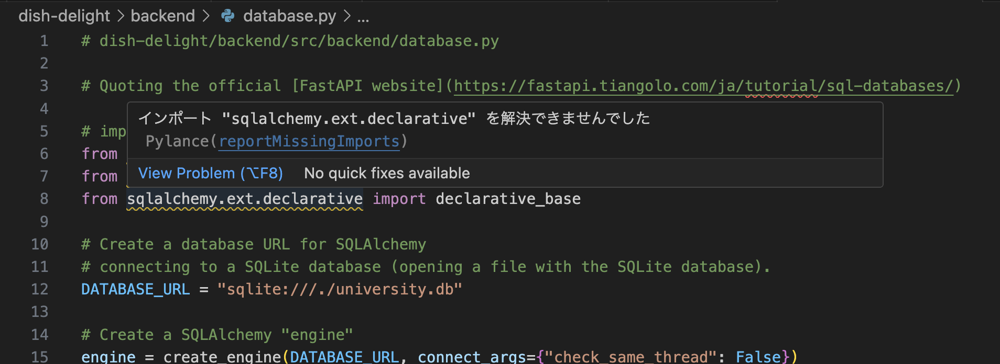
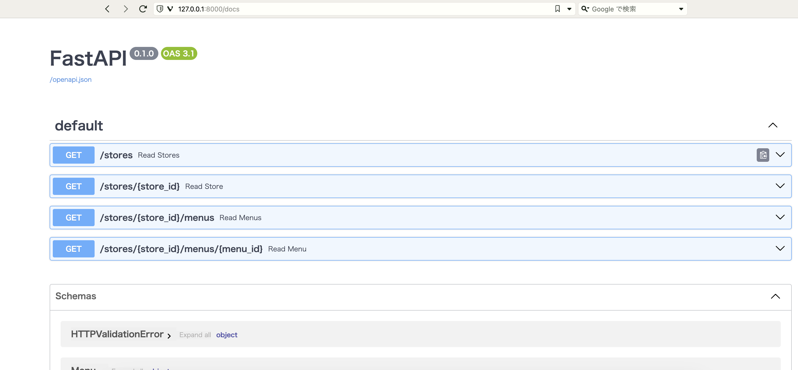
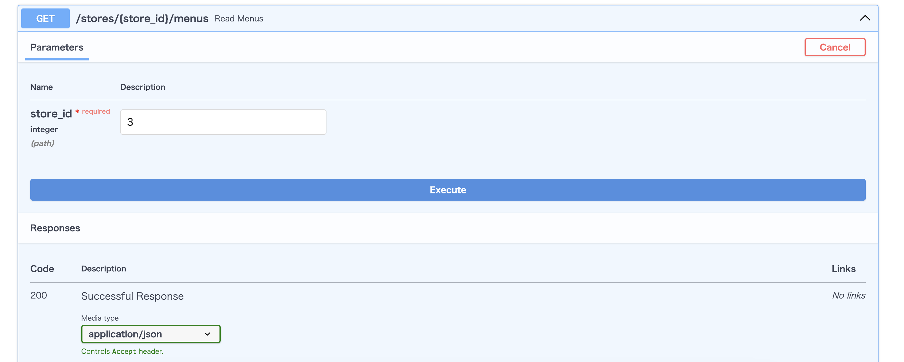

# ほんの少しだけ複雑な UI＆独自APIを開発するハンズオン

## 0. はじめに

このハンズオンの目的と趣旨は[1st](./1st#0-はじめに)と同じであるため、割愛します。

### 作るもの

APIを作成し、それらを呼び出し、その情報を画面に表示します。[1st](./1st)よりほんの少し複雑なUIを構築します。  
具体的なイメージは、学食や社食、自治会レベルの地域の祭りで出す露店のメニューを表示するUIです。

### 主な技術スタック

- [Javascript](https://developer.mozilla.org/en-US/docs/Web/JavaScript)/[Typescript](https://www.typescriptlang.org/)
- [Next.js](https://nextjs.org/)
- [Python](https://www.python.org/)
- [FastAPI](https://fastapi.tiangolo.com/)

TIPS:

- Next.jsについて
  - Next.jsは、ReactをベースにしたUIフレームワークで、SSR/SSG、ファイルベースルーティング、Fast Refresh、画像最適化、ゼロコンフィグなどの機能を提供しています。これらの機能により、Web ページの読み込み速度が高速化され、SEOに有利な構造が実現され、開発効率が向上します。Next.jsはモダンかつ強力なフロントエンドフレームワークであり、様々な長所を持っています。
  - また、[React公式サイト](https://react.dev/learn/start-a-new-react-project#nextjs)においても豊富な機能やコミュニティのサポートなどを理由に、Next.jsは
    あらゆるサイズの Reactアプリを作成に適しており、Next.jsの利用を推奨しています。
- FastAPIについて
  - FastAPIは、以下の特徴があります。
    - 高速
      - FastAPIは、StarletteとUvicornに基づいており、非常に高速なパフォーマンスを実現しています。
        - Starletteは、Pythonで書かれた軽量なASGIフレームワークで、高速な非同期サービスを構築することができます。Uvicornは、ASGIサーバーの実装であり、非常に高速です。FastAPIは、Starletteの上に構築され、Uvicornを使用して実行することができます。
    - 簡潔
      - FastAPIは、簡潔な構文を採用しており、コードが読みやすく、書きやすくなっています。
    - バリデーション
      - FastAPIは、Pydanticを使用してリクエストとレスポンスのバリデーションを行うことができます。
        - Pydanticは、データの型安全性を確保するためのライブラリであり、データの型を宣言的に定義することができます。これにより、FastAPIは、タイプセーフな Web アプリケーションの構築をサポートしています。
          - タイプセーフとは、プログラムが実行される前に型エラーが検出されることを指します。これにより、ランタイムエラーを防ぐことができます。
    - 自動ドキュメント生成
      - FastAPIは、Swagger UIとReDocを使用して、自動的にAPIドキュメントを生成することができます。
        - Swagger UIとReDocは、OpenAPI仕様に基づいてAPIドキュメントを生成するツールです。
    - 非同期サポート
      - FastAPIは、非同期処理をサポートしており、非同期コードを簡単に書くことができます。

**注意事項**:

- Pythonのパッケージマネージャーについて
  - 今回のハンズオンで使用するPythonのパッケージマネージャーは[rye](https://github.com/mitsuhiko/rye)です。依存関係のインストールとアンインストール、仮想環境の管理などを行える、便利なツールです。
  - ただし、以下のコメントが公式ページに記載されているとおり、Experimentalな状態です。この資料を書いている時点では利用可能ですが、ハンズオンを行う際にその利用可否は保証できません。もし、利用できない場合は、他のツール([poetry](https://python-poetry.org/) や [pip](https://pypi.org/project/pip/) など)の利用を検討してください。
    > An Experimental Package Management Solution for Python

## 1. Setup

### 前提条件

- Node.js 16 or above
- Python 3.8 or above
- Code Editor (e.g., Visual Studio Code)

**注意事項**：  
ここに記載されている必要なソフトウェアのインストール手順は、WSLを使用しないWindowsユーザーを対象としています。
これは、このハンズオンの最初のターゲットユーザーが、WSLを使用しないWindowsユーザーであるためです。実際にソフトウェアをインストールする際には、ご自身の環境に応じたインストール手順で行ってください。

### Windowsユーザー向けの詳細な手順

- Node.js のインストール
  - [1st](./1st#1-setup)参照
- Pythonのインストール
  - [Pythonの公式サイト](https://www.python.org/downloads/windows/)にアクセスし、最新バージョンのPythonのインストーラー(`Windows installer(64-bit)`)をダウンロードします。
  - ダウンロードしたインストーラーを実行します。
  - インストールウィザードが表示されます。`Install Now`または`Customize installation`をクリックします。
  - インストールが完了したら、コマンドプロンプトを開き、以下のコマンドを実行して、Pythonが正しくインストールされていることを確認します。

    ```sh
    python --version
    ```

  - 既にPythonがインストールされている場合、上記の手順に従って最新バージョンのPythonをインストールすることでアップデートすることができます。ただし、複数のバージョンのPythonが同時にインストールされている場合は、環境変数の設定を確認して、適切なバージョンのPythonが使用されるようにする必要があります。
    - スタートメニューから`システムのプロパティ`を検索し、開きます。
    - `詳細設定`タブをクリックし、`環境変数`ボタンをクリックします。
    - `システム環境変数`セクションで、`Path`変数を選択し、`編集`ボタンをクリックします。
    - `Path`変数の値に、新しくインストールしたPythonの実行ファイルがあるディレクトリ（通常は C:\Users\[ユーザー名]\AppData\Local\Programs\Python\Python[バージョン]\）を追加します。
    - 変更を保存し、コマンドプロンプトを再起動します。
    - 以下のコマンドを実行して、新しいバージョンのPythonが使用されていることを確認します。

      ```sh
      python --version
      ```

- rye のインストール
  - [rye の公式サイト](https://rye-up.com/guide/installation/)にアクセスし、Windows用のexeファイル(`rye-x86_64-windows.exe for 64bit Intel Windows`)をダウンロードし、インストールします。
    - `Windows protected your PC`のダイアログが出たら、`more info`を開き、`Run anyway`ボタンを押して、継続してください。
      - コマンドプロンプトが表示されているとおり、`Windows Developer Mode`([ryeの公式サイト](https://rye-up.com/guide/faq/#windows-developer-mode)を参照)を設定後、`y`を入力し、継続してください。
  - [rye の公式サイト](https://rye-up.com/guide/installation/#add-shims-to-path)の説明のとおり、環境変数`Path`に`shims`を登録し、その優先順位を上げます。
  - 変更を保存し、コマンドプロンプトを再起動します。
  - 以下のコマンドを実行して、エラーがryeのコマンドがエラーなく、実行されることを確認します。

    ```sh
      rye
    ```

- Visual Studio Code(VS Code)のインストール
  - [1st](./1st#1-setup)参照
- VS Codeの拡張機能のインストール・設定

  - Javascriptに関しては[1st](./1st#1-setup)参照
    - (Option)保存時に自動的にESLintでコードを修正するように設定します。
      - `Editor: Code Actions On Save`の設定変更
        - VSCodeの設定（File > Preferences > Settings）を開くか、ショートカット（Ctrl+,）を使用します。
        - 設定の中で`Editor: Code Actions On Save`または`editor.codeActionsOnSave`を検索し、`Edit in setting.json`を押します。
          - **このハンズオン以外でこの設定を使用したくない場合は`User`タブから`Workspace`タブに切り替えて設定してください。**
        - 以下の設定に変更します。変更後、忘れずにファイルを保存してください。

          ```json
          {
            "editor.codeActionsOnSave": {
              "source.fixAll": true
            }
          }
          ```

  - (Option)Pythonの開発にあたって、以下の拡張機能をインストールして、Webアプリの開発体験を向上させることをお勧めします：
    - Visual Studio Codeを起動します。 - 左サイドバーの四角いアイコンをクリックするか、Ctrl+Shift+X を押して、Extensionsサイドバーを開きます。
    - 以下の拡張機能(いずれもMicrosoft社製)を検索し、各拡張機能の横にある`インストール`ボタンをクリックします：
      - Python
        - Pylanceが含まれています。
      - Flake8
        - こちらをインストールすると、Pythonファイルを開いたときに自動的に flake8(Linter)が実行されます。
      - Black Formatter
    - `Python: Language Server`の設定変更 - VSCode の設定（File > Preferences > Settings）を開くか、ショートカット（Ctrl+,）を使用します。
      - **このハンズオン以外でこの設定を使用したくない場合は`User`タブから`Workspace`タブに切り替えて設定してください。**
      - 設定の中で`python.languageServer`を検索し、値を`Pylance`にします。
    - Pythonファイルの保存時に自動的にBlack Formatterでコードを修正するように設定します。
      - Ctrl+Shift+Pを押して、コマンドパレットを開きます。
      - `Preferences: Open User Settings(JSON)`を入力、選択して、JSONファイルを開きます。
        - **このハンズオン以外でこの設定を使用したくない場合は`Preferences: Open Workspace Settings(JSON)`開いてください。**
      - 以下のコードをJSONの最後に設定します。

        ```js
          "[python]": {
            "editor.defaultFormatter": "ms-python.black-formatter",
            "editor.formatOnSave": true
          }
        ```

        - ほかの設定も行なっている場合には以下のようになります。

          ```js
          {
            "editor.defaultFormatter": "esbenp.prettier-vscode",
            "editor.formatOnSave": true,
            "editor.codeActionsOnSave": {
              "source.fixAll": true
            },
            "python.languageServer": "Pylance",
            "[python]": {
              "editor.defaultFormatter": "ms-python.black-formatter",
              "editor.formatOnSave": true
            }
          }
          ```

### プロジェクト作成

#### プロジェクトディレクトリの作成

`dish-delight`ディレクトリを作成し、その中に`frontend`ディレクトリと`backend`ディレクトリを作成します。以下のコマンドを実行します。

```sh
mkdir dish-delight/backend
mkdir dish-delight/frontend
cd dish-delight
```

#### フロントエンド(Next.js)プロジェクト作成

以下のコマンドを実行してください。

```sh
cd frontend
npx create-next-app .
```

上記コマンドを実行すると、プロンプト上で質問されます。以下のとおり、質問に回答してください。

```sh
✔ Would you like to use TypeScript? … Yes
✔ Would you like to use ESLint? … Yes
✔ Would you like to use Tailwind CSS? … Yes
✔ Would you like to use `src/` directory? … No
✔ Would you like to use App Router? (recommended) … Yes
✔ Would you like to customize the default import alias? … No
```

注意事項:
以下のエラーが出た場合は、`npm i -g npx`を実行してから、再度実行してみてください。詳しくは[Nextjs公式のissue](https://github.com/vercel/next.js/discussions/39997)を参考にしてください。

```sh
$ npx create-next-app
Debugger attached.
npm ERR! code ENOENT
npm ERR! syscall lstat
npm ERR! path /home/zxytim/.local/npm
npm ERR! errno -2
npm ERR! enoent ENOENT: no such file or directory, lstat '/home/zxytim/.local/npm'
npm ERR! enoent This is related to npm not being able to find a file.
npm ERR! enoent 

npm ERR! A complete log of this run can be found in:
npm ERR!     /home/zxytim/.npm/_logs/2022-08-27T03_37_34_606Z-debug-0.log
Waiting for the debugger to disconnect...
```

#### バックエンドプロジェクトの初期化

以下のコマンドを実行してください。

```sh
cd ../backend
# initialize Project
rye init --no-pin
# specify Python version for this Project
rye pin 3.11
# synchronize and create virtualenv
rye sync
```

以下のコマンドを実行して、`Python 3.11.X`(X は最新のマイナーバージョンの数字。例: `Python 3.11.3`)と表示されることを確認してください。

```sh
python --version
```

#### 必要なライブラリやツールのインストール

以下のコマンドを実行してください。

```sh
# add required libraries
rye add fastapi uvicorn sqlalchemy
# add necessary development tools
rye add --dev black flake8
# synchronize and install
rye sync
```

## 2. フロントエンドのみのHomeとメニュー一覧と詳細画面の実装

Next.jsとTailwind CSSを使用して、Homeとメニュー一覧とメニュー詳細画面を作成します。  
フロントエンドのみの実装でバックエンドにはまだ接続しません。

以下はFigmaを利用したUIイメージです。参考として掲載します。

| Home  | メニュー一覧  | メニュー詳細 |
| --- | --- | --- |
|  |  |  |

注意事項:
上記はハンズオン構想段階でのドラフトのデザインです。ハンズオンの実装とは異なる点もあります。

TIPS:

- Figmaとは
  - [Figma](https://www.figma.com/)は、Webベースのグラフィックデザインツールで、UI/UXデザイン、プロトタイピング、コラボレーションなどに使用されます。
  - エンジニアにとってのメリットとしては、デザイナーとのコラボレーションが容易になり、デザインからコードへの変換がスムーズになることが挙げられます。また、簡単なUIであればエンジニアもFigmaで顧客とのイメージ共有等のためにデザインを作成することもあります。

### 設定ファイルの変更

#### 開発サーバーの起動

以下のコマンドを実行してください。

```sh
cd ../frontend
npm run dev
```

ブラウザを開いて <http://localhost:3000> にアクセスし、Nextjsのデフォルト画面が表示されることを確認してください。

**注意事項**:すでに 3000ポートを使用している場合は、別のポートが指定されます。その場合は、以下のようにコマンドライン上に表示されます

```sh
- warn Port 3000 is in use, trying 3001 instead.
- ready started server on 0.0.0.0:3001, url: http://localhost:3001
```

Ctrl + cで停止してください。

#### globals.css の設定修正

デフォルトで設定されている globals.cssの設定を修正します。  
`dish-delight/frontend/app/globals.css`を開き、その内容を以下のコードに置き換えます：

```css
@tailwind base;
@tailwind components;
@tailwind utilities;

body {
  color: rgb(255, 255, 255);
  background: rgb(0, 0, 0);
}
```

TIPS:

- 今回、Tailwind CSSのインストールや設定は不要です。Nextjsプロジェクト作成時にTailwind CSSを使用するオプションを指定しているためです。

#### 外部画像サイトの設定

今回、Next.jsが提供する[Image コンポーネント](https://nextjs.org/docs/pages/building-your-application/optimizing/images)を使用します。Next.jsの`Imageコンポーネント`は、HTML の``要素の拡張で、現代のWebのニーズに適応したものです。良いCore Web Vitalsを達成するため、様々な組み込みのパフォーマンス最適化が含まれています。

今回外部画像を使用するため、`next.config.js`にて、`remotePatterns`プロパティの設定が必要です。詳しくは[公式サイトの説明](https://nextjs.org/docs/pages/api-reference/components/image#configuration-options)を参照してください。

`dish-delight/frontend/next.config.js`を開き、その内容を以下のコードに置き換えます：

```js
/** @type {import('next').NextConfig} */
const nextConfig = {
  reactStrictMode: true,
  images: {
    remotePatterns: [
      {
        protocol: "https",
        hostname: "images.unsplash.com",
        pathname: "/**",
      },
    ],
  },
};

module.exports = nextConfig;
```

注意事項:

- `next.config.js`にて、`Parsing error: Cannot find module 'next/babel'`が出ます。このままでも動作に影響しませんが、解消したい場合は`.eslintrc.json`を以下に変更してください。

  ```js
  {
  "extends": ["next/core-web-vitals", "next/babel"]
  }
  ```

以下のコマンドを実行してください。

```sh
npm run dev
```

再度ブラウザを開いて <http://localhost:3000> にアクセスし、Nextjsのデフォルト画面が表示されることを確認してください。

開発サーバーはそのまま起動しておいてください。停止したい場合は、コマンドラインでCtrl + cで停止することができます。

### Homeとメニュー一覧とメニュー詳細画面を作成

#### Home画面を実装する

`dish-delight/frontend/public`に画面で使用するロゴの画像ファイルを4つを配置します:

対象の画像は[Github Repository](https://github.com/minakamoto/pschs2023/tree/main/docs/static/img/2nd/logo)からすべて取得してください。以下の4つのファイルです。  
なお、svgファイルはNavbarで使うロゴで、jpegファイルのロゴは各店舗のロゴです。各店舗のロゴはstoreデータのimgで指定されています。

- aroy_logo.jpeg
- buono_logo.jpeg
- logo_jojo_univ.svg
- sakura_tei_logo.jpeg

注意事項:

- これらの画像は、Bing上から`Image Creator`(`DALL-E`)を使用して作成しています。

`dish-delight/frontend/app/page.tsx`を開き、その内容を以下のコードに置き換えます:

```tsx
// dish-delight/frontend/app/page.tsx
import Image from "next/image";
import Link from "next/link";
import jojoUnivLogo from "../public/logo_jojo_univ.svg";

// type definition of store
type Store = {
  id: number;
  name: string;
  img: string;
  category: string;
};

export const stores: Store[] = [
  {
    id: 1,
    name: "Sakura-tei",
    img: "/sakura_tei_logo.jpeg",
    category: "Japanese",
  },
  {
    id: 2,
    name: "Aroy",
    img: "/aroy_logo.jpeg",
    category: "Thai",
  },
  {
    id: 3,
    name: "Buono",
    img: "/buono_logo.jpeg",
    category: "Italian",
  },
];

export default function Home() {
  return (
    <div>
      <nav className="flex items-center justify-between flex-wrap bg-sky-500 p-2">
        <div className="flex items-center flex-shrink-0 text-white mr-6">
          <Image
            src={jojoUnivLogo}
            alt="Logo of Jojo University"
            width={45}
            height={45}
          />
          <span className="font-semibold text-lg tracking-tight pl-2">
            Jojo University Cafeteria
          </span>
        </div>
      </nav>
      <div className="text-center mt-8">
        <h1 className="text-3xl font-bold">
          Welcome to Jojo University Cafeteria!
        </h1>
        {/* Do not display this image for mobile */}
        <Image
          className="hidden md:block mx-auto mt-4"
          src={"https://images.unsplash.com/photo-1567521464027-f127ff144326"}
          alt="University Cafeteria Image"
          width={500}
          height={375}
          priority={false}
        />
      </div>
      <div className="text-center mt-6 mx-2">
        <h2 className="text-xl text-gray-500">
          Select the store where you would like to see the menu
        </h2>
        <div className="grid grid-cols-1 md:grid-cols-2 lg:grid-cols-3 gap-6 p-10">
          {/* For the number of stores list, link to the menu list and display the image component, store name, and category.
           */}
          {stores.map((store) => (
            <Link href={`/stores/${store.id}`} key={store.id}>
              <div className="max-w-sm rounded overflow-hidden shadow-lg mx-auto">
                <Image
                  className="w-full"
                  src={store.img}
                  alt={store.name}
                  width={300}
                  height={300}
                />
                <div className="px-6 py-4">
                  <div className="font-bold text-xl mb-2">{store.name}</div>
                  <p className="text-gray-700 text-base">{store.category}</p>
                </div>
              </div>
            </Link>
          ))}
        </div>
      </div>
    </div>
  );
}
```

- 見た目は以下となっていることを確認します。
  
- `Sakura-tei`、`Aroy`、`Buono`のいずれかのCardをクリックすると、メニュー一覧画面に遷移すること
  - 画面はまだ作っていないので、"404 This page could not be found"と表示されます

このハンズオンのレイアウトはモバイルファーストなUIデザインを目指します。これ以降、スマホサイズでの表示確認を前提とします。

以下の手順を参考に、ブラウザの開発者ツールにていずれかのスマホもしくはスマホのサイズになるように画面を調節してください。

- ブラウザを開き、`デベロッパーツール`もしくは`開発者ツール`を表示します。
  - Chromeであれば「メニュー」→「その他のツール」→「デベロッパーツール」
  - Edgeであれば「メニュー」→「その他のツール」→「開発者ツール」
  - Windowsであれば、どのブラウザでも共通で、ショートカットキーは`Shift+Ctrl+i`
- 開発者ツールにて上部にあるPCとスマホが重なったようなアイコン(下記画像の右側を参照)のボタンをクリックします。
  - Windowsであれば、ショートカットキーは`Shift+Ctrl+m`
    
- 画面の左上のメニューでシミュレートする端末を選びます(上記の画像の左側を参照)。
  - もしくは`Responsive`状態で自分で大きさを調整します。

スマホと同等のサイズにした場合、以下の見た目になっていることを確認してください。

- 上記キャプチャーのレイアウトになること
- 店舗のCardが縦に配置されていること
  - `Sakura-tei`、`Aroy`、`Buono`の順

TIPS:
タブレットサイズにすると、列は2つになります。

#### Navbarをコンポーネント化する

メニュー一覧やメニュー詳細画面でも同じNavbarを使用したいため、Navbarをコンポーネント化します。

`dish-delight/frontend/components/Navbar.tsx`ファイルを作成し、その内容を以下のコードに置き換えます:

```tsx
// components/Navbar.tsx
import Image from "next/image";
import jojoUnivLogo from "../public/logo_jojo_univ.svg";

// Navbar implemented in dish-delight/frontend/app/page.tsx is defined as a component
export default function Navbar() {
  return (
    <>
      <nav className="flex items-center justify-between flex-wrap bg-sky-500 p-2">
        <div className="flex items-center flex-shrink-0 text-white mr-6">
          <Image
            src={jojoUnivLogo}
            alt="Logo of Jojo University"
            width={45}
            height={45}
          />
          <span className="font-semibold text-lg tracking-tight pl-2">
            Jojo University Cafeteria
          </span>
        </div>
      </nav>
    </>
  );
}
```

`dish-delight/frontend/app/page.tsx`を開き、その内容を以下のコードに置き換えます:

```tsx
// dish-delight/frontend/app/page.tsx
import Image from "next/image";
import Link from "next/link";
import Navbar from "../components/Navbar";

type Store = {
  id: number;
  name: string;
  img: string;
  category: string;
};

export const stores: Store[] = [
  {
    id: 1,
    name: "Sakura-tei",
    img: "/sakura_tei_logo.jpeg",
    category: "Japanese",
  },
  {
    id: 2,
    name: "Aroy",
    img: "/aroy_logo.jpeg",
    category: "Thai",
  },
  {
    id: 3,
    name: "Buono",
    img: "/buono_logo.jpeg",
    category: "Italian",
  },
];

export default function Home() {
  return (
    <div>
      {/* call the Navbar component */}
      <Navbar />
      <div className="text-center mt-8">
        <h1 className="text-3xl font-bold">
          Welcome to Jojo University Cafeteria!
        </h1>
        <Image
          className="hidden md:block mx-auto mt-4"
          src={"https://images.unsplash.com/photo-1567521464027-f127ff144326"}
          alt="University Cafeteria Image"
          width={500}
          height={375}
        />
      </div>
      <div className="text-center mt-6 mx-2">
        <h2 className="text-xl text-gray-500">
          Select the store where you would like to see the menu
        </h2>
        <div className="grid grid-cols-1 md:grid-cols-2 lg:grid-cols-3 gap-6 p-10">
          {stores.map((store) => (
            <Link href={`/stores/${store.id}`} key={store.id}>
              <div className="max-w-sm rounded overflow-hidden shadow-lg mx-auto">
                <Image
                  className="w-full"
                  src={store.img}
                  alt={store.name}
                  width={300}
                  height={300}
                />
                <div className="px-6 py-4">
                  <div className="font-bold text-xl mb-2">{store.name}</div>
                  <p className="text-gray-700 text-base">{store.category}</p>
                </div>
              </div>
            </Link>
          ))}
        </div>
      </div>
    </div>
  );
}
```

ブラウザを開き、アプリケーションの動作・見た目に変化がないことを確認します。

#### メニュー一覧画面を実装する

Home画面で店舗を選択後に表示されるメニュー一覧画面を実装します。

メニュー一覧画面では、Navbarに店舗名とメニュー一覧(UI上は`MENUS`)へのLinkを表示するため、Navbarコンポーネントをまず修正します。
`dish-delight/frontend/components/Navbar.tsx`を開き、その内容を以下のコードに置き換えます:

```tsx
// dish-delight/frontend/components/Navbar.tsx
import Image from "next/image";
import jojoUnivLogo from "../public/logo_jojo_univ.svg";
import Link from "next/link";

// type definition of props
type NavbarProps = {
  storeName?: string;
  storeId?: number;
};

export default function Navbar({ storeName, storeId }: NavbarProps) {
  return (
    <>
      <nav className="flex items-center justify-between flex-wrap bg-sky-500 p-2">
        <div className="flex items-center flex-shrink-0 text-white mr-6">
          <Link href="/">
            <Image
              src={jojoUnivLogo}
              alt="Logo of Jojo University"
              width={45}
              height={45}
            />
          </Link>
          {/* If the store is not set up (i.e., only for Home), give the name of the university. */}
          {!storeName && (
            <span className="font-semibold text-lg md:text-xl tracking-tight pl-2">
              Jojo University Cafeteria
            </span>
          )}
          {/* Only when the store name is set, the store name and a link to Home are displayed. */}
          {storeName && (
            <>
              <span className="font-semibold text-lg md:text-xl tracking-tight px-2">
                {storeName}
              </span>
              <Link
                href="/"
                className="text-gray-200 text-base ml-3 px-1 hover:bg-sky-600"
              >
                Home
              </Link>
            </>
          )}
          {/* Display a link to the menu list only when the store name and store ID are set */}
          {storeName && storeId && (
            <Link
              href={`/stores/${storeId}`}
              key={storeId}
              className="text-gray-200 text-base ml-3 px-1 hover:bg-sky-600"
            >
              Menus
            </Link>
          )}
        </div>
      </nav>
    </>
  );
}
```

メニュー一覧画面を実装します。
`dish-delight/frontend/app/stores/[storeId]/page.tsx`ファイルを作成し、その内容を以下のコードに置き換えます:

```tsx
// dish-delight/frontend/app/stores/[storeId]/page.tsx
import Link from "next/link";
import Navbar from "../../../components/Navbar";
import { stores } from "@/app/page";
import Image from "next/image";

// First, the menu information is kept fixed on the frontend.
// The image uses data from [Unsplash](https://unsplash.com/).
export const menus = [
  {
    id: 1,
    storeId: 1,
    name: "Soy sauce ramen",
    img: "https://images.unsplash.com/photo-1632709810780-b5a4343cebec",
    author: "@5amramen",
    price: "900 yen",
    description:
      "A classic Japanese ramen noodle soup that is made with a soy sauce-based broth.",
    options: [
      {
        name: "Extra noodles",
        price: "100 yen",
      },
      {
        name: "Extra char siu",
        price: "100 yen",
      },
      {
        name: "Barikata(very hard noodles)",
        price: "0 yen",
      },
    ],
  },
  {
    id: 2,
    storeId: 1,
    name: "Sanuki Udon",
    img: "https://images.unsplash.com/photo-1618841557871-b4664fbf0cb3",
    author: "@jinomono",
    price: "800 yen",
    description:
      "A type of thick, chewy udon noodle that is made in Kagawa Prefecture, Japan.",
    options: [
      {
        name: "Chicken tempura",
        price: "100 yen",
      },
      {
        name: "Squid tempura",
        price: "100 yen",
      },
      {
        name: "Vegetable tempura",
        price: "100 yen",
      },
      {
        name: "Large size",
        price: "100 yen",
      },
      {
        name: "Small size",
        price: "-50 yen",
      },
    ],
  },
  {
    id: 3,
    storeId: 1,
    name: "Zaru soba",
    img: "https://images.unsplash.com/photo-1519984388953-d2406bc725e1",
    author: "@gaspanik",
    price: "1,000 yen",
    description: "A cold soba noodle dish served with a dipping sauce.",
    options: [
      {
        name: "Large size",
        price: "200 yen",
      },
    ],
  },
  {
    id: 4,
    storeId: 1,
    name: "Spicy Miso Ramen",
    img: "https://images.unsplash.com/photo-1637024696628-02cb19cc1829",
    author: "@5amramen",
    price: "900 yen",
    description: "A spicy miso ramen with a rich and flavorful broth.",
    options: [
      {
        name: "Large size",
        price: "100 yen",
      },
      {
        name: "Extra char siu",
        price: "100 yen",
      },
      {
        name: "Seasoned egg",
        price: "100 yen",
      },
    ],
  },
  {
    id: 8,
    storeId: 2,
    name: "Khao soi",
    img: "https://images.unsplash.com/photo-1569562211093-4ed0d0758f12",
    author: "@ural_8_low",
    price: "60 baht",
    description:
      "Khao Soi is a Northern Thai curry noodle soup with a rich and flavorful broth.",
  },
];

export default function StoreMenu({ params }: { params: { storeId: string } }) {
  // storeId in params is set to the store ID of the store selected in Home
  const storeId = Number(params.storeId);
  // Get the corresponding store from the store list
  const store = stores.find((store) => store.id === storeId);
  // Get the corresponding menu from the menu list
  const storeMenus = menus.filter((menu) => menu.storeId === storeId);

  // When the store does not exist
  if (!store) {
    return (
      <div>
        <Navbar />
        <div className="m-3">
          <p>
            The store does not exist, please select the store again from HOME.
          </p>
        </div>
      </div>
    );
  }

  // When the menu for the store does not exist
  if (storeMenus.length === 0) {
    return (
      <div>
        <Navbar />
        <div className="m-3">
          <p>
            The menu for that store does not exist, please select the store again from HOME.
          </p>
        </div>
      </div>
    );
  }

  return (
    <div>
      {/* Pass store name and store ID to Navbar */}
      <Navbar storeName={store?.name} storeId={store?.id} />
      <div className="grid grid-cols-1 md:grid-cols-2 lg:grid-cols-3 gap-4 p-4">
        {/* For the number of menus list, link to the menu detail and display the image component, menu.
         */}
        {storeMenus.map((menu) => (
          <Link href={`/stores/${storeId}/menus/${menu.id}`} key={menu.id}>
            <div className="max-w-sm rounded overflow-hidden shadow-lg mx-auto">
              <Image
                className="w-full"
                src={menu.img}
                alt={menu.name}
                width={300}
                height={300}
              />
              <div className="px-6 py-4">
                <div className="font-bold text-xl mb-2">{menu.name}</div>
                <p className="text-gray-700 text-base">{menu.price}</p>
              </div>
            </div>
          </Link>
        ))}
      </div>
    </div>
  );
}
```

動作・見た目を確認します。

- Home画面にて`Sakura-tei`のCardをクリックすると、メニュー一覧画面に遷移すること
  - メニューが4つ表示されること
    
- Navbarの`HOME`を押すとHOME画面に遷移すること、`MENUS`を押すとメニュー一覧画面のままであること
- メニュー一覧画面のいずれかのメニューの Card をクリックすると、メニュー詳細画面に遷移すること
  - 画面はまだ作っていないので、"404 This page could not be found"と表示されます
- Home画面にて`Aroy`のCardをクリックすると、メニュー一覧画面に遷移すること
  - メニューが1つ表示されること
- Home画面にて`Bohno`のCardをクリックすると、メニュー一覧画面に遷移すること
  - メニューがないため、エラーメッセージがでること
    
  - 実装に店舗やメニューが存在しない場合の処理を加えています。
    - 上記は、メニューが存在していない場合ですが、店舗が存在していない場合も動作確認をしてみてください。
      - 一時的にコードを書き換えてみる(例: 取得データを0にする、if文を外すなど)などで表示されます。

注意事項:

- このハンズオンの例外処理について
  - フロントエンド、バックエンドともに本ハンズオンでは、Webアプリ開発の体験を優先しているため、例外処理は簡易的に実装しています。実際の開発では、要件や技術要素を加味して適切に実装してください。

#### リファクタリング(バックエンドのAPI呼び出しのための準備)

現状フロントエンドで固定でデータを持っていますが、後ほどの手順でバックエンドのAPI呼び出しによるデータ取得に変更するため、メニュー詳細画面に入る前に、まずはそのための準備のリファクタリングをします。

リファクタリングの流れ(細かなステップ)としては以下のとおりです。  
ただし、この流れは手順を示すだけにしておきます。これまで通り、修正後のコードを各ファイルに上書きする方法で記載します。  
もし、余力がある方はこの流れに沿ってご自身でリファクタリングを実施し、修正後のコードと比べてみてください。

1. `dish-delight/frontend/app/page.tsx`から店舗の固定データを`dish-delight/frontend/lib/api.tsx`に移動します。
1. `dish-delight/frontend/lib/api.tsx`に`getStores`メソッドを作って、店舗データをすべて返すようにする
1. `dish-delight/frontend/app/page.tsx`で店舗の固定データを呼び出していたところを`dish-delight/frontend/lib/api.tsx`の`getStores`メソッドを呼ぶようにする
1. `dish-delight/frontend/lib/api.tsx`に`getStore`メソッドを作って指定された店舗だけを返すようにする
1. `dish-delight/frontend/app/stores/[storeId]/page.tsx`で`dish-delight/frontend/app/page.tsx`の`stores`を呼び出していたところを`dish-delight/frontend/lib/api.tsx`の`getStore`メソッドを呼ぶようにする
1. `dish-delight/frontend/app/stores/[storeId]/page.tsx`からメニューの固定データを`dish-delight/frontend/lib/api.tsx`に移動する
1. `dish-delight/frontend/lib/api.tsx`に`getMenus`メソッドを作って指定された店舗のメニューをすべて返すようにする
   - レスポンスの型を指定したいので、メニューの型定義も行っています
1. `dish-delight/frontend/app/stores/[storeId]/page.tsx`で`dish-delight/frontend/app/page.tsx`の`menus`を呼び出していたところを`dish-delight/frontend/lib/api.tsx`の`getMenus`メソッドを呼び、取得するようにする

`dish-delight/frontend/lib/api.tsx`を作成し、その内容を以下のコードに置き換えます:

```tsx
// dish-delight/frontend/lib/api.tsx

type Store = {
  id: number;
  name: string;
  img: string;
  category: string;
};

export const stores: Store[] = [
  {
    id: 1,
    name: "Sakura-tei",
    img: "/sakura_tei_logo.jpeg",
    category: "Japanese",
  },
  {
    id: 2,
    name: "Aroy",
    img: "/aroy_logo.jpeg",
    category: "Thai",
  },
  {
    id: 3,
    name: "Buono",
    img: "/buono_logo.jpeg",
    category: "Italian",
  },
];

// type definition of menu
type Menu = {
  id: number;
  storeId: number;
  name: string;
  img: string;
  author: string;
  price: string;
  description: string;
  options?: Option[];
};

// type definition of menu's option
type Option = {
  name: string;
  price: string;
};

export const menus = [
  {
    id: 1,
    storeId: 1,
    name: "Soy sauce ramen",
    img: "https://images.unsplash.com/photo-1632709810780-b5a4343cebec",
    author: "@5amramen",
    price: "900 yen",
    description:
      "A classic Japanese ramen noodle soup that is made with a soy sauce-based broth.",
    options: [
      {
        name: "Extra noodles",
        price: "100 yen",
      },
      {
        name: "Extra char siu",
        price: "100 yen",
      },
      {
        name: "Barikata(very hard noodles)",
        price: "0 yen",
      },
    ],
  },
  {
    id: 2,
    storeId: 1,
    name: "Sanuki Udon",
    img: "https://images.unsplash.com/photo-1618841557871-b4664fbf0cb3",
    author: "@jinomono",
    price: "800 yen",
    description:
      "A type of thick, chewy udon noodle that is made in Kagawa Prefecture, Japan.",
    options: [
      {
        name: "Chicken tempura",
        price: "100 yen",
      },
      {
        name: "Squid tempura",
        price: "100 yen",
      },
      {
        name: "Vegetable tempura",
        price: "100 yen",
      },
      {
        name: "Large size",
        price: "100 yen",
      },
      {
        name: "Small size",
        price: "-50 yen",
      },
    ],
  },
  {
    id: 3,
    storeId: 1,
    name: "Zaru soba",
    img: "https://images.unsplash.com/photo-1519984388953-d2406bc725e1",
    author: "@gaspanik",
    price: "1,000 yen",
    description: "A cold soba noodle dish served with a dipping sauce.",
    options: [
      {
        name: "Large size",
        price: "200 yen",
      },
    ],
  },
  {
    id: 4,
    storeId: 1,
    name: "Spicy Miso Ramen",
    img: "https://images.unsplash.com/photo-1637024696628-02cb19cc1829",
    author: "@5amramen",
    price: "900 yen",
    description: "A spicy miso ramen with a rich and flavorful broth.",
    options: [
      {
        name: "Large size",
        price: "100 yen",
      },
      {
        name: "Extra char siu",
        price: "100 yen",
      },
      {
        name: "Seasoned egg",
        price: "100 yen",
      },
    ],
  },
  {
    id: 8,
    storeId: 2,
    name: "Khao soi",
    img: "https://images.unsplash.com/photo-1569562211093-4ed0d0758f12",
    author: "@ural_8_low",
    price: "60 baht",
    description:
      "Khao Soi is a Northern Thai curry noodle soup with a rich and flavorful broth.",
  },
];

export async function getStores(): Promise<Store[]> {
  return stores;
}

export async function getStore(storeId: number): Promise<Store | undefined> {
  return stores.find((store) => store.id === storeId);
}

export async function getMenus(storeId: number): Promise<Menu[]> {
  return menus.filter((menu) => menu.storeId === storeId);
}
```

注意事項:  
固定データの取得に非同期処理のためのasync/awaitを付ける必要はまったくないです。バックエンドAPIに置き換えたとき、修正が少ないようにasync/awaitを付けています。

`dish-delight/frontend/app/page.tsx`を開き、その内容を以下のコードに置き換えます:

```tsx
// dish-delight/frontend/app/page.tsx
import Image from "next/image";
import Link from "next/link";
import Navbar from "../components/Navbar";
import { getStores } from "@/lib/api";

export default async function Home() {
  const stores = await getStores();
  return (
    <div>
      <Navbar />
      <div className="text-center mt-8">
        <h1 className="text-3xl font-bold">
          Welcome to Jojo University Cafeteria!
        </h1>
        <Image
          className="hidden md:block mx-auto mt-4"
          src={"https://images.unsplash.com/photo-1567521464027-f127ff144326"}
          alt="University Cafeteria Image"
          width={500}
          height={375}
        />
      </div>
      <div className="text-center mt-6 mx-2">
        <h2 className="text-xl text-gray-500">
          Select the store where you would like to see the menu
        </h2>
        <div className="grid grid-cols-1 md:grid-cols-2 lg:grid-cols-3 gap-6 p-10">
          {stores.map((store) => (
            <Link href={`/stores/${store.id}`} key={store.id}>
              <div className="max-w-sm rounded overflow-hidden shadow-lg mx-auto">
                <Image
                  className="w-full"
                  src={store.img}
                  alt={store.name}
                  width={300}
                  height={300}
                />
                <div className="px-6 py-4">
                  <div className="font-bold text-xl mb-2">{store.name}</div>
                  <p className="text-gray-700 text-base">{store.category}</p>
                </div>
              </div>
            </Link>
          ))}
        </div>
      </div>
    </div>
  );
}
```

`dish-delight/frontend/app/stores/[storeId]/page.tsx`を開き、その内容を以下のコードに置き換えます:

```tsx
// dish-delight/frontend/app/stores/[storeId]/page.tsx
import Link from "next/link";
import Navbar from "../../../components/Navbar";
import Image from "next/image";
import { getMenus, getStore } from "@/lib/api";

export default async function StoreMenu({
  params,
}: {
  params: { storeId: string };
}) {
  const storeId = Number(params.storeId);
  const store = await getStore(storeId);
  const menus = await getMenus(storeId);

  // When the store does not exist
  if (!store) {
    return (
      <div>
        <Navbar />
        <div className="m-3">
          <p>
            The store does not exist, please select the store again from HOME.
          </p>
        </div>
      </div>
    );
  }

  // When the menu for the store does not exist
  if (menus.length === 0) {
    return (
      <div>
        <Navbar />
        <div className="m-3">
          <p>
            The menu for that store does not exist, please select the store again from HOME.
          </p>
        </div>
      </div>
    );
  }

  return (
    <div>
      <Navbar storeName={store.name} storeId={store.id} />
      <div className="grid grid-cols-1 md:grid-cols-2 lg:grid-cols-3 gap-4 p-4">
        {menus.map((menu) => (
          <Link href={`/stores/${storeId}/menus/${menu.id}`} key={menu.id}>
            <div className="max-w-sm rounded overflow-hidden shadow-lg mx-auto">
              <Image
                className="w-full"
                src={menu.img}
                alt={menu.name}
                width={300}
                height={300}
              />
              <div className="px-6 py-4">
                <div className="font-bold text-xl mb-2">{menu.name}</div>
                <p className="text-gray-700 text-base">{menu.price}</p>
              </div>
            </div>
          </Link>
        ))}
      </div>
    </div>
  );
}
```

動作や見た目に変更がないことを確認します。  

#### メニュー詳細画面を実装する

メニュー一覧画面にてメニューを選択後に表示されるメニュー詳細画面を実装します。

メニュー詳細画面を実装すると、ディレクトリ構成は以下となります(関連するファイルのみ抜粋)。

```sh
dish-delight/frontend
├── app/
│   ├── index.ts
│   └── stores/
│       ├── [storeId]/
│       │   └── page.tsx
│       └── menus/
│           └── [menuId]/
│               └── page.tsx
├── components/
│   └── Navbar.tsx
├── lib/
│   ├── api.ts                 // Call the backend API
│   └── constants.ts
├── public/
│   ├── aroy_logo.jpeg
│   ├── buono_logo.jpeg
│   ├── logo_jojo_univ.svg
│   └── sakura_tei_logo.jpeg
├── styles/
│   └── globals.css
├── next.config.js
└── tailwind.config.js
```

メニュー詳細画面を表示するために、まずメニューを取得するfunctionを実装します。
`dish-delight/frontend/lib/api.tsx`ファイルを開き、以下のコードを最下部に加えます:

```tsx
// lib/api.tsx
export async function getMenu(
  storeId: number,
  menuId: number
): Promise<Menu | undefined> {
  return menus.find((menu) => menu.storeId === storeId && menu.id === menuId);
}
```

メニュー詳細画面を実装します。
`dish-delight/frontend/app/stores/[storeId]/menus/[menuId]/page.tsx`を作成し、以下のコードに置き換えます：

```tsx
// dish-delight/frontend/app/stores/[storeId]/menus/[menuId]/page.tsx
import Image from "next/image";
import { getMenu, getStore } from "@/lib/api";
import Navbar from "@/components/Navbar";

export default async function Menu({
  params,
}: {
  params: { storeId: string; menuId: string };
}) {
  const storeId = Number(params.storeId);
  const menuId = Number(params.menuId);
  const store = await getStore(storeId);
  const menu = await getMenu(storeId, menuId);

  // When the store does not exist
  if (!store) {
    return (
      <div>
        <Navbar />
        <div className="m-3">
          <p>
            The store does not exist, please select the store again from HOME.
          </p>
        </div>
      </div>
    );
  }

  // When the menu for the store does not exist
  if (!menu) {
    return (
      <div>
        <Navbar />
        <div className="m-3">
          <p>
            The menu for that store does not exist, please select the store again from HOME.
          </p>
        </div>
      </div>
    );
  }

  return (
    <div>
      <Navbar storeName={store.name} storeId={store.id} />
      <div className="max-w-sm rounded overflow-hidden shadow-lg m-4 md:mx-auto">
        <Image
          className="w-full"
          src={menu.img}
          alt={menu.name}
          width={300}
          height={300}
          priority={false}
        />
        <div className="px-6 py-4">
          <div className="font-bold text-xl mb-2">{menu.name}</div>
          <p className="text-gray-500 text-base mt-2">{menu.price}</p>
          <div className="text-base mt-3">{menu.description}</div>
          {menu.options && menu.options.length > 0 && (
            <div>
              <p className="font-bold text-gray-500 text-lg mt-5">Option</p>
              {/* If there are options in the menu, display the number of options */}
              {menu.options.map((option) => (
                <ul key={option.name}>
                  <li className="list-disc list-inside text-base mt-3">
                    {option.name}{" "}
                    <span className="text-gray-500">{option.price}</span>
                  </li>
                </ul>
              ))}
            </div>
          )}
        </div>
      </div>
    </div>
  );
}
```

動作・見た目を確認します。

- メニュー一覧画面のいずれかのメニューのCardをクリックすると、メニュー詳細画面に遷移すること
  - 該当のメニュー画像や説明、Optionなどが表示されること
    - 例: 店舗`Aroy`の`Khao Soi`(Optionなし)
    
    - 例: 店舗`Sakura-tei`の`Sanuki Udon`(Optionあり)
    
- Navbarの`HOME`を押すとHOME画面に、`MENUS`を押すとメニュー一覧画面に遷移すること
- 店舗やメニューが存在しない場合のエラー画面
  - イメージはメニュー一覧画面と同じ

#### リファクタリング(データ取得のエラー画面のコンポーネント化)

店舗やメニューのデータ取得時に存在しなかった場合の画面が冗長なため、コンポーネント化します。

リファクタリングの対象は以下の2つです。それぞれ、店舗やメニューのデータ取得時に存在しなかった場合の画面を実装しています。これを共通化します。

- `dish-delight/frontend/app/stores/[storeId]/page.tsx`
- `dish-delight/frontend/app/stores/[storeId]/menus/[menuId]/page.tsx`

固定のメッセージを格納するために、`dish-delight/frontend/lib/constants.ts`ファイルを作成し、その内容を以下のコードに置き換えます:

```ts
// dish-delight/frontend/lib/constants.ts

export const DATA_NOT_FOUND_MESSAGE = {
  STORE: "The store does not exist, please select the store again from HOME.",
  MENU: "The menu for that store does not exist, please select the store again from HOME.",
};
```

エラー画面をコンポーネント化します。
`dish-delight/frontend/components/DataNotFound.tsx`ファイルを作成し、その内容を以下のコードに置き換えます:

```tsx
// dish-delight/frontend/components/DataNotFound.tsx

import Navbar from "./Navbar";

type DataNotFoundProps = {
  message: string;
};

// The message will be passed on from the caller.
export default function DataNotFound({ message }: DataNotFoundProps) {
  return (
    <>
      <Navbar />
      <div className="m-3">
        <p>{message}</p>
      </div>
    </>
  );
}
```

各画面のエラー画面を作成したコンポーネントに置き変えます。

`dish-delight/frontend/app/stores/[storeId]/page.tsx`を開き、その内容を以下のコードに置き換えます:

```tsx
// dish-delight/frontend/app/stores/[storeId]/page.tsx
import Link from "next/link";
import Navbar from "../../../components/Navbar";
import Image from "next/image";
import { getMenus, getStore } from "@/lib/api";
import DataNotFound from "@/components/DataNotFound";
import { DATA_NOT_FOUND_MESSAGE } from "@/lib/constants";

export default async function StoreMenu({
  params,
}: {
  params: { storeId: string };
}) {
  const storeId = Number(params.storeId);
  const store = await getStore(storeId);
  const menus = await getMenus(storeId);

  // When the store does not exist
  if (!store) {
    return <DataNotFound message={DATA_NOT_FOUND_MESSAGE.STORE} />;
  }

  // When the menu for the store does not exist
  if (menus.length === 0) {
    return <DataNotFound message={DATA_NOT_FOUND_MESSAGE.MENU} />;
  }

  return (
    <div>
      <Navbar storeName={store.name} storeId={store.id} />
      <div className="grid grid-cols-1 md:grid-cols-2 lg:grid-cols-3 gap-4 p-4">
        {menus.map((menu) => (
          <Link href={`/stores/${storeId}/menus/${menu.id}`} key={menu.id}>
            <div className="max-w-sm rounded overflow-hidden shadow-lg mx-auto">
              <Image
                className="w-full"
                src={menu.img}
                alt={menu.name}
                width={300}
                height={300}
              />
              <div className="px-6 py-4">
                <div className="font-bold text-xl mb-2">{menu.name}</div>
                <p className="text-gray-700 text-base">{menu.price}</p>
              </div>
            </div>
          </Link>
        ))}
      </div>
    </div>
  );
}
```

`dish-delight/frontend/app/stores/[storeId]/menus/[menuId]/page.tsx`を開き、その内容を以下のコードに置き換えます:

```tsx
// dish-delight/frontend/app/stores/[storeId]/menus/[menuId]/page.tsx
import Image from "next/image";
import { getMenu, getStore } from "@/lib/api";
import Navbar from "@/components/Navbar";
import DataNotFound from "@/components/DataNotFound";
import { DATA_NOT_FOUND_MESSAGE } from "@/lib/constants";

export default async function Menu({
  params,
}: {
  params: { storeId: string; menuId: string };
}) {
  const storeId = Number(params.storeId);
  const menuId = Number(params.menuId);
  const store = await getStore(storeId);
  const menu = await getMenu(storeId, menuId);

  // When the store does not exist
  if (!store) {
    return <DataNotFound message={DATA_NOT_FOUND_MESSAGE.STORE} />;
  }

  // When the menu does not exist
  if (!menu) {
    return <DataNotFound message={DATA_NOT_FOUND_MESSAGE.MENU} />;
  }

  return (
    <div>
      <Navbar storeName={store.name} storeId={store.id} />
      <div className="max-w-sm rounded overflow-hidden shadow-lg m-4 md:mx-auto">
        <Image
          className="w-full"
          src={menu.img}
          alt={menu.name}
          width={300}
          height={300}
          priority={false}
        />
        <div className="px-6 py-4">
          <div className="font-bold text-xl mb-2">{menu.name}</div>
          <p className="text-gray-500 text-base mt-2">{menu.price}</p>
          <div className="text-base mt-3">{menu.description}</div>
          {menu.options && menu.options.length > 0 && (
            <div>
              <p className="font-bold text-gray-500 text-lg mt-5">Option</p>
              {menu.options.map((option) => (
                <ul key={option.name}>
                  <li className="list-disc list-inside text-base mt-3">
                    {option.name}{" "}
                    <span className="text-gray-500">{option.price}</span>
                  </li>
                </ul>
              ))}
            </div>
          )}
        </div>
      </div>
    </div>
  );
}
```

動作・見た目に変更がないことを確認します。

#### サイトのタイトルとfaviconの設定

上記でフロントエンド部分は終わりですが、最後にサイトのタイトルとfaviconだけ修正します。

現状、以下のとおりNext.jsデフォルトのタイトルとfaviconになっています。これを修正します。


`dish-delight/frontend/app/layout.tsx`を開き、その内容を以下のコードに置き換えます。

```tsx
import "./globals.css";
import type { Metadata } from "next";
import { Inter } from "next/font/google";

const inter = Inter({ subsets: ["latin"] });

export const metadata: Metadata = {
  title: "Jojo University Cafeteria",
  description: "This site shows the menu of Jojo University Cafeteria",
};

export default function RootLayout({
  children,
}: {
  children: React.ReactNode;
}) {
  return (
    <html lang="en">
      <body className={inter.className}>{children}</body>
    </html>
  );
}
```

`dish-delight/frontend/app/favicon.ico`を置き換えます:

対象の画像は[Github Repository](https://github.com/minakamoto/pschs2023/tree/main/docs/static/img/2nd/favicon.ico)から取得してください。

動作・見た目を確認します。

- サイトのタイトルとfaviconが以下のキャプチャと同じであることを確認する
  

## 3. データベースに接続してデータを返す

ここから、いよいよバックエンドの実装に入ります。バックエンドの処理が実装できたら、フロントエンドを修正し、バックエンドにつなげます。

### データベースの接続設定を行う

ORMのSQLAlchemyによるSQLiteデータベースへの接続設定を行います。

`dish-delight/backend/src/backend/database.py`ファイルを作成し、その内容を以下のコードに置き換えます:

```py
# dish-delight/backend/src/backend/database.py

# Quoting the official [FastAPI website](https://fastapi.tiangolo.com/ja/tutorial/sql-databases/)

# import the SQLAlchemy parts
from sqlalchemy import create_engine
from sqlalchemy.orm import sessionmaker
from sqlalchemy.ext.declarative import declarative_base

# Create a database URL for SQLAlchemy
# connecting to a SQLite database (opening a file with the SQLite database).
DATABASE_URL = "sqlite:///./university.db"

# Create a SQLAlchemy "engine"
engine = create_engine(DATABASE_URL, connect_args={"check_same_thread": False})

# Create a SessionLocal class.
# Each instance of the SessionLocal class will be a database session.
SessionLocal = sessionmaker(autocommit=False, autoflush=False, bind=engine)

# Create a Base class.
# Later we will inherit from this class to create each of the database models or classes (the ORM models)
Base = declarative_base()

```

TIPS:

- ORMとは
  - ORMとは、Object-Relational Mappingの略で、プログラム内のオブジェクトとデータベース内のテーブルやレコードとの間のマッピングを自動化する技術です。ORMを使用することで、データベース操作をオブジェクト指向のスタイルで行うことができます。
- SQLiteについて
  - 今回ハンズオンのデータベースにはSQLiteを使用しています。SQLite(スクウェアライト)は、サーバーが不要で、ディスク上の単一ファイルで動作する軽量な組み込み型リレーショナルデータベース管理システム(RDBMS)です。SQLiteはPythonに標準で含まれているため、Pythonをインストールすると自動的に利用することができます。
- SQLAlchemyについて
  - 今回ハンズオンのORMにはSQLAlchemyを使用しています。SQLAlchemyはPythonのSQLツールキットおよびORMライブラリです。データベース操作を簡素化し、データベーステーブルをPythonクラスとして表現することができます。これにより、データベース操作をPythonのオブジェクト指向プログラミングスタイルで行うことができます。
- データベースやSQL周りのコードや説明は[FastAPI公式サイト](https://fastapi.tiangolo.com/ja/tutorial/sql-databases)を引用しています。詳しく知りたい方はそちらをご確認ください。

注意事項

- Pylanceがrye自動構築の仮想環境を認識できておらず、importで警告がでる場合の対処
  - 下記キャプチャーの警告が出る場合、以下の対応をしてみてください。
    
  - コマンドパレットにて(Ctrl+Shift+Pを押す)、`Python: Select Interpreter`を選択、Windowsの場合:`{各自の作業ディレクトリの絶対パス}/dish-delight/backend/.venv/Scripts/python.exe)`、Macの場合:`{各自の作業ディレクトリの絶対パス}/dish-delight/backend/.venv/bin/python)`を指定する

### テーブル(データベースモデル)定義を行う

SQLAlchemyによるテーブル(データベースモデル)定義を行います。

`dish-delight/backend/src/backend/models.py`ファイルを作成し、その内容を以下のコードに置き換えます:

```py
# dish-delight/backend/src/backend/models.py

from sqlalchemy import Column, Integer, String, ForeignKey
from sqlalchemy.orm import relationship

# Import Base defined in database.py
from database import Base


# Define a model for each table by inheriting from Base
class Store(Base):
    # Define Store table
    __tablename__ = "stores"

    # Define columns and attributes
    id = Column(Integer, primary_key=True, index=True)
    name = Column(String, index=True)
    img = Column(String)
    category = Column(String)

    # Define the relationship
    menus = relationship("Menu", back_populates="store")


class Menu(Base):
    # Define Menu table
    __tablename__ = "menus"

    id = Column(Integer, primary_key=True, index=True)
    storeId = Column(Integer, ForeignKey("stores.id"))
    name = Column(String, index=True)
    img = Column(String)
    author = Column(String)
    price = Column(String)
    description = Column(String)

    store = relationship("Store", back_populates="menus")
    options = relationship("Option", back_populates="menu")


class Option(Base):
    # Define Option table
    __tablename__ = "options"

    id = Column(Integer, primary_key=True, index=True)
    menuId = Column(Integer, ForeignKey("menus.id"))
    name = Column(String)
    price = Column(String)

    menu = relationship("Menu", back_populates="options")

```

### データベースに初期データを登録する

データベースに初期データを登録します。初期データ登録用に簡単なスクリプトを用意しています。  
[Github リポジトリ](https://github.com/minakamoto/pschs2023/tree/main/src/script/2nd)にあるファイルをすべてダウンロードし、`dish-delight/backend/src/backend`配下に置きます。

対象のファイルは以下の 4 つです。

- data.json
- insert_data.py
- insert_initial_data.py
- read_json.py

`dish-delight/backend/src/backend`にて、以下のコマンドを実行します。

```sh
python insert_initial_data.py
```

`dish-delight/backend/src/backend`配下に`university.db`ファイルができていれば成功です。

TIPS:

- データを変えて、再度データベースに登録したい場合は`university.db`ファイルを消して、もう一度実行します。
- `models.py`で作成したモデルはSQLAlchemyのモデルであり、データベース用のモデルです。

注意事項:

- 初期データ登録のスクリプトの目的は今回のハンズオンの初期データ登録の一度きりのみです。実際の開発において、データベースを扱う場合にはマイグレーションツール(FastAPIであれば、[Alembic](https://alembic.sqlalchemy.org/en/latest/))の導入を検討してください。

### データベースから店舗一覧とメニュー一覧とメニュー詳細のデータを取得して返すAPIを作成する

APIで使用するデータの型(Pydanticのモデル)とデータベースから店舗一覧と店舗詳細、メニュー一覧とメニュー詳細を取得するAPIを作成します。

まず、Pydanticのモデルを作ります。  
`dish-delight/backend/src/backend/schemas.py`ファイルを作成し、その内容を以下のコードに置き換えます:

```py
# dish-delight/backend/src/backend/schemas.py
from pydantic import BaseModel


# Store type definition
class Store(BaseModel):
    id: int
    name: str
    img: str
    category: str

    class Config:
        from_attributes = True


# Type definition for menu options
class Option(BaseModel):
    id: int
    menuId: int
    name: str
    price: str

    class Config:
        from_attributes = True


# Menu type definition
class Menu(BaseModel):
    id: int
    storeId: int
    name: str
    img: str
    author: str
    price: str
    description: str
    options: list[Option] = []

    class Config:
        from_attributes = True

```

APIを作成します。  
`dish-delight/backend/src/backend/main.py`ファイルを作成し、その内容を以下のコードに置き換えます:

```py
from fastapi import FastAPI, Depends, HTTPException
from sqlalchemy.orm import Session
from database import SessionLocal
import models
from pydantic import BaseModel

app = FastAPI()


# Dependency
# This dependency will create a new SQLAlchemy SessionLocal
# that will be used in a single request,
# and then close it once the request is finished.
def get_db():
    db = SessionLocal()
    try:
        yield db
    finally:
        db.close()


# Store type definition
class Store(BaseModel):
    id: int
    name: str
    img: str
    category: str

    class Config:
        from_attributes = True


# Type definition for menu options
class Option(BaseModel):
    id: int
    menuId: int
    name: str
    price: str

    class Config:
        from_attributes = True


# Menu type definition
class Menu(BaseModel):
    id: int
    storeId: int
    name: str
    img: str
    author: str
    price: str
    description: str
    options: list[Option] = []

    class Config:
        from_attributes = True


# API to get a list of stores
# `@app.get` to indicate that it is a GET method,
# and its first argument specifies the path.
# And We can use response_model to define the response type
@app.get("/stores", response_model=list[Store])
def read_stores(db: Session = Depends(get_db)):
    # Get all items from Store table
    result = db.query(models.Store).all()
    # Exception handling when result does not exist
    if not result:
        raise HTTPException(status_code=404, detail="Store not found")
    return result


# API to get the specified store ID
@app.get("/stores/{store_id}", response_model=Store)
def read_store(store_id: int, db: Session = Depends(get_db)):
    # Get data matching the specified store_id and Id from the Store table
    result = db.query(models.Store).filter(models.Store.id == store_id).first()
    if not result:
        raise HTTPException(status_code=404, detail="Store not found")
    return result


# API to get the menu list of the specified store ID
@app.get("/stores/{store_id}/menus", response_model=list[Menu])
def read_menus(store_id: int, db: Session = Depends(get_db)):
    result = db.query(models.Menu).filter(models.Menu.storeId == store_id).all()
    if not result:
        raise HTTPException(status_code=404, detail="Menus not found")
    return result


# API to get the menu with the specified store ID and menu ID
@app.get("/stores/{store_id}/menus/{menu_id}", response_model=Menu)
def read_menu(store_id: int, menu_id: int, db: Session = Depends(get_db)):
    # To get data, specify multiple conditions in the Menu table.
    condition = [models.Menu.storeId == store_id, models.Menu.id == menu_id]
    result = db.query(models.Menu).filter(*condition).first()
    if not result:
        raise HTTPException(status_code=404, detail="Menu not found")
    return result
```

TIPS:

- PydanticのモデルはAPIでデータを読み込んだり、作成したりするときに使用します。
- ハンズオンと[FastAPIの公式サイト](https://fastapi.tiangolo.com/ja/tutorial/sql-databases)との相違点
  - [FastAPIの公式サイト](https://fastapi.tiangolo.com/ja/tutorial/sql-databases)ではPydanticのモデルは各モデルクラスの`Base`クラス(例:`User`なら`UserBase`)とそれらを継承した`Create`用クラス(例:`UserCreate`)と`Read`用クラス(例:`User`)を作る説明がされています。`Create`時と`Read`時で必要な情報、渡したくない情報(例:`password`)が異なるためです。
    - このハンズオンでは`CRUD`関数のうち、`R(read)`のみを作成します。そのため、クラスは1つのみ作成しています。
      - CRUD comes from: Create, Read, Update, and Delete.
  - [FastAPIの公式サイト](https://fastapi.tiangolo.com/ja/tutorial/sql-databases)では、`CRUD`関数のUtilモジュールを作成し、それらを各API関数で呼ぶようにしています。コードの再利用性、テスト容易性、保守性などを考慮したためです。
    - このハンズオンではWebアプリ開発体験を優先するため、簡易的な実装を行っています。実際の開発にあたっては、要件等を勘案して設計・実装を行なってください。

注意事項:

- ハンズオンを記載している時点の[FastAPIの公式サイト](https://fastapi.tiangolo.com/ja/tutorial/sql-databases)を参考に、上記の実装をしています。このハンズオンを書いている時点で、以下のとおり記載があり、`Pydantic v2`に対応するため説明と異な実装をしているところもあります。
  - また、ハンズオン資料の作成時に参考にした資料は、ハンズオン実施時に`Pydantic v2`に対応した新しい Version の資料に変わっている可能性があります。
    > These docs are about to be updated. 🎉
    >
    > The current version assumes Pydantic v1, and SQLAlchemy versions less than 2.0.
    >
    > The new docs will include Pydantic v2 and will use SQLModel (which is also based on SQLAlchemy) once it is updated to use Pydantic v2 as well.

### Swagger UIを使用して、APIの動作確認を行う

FastAPIではデフォルトでAPIドキュメントをOpenAPI仕様に基づいて自動で生成されます。Swagger UIを使用して、Webブラウザで確認することができます。
FastAPIを起動します。

```sh
rye run uvicorn main:app --reload
```

ブラウザを開いて <http://127.0.0.1:8000/docs> にアクセスし、以下の画面が表示されることを確認してください。



注意事項:

もし、該当のポートを使用中であった場合は以下のエラーがでます。ほかのアプリが起動中でないか確認してください。

```sh
ERROR:    [Errno 48] Address already in use
```

各APIを開いて、必要に応じて`Parameters`を入力して動作を確認してみてください。

手順

- 確認したいAPIを開く
- `Try it out`ボタンを押す
- 確認したい内容に応じて`Parameters`を入力する
- `Execute`ボタンを押す
- `Code`が 200 であることを確認し、`Details`の中身が意図したデータであることを確認する
  - データベースに登録したデータは、フロントエンドの固定データよりもデータを増やしています。登録したデータの内容は、`dish-delight/backend/src/backend`にダウンロードした`data.json`を確認してください。

例:指定した店舗のメニューを取得 API(`/stores/{store_id}/menus`)の動作確認は以下になります。

- `Parameters`の`store_id`に`3`を代入する
  
- `Execute`ボタンを押す
- `Code`が 200 であることを確認し、`Details`の中身が以下であること

  ```sh
  [
  {
    "id": 12,
    "storeId": 3,
    "name": "Margherita",
    "img": "https://images.unsplash.com/photo-1604068549290-dea0e4a305ca",
    "author": "@amir_v_ali",
    "price": "6 Euro",
    "description": "A pizza with tomato sauce, mozzarella cheese, and basil."
  },
  {
    "id": 13,
    "storeId": 3,
    "name": "Bolognese",
    "img": "https://images.unsplash.com/photo-1598866594230-a7c12756260f",
    "author": "@dacakockica",
    "price": "7 Euro",
    "description": "A pasta dish with a meat sauce made with ground beef, pork, and veal."
  },
  {
    "id": 14,
    "storeId": 3,
    "name": "Carbonara",
    "img": "https://images.unsplash.com/photo-1612874742237-6526221588e3",
    "author": "@robwicks",
    "price": "9 Euro",
    "description": "A pasta dish with a cream sauce made with guanciale, eggs, and Parmesan cheese."
  }
  ]
  ```

TIPS:

- API周りについて

  - APIはプログラム間の通信インターフェースであり、一般的にRestAPIとGraphQLに大別されます。
    - RestAPIはHTTPプロトコルを通じてリソースを操作するための形式であり、GraphQLは柔軟なデータ取得と操作を行うためのクエリ言語とエンジンを提供する形式です。どちらも異なるアプリケーションやサービス間で情報の共有や通信を行う際に使用される一般的な手段です。
  - OpenAPI仕様は、RestAPIの設計、記述、ドキュメント化、テストを支援するための仕様です。
  - Swagger UIはOpenAPI仕様に基づいてAPIドキュメントを視覚的に確認し、APIをテストするためのツールです。

- FastAPIの起動について
  - 今回のryeを使用しているため、`rye run`をつけますが、ryeを使用しない場合は以下です。

  ```sh
  uvicorn main:app --reload
  ```

### バックエンドのAPIからデータを取得するようにフロントエンドを修正する

バックエンドのAPIからデータを取得するようにフロントエンドを修正します。  
`dish-delight/frontend/lib/api.ts`を開き、その内容を以下のコードに置き換えます:

```ts
// dish-delight/frontend/lib/api.ts

type Store = {
  id: number;
  name: string;
  img: string;
  category: string;
};

type Menu = {
  id: number;
  storeId: number;
  name: string;
  img: string;
  author: string;
  price: string;
  description: string;
  options?: Option[];
};

type Option = {
  name: string;
  price: string;
};

const url = "http://127.0.0.1:8000";

export async function getStores(): Promise<Store[]> {
  const res = await fetch(`${url}/stores`);

  if (!res.ok) {
    // This will activate the closest `error.js` Error Boundary
    throw new Error("Failed to fetch data");
  }

  return res.json();
}

export async function getStore(storeId: number): Promise<Store | undefined> {
  const res = await fetch(`${url}/stores/${storeId}`);

  if (!res.ok) {
    // This will activate the closest `error.js` Error Boundary
    throw new Error("Failed to fetch data");
  }

  return res.json();
}

export async function getMenus(storeId: number): Promise<Menu[]> {
  const res = await fetch(`${url}/stores/${storeId}/menus`);

  if (!res.ok) {
    // This will activate the closest `error.js` Error Boundary
    throw new Error("Failed to fetch data");
  }

  return res.json();
}

export async function getMenu(
  storeId: number,
  menuId: number
): Promise<Menu | undefined> {
  const res = await fetch(`${url}/stores/${storeId}/menus/${menuId}`);

  if (!res.ok) {
    // This will activate the closest `error.js` Error Boundary
    throw new Error("Failed to fetch data");
  }

  return res.json();
}
```

動作・見た目を確認します。  
店舗やメニューを変えてひとしきり動作確認を行なってみてください。`Home`だけでなく`Navbar`のボタンも使用してみてください。

注意事項:

- バックエンドの接続先 URL について
  - 本ハンズオンでは、ローカル環境でのみ動作させるため、簡易的に実装しています。実際の開発では、`env`ファイル等に定義するようにしてください。なお、バックエンド(FastAPI)も同様です(デプロイする場合には、`CORS`の設定を行う必要がある、など)。

## (Option)4. フロントエンドのリファクタリング

TBD: Layoutsを活用して、Nabvarコンポーネント呼び出しの共通化
