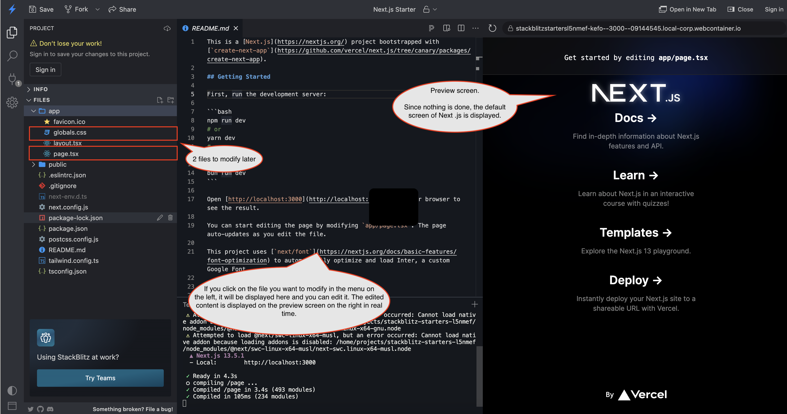
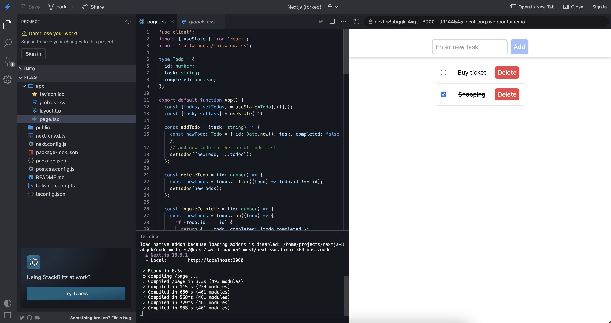

# シンプルなTodo Listアプリを作るハンズオン

## 作るもの

以下の機能を持つシンプルなTodo Listアプリを実装します。

- 機能はTodoの新規作成、完了のチェック、削除のみ
- 画面は一画面のみで、モーダルも使わない
- backendは作らず、frontendのみの簡易実装

## 主な技術スタック

- [Next.js](https://nextjs.org/)
  - React-based UI framework
  - Next.jsを導入する際に以下2つの技術スタックを選択すると自動で追加・設定されます。
- [Typescript](https://www.typescriptlang.org/)
  - JavaScript with syntax for types
- [tailwindcss](https://tailwindcss.com/)
  - CSS framework

## 実装

### Next.jsインストール設定済みのブラウザベースのIDEを開く

Next.jsインストール設定済みのブラウザベースのIDE [stackblitzのテンプレート](https://stackblitz.com/edit/nextjs)を開いてください。

開くとインストールや設定が始まります。以下の右ペインの画面(Next.jsのデフォルト画面)になるまでしばらくお待ちください。

stackblitzは、左ペインにファイルのディレクトリ、真ん中はファイルの編集、右ペインはプレビュー画面の構成になっています。



### 不要なCSS設定を消す

左のサイドバーにあるFilesの`app/globals.css`ファイルを開き、その内容を以下のコードに置き換えます。

```css
@tailwind base;
@tailwind components;
@tailwind utilities;
```

### Todo listアプリを実装する

左のサイドバーにあるFilesの`app/page.tsx`ファイルを開き、その内容を以下のコードに置き換えます。

```tsx
"use client";
import { useState } from "react";
import "tailwindcss/tailwind.css";

type Todo = {
  id: number;
  task: string;
  completed: boolean;
};

export default function App() {
  const [todos, setTodos] = useState<Todo[]>([]);
  const [task, setTask] = useState("");

  const addTodo = (task: string) => {
    // If multiple todos are created in the same millisecond and the same ID can be generated, consider another means (ex uuid)
    const newTodo: Todo = { id: Date.now(), task, completed: false };
    // add new todo to the top of todo list
    setTodos([newTodo, ...todos]);
  };

  const deleteTodo = (id: number) => {
    const newTodos = todos.filter((todo) => todo.id !== id);
    setTodos(newTodos);
  };

  const toggleComplete = (id: number) => {
    const newTodos = todos.map((todo) => {
      if (todo.id === id) {
        return { ...todo, completed: !todo.completed };
      }
      return todo;
    });
    setTodos(newTodos);
  };

  const handleAddClick = () => {
    addTodo(task);
    setTask("");
  };

  return (
    // using `className` property apply tailwindcss's class
    <div className="flex flex-col items-center min-h-screen py-2">
      <div className="fixed top-0 left-0 right-0 bg-white z-10 shadow-md">
        <div className="flex items-center justify-center pt-5">
          <input
            type="text"
            value={task}
            onChange={(e) => setTask(e.target.value)}
            placeholder="Enter new task"
            className="border-2 border-gray-300 p-2 my-2 rounded-md h-10"
          />
          <button
            onClick={handleAddClick}
            className={`bg-blue-500 text-white px-2 py-1 rounded-md ml-2 h-10 ${
              task ? "" : "opacity-50 cursor-not-allowed"
            }`}
            disabled={!task}
          >
            Add
          </button>
        </div>
      </div>
      <div className="mt-20 w-1/3">
        {todos.map((todo) => (
          <div
            key={todo.id}
            className="flex items-center justify-between p-3 border-b-2 w-100"
          >
            <input
              type="checkbox"
              checked={todo.completed}
              onChange={() => toggleComplete(todo.id)}
              className="mr-2"
            />
            <div
              onClick={() => toggleComplete(todo.id)}
              className={`cursor-pointer ${
                todo.completed ? "line-through" : ""
              }`}
            >
              {todo.task}
            </div>
            <button
              onClick={() => deleteTodo(todo.id)}
              className="bg-red-500 text-white px-2 py-1 rounded-md"
            >
              Delete
            </button>
          </div>
        ))}
      </div>
    </div>
  );
}
```

実装後は、以下の画面になっています(初期の何もTodoのない状態からTodoを追加しています)。



### 動作確認

右側のプレビュー画面にて、Todo Listアプリの動作確認をしてみてください。

### 終わりに

これでハンズオンは終わりです。  
コードは[ここ](https://github.com/minakamoto/pcshscr2023/tree/main/src/webapp/30min-exp-web-tech/1th/todo-list)から確認できます。  

もし、興味があれば、上に挙げたリンクをたどってコードの内容を調べたり、コードを好きに修正してみてください。
