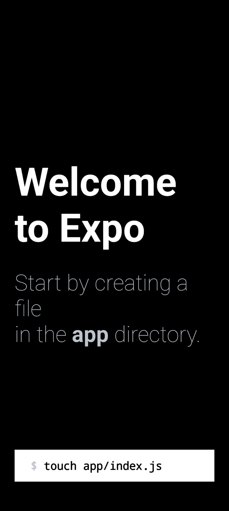
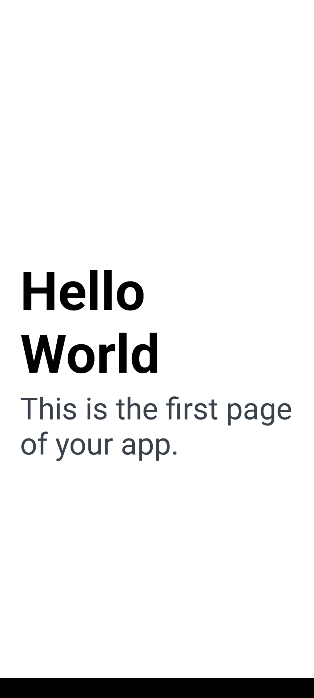
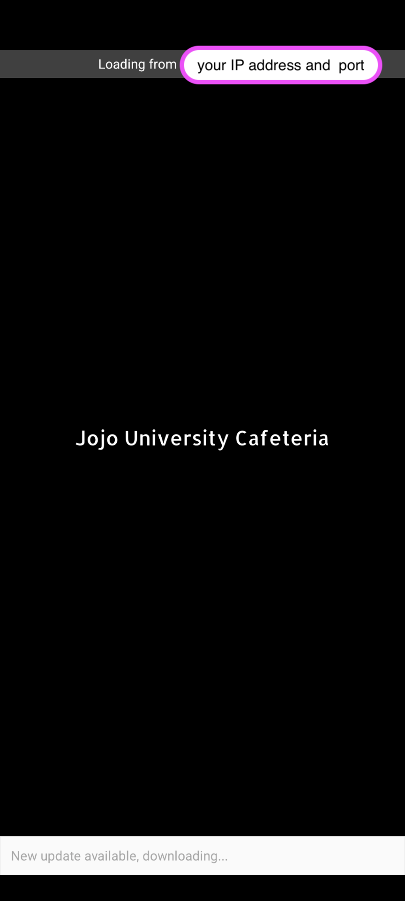
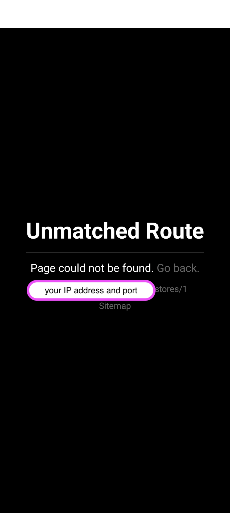
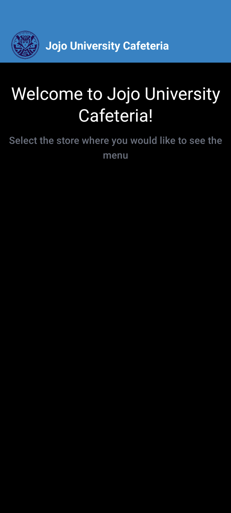
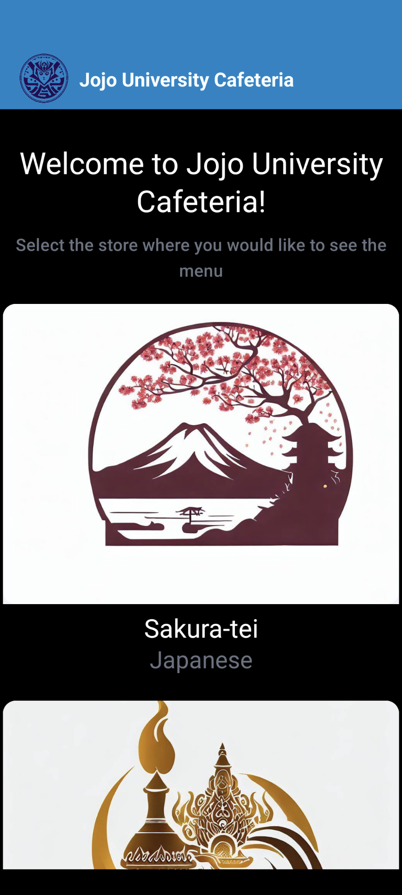
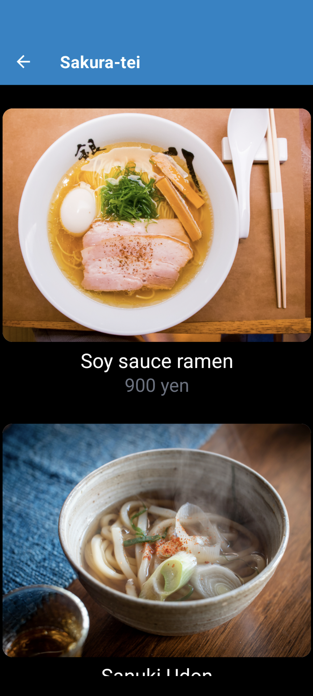
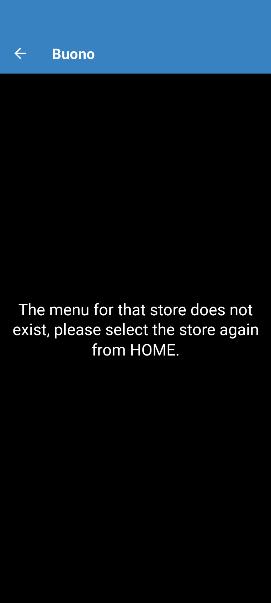
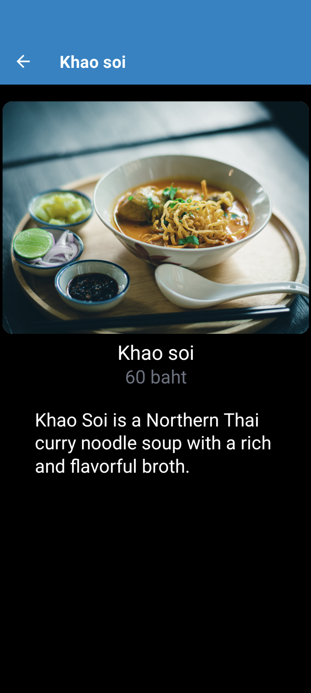
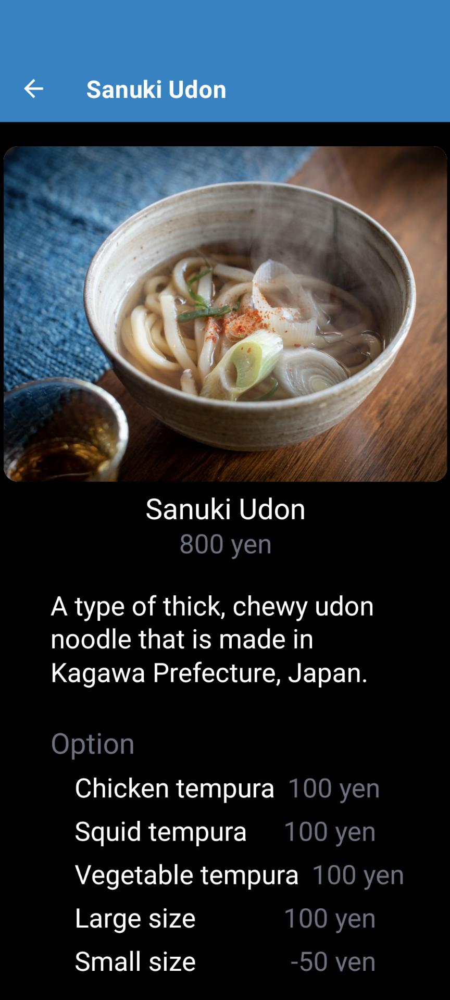

# 1stと2ndで体験したWebアプリ開発技術を利用してモバイルアプリを開発してみるハンズオン

## 0. はじめに

このハンズオンでは、1stと2ndで使用したWebアプリ開発技術(主にJavaScript/TypeScript, React)を利用して、モバイルアプリを体験してみるハンズオンです。[1st](1st.md)や[2nd](2nd.md)と同様、開発体験を楽しみ、Webアプリ開発技術に興味を持ってもらうことを主眼にしています。

そのため、あまり詳しい解説は行っていません。また、簡易な実装にとどめています。必要に応じて、TIPSや参考となるWebサイトのリンクを提供しています。

### 作るもの

[2nd](2nd.md)で作成したバックエンドAPIを呼び出し、その情報をモバイルアプリに表示します。機能およびUIは[2nd](2nd.md)で作成したWebアプリとほぼ同じです。

### 主な技術スタック

- [Javascript](https://developer.mozilla.org/en-US/docs/Web/JavaScript)/[Typescript](https://www.typescriptlang.org/)
- [React Native](https://reactnative.dev/)/[Expo](https://expo.dev/)

TIPS:

- React Nativeについて
  - React Nativeはクロスプラットフォームのモバイルアプリ開発フレームワークで、JavaScript(TypeScript)を使用します。一つのコードでiOSとAndroidの両方のアプリを開発できます。また、Webアプリケーション向けUI構築ライブラリーのReact.jsをモバイル端末向けアプリケーション開発用に使えるように作られたものです。React NativeとReact.jsは、役割は異なるもののコード表記法やコンポーネントの考え方など、多くの共通点があります。
  - クロスプラットフォームのモバイルアプリ開発フレームワークには、React Nativeのほかに[Flutter](https://flutter.dev/)が有名です。
    - FlutterはReact Nativeよりも後発のフレームワークであり、主な違いは使用する言語、デザインの自由度です。
  - クロスプラットフォームアプリでは、[Swift(iOS)](https://www.swift.org/)や[Kotlin(Android)](https://kotlinlang.org/)によるネイティブアプリに比べ、OSの最新機能や凝ったアプリが開発できないといったデメリットがあります。

- Expoについて
  - Expoは、React Nativeをベースにしたモバイルアプリを開発するためのツールセットです。Expoを使用すると、React Native単独で開発するよりも簡単にモバイルアプリを開発することができます。
  - Expoの主な特徴は以下の通りです：
    - Expo SDK
      - Expo SDKは、カメラ、加速度計、地図などのネイティブデバイス機能にアクセスするためのJavaScript APIを提供します。
    - Expo Go
      - Expo Goは、開発中のアプリをテストするためのモバイルクライアントアプリです。
    - Snack
      - Snackは、ブラウザ上でExpoプロジェクトを作成し、実行するためのオンラインエディタです。

## 1. Setup

### 前提条件

- Node.js 18+ or 20+
- Code Editor (Visual Studio Code)
- [2nd](2nd.md#3-データベースに接続してデータを返す)のバックエンドAPIをローカルに実装済みであること

**注意事項**：  
ここに記載されている必要なソフトウェアのインストール手順は、Windowsユーザーを対象としています。
これは、このハンズオンの最初のターゲットユーザーが、Windowsユーザーであるためです。実際にソフトウェアをインストールする際には、ご自身の環境に応じたインストール手順で行ってください。

### Windowsユーザー向けの詳細な手順

- Node.jsのインストール
  - [1st](./1st.md#1-setup)参照
- Visual Studio Code(VS Code)のインストール
  - [1st](./1st.md#1-setup)参照
- VS Codeの拡張機能のインストール・設定
  - [2st](2nd.md#1-setup)参照
- Expo Goのインストール
  - モバイルアプリの動作確認のために、[Expo Go](https://expo.dev/client)を使用します。Expo Goによって、お持ちのデバイス(Android, iOS)で開発しているモバイルアプリを即座に実行できます。お持ちのデバイスに応じて、Google PlayもしくはApp Storeにて、ダウンロードしてください([Expo Goの公式サイト](https://expo.dev/client)にリンクがあります)。

## 2. モバイルアプリ作成

### Expoプロジェクトの作成

VSCodeを起動します。`File`メニューの`Open Folder`を実行し、[2nd](2nd.md#1-setup)で各自作成した`dish-delight`ディレクトリを選択してください。  
`Terminal`メニューの`New Terminal`を実行し、ターミナルを起動します。以下のコマンドを実行します。  
**これ以降、コマンドの実行はVSCode上のターミナルを使用してください。**

```sh
npx create-expo-app mobile  -t blank-typescript@49 
```

**注意事項**：  
このハンズオンではExpo SDK49を使用します。Expo SDKは年に3回更新されます。次のバージョンのSDK50はbreaking changeや新機能もたくさんあるため、実際に開発する場合には最新の公式サイトを参照してください。

### 必要なライブラリのインストール

必要なライブラリのインストールをします。  
以下のコマンドを実行してください。

```sh
cd mobile
npx expo install expo-router react-native-safe-area-context react-native-screens expo-linking expo-constants expo-status-bar react-native-gesture-handler
npm install react-native-paper
```

TIPS:

- [Expo Router](https://docs.expo.dev/router/introduction/)について
  - 今回、RoutingにExpo Routerを採用しています。Expo Routerは、React NativeとWebアプリケーションのためのファイルベースのルーターです。
    - これは、アプリのディレクトリにファイルを追加すると、そのファイルが自動的にナビゲーションのルートになるという概念を採用しています。[Next.js](https://nextjs.org/)の概念と同じです。
  - Expo Routerは、[React Navigation](https://reactnavigation.org/)を基に作られており、同じコア機能を提供しますが、異なるアプローチを採用しています。
  - 一方、React Navigationはモバイルアプリケーション向けに設計され、ネイティブのモバイルアプリナビゲーションと似たスタックベースのナビゲーションモデルを提供します。
    - ファイルベースに慣れていると、React Navigationはルートを定義するためのコードが多い印象を持つかもしれません。
- [React Native Paper](https://reactnativepaper.com/)について
  - React Native Paperは、React NativeアプリのUIを作成するためのライブラリです。GoogleのMaterial Design原則に基づいており、簡単に見た目が良く、使いやすいアプリを作成するのに役立ちます。

注意事項:  
今回は必要なライブラリをマニュアルでインストールする方法を採用しています。  
`Quick Start`という方法もあります。必要なライブラリのインストールや次の手順の設定も自動で行われます。ただし、使用しないライブラリがインストールされたり、不要なファイルが作成されたりします。  
今回は開発する機能に対して、マニュアルインストールの方が手間や影響が少ないと判断したため、マニュアルインストールを採用しています。インストール方法について、詳しく知りたい場合は[公式サイト](https://docs.expo.dev/router/installation/)をご確認ください。

### 設定の修正

Expo Routerを導入したことにより必要な設定の修正を行います。

注意事項:  
このハンズオンで必要な箇所のみ修正しています。実際の開発の場合、必要な設定を[公式サイト](https://docs.expo.dev/router/installation/)で確認してください。

#### エントリーポイントの修正

エントリーポイントの修正をします。`dish-delight/mobile/package.json`を開き、4行目の`"main"`の値を以下に修正します。

```json
  "main": "expo-router/entry",
```

`dish-delight/mobile/package.json`全体では以下のようになります。

注意事項:  
インストールのタイミングによって、ライブラリのマイナーバージョン(例: `"expo"`の`49.XX.XX`の部分)が異なるため、まったく同一の値にはなりません。

```json
{
  "name": "mobile",
  "version": "1.0.0",
  "main": "expo-router/entry",
  "scripts": {
    "start": "expo start",
    "android": "expo start --android",
    "ios": "expo start --ios",
    "web": "expo start --web"
  },
  "dependencies": {
    "expo": "~49.0.18",
    "expo-constants": "~14.4.2",
    "expo-linking": "~5.0.2",
    "expo-router": "^2.0.0",
    "expo-status-bar": "~1.6.0",
    "react": "18.2.0",
    "react-native": "0.72.6",
    "react-native-gesture-handler": "~2.12.0",
    "react-native-paper": "^5.11.6",
    "react-native-safe-area-context": "4.6.3",
    "react-native-screens": "~3.22.0"
  },
  "devDependencies": {
    "@babel/core": "^7.20.0",
    "@types/react": "~18.2.14",
    "typescript": "^5.1.3"
  },
  "private": true
}
```

#### プロジェクト設定の修正

`dish-delight/mobile/app.json`を開き、その内容を以下のコードに置き換えます:  

```json
{
  "expo": {
    "name": "mobile",
    "slug": "mobile",
    "scheme": "dish-delight",
    "version": "1.0.0",
    "orientation": "portrait",
    "icon": "./assets/icon.png",
    "userInterfaceStyle": "light",
    "splash": {
      "image": "./assets/splash.png",
      "resizeMode": "contain",
      "backgroundColor": "#ffffff"
    },
    "assetBundlePatterns": ["**/*"],
    "ios": {
      "supportsTablet": true
    },
    "android": {
      "adaptiveIcon": {
        "foregroundImage": "./assets/adaptive-icon.png",
        "backgroundColor": "#ffffff"
      }
    },
    "web": {
      "favicon": "./assets/favicon.png"
    },
    "plugins": ["expo-router"]
  }
}
```

#### babel.config.jsの修正

`dish-delight/mobile/babel.config.js`を開き、その内容を以下のコードに置き換えます:

```js
module.exports = function (api) {
  api.cache(true);
  return {
    presets: ['babel-preset-expo'],
    plugins: ['expo-router/babel'],
  };
};
```

TIPS:

- babel.config.jsとは？
  - [Babel](https://babeljs.io/docs/)は、最新のJavaScript（ES2015+）を古いブラウザでも実行できる形式に変換するツール（トランスパイラ）です。
  - [babel.config.js](https://babeljs.io/docs/configuration)は、Babelの設定ファイルで、どのようにJavaScriptコードを変換するかを指示する設定が記述されています。これにより、最新のJavaScriptの機能を使用しながらも、古いブラウザでもそのコードを実行できます。

### 開発サーバーの起動

デフォルトのアプリのまま開発サーバを起動し、お手持ちのデバイスでアプリが起動できることを確認します。

以下のコマンドを実行してください。

```sh
npm run start -c
```

Expo GoアプリをインストールしたiOSまたはAndroidを作業しているPCと同じワイヤレスネットワークに接続します。  
Androidの場合、Expo Goアプリを使用してPCのターミナルに表示されるQRコードをスキャンし、プロジェクトを開きます。iOSの場合、デフォルトのiOSカメラアプリを使用し、QRコードをスキャンして、プロジェクトを開きます。

下記のExpo Routerのデフォルト画面が表示されることを確認してください。表示されたら、下部にある`touch app/index.js`ボタンを押してください。



`touch app/index.js`ボタンを押すと、以下になることを確認してください。

- 下記の画面に変わること
- VSCodeに戻ると、`dish-delight/mobile/app/index.tsx`が作成されていること



### Splash Screen等の画像をカスタマイズ

アプリ起動時に表示されるSplash Screenやアプリのロゴ等をこのhands-on用に変更します。合わせて、各店舗のロゴも取得・配置しておきます([2nd](2nd.md#2-フロントエンドのみのhomeとメニュー一覧と詳細画面の実装)と同様の画像ファイルです)。

対象の画像は[Github Repository](https://github.com/minakamoto/pschs2023/tree/main/docs/static/img/3rd/assets)からすべて取得してください。以下の7つのファイルです。  

- adaptive-icon.png
- aroy_logo.jpeg
- buono_logo.jpeg
- icon_jojo.png
- logo_jojo.png
- sakura_tei_logo.jpeg
- splash_jojo.png

`dish-delight/mobile/assets`に上記でダウンロードしたファイルを配置(上書き)してください。  

`dish-delight/mobile/app.json`を開き、その内容を以下のコードに置き換えます:

```json
{
  "expo": {
    "name": "Jojo University Cafeteria",
    "slug": "jojoUnivCafe",
    "scheme": "dish-delight",
    "version": "1.0.0",
    "orientation": "portrait",
    "icon": "./assets/icon_jojo.png",
    "userInterfaceStyle": "light",
    "splash": {
      "image": "./assets/splash_jojo.png",
      "resizeMode": "contain",
      "backgroundColor": "#000000"
    },
    "assetBundlePatterns": ["**/*"],
    "ios": {
      "supportsTablet": true
    },
    "android": {
      "adaptiveIcon": {
        "foregroundImage": "./assets/adaptive-icon.png",
        "backgroundColor": "#ffffff"
      }
    },
    "web": {
      "favicon": "./assets/favicon.png"
    },
    "plugins": ["expo-router"]
  }
}
```

お手持ちのデバイスでExpo GOでモバイルアプリを起動しなおし、アプリ起動時のSplash Screenが変更されることを確認してください。



TIPS:

- Expo GO上のモバイルアプリのreload方法
  1. モバイルアプリの開発サーバを起動している(`npm run start`)際にターミナル上で`r`を押す
  1. モバイルアプリの開発サーバを起動している(`npm run start`)際にターミナル上で`j`を押し、Expo GOのDevTool(or debugger)を起動させ、`Reload`ボタンを押す
  1. お手持ちのデバイスを振り(Android: 縦に振る、iOS: デバイスを少し振る or 3本の指で画面をタッチする)、Expo GOのDevTool(or debugger)を起動させ、`Reload`ボタンを押す
  - 詳しくは[Expo公式サイト](https://docs.expo.dev/debugging/tools/#developer-menu)を確認してください。
- Expo GOのDevToolにはChrome Devtoolでデバッグできたりなど、さまざまな機能があります。興味があれば、[Expo公式サイト](https://docs.expo.dev/debugging/tools/)をご確認ください。

### 固定文字を表示する3画面とそれらの画面遷移を実装する

このhands-onで構築する画面は[2nd](2nd.md)と同様、Homeとメニュー一覧とメニュー詳細画面の3つです。まずは、モバイルの画面遷移の開発を体験してみます。APIからデータを取得したり、それに合わせた画面を実装する前に、固定文字のみを表示させ、3画面の画面遷移を実装します。

`dish-delight/mobile/app/index.tsx`を開き、その内容を以下のコードに置き換えます:

```tsx
import { Link } from "expo-router";
import { StyleSheet, View } from "react-native";

export default function Home() {
  return (
    <View style={styles.container}>
      <Link
        style={styles.title}
        href={{
          pathname: "/stores/[storeId]",
          // Fixed values are passed to params for the only purpose of experiencing screen transitions.
          params: { storeName: "Sakura-tei", storeId: "1" },
        }}
      >
        Sakura-tei
      </Link>
    </View>
  );
}

const styles = StyleSheet.create({
  container: {
    flex: 1,
    alignItems: "center",
    justifyContent: "center",
    padding: 24,
  },
  title: {
    fontSize: 36,
    fontWeight: "bold",
  },
});

```

Expo GOでモバイルアプリを開いて、以下の画面が表示されることを確認してください。


また、`Sakura-tei`をタップすると、デフォルトのエラー画面(`Unmatched Route`)が表示されることを確認してください。


エラー画面の表示後、右スワイプ(左端から右へスワイプ)で`Sakura-tei`が表示されるHome画面に戻ってください。

`dish-delight/mobile/app/stores/[storeId]/index.tsx`ファイルを作成し、その内容を以下のコードに置き換えます:

```tsx
import { Link } from "expo-router";
import { StyleSheet, View } from "react-native";

export default function StoreMenu() {
  return (
    <View style={styles.container}>
      <Link
        style={styles.title}
        href={{
          pathname: "/stores/[storeId]/menus/[menuId]",
          params: { storeId: "1", menuName: "ramen", menuId: "1" },
        }}
      >
        Soy sauce ramen
      </Link>
    </View>
  );
}

const styles = StyleSheet.create({
  container: {
    flex: 1,
    alignItems: "center",
    justifyContent: "center",
    padding: 24,
  },
  title: {
    fontSize: 36,
    fontWeight: "bold",
  },
});

```

`dish-delight/mobile/app/stores/[storeId]/menus/[menuId]/index.tsx`ファイルを作成し、その内容を以下のコードに置き換えます:

```tsx
import { StyleSheet, Text, View } from "react-native";

export default function MenuDetail() {
  return (
    <View style={styles.container}>
      <Text style={styles.title}>Menu Detail</Text>
    </View>
  );
}

const styles = StyleSheet.create({
  container: {
    flex: 1,
    alignItems: "center",
    justifyContent: "center",
    padding: 24,
  },
  title: {
    fontSize: 36,
    fontWeight: "bold",
  },
});
```

Expo GOでモバイルアプリを開いて、以下の3画面が表示および遷移(固定文字のタップもしくはスワイプ)できるようになっているか確認してください。

| Home  | メニュー一覧  | メニュー詳細 |
| --- | --- | --- |
|  |  |  |

### 固定文字を表示するNavbarを実装する

さきほど実装した固定文字を表示する3画面に対応するNavbarを実装します。

`dish-delight/mobile/app/_layout.tsx`ファイルを作成し、その内容を以下のコードに置き換えます:

```tsx
import { Stack } from "expo-router";

export default function Layout() {
  return (
    <Stack
      initialRouteName="Home"
      // common setting
      screenOptions={{
        headerStyle: {
          backgroundColor: "#0284c7",
        },
        headerTintColor: "#fff",
        headerTitleStyle: {
          fontWeight: "bold",
        },
      }}
    />
  );
}
```

`dish-delight/mobile/app/index.tsx`を開き、その内容を以下のコードに置き換えます:

```tsx
import { Link, Stack } from "expo-router";
import { StyleSheet, View } from "react-native";

export default function Home() {
  return (
    <View style={styles.container}>
      <Stack.Screen options={{ title: "Home" }} />
      <Link
        style={styles.title}
        href={{
          pathname: "/stores/[storeId]",
          // Fixed values are passed to params for the purpose of experiencing screen transitions only.
          params: { storeName: "Sakura-tei", storeId: "1" },
        }}
      >
        Sakura-tei
      </Link>
    </View>
  );
}

const styles = StyleSheet.create({
  container: {
    flex: 1,
    alignItems: "center",
    justifyContent: "center",
    padding: 24,
  },
  title: {
    fontSize: 36,
    fontWeight: "bold",
  },
});
```

TIPS:  
各Screenのindex.tsxの差分は以下の部分だけです。

```tsx
<Stack.Screen options={{ ... }} />
```

`dish-delight/mobile/app/stores/[storeId]/index.tsx`を開き、その内容を以下のコードに置き換えます:

```tsx
import { Link, Stack } from "expo-router";
import { StyleSheet, View } from "react-native";

export default function StoreMenu() {
  return (
    <View style={styles.container}>
      <Stack.Screen
        options={{
          title: "Sakura-tei",
        }}
      />
      <Link
        style={styles.title}
        href={{
          pathname: "/stores/[storeId]/menus/[menuId]",
          params: { storeId: "1", menuName: "ramen", menuId: "1" },
        }}
      >
        Soy sauce ramen
      </Link>
    </View>
  );
}

const styles = StyleSheet.create({
  container: {
    flex: 1,
    alignItems: "center",
    justifyContent: "center",
    padding: 24,
  },
  title: {
    fontSize: 36,
    fontWeight: "bold",
  },
});

```

`dish-delight/mobile/app/stores/[storeId]/menus/[menuId]/index.tsx`を開き、その内容を以下のコードに置き換えます:

```tsx
import { Stack } from "expo-router";
import { StyleSheet, Text, View } from "react-native";

export default function MenuDetail() {
  return (
    <View style={styles.container}>
      <Stack.Screen
        options={{
          title: "Soy sauce ramen",
        }}
      />
      <Text style={styles.title}>Menu Detail</Text>
    </View>
  );
}

const styles = StyleSheet.create({
  container: {
    flex: 1,
    alignItems: "center",
    justifyContent: "center",
    padding: 24,
  },
  title: {
    fontSize: 36,
    fontWeight: "bold",
  },
});

```

Expo GOでモバイルアプリを開いて、3つの画面が以下になっているか確認してください。

| Home  | メニュー一覧  | メニュー詳細 |
| --- | --- | --- |
|  |  |  |

### Home画面のNavbarを変更する

`dish-delight/mobile/app/index.tsx`を開き、その内容を以下のコードに置き換えます:

```tsx
import { Stack } from "expo-router";
import { Image, StyleSheet, View } from "react-native";
import { Text } from "react-native-paper";

function LogoTitle() {
  return (
    <View style={styles.logoContainer}>
      <Image
        style={styles.logoImage}
        source={require("./../assets/logo_jojo.png")}
      />
      <Text style={styles.logoText}>Jojo University Cafeteria</Text>
    </View>
  );
}

export default function Home() {
  return (
    <View style={styles.container}>
      <Stack.Screen
        options={{
          // refs. https://reactnavigation.org/docs/headers#setting-the-header-title
          title: "Jojo Univ Cafeteria's Home",
          // refs. https://reactnavigation.org/docs/headers#replacing-the-title-with-a-custom-component
          headerTitle: () => <LogoTitle />,
        }}
      />
      <Text variant="headlineMedium" style={styles.title}>
        Welcome to Jojo University Cafeteria!
      </Text>
      <Text variant="titleMedium" style={styles.subTitle}>
        Select the store where you would like to see the menu
      </Text>
    </View>
  );
}

const styles = StyleSheet.create({
  container: {
    flex: 1,
    backgroundColor: "black",
  },
  title: {
    textAlign: "center",
    marginTop: 32,
    color: "#fff",
  },
  subTitle: {
    textAlign: "center",
    marginTop: 10,
    marginBottom: 20,
    marginHorizontal: 6,
    color: "#6b7280",
  },
  logoContainer: {
    flexDirection: "row",
    width: "100%",
  },
  logoImage: {
    width: 50,
    height: 50,
    alignSelf: "flex-start",
  },
  logoText: {
    textAlignVertical: "center",
    marginVertical: 10, // for iOS
    paddingStart: 8,
    fontWeight: "bold",
    fontSize: 18,
    color: "#fff",
  },
});
```

Expo GOでモバイルアプリを開いて、以下の画面が表示されることを確認してください(Navbarと固定のテキストのみ表示しています)。  


### 固定のデータでmobile側のAPI呼び出しを実装する

[2nd](2nd.md)では、まず各画面コンポーネントで固定のデータや型を持ち、リファクタリング後にAPI呼び出しコンポーネントを作成しました。しかし、今回は先に固定データでのAPI呼び出しコンポーネントを作成します([2nd](2nd.md)と同じコードです)。  
リファクタリングまでの流れがわからない場合は、[2nd](2nd.md)で復習してみてください。

`dish-delight/mobile/lib/api.tsx`ファイルを作成し、その内容を以下のコードに置き換えます:

```tsx
// dish-delight/frontend/lib/api.tsx

export type Store = {
  id: number;
  name: string;
  img: string;
  category: string;
};

const stores: Store[] = [
  {
    id: 1,
    name: "Sakura-tei",
    img: "/sakura_tei_logo.jpeg",
    category: "Japanese",
  },
  {
    id: 2,
    name: "Aroy",
    img: "/aroy_logo.jpeg",
    category: "Thai",
  },
  {
    id: 3,
    name: "Buono",
    img: "/buono_logo.jpeg",
    category: "Italian",
  },
];

// type definition of menu
export type Menu = {
  id: number;
  storeId: number;
  name: string;
  img: string;
  author: string;
  price: string;
  description: string;
  options?: Option[];
};

// type definition of menu's option
type Option = {
  name: string;
  price: string;
};

const menus = [
  {
    id: 1,
    storeId: 1,
    name: "Soy sauce ramen",
    img: "https://images.unsplash.com/photo-1632709810780-b5a4343cebec",
    author: "@5amramen",
    price: "900 yen",
    description:
      "A classic Japanese ramen noodle soup that is made with a soy sauce-based broth.",
    options: [
      {
        name: "Extra noodles",
        price: "100 yen",
      },
      {
        name: "Extra char siu",
        price: "100 yen",
      },
      {
        name: "Barikata(very hard noodles)",
        price: "0 yen",
      },
    ],
  },
  {
    id: 2,
    storeId: 1,
    name: "Sanuki Udon",
    img: "https://images.unsplash.com/photo-1618841557871-b4664fbf0cb3",
    author: "@jinomono",
    price: "800 yen",
    description:
      "A type of thick, chewy udon noodle that is made in Kagawa Prefecture, Japan.",
    options: [
      {
        name: "Chicken tempura",
        price: "100 yen",
      },
      {
        name: "Squid tempura",
        price: "100 yen",
      },
      {
        name: "Vegetable tempura",
        price: "100 yen",
      },
      {
        name: "Large size",
        price: "100 yen",
      },
      {
        name: "Small size",
        price: "-50 yen",
      },
    ],
  },
  {
    id: 3,
    storeId: 1,
    name: "Zaru soba",
    img: "https://images.unsplash.com/photo-1519984388953-d2406bc725e1",
    author: "@gaspanik",
    price: "1,000 yen",
    description: "A cold soba noodle dish served with a dipping sauce.",
    options: [
      {
        name: "Large size",
        price: "200 yen",
      },
    ],
  },
  {
    id: 4,
    storeId: 1,
    name: "Spicy Miso Ramen",
    img: "https://images.unsplash.com/photo-1637024696628-02cb19cc1829",
    author: "@5amramen",
    price: "900 yen",
    description: "A spicy miso ramen with a rich and flavorful broth.",
    options: [
      {
        name: "Large size",
        price: "100 yen",
      },
      {
        name: "Extra char siu",
        price: "100 yen",
      },
      {
        name: "Seasoned egg",
        price: "100 yen",
      },
    ],
  },
  {
    id: 8,
    storeId: 2,
    name: "Khao soi",
    img: "https://images.unsplash.com/photo-1569562211093-4ed0d0758f12",
    author: "@ural_8_low",
    price: "60 baht",
    description:
      "Khao Soi is a Northern Thai curry noodle soup with a rich and flavorful broth.",
  },
];

export async function getStores(): Promise<Store[]> {
  return stores;
}

export async function getStore(storeId: number): Promise<Store | undefined> {
  return stores.find((store) => store.id === storeId);
}

export async function getMenus(storeId: number): Promise<Menu[]> {
  return menus.filter((menu) => menu.storeId === storeId);
}

export async function getMenu(
  storeId: number,
  menuId: number
): Promise<Menu | undefined> {
  return menus.find((menu) => menu.storeId === storeId && menu.id === menuId);
}
```

### データが存在しない場合のコンポーネントを実装する

API呼び出しと同様、[2nd](2nd.md)ではリファクタリング後に行っていましたが、コンポーネント化を先に実施します。  
リファクタリングまでの流れがわからない場合は、[2nd](2nd.md)で復習してみてください。

`dish-delight/mobile/lib/constants.ts`ファイルを作成し、その内容を以下のコードに置き換えます:

```ts
// dish-delight/mobile/lib/constants.ts

export const DATA_NOT_FOUND_MESSAGE = {
  // This message is not used because frontend and data are not executed on each Screen, but are passed between screens (difference between Next.js and React Native/Expo).
  STORE: "The store does not exist, please select the store again from HOME.",
  MENU: "The menu for that store does not exist, please select the store again from HOME.",
};
```

`dish-delight/mobile/components/DataNotFound.tsx`ファイルを作成し、その内容を以下のコードに置き換えます:

```tsx
// dish-delight/mobile/components/DataNotFound.tsx

import { StyleSheet, View } from "react-native";
import { Text } from "react-native-paper";

type DataNotFoundProps = {
  message: string;
};

// The message will be passed on from the caller.
export default function DataNotFound({ message }: DataNotFoundProps) {
  return (
    <View style={styles.notFoundContainer}>
      <Text variant="titleLarge" style={styles.notFoundText}>
        {message}
      </Text>
    </View>
  );
}

const styles = StyleSheet.create({
  notFoundContainer: {
    flex: 1,
    backgroundColor: "black",
    alignItems: "center",
    justifyContent: "center",
  },
  notFoundText: {
    textAlign: "center",
    color: "#fff",
    marginHorizontal: 10,
  },
});

```

**注意事項**:

- 例外処理について
  - ほかのハンズオンと同様、このハンズオンでは、開発の体験を優先しているため、例外処理は簡易的に実装しています。実際の開発では、要件や技術要素を加味して適切に実装してください。

### Home画面を固定のデータで表示する

[2nd](2nd.md)と同じく、バックエンドのAPIからデータを取得する前にフロントエンド上で保持する固定データを表示するようにします。

`dish-delight/mobile/app/index.tsx`を開き、その内容を以下のコードに置き換えます:

```tsx
// dish-delight/mobile/app/index.tsx

import { Stack, router } from "expo-router";
import { useEffect, useState } from "react";
import { Image, ScrollView, StyleSheet, View } from "react-native";
import { Card, Text } from "react-native-paper";
import { Store, getStores } from "../lib/api";

const assetLogoImages = [
  { name: "Sakura-tei", source: require("./../assets/sakura_tei_logo.jpeg") },
  { name: "Aroy", source: require("./../assets/aroy_logo.jpeg") },
  { name: "Buono", source: require("./../assets/buono_logo.jpeg") },
];

function getStoreImage(storeName: string) {
  const imageSource = assetLogoImages.find((image) => image.name === storeName);
  return imageSource
    ? imageSource.source
    : require("./../assets/icon_jojo.png"); // If no matching image is found
}

function LogoTitle() {
  return (
    <View style={styles.logoContainer}>
      <Image
        style={styles.logoImage}
        source={require("./../assets/logo_jojo.png")}
      />
      <Text style={styles.logoText}>Jojo University Cafeteria</Text>
    </View>
  );
}

export default function Home() {
  const [stores, setStores] = useState<Store[]>([]);

  // see. https://reactnative.dev/docs/next/network#using-fetch
  const getStoreList = async () => {
    try {
      const data = await getStores();
      setStores(data);
    } catch (error) {
      console.error(error);
    }
  };

  useEffect(() => {
    getStoreList();
  }, []);

  return (
    <ScrollView style={styles.container}>
      <Stack.Screen
        options={{
          // refs. https://reactnavigation.org/docs/headers#setting-the-header-title
          title: "Jojo Univ Cafeteria's Home",
          // refs. https://reactnavigation.org/docs/headers#replacing-the-title-with-a-custom-component
          headerTitle: () => <LogoTitle />,
        }}
      />
      <Text variant="headlineMedium" style={styles.title}>
        Welcome to Jojo University Cafeteria!
      </Text>
      <Text variant="titleMedium" style={styles.subTitle}>
        Select the store where you would like to see the menu
      </Text>
      {stores.map((store) => (
        <Card
          key={store.id}
          accessible={true}
          accessibilityLabel={`Card for${store.name}`}
          style={styles.cardContainer}
          onPress={() =>
            router.push({
              pathname: "/stores/[storeId]",
              params: { storeName: store.name, storeId: store.id },
            })
          }
        >
          <Card.Cover
            accessible={true}
            accessibilityLabel={`Cover image for${store.name}`}
            alt={`Cover image for${store.name}`}
            source={getStoreImage(store.name)}
            style={styles.cardCover}
          />
          <Card.Title
            title={store.name}
            subtitle={store.category}
            titleVariant="headlineSmall"
            subtitleVariant="titleLarge"
            titleStyle={styles.cardTitle}
            subtitleStyle={styles.cardSubTitle}
            style={{
              backgroundColor: "black",
            }}
          ></Card.Title>
        </Card>
      ))}
    </ScrollView>
  );
}

const styles = StyleSheet.create({
  container: {
    flex: 1,
    backgroundColor: "black",
  },
  title: {
    textAlign: "center",
    marginTop: 32,
    color: "#fff",
  },
  subTitle: {
    textAlign: "center",
    marginTop: 10,
    marginBottom: 20,
    marginHorizontal: 6,
    color: "#6b7280",
  },
  logoContainer: {
    flexDirection: "row",
    width: "100%",
  },
  logoImage: {
    width: 50,
    height: 50,
    alignSelf: "flex-start",
  },
  logoText: {
    textAlignVertical: "center",
    marginVertical: 10, // for iOS
    paddingStart: 8,
    fontWeight: "bold",
    fontSize: 18,
    color: "#fff",
  },
  cardContainer: {
    alignSelf: "center",
    marginBottom: 20,
    marginHorizontal: 30,
    height: 350,
    width: 370,
  },
  cardCover: {
    height: 280,
    width: 370,
  },
  cardTitle: {
    textAlign: "center",
    color: "#fff",
  },
  cardSubTitle: {
    textAlign: "center",
    color: "#6b7280",
  },
});
```

以下を確認してください。

- Expo GOでモバイルアプリを開いて、以下の画面が表示されること  

- `Sakura-tei`、`Aroy`、`Buono`のいずれかのCardをクリックすると、メニュー一覧画面に遷移すること
  - メニュー一覧画面の実装はまだ変えていないので、どの店舗をクリックしても固定文字`Soy sauce ramen`が表示されます

### メニュー一覧画面を固定のデータで表示する

Home画面と同じく、メニュー一覧画面もフロントエンド上で保持する固定データを表示するようにします。

`dish-delight/mobile/app/stores/[storeId]/index.tsx`を開き、その内容を以下のコードに置き換えます:

```tsx
// dish-delight/mobile/app/stores/[storeId]/index.tsx

import { Stack, router, useLocalSearchParams } from "expo-router";
import { useEffect, useState } from "react";
import { FlatList, StyleSheet, View } from "react-native";
import { Menu, getMenus } from "../../../lib/api";
import { ActivityIndicator, Card } from "react-native-paper";
import DataNotFound from "../../../components/DataNotFound";
import { DATA_NOT_FOUND_MESSAGE } from "../../../lib/constants";

export default function StoreMenu() {
  // Get the parameter specified at router push.
  const params = useLocalSearchParams();
  const storeName = params.storeName as string;
  const storeId = Number(params.storeId);

  const [isLoading, setLoading] = useState(true);
  const [menus, setMenus] = useState<Menu[]>([]);

  const getMenuList = async () => {
    try {
      const data = await getMenus(storeId);
      setMenus(data);
    } catch (error) {
      console.error(error);
    } finally {
      setLoading(false);
    }
  };

  useEffect(() => {
    getMenuList();
  }, [storeId]);

  // This function is provided to Flatlist's "renderItem".
  // "renderItem" is a function that defines how each item in the list should be drawn.
  // In other words, it determines how each item in the list will look like.
  const renderCard = (item: Menu) => (
    <>
      <Card
        key={item.id}
        accessible={true}
        accessibilityLabel={`Card for${item.name}`}
        style={styles.cardContainer}
        onPress={() =>
          router.push({
            pathname: "/stores/[storeId]/menus/[menuId]",
            params: { storeId: storeId, menuName: item.name, menuId: item.id },
          })
        }
      >
        <Card.Cover
          accessible={true}
          accessibilityLabel={`Cover image for${item.name}`}
          alt={`Card image for${item.name}`}
          source={{ uri: item.img }}
          style={styles.cardCover}
        />
        <Card.Title
          title={item.name}
          subtitle={item.price}
          titleVariant="headlineSmall"
          subtitleVariant="titleLarge"
          titleStyle={styles.cardTitle}
          subtitleStyle={styles.cardSubTitle}
          style={styles.cardTitleContainer}
        ></Card.Title>
      </Card>
    </>
  );

  // If data does not exist, an error screen is displayed
  if (!isLoading && menus.length === 0) {
    return <DataNotFound message={DATA_NOT_FOUND_MESSAGE.MENU} />;
  }

  return (
    <View style={styles.container}>
      <Stack.Screen
        options={{
          title: storeName,
        }}
      />
      {isLoading ? (
        // Display Loading until data is available
        <ActivityIndicator
          size={"large"}
          color="#0284c7"
          style={styles.indicator}
        />
      ) : (
        // FlatList is a component for efficient display of long lists. It is a tool for creating scrollable lists, which is especially useful when dealing with large amounts of data.
        <FlatList
          style={styles.container}
          data={menus}
          renderItem={({ item }) => renderCard(item)}
        ></FlatList>
      )}
    </View>
  );
}

const styles = StyleSheet.create({
  container: {
    flex: 1,
    backgroundColor: "black",
  },
  indicator: {
    flex: 1,
    backgroundColor: "black",
    alignItems: "center",
    justifyContent: "center",
  },
  cardContainer: {
    alignItems: "center",
    marginHorizontal: 20,
    marginTop: 28,
    height: 350,
    backgroundColor: "black",
  },
  cardCover: {
    height: 280,
    width: 370,
  },
  cardTitleContainer: {
    backgroundColor: "black",
  },
  cardTitle: {
    textAlign: "center",
    color: "#fff",
  },
  cardSubTitle: {
    textAlign: "center",
    color: "#6b7280",
  },
});

```

動作や見た目を確認します。

- Home画面にて`Sakura-tei`のCardをクリックすると、メニュー一覧画面に遷移すること
  - メニューが4つ表示されること
    
- メニュー一覧画面のいずれかのメニューの Card をクリックすると、メニュー詳細画面に遷移すること
  - 固定文字を表示する画面のままなので、どれをクリックしても"Menu Detail"と表示されます
- Home画面にて`Aroy`のCardをクリックすると、メニュー一覧画面に遷移すること
  - メニューが1つ表示されること
- Home画面にて`Buono`のCardをクリックすると、メニュー一覧画面に遷移すること
  - メニューがないため、エラーメッセージがでること
    

### メニュー詳細画面を固定のデータで表示する

Homeやメニュー一覧画面と同じく、メニュー詳細画面もフロントエンド上で保持する固定データを表示するようにします。

`dish-delight/mobile/app/stores/[storeId]/menus/[menuId]/index.tsx`を開き、その内容を以下のコードに置き換えます:

```tsx
// dish-delight/mobile/app/stores/[storeId]/menus/[menuId]/index.tsx

import { Stack, useLocalSearchParams } from "expo-router";
import { useEffect, useState } from "react";
import { StyleSheet, View } from "react-native";
import { Menu, getMenu } from "../../../../../lib/api";
import DataNotFound from "../../../../../components/DataNotFound";
import { DATA_NOT_FOUND_MESSAGE } from "../../../../../lib/constants";
import { Card, Text } from "react-native-paper";

export default function MenuDetail() {
  // Get the parameter specified at router push.
  const params = useLocalSearchParams();
  const menuName = params.menuName as string;
  const menuId = Number(params.menuId);
  const storeId = Number(params.storeId);
  const [menu, setMenu] = useState<Menu>();
  // Since there is only one data item in the menu detail screen, Loading process would be skipped.

  const getMenuDetail = async () => {
    try {
      const data = await getMenu(storeId, menuId);
      setMenu(data);
    } catch (error) {
      console.error(error);
    }
  };

  useEffect(() => {
    getMenuDetail();
  }, [storeId, menuId]);

  // If data does not exist, an error screen is displayed
  if (!menu) {
    return <DataNotFound message={DATA_NOT_FOUND_MESSAGE.MENU} />;
  }

  return (
    <View style={styles.container}>
      <Stack.Screen
        options={{
          title: menuName,
        }}
      />
      <Card
        key={menu?.id}
        style={styles.cardContainer}
        accessible={true}
        accessibilityLabel={`Card for${menu?.name}`}
      >
        <Card.Cover
          accessible={true}
          accessibilityLabel={`Cover image for${menu?.name}`}
          alt={`Card image for${menu?.name}`}
          source={{ uri: menu?.img }}
          style={styles.cardCover}
        />
        <Card.Title
          title={menu?.name}
          subtitle={menu?.price}
          titleVariant="headlineSmall"
          subtitleVariant="titleLarge"
          titleStyle={styles.cardTitle}
          subtitleStyle={styles.cardSubTitle}
          style={styles.cardTitleContainer}
        ></Card.Title>
      </Card>
      <Text variant="titleLarge" style={styles.menuDescription}>
        {menu?.description}
      </Text>
      {menu?.options && menu.options.length > 0 && (
        <View style={styles.menuOptionContainer}>
          <Text variant="headlineSmall" style={styles.menuOptionTitle}>
            Option
          </Text>
          {menu.options.map((option) => (
            // If there are options in the menu, display the number of options
            <View
              key={option.name}
              style={styles.menuOptionInnerContainer}
              accessible={true}
            >
              <Text variant="titleLarge" style={styles.menuOptionName}>
                {option.name}
              </Text>
              <Text variant="titleLarge" style={styles.menuOptionPrice}>
                {option.price}
              </Text>
            </View>
          ))}
        </View>
      )}
    </View>
  );
}

const styles = StyleSheet.create({
  container: {
    flex: 1,
    backgroundColor: "black",
  },
  cardContainer: {
    alignItems: "center",
    marginHorizontal: 20,
    marginVertical: 20,
    height: 350,
    backgroundColor: "black",
  },
  cardCover: {
    height: 280,
    width: 370,
  },
  cardTitleContainer: {
    backgroundColor: "black",
  },
  cardTitle: {
    textAlign: "center",
    color: "#fff",
  },
  cardSubTitle: {
    textAlign: "center",
    color: "#6b7280",
  },
  menuDescription: {
    color: "white",
    marginHorizontal: 42,
  },
  menuOptionContainer: {
    marginHorizontal: 42,
    marginTop: 28,
  },
  menuOptionTitle: {
    color: "#6b7280",
  },
  menuOptionInnerContainer: {
    flexDirection: "row",
    justifyContent: "space-between",
    marginHorizontal: 20,
    marginTop: 8,
  },
  menuOptionName: {
    color: "white",
  },
  menuOptionPrice: {
    color: "#6b7280",
    marginLeft: 10,
  },
});
```

動作や見た目を確認します。

- メニュー一覧画面のいずれかのメニューのCardをクリックすると、メニュー詳細画面に遷移すること
  - 該当のメニュー画像や説明、Optionなどが表示されること
    - 例: 店舗`Aroy`の`Khao Soi`(Optionなし)
    
    - 例: 店舗`Sakura-tei`の`Sanuki Udon`(Optionあり)
    
- 店舗やメニューが存在しない場合のエラー画面
  - イメージはメニュー一覧画面と同じ

### 作業しているPCのIPアドレスを確認し、バックエンドAPIを起動する

作業しているPCのIPアドレスを確認し、バックエンドAPIを起動します。

まず、作業しているPCのIPアドレスを確認します。  
IPアドレスの確認方法は、コントロールパネルやターミナルでコマンドを実行する方法などがあります。  
今回はモバイルアプリの開発サーバを起動している(`npm run start`)際にターミナル上にご自身のIPアドレス(`Metro waiting on exp://xxx.xxx.xxx.xxx:8081`の`xxx.xxx.xxx.xxx`部分)が以下のように表示されていると思いますので、そちらを確認してみてください。

```sh
› Metro waiting on exp://xxx.xxx.xxx.xxx:8081
› Scan the QR code above with Expo Go (Android) or the Camera app (iOS)

› Using Expo Go
› Press s │ switch to development build

› Press a │ open Android
› Press i │ open iOS simulator
› Press w │ open web

› Press j │ open debugger
› Press r │ reload app
› Press m │ toggle menu
› Press o │ open project code in your editor

› Press ? │ show all commands
```

次にバックエンドAPIを起動します。  
モバイルアプリの開発サーバを起動しているターミナルとは別のターミナルを開き、[2nd](2nd.md#1-setup)で各自作成した`dish-delight/backend`ディレクトリに移動してください。`dish-delight/backend`ディレクトリへ移動したことを確認し、以下のコマンドを実行します。

```sh
rye run uvicorn main:app --reload --host xxx.xxx.xxx.xxx
```

`xxx.xxx.xxx.xxx`は先ほど調べたあなたのPCのIPアドレスに置き換えてください。

### mobile側のAPI呼び出しを修正する

固定データを返していたAPI呼び出しコンポーネントをバックエンドのAPIを呼び出すように変更します。

`dish-delight/mobile/lib/api.tsx`を開き、その内容を以下のコードに置き換えます:

```tsx
// dish-delight/mobile/lib/api.tsx

export type Store = {
  id: number;
  name: string;
  img: string;
  category: string;
};

export type Menu = {
  id: number;
  storeId: number;
  name: string;
  img: string;
  author: string;
  price: string;
  description: string;
  options?: Option[];
};

type Option = {
  name: string;
  price: string;
};

// FIXME Please set the IP address of your local PC.
const url = "http://xxx.xxx.xxx.xxx:8000";

export async function getStores(): Promise<Store[]> {
  const res = await fetch(`${url}/stores`);

  if (!res.ok) {
    // This will activate the closest `error.js` Error Boundary
    throw new Error("Failed to fetch data");
  }

  return res.json();
}

export async function getStore(storeId: number): Promise<Store | undefined> {
  const res = await fetch(`${url}/stores/${storeId}`);

  if (!res.ok) {
    // This will activate the closest `error.js` Error Boundary
    throw new Error("Failed to fetch data");
  }

  return res.json();
}

export async function getMenus(storeId: number): Promise<Menu[]> {
  const res = await fetch(`${url}/stores/${storeId}/menus`);

  if (!res.ok) {
    // This will activate the closest `error.js` Error Boundary
    throw new Error("Failed to fetch data");
  }

  return res.json();
}

export async function getMenu(
  storeId: number,
  menuId: number
): Promise<Menu | undefined> {
  const res = await fetch(`${url}/stores/${storeId}/menus/${menuId}`);

  if (!res.ok) {
    // This will activate the closest `error.js` Error Boundary
    throw new Error("Failed to fetch data");
  }

  return res.json();
}
```

動作確認の前に、27行目の`xxx.xxx.xxx.xxx`を先ほど調べたあなたのPCのIPアドレスに置き換えてください。

動作や見た目を確認します。  
店舗やメニューを変えてひとしきり動作確認を行なってみてください。データベースからデータを取得しているため、先ほど確認したフロントエンドで保持した固定データの内容よりも増えているはずです。(例: 店舗`Buono`にもメニューがあります。)

## 3. 終わりに

これでハンズオンは終了です。お疲れ様でした。完全なコードは[こちら](https://github.com/minakamoto/pcshscr2023/tree/main/src/webapp/handson-for-catchup/src/3rd/dish-delight)から確認できます。  
モバイルアプリもWebアプリと同じような雰囲気で開発できることを少し体験できたと思います。興味があれば、紹介したリンクのサイトを確認したり、ご自分のアイデアでアプリを開発してみてください。
