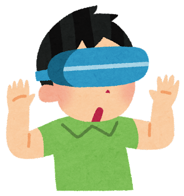
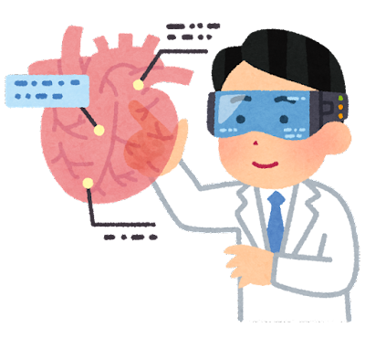

# さまざまなXR事例の紹介

## はじめに

このドキュメントは、ICTの基礎を学ぶ中学生に、XRの活用例を紹介し、ICT技術への興味関心を促すためのものです。

## TIPS

### XRとは

XRは、**Extended Reality**（エクステンデッドリアリティ）の略で、現実世界と仮想世界を融合させて、現実にはないものを知覚できる技術の総称です。そのため、**VR**（仮想現実）、**AR**（拡張現実）、**MR**（複合現実）といった技術は、いずれもXRに含まれます。

**VR**は、**Virtual Reality**（バーチャルリアリティ）の略で、現実世界を完全に遮断して、仮想の空間を体験できる技術です。ヘッドマウントディスプレイ（HMD）やゴーグルなどのデバイスを装着して、仮想の世界を360度で体験することができます。VRはゲームやトレーニングなどで使われています。

**AR**は、**Augmented Reality**（オーグメンテッドリアリティ）の略で、現実世界に仮想の情報を重ねて、現実を拡張して体験できる技術です。スマートフォンやタブレットなどのデバイスを使って、カメラで撮影している現実の映像に、CGやテキストなどの仮想の情報を重ねることで、現実の世界を拡張することができます。ARはナビゲーションや広告どで使われています。

**MR**は、**Mixed Reality**（ミックスドリアリティ）の略で、現実世界と仮想世界を融合して、現実と仮想がシームレスに連続する体験ができる技術です。HMDやスマートグラスなどのデバイスを使って、現実の世界と仮想の世界を同時に体験することができます。MRは製造業や医療などで使われています。

XRは、ゲームやエンターテインメントの分野ですでに活用されていますが、今後は教育、医療、製造、ビジネスなど、さまざまな分野での活用が期待されています。

### WebXRとは

WebXRは、ウェブブラウザ上でXRコンテンツを体験できるようにするAPIです。WebXRを使うことで、特別なデバイスやソフトウェアをインストールする必要がなく、スマートフォンやタブレット、PCなどのさまざまなデバイスで利用でき、XRのコンテンツを簡単に体験することができます。さらに、オープンソースで開発されているため、誰でも自由に開発に参加することができ、さまざまな機能やアプリケーションが開発されています。

これらの特徴から、WebXRはXRコンテンツの普及に大きく貢献すると考えられています。今後、WebXRを使ったさまざまなXRコンテンツが開発され、さまざまな分野で活用されることが期待されています。

## XR事例

### 事例1

TBD

### 事例2

TBD
