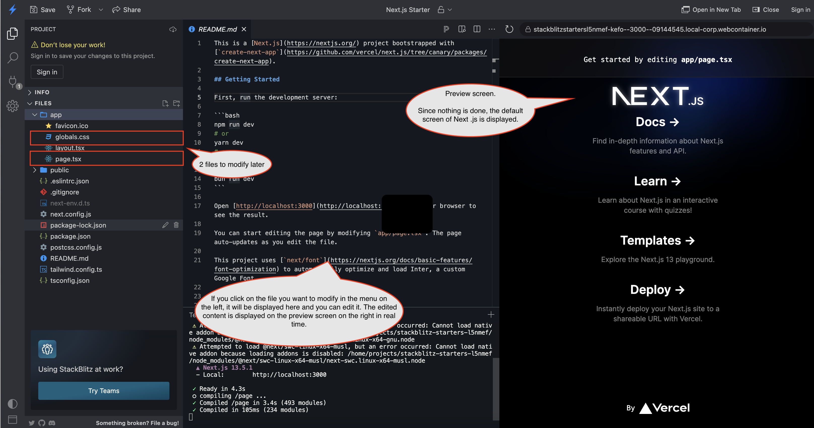
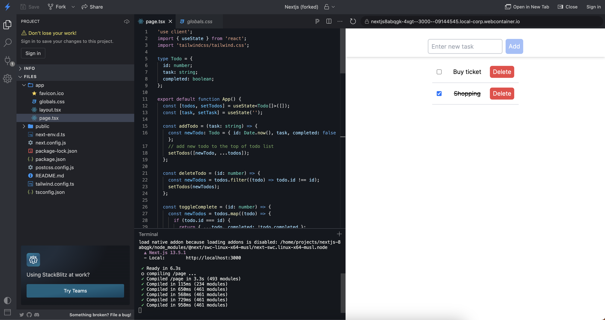

# Hands-on to developing a simple Todo List app

## What we make

We will develop a simple Todo List app with the following functions.

- Create new todo, check completion, and delete todo.
- Only one screen and no modal.
- No backend, just a simple development of the frontend.

## Main Technology Stack

- [Next.js](https://nextjs.org/)
  - React-based UI framework
  - The following two technology stacks are automatically added and configured when you select them when installing Next.js.
- [Typescript](https://www.typescriptlang.org/)
  - JavaScript with syntax for types
- [tailwindcss](https://tailwindcss.com/)
  - CSS framework

## Development

### Open Next.js installation configured browser-based IDE

Open the Next.js installation configured browser-based IDE [stackblitz template](https://stackblitz.com/edit/nextjs).

Once opened, installation and configuration will begin. Please wait a moment until you see the screen in the right pane below (the default Next.js screen).

stackblitz consists of a directory of files in the left pane, file editing in the middle, and a preview screen in the right pane.



### Delete unnecessary CSS settings

Open the file `app/globals.css` in Files in the left sidebar and replace its contents with the following code.

```css
@tailwind base;
@tailwind components;
@tailwind utilities;
```

### Developing Todo list App

Open the file `app/page.tsx` in Files on the left sidebar and replace its contents with the following code.

```tsx
"use client";
import { useState } from "react";
import "tailwindcss/tailwind.css";

type Todo = {
  id: number;
  task: string;
  completed: boolean;
};

export default function App() {
  const [todos, setTodos] = useState<Todo[]>([]);
  const [task, setTask] = useState("");

  const addTodo = (task: string) => {
    // If multiple todos are created in the same millisecond and the same ID can be generated, consider another means (ex uuid)
    const newTodo: Todo = { id: Date.now(), task, completed: false };
    // add new todo to the top of todo list
    setTodos([newTodo, ...todos]);
  };

  const deleteTodo = (id: number) => {
    const newTodos = todos.filter((todo) => todo.id !== id);
    setTodos(newTodos);
  };

  const toggleComplete = (id: number) => {
    const newTodos = todos.map((todo) => {
      if (todo.id === id) {
        return { ...todo, completed: !todo.completed };
      }
      return todo;
    });
    setTodos(newTodos);
  };

  const handleAddClick = () => {
    addTodo(task);
    setTask("");
  };

  return (
    // using `className` property apply tailwindcss's class
    <div className="flex flex-col items-center min-h-screen py-2">
      <div className="fixed top-0 left-0 right-0 bg-white z-10 shadow-md">
        <div className="flex items-center justify-center pt-5">
          <input
            type="text"
            value={task}
            onChange={(e) => setTask(e.target.value)}
            placeholder="Enter new task"
            className="border-2 border-gray-300 p-2 my-2 rounded-md h-10"
          />
          <button
            onClick={handleAddClick}
            className={`bg-blue-500 text-white px-2 py-1 rounded-md ml-2 h-10 ${
              task ? "" : "opacity-50 cursor-not-allowed"
            }`}
            disabled={!task}
          >
            Add
          </button>
        </div>
      </div>
      <div className="mt-20 w-1/3">
        {todos.map((todo) => (
          <div
            key={todo.id}
            className="flex items-center justify-between p-3 border-b-2 w-100"
          >
            <input
              type="checkbox"
              checked={todo.completed}
              onChange={() => toggleComplete(todo.id)}
              className="mr-2"
            />
            <div
              onClick={() => toggleComplete(todo.id)}
              className={`cursor-pointer ${
                todo.completed ? "line-through" : ""
              }`}
            >
              {todo.task}
            </div>
            <button
              onClick={() => deleteTodo(todo.id)}
              className="bg-red-500 text-white px-2 py-1 rounded-md"
            >
              Delete
            </button>
          </div>
        ))}
      </div>
    </div>
  );
}
```

After development, the following screen is shown (Todo is added from the initial state with no Todo).



### Checking the behavior

Please check the behavior of the Todo List app on the preview screen on the right.

### Wrap up

This concludes the hands-on session.  
The code can be viewed [here](https://github.com/minakamoto/pcshscr2023/tree/main/src/webapp/30min-exp-web-tech/1th/todo-list).  

If you are interested, follow the links above to check out the code and modify it as you like.
