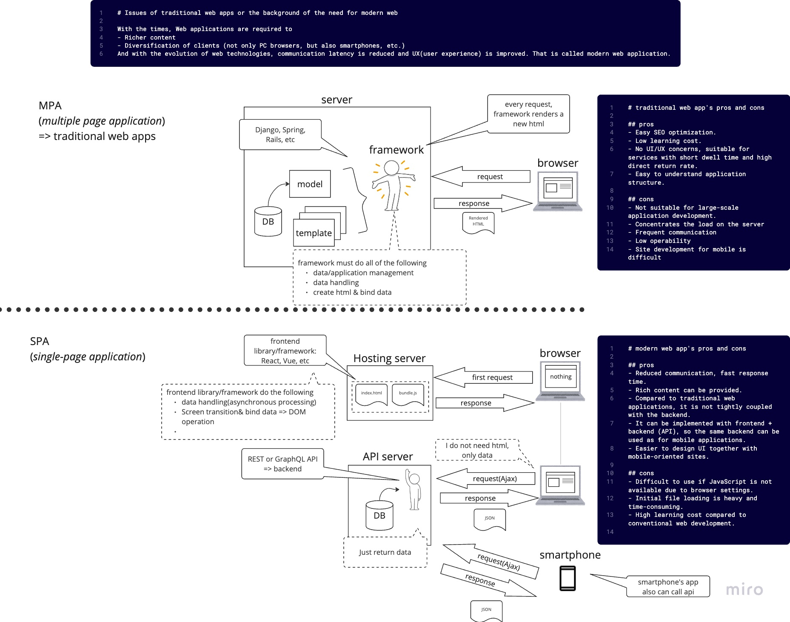
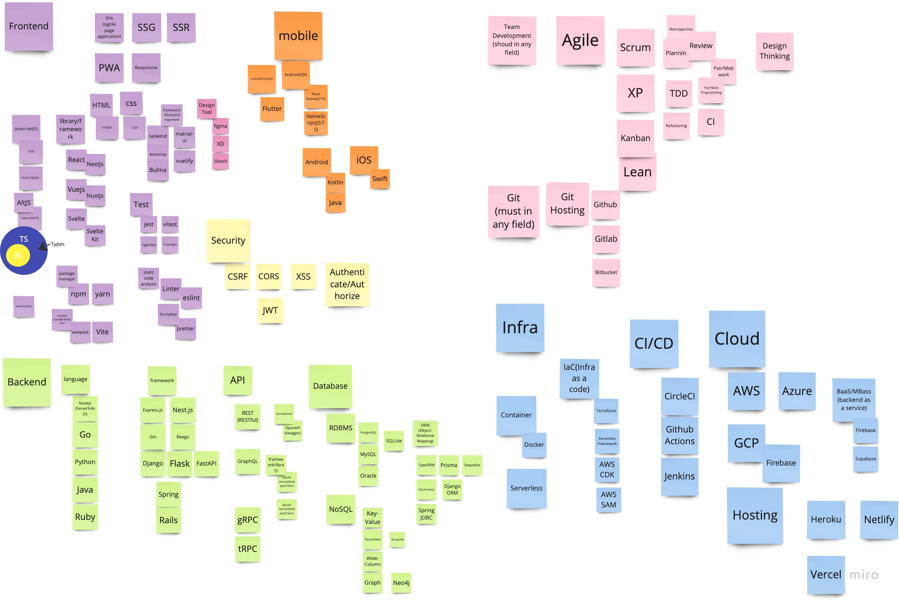

# ภาพรวมเกี่ยวกับเทคโนโลยีสำหรับพัฒนาเว็บแอปพลิเคชัน

## 0. บทนำ

นี่คือเซสชันเพื่อดูเล่นความแตกต่างระหว่าง architecture เว็บแอปสมัยใหม่และแบบดั้งเดิมและสแต็กเทคโนโลยีที่จำเป็นสำหรับการพัฒนาเว็บแอปสมัยใหม่

- โปรดดูข้อมูลที่ระบุไว้ พูดคุยกับผู้เข้าร่วมคนอื่นๆ และค้นหาสิ่งที่คุณสนใจ ลองทำความเข้าใจว่าการพัฒนาเว็บแอปสมัยใหม่เป็นอย่างไร
- คุณอาจไม่รู้ว่ามันคืออะไรในครั้งแรกที่คุณเห็น แต่ก็ไม่เป็นไร ก็เพียงพอแล้วที่จะรู้ว่าการพัฒนาเว็บในอดีตและปัจจุบันนั้นแตกต่างกันมาก และจำนวนและความกว้างของสแต็กเทคโนโลยีสำหรับการพัฒนาเว็บสมัยใหม่นั้นกว้างมาก
- คุณอาจพบว่าสิ่งนี้มีประโยชน์ที่จะกลับมาดูอีกครั้งหลังจากคุณได้ทำกิจกรรม hands-on แล้ว เป็นต้น

## 1. ภาพรวมของวิวัฒนาการของสแต็กเทคโนโลยีเว็บแอปพลิเคชัน

### ความแตกต่างระหว่างเทคโนโลยีเว็บแอปเมื่อ 20 ปีที่แล้วกับปัจจุบัน

#### ให้ความสนใจกับเรื่องของหน้า HTML หลายหน้า กับแอปพลิเคชันหน้าเดียว:

ดูแผนภาพต่อไปนี้เพื่อทำความเข้าใจวิธีการทำงาน รายละเอียดเพิ่มเติมจะอธิบายในบทต่อไป

#### ความแตกต่างโดยรวมระหว่างสแต็กเทคโนโลยีเว็บแอปเมื่อ 20 ปีที่แล้วกับปัจจุบัน

ตารางนี้สรุปความแตกต่างสำคัญระหว่างการพัฒนาเว็บแอปเมื่อ 20 ปีที่แล้วกับปัจจุบัน:

|          Aspect         | 20 Years Ago | Today                      |
|:-----------------------:|:------------:|:--------------------------:|
|    Application Architecture | Multiple HTML pages | Single-page apps |
|       Backend Architecture | Monolithic	| Monolithic, Microservices|
|    Frontend Technology Stack | Simple HTML, CSS, JavaScript | Advanced HTML, CSS, JavaScript(include library/framework like React, Angular, Vue.js, etc.) |
|       Backend Technology Stack | PHP, Perl, etc. |  JavaScript(Node.js), Python, Go, Rust, etc.|
|         Database           | RDB	| RDB, NoSQL| 
|        User Interface     | Static, page-based | Dynamic, interactive |
|        User Experience    | Not a priority | Responsive, intuitive, user-friendly |
|     Mobile-first approach | Not common | Optimized for mobile devices first |
|         Data Handling     | Server-side rendering | Client-side rendering |
|         Data Transfer     | Limited | GraphQL, RestAPI |
|          Performance      | Slow load times, page refreshes | Fast load times, smooth transitions |
|         Collaboration     | Mostly solo | Team-based using Git, Jira, Slack, etc. |
|   Development Process     | Waterfall model | Agile development methodologies |
|       Cloud Computing     | Physical servers | AWS, Azure, Google Cloud, etc. |
|          Deployment       | Manual deployment | Continuous deployment and delivery |

ความแตกต่างที่น่าสังเกตบางประการ ได้แก่:

- multiple HTML pages vs. single-page apps:
  - มาตรฐานการพัฒนาเว็บแอปประมาณ 20 ปีที่ผ่านมาเป็นการใช้หน้า HTML หลายหน้า โดยแต่ละหน้าจะเป็นไฟล์ HTML แยกต่างหาก และผู้ใช้ต้องโหลดหน้าเว็บทั้งหมดใหม่เมื่อต้องการเปลี่ยนหน้า ส่งผลให้เวลาในการโหลดช้าลงและประสบการณ์การใช้งานที่ลื่นไหลน้อยลง ในทางตรงกันข้าม แอปหน้าเดียว (SPA) ได้รับความนิยมมากขึ้นในการพัฒนาเว็บแอปสมัยใหม่ SPA เร็วกว่า มอบประสบการณ์ผู้ใช้ที่ราบรื่นยิ่งขึ้น และประสิทธิภาพที่ดีขึ้น แต่อาจซับซ้อนกว่าในการพัฒนาและต้องการเทคโนโลยีขั้นสูง เช่น React, Vue หรือ Angular สปาอาจมีปัญหากับ SEO การเปลี่ยนไปสู่ SPA สะท้อนให้เห็นถึงแนวโน้มที่มากขึ้นในการสร้างเว็บแอปที่ให้ความสำคัญกับประสบการณ์และประสิทธิภาพของผู้ใช้ แต่ยังต้องการทักษะและการพิจารณาในการพัฒนาที่ซับซ้อนมากขึ้นด้วย
- AJAX: 
  - AJAX (Asynchronous JavaScript and XML) เป็นเทคโนโลยีที่ช่วยให้เว็บแอปพลิเคชันสามารถอัปเดตเนื้อหาได้โดยไม่ต้องโหลดหน้าเว็บทั้งหมดใหม่  AJAX เป็นเทคนิคที่มีประสิทธิภาพที่ช่วยปรับปรุงประสบการณ์ของผู้ใช้บนหน้าเว็บได้  AJAX เป็นเทคโนโลยีที่สำคัญสำหรับการพัฒนาเว็บแอปพลิเคชันสมัยใหม่
- Responsive design: 
  - ในอดีต เว็บแอปพลิเคชันได้รับการออกแบบด้วยรูปแบบตายตัวที่ไม่ได้ปรับตามขนาดหน้าจอที่แตกต่างกัน ในปัจจุบัน การออกแบบที่ตอบสนองตามอุปกรณ์ถือเป็นเรื่องปกติ และเว็บแอปพลิเคชันคาดว่าจะดูดีและทำงานได้ดีบนอุปกรณ์ต่างๆ รวมถึงเดสก์ท็อป แท็บเล็ต และสมาร์ทโฟน
- Mobile-first design:
  - ด้วยการเพิ่มขึ้นของสมาร์ทโฟนและแท็บเล็ต เว็บแอปพลิเคชันจำนวนมากในปัจจุบันจึงได้รับการออกแบบโดยคำนึงถึงอุปกรณ์เคลื่อนที่เป็นอันดับแรก ซึ่งหมายความว่าการออกแบบได้รับการปรับให้เหมาะกับอุปกรณ์พกพา โดยมีเค้าโครงเดสก์ท็อปและแท็บเล็ตที่สร้างขึ้นเหนือการออกแบบอุปกรณ์พกพา
- Security:
  - ด้วยการเพิ่มขึ้นของภัยคุกคามทางไซเบอร์ ความปลอดภัยจึงเป็นข้อกังวลสูงสุดสำหรับเว็บแอปพลิเคชัน ปัจจุบัน เว็บแอปพลิเคชันได้รับการออกแบบให้มีคุณลักษณะด้านความปลอดภัย เช่น การเข้ารหัส SSL การตรวจสอบสิทธิ์แบบสองปัจจัยและการป้องกันการเขียนสคริปต์ข้ามไซต์ (XSS)
- Cloud computing:
  - ในอดีต เว็บแอปพลิเคชันมักโฮสต์บนเซิร์ฟเวอร์จริง ซึ่งทีมพัฒนาต้องดูแลและอัปเดต ปัจจุบัน การประมวลผลแบบคลาวด์ได้ปฏิวัติการโฮสต์เว็บ ทำให้การโฮสต์เว็บแอปพลิเคชันในระบบคลาวด์เป็นเรื่องง่ายและประหยัดมากขึ้น

## 2. สแต็กเทคโนโลยีเว็บแอปสมัยใหม่

### ภาพรวมและความสัมพันธ์ของสแต็กเทคโนโลยีที่จำเป็นสำหรับการสร้างเว็บแอปพลิเคชันสมัยใหม่

สแต็กเทคโนโลยีที่จำเป็นสำหรับเว็บแอปสมัยใหม่ประกอบด้วยเลเยอร์ต่างๆรวมถึง frontend, backend, mobile, UI/UX และ เทคโนโลยีinfrastructure ซึ่งทำงานร่วมกันเพื่อสร้างประสบการณ์ผู้ใช้ที่ราบรื่น แม้ว่าองค์ประกอบของทีมอาจแตกต่างกันไปขึ้นอยู่กับขนาดขององค์กรและปัจจัยอื่นๆ การพัฒนาและปรับใช้แอปพลิเคชันให้ประสบความสำเร็จจำเป็นต้องอาศัยการทำงานร่วมกันและการสื่อสารที่มีประสิทธิภาพระหว่างสมาชิกในทีมและผู้มีส่วนได้ส่วนเสียภายนอก เช่น ลูกค้าและผู้ใช้ Agile, XP, TDD, Git และเครื่องมือการจัดการโครงการต่างๆ เช่น Jira, Asana และ Trello สามารถช่วยในการทำงานร่วมกันและการจัดการนี้ได้

#### คำอธิบายสั้น ๆ ของแต่ละเลเยอร์เทคโนโลยีในสแต็กการพัฒนาเว็บแอปสมัยใหม่:

- Frontend: 
  - เลเยอร์นี้มีหน้าที่สร้าง user interface และ user experience ของแอปพลิเคชัน โดยใช้เทคโนโลยีเช่น HTML, CSS, JavaScript และfrontend frameworksต่างๆ เช่น React, Vue และ Angular
- Backend:
  - เลเยอร์นี้มีหน้าที่จัดการตรรกะทางธุรกิจและการจัดเก็บข้อมูลของแอปพลิเคชัน โดยใช้เทคโนโลยีserver-side เช่น ภาษาการเขียนโปรแกรม เช่น Node.js, Python, Ruby และ Java และframeworkต่างๆ เช่น Express.js, Nest.js, Django, FastAPI, Spring, Ruby on Rails
- Mobile:
  - เลเยอร์นี้มีหน้าที่ในการพัฒนาแอปพลิเคชันมือถือที่ทำงานควบคู่กับเว็บแอป ใช้ framework การพัฒนาแอพแบบเนทีฟเช่น Swift, Kotlin และ Java หรือ framework การพัฒนา cross-platform เช่น React Native และ Flutter
- UI/UX: 
  - เลเยอร์นี้มีหน้าที่สร้างประสบการณ์ผู้ใช้ที่ดึงดูดสายตาและราบรื่นสำหรับแอปพลิเคชัน โดยใช้เครื่องมือออกแบบ เช่น Sketch, Figma และ Adobe XD
- Infrastructure:
  - เลเยอร์นี้มีหน้าที่การปรับใช้ การปรับขนาด และการจัดการแอปพลิเคชัน ใช้ cloud platform เช่น AWS, Azure และ GCP และเครื่องมือ DevOps เช่น Docker, Kubernetes, Ansible และ Terraform

แต่ละเลเยอร์ต้องการชุดทักษะและความเชี่ยวชาญที่แตกต่างกัน และการทำงานร่วมกันระหว่างทีมต่างๆ เป็นสิ่งสำคัญเพื่อให้มั่นใจว่าการพัฒนาและการปรับใช้แอปพลิเคชันประสบความสำเร็จ

### แผนภาพพร้อมชื่อโดยละเอียด (เป็นตัวอย่างเท่านั้น) ของสแต็คเทคโนโลยีที่จำเป็นสำหรับเว็บแอปสมัยใหม่

ชื่อโดยละเอียดของสแต็คเทคโนโลยีที่จำเป็นสำหรับการพัฒนาเว็บแอปพลิเคชันสมัยใหม่แสดงอยู่ในตัวอย่างบนสติกกี่ นี่เป็นเพียงตัวอย่างเท่านั้น ผู้เขียนได้โพสต์สติกกี่พร้อมชื่อสแต็กเทคโนโลยีที่คิดขึ้นได้อย่างรวดเร็วในเวลาที่เขียน โปรดทราบว่าเทคโนโลยีมีการพัฒนาอย่างต่อเนื่อง และข้อมูลนี้อาจล้าสมัยได้ทุกเมื่อ

## 3. Links
- [MDN Web Docs](https://developer.mozilla.org/en-US/docs/Learn)
  - มีการรวบรวมข้อมูลเกี่ยวกับเทคโนโลยีเว็บ นอกจากนี้ยังมีแบบฝึกหัดสำหรับผู้เริ่มต้น
- [microsoft/Web-Dev-For-Beginners](https://microsoft.github.io/Web-Dev-For-Beginners/#/)
  - หลักสูตรสำหรับผู้เริ่มต้นในการพัฒนาเว็บที่ Microsoft นำเสนอ
    - [เนื้อหาเพิ่มเติม](https://learn.microsoft.com/en-us/users/wirelesslife/collections/p1ddcy5jwy0jkm) ของหลักสูตรข้างต้น
      - นอกจากเนื้อหาด้านบนนี้แล้ว ยังมีเนื้อหาที่หลากหลายให้เลือกใน [Microsoft Learn](https://learn.microsoft.com/en-us/training/) เพิ่มเติม
- [web.dev](https://web.dev/)
  - คำแนะนำสำหรับการพัฒนาเว็บสมัยใหม่ โดย Google
- [Developer Roadmaps](https://roadmap.sh/)
  - มีชุดของแผนงานที่จะแนะนำผู้เรียนผ่านเส้นทางต่างๆ ของการพัฒนาเว็บ นอกจากนี้ แผนงานจะได้รับการอัปเดตเป็นประจำเพื่อให้ทันกับแนวโน้มและเทคโนโลยีล่าสุดในด้านนี้
- [The State of JS](https://2022.stateofjs.com/en-US/)
  - เว็บไซต์นี้รวบรวมแบบสำรวจที่รวบรวมจากนักพัฒนาเว็บทั่วโลกทุกปี เป็นข้อมูลอ้างอิงที่ดีในการดูแนวโน้มและสถานะเกี่ยวกับ JavaScript โปรดทราบว่า URL จะเปลี่ยนแปลงทุกปี
