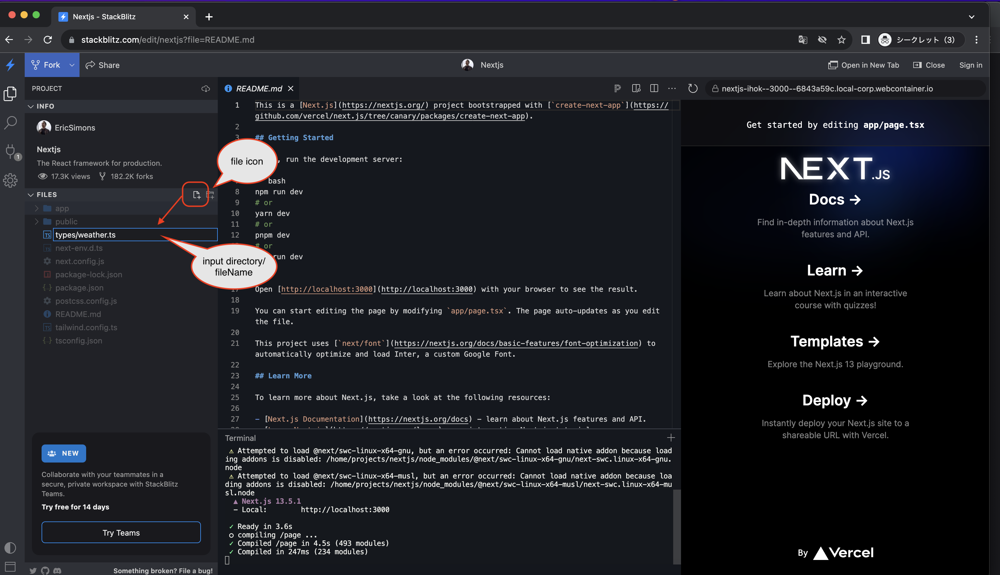
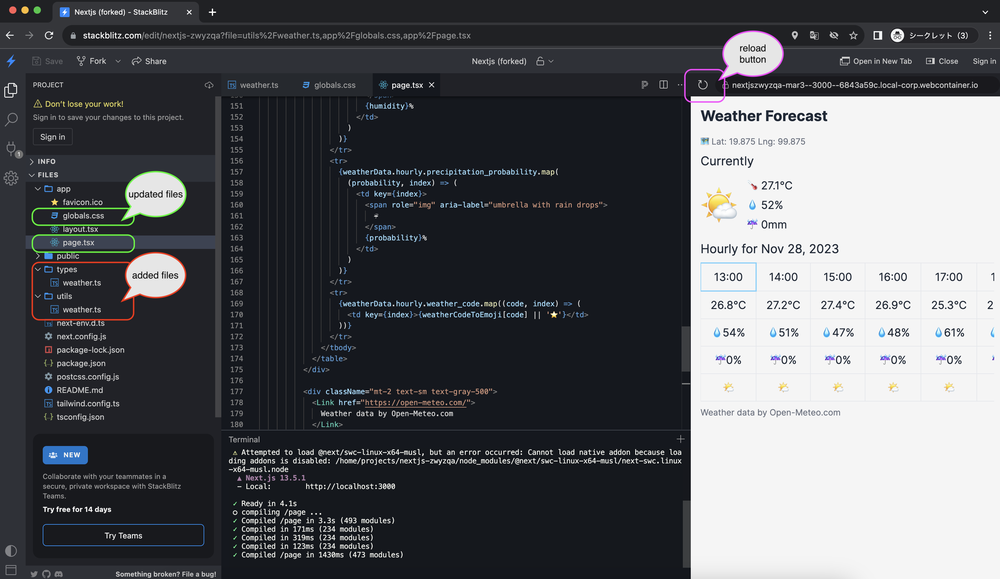

# Hands-on to developing a simple Weather Forecast app

## สิ่งที่เราจะสร้าง

เราจะพัฒนาแอป Weather Forecast แบบง่ายๆ พร้อมด้วยฟังก์ชันต่อไปนี้

- รับตำแหน่งปัจจุบันจากเบราว์เซอร์ เรียก API ภายนอก และแสดงบนหน้าจอ
  - รับสภาพอากาศปัจจุบันและพยากรณ์อากาศรายชั่วโมงสำหรับวันปัจจุบันด้วย API ภายนอก
  - API พยากรณ์อากาศใช้ [Open-Meteo](https://open-meteo.com/)
    - ไม่ต้องลงทะเบียนผู้ใช้สำหรับการใช้งานที่ไม่ใช่เชิงพาณิชย์ และสามารถใช้ได้ฟรีสูงสุด 10,000 ครั้ง
- มีเพียงหน้าจอเดียวและไม่มีmodal
- API ภายนอกเป็นการใช้งานแบบง่ายที่ทำการเรียกใช้เท่านั้นและไม่จัดการกับข้อผิดพลาด

หมายเหตุ:  
เมื่อพัฒนาจริง โปรดเลือก API ภายนอกที่เหมาะสมตามความต้องการของคุณ  
เพื่อมอบประสบการณ์สบายๆ ในการพัฒนาแอปพลิเคชันเว็บ เรามุ่งเน้นที่ความสะดวกของผู้เข้าร่วมที่ hands-on (ฟรีและไม่ต้องลงทะเบียนผู้ใช้)

## สแต็คเทคโนโลยีหลัก

เหมือนกับ[1st](./1st.md#สแต็คเทคโนโลยีหลัก)

## การพัฒนา

### เปิดการติดตั้ง Next.js ที่กำหนดค่า IDE บนเบราว์เซอร์

เปิดการติดตั้ง Next.js เทมเพลต IDE [stackblitz template](https://stackblitz.com/edit/nextjs) ที่ใช้เบราว์เซอร์ที่กำหนดค่าไว้

สำหรับคำอธิบายของหน้าจอ stackblitz โปรดดูที่ [1st](./1st.md#เปิดการติดตั้ง-nextjs-ที่กำหนดค่า-ide-บนเบราว์เซอร์)

### การตั้งค่า CSS

เปิดไฟล์ `app/globals.css` ใน Files ในแถบด้านข้างซ้าย และแทนที่เนื้อหาด้วยโค้ดต่อไปนี้  
กด `Ctrl + s` (หรือ `Command + s` บน Mac) หลังจากทำการเปลี่ยนแปลงเพื่อให้แน่ใจว่าเนื้อหาได้รับการบันทึก

```css
@import 'tailwindcss/base';
@import 'tailwindcss/components';
@import 'tailwindcss/utilities';

body {
  @apply bg-neutral-100 text-gray-800;
}

h1 {
  @apply text-2xl font-bold mb-4;
}

h2 {
  @apply text-xl my-2;
}

p {
  @apply my-1;
}

table {
  @apply w-full text-left border-collapse;
}

th,
td {
  @apply text-lg border py-2 px-4 text-center whitespace-nowrap;
}
```

### กำหนดประเภท

กำหนดประเภทที่จำเป็นสำหรับการตอบกลับที่ส่งกลับโดย API ภายนอก

คลิกไอคอนไฟล์ทางด้านขวาของไฟล์ในแถบด้านข้างซ้ายและสร้างไฟล์ `types/weather.ts`  
  
เปิดไฟล์ `types/weather.ts` ใน Files ในแถบด้านข้างซ้าย และแทนที่เนื้อหาด้วยโค้ดต่อไปนี้  
กด `Ctrl + s` (หรือ `Command + s` บน Mac) หลังจากทำการเปลี่ยนแปลงเพื่อให้แน่ใจว่าเนื้อหาได้รับการบันทึก

```ts
// define type
export type WeatherData = {
  latitude: number;
  longitude: number;
  generationtime_ms: number;
  utc_offset_seconds: number;
  timezone: string;
  timezone_abbreviation: string;
  elevation: number;
  current_units: {
    time: string;
    interval: string;
    temperature_2m: string;
    relative_humidity_2m: string;
    rain: string;
    weather_code: string;
  };
  current: {
    time: string;
    interval: number;
    temperature_2m: number;
    relative_humidity_2m: number;
    rain: number;
    weather_code: number;
  };
  hourly_units: {
    time: string;
    temperature_2m: string;
    relative_humidity_2m: string;
    precipitation_probability: string;
    weather_code: string;
  };
  hourly: {
    time: string[];
    temperature_2m: number[];
    relative_humidity_2m: number[];
    precipitation_probability: number[];
    weather_code: number[];
  };
};

```

### กำหนด utility

กำหนด object ที่จำเป็นในการแปลงรหัสสภาพอากาศในการตอบกลับที่ API ภายนอกส่งคืนเป็นอิโมจิ

คลิกไอคอนไฟล์ทางด้านขวาของไฟล์ในแถบด้านข้างซ้ายและสร้างไฟล์ `utils/weather.ts`  
เปิดไฟล์ `utils/weather.ts` ใน Files ในแถบด้านข้างซ้าย และแทนที่เนื้อหาด้วยโค้ดต่อไปนี้  
กด `Ctrl + s` (หรือ `Command + s` บน Mac) หลังจากทำการเปลี่ยนแปลงเพื่อให้แน่ใจว่าเนื้อหาได้รับการบันทึก

```ts
// mapping of weather codes returned in API responses and emojis
export const weatherCodeToEmoji: Record<number, string> = {
  0: "🌞", // Clear sky
  1: "🌤️", // Mainly clear, partly cloudy, and overcast
  2: "🌤️", // Mainly clear, partly cloudy, and overcast
  3: "🌤️", // Mainly clear, partly cloudy, and overcast
  45: "🌫️", // Fog and depositing rime fog
  48: "🌫️", // Fog and depositing rime fog
  51: "🌧️", // Drizzle: Light, moderate, and dense intensity
  53: "🌧️", // Drizzle: Light, moderate, and dense intensity
  55: "🌧️", // Drizzle: Light, moderate, and dense intensity
  56: "🌧️", // Freezing Drizzle: Light and dense intensity
  57: "🌧️", // Freezing Drizzle: Light and dense intensity
  61: "🌧️", // Rain: Slight, moderate and heavy intensity
  63: "🌧️", // Rain: Slight, moderate and heavy intensity
  65: "🌧️", // Rain: Slight, moderate and heavy intensity
  66: "🌧️", // Freezing Rain: Light and heavy intensity
  67: "🌧️", // Freezing Rain: Light and heavy intensity
  71: "🌨️", // Snow fall: Slight, moderate, and heavy intensity
  73: "🌨️", // Snow fall: Slight, moderate, and heavy intensity
  75: "🌨️", // Snow fall: Slight, moderate, and heavy intensity
  77: "🌨️", // Snow grains
  80: "🌧️", // Rain showers: Slight, moderate, and violent
  81: "🌧️", // Rain showers: Slight, moderate, and violent
  82: "🌧️", // Rain showers: Slight, moderate, and violent
  85: "🌨️", // Snow showers slight and heavy
  86: "🌨️", // Snow showers slight and heavy
  95: "⛈️", // Thunderstorm: Slight or moderate
  96: "⛈️", // Thunderstorm with slight and heavy hail
  99: "⛈️", // Thunderstorm with slight and heavy hail
};

```

### การพัฒนาแอปพยากรณ์อากาศ

เปิดไฟล์ `app/page.tsx` ใน Files ที่แถบด้านข้างซ้าย และแทนที่เนื้อหาด้วยโค้ดต่อไปนี้  
กด `Ctrl + s` (หรือ `Command + s` บน Mac) หลังจากทำการเปลี่ยนแปลงเพื่อให้แน่ใจว่าเนื้อหาได้รับการบันทึก
  
```tsx
"use client";
import Link from "next/link";
import { useEffect, useRef, useState } from "react";
import { WeatherData } from "../types/weather";
import { weatherCodeToEmoji } from "../utils/weather";

const Home = () => {
  // Define current time only once at rendering
  const now = new Date();
  // round down to the nearest hour
  now.setMinutes(0);
  const currentTime = now.toLocaleTimeString([], {
    hour: "2-digit",
    minute: "2-digit",
  });
  const currentDate = now.toLocaleDateString("en-US", {
    year: "numeric",
    month: "short",
    day: "numeric",
  });

  const [weatherData, setWeatherData] = useState<WeatherData | null>(null);
  const [errorMessage, setErrorMessage] = useState("");
  const timeRefs = useRef<{ [key: string]: HTMLTableCellElement | null }>({});
  const scrollContainer = useRef<HTMLDivElement>(null);
  // Define the width of the fixed columns
  // This should be adjusted based on your actual layout
  const fixedColumnsWidth = 100;
  useEffect(() => {
    navigator.geolocation.getCurrentPosition(
      async (position) => {
        const { latitude, longitude } = position.coords;
        // Simple coding, so fetch error handling is not implemented.
        const response = await fetch(
          `https://api.open-meteo.com/v1/forecast?latitude=${latitude}&longitude=${longitude}&timezone=auto&current=temperature_2m,relative_humidity_2m,rain,weather_code&hourly=temperature_2m,relative_humidity_2m,precipitation_probability,rain,weather_code&forecast_days=1`
        );
        const data = await response.json();
        setWeatherData(data);
      },
      (error) => {
        // Error handling when location information cannot be obtained
        setErrorMessage(
          "Failed to get location information. Please check your browser settings."
        );
      }
    );
  }, []);

  // To move to the column corresponding to the current time
  useEffect(() => {
    const currentTimeColumn = timeRefs.current[currentTime];
    if (currentTimeColumn && scrollContainer.current) {
      // Calculate the scroll position
      const scrollPosition = currentTimeColumn.offsetLeft + fixedColumnsWidth;
      // Scroll to the calculated position
      scrollContainer.current.scrollLeft = scrollPosition;
    }
    timeRefs.current[currentTime]?.scrollIntoView({
      behavior: "auto",
      block: "nearest",
      inline: "start",
    });
  }, [currentTime, weatherData]);

  // Simplified message and screen if location information could not be obtained
  if (errorMessage) {
    return <p>{errorMessage}</p>;
  }

  return (
    <div className="container mx-auto p-4">
      {weatherData && (
        <div>
          <h1>Weather Forecast</h1>
          <p className="mt-2 text-sm text-gray-500">
            <span role="img" aria-label="map">
              🗺️{" "}
            </span>
            Lat: {weatherData.latitude} Lng: {weatherData.longitude}
          </p>
          <h2>Currently</h2>
          <div className="flex items-center space-x-4">
            <div className="text-6xl">
              {weatherCodeToEmoji[weatherData.current.weather_code] ||
                weatherData.current.weather_code}
            </div>
            <div className="text-lg">
              <p>
                <span role="img" aria-label="thermometer">
                  🌡️
                </span>{" "}
                {weatherData.current.temperature_2m}°C
              </p>
              <p>
                <span role="img" aria-label="droplet">
                  💧
                </span>{" "}
                {weatherData.current.relative_humidity_2m}%
              </p>
              <p>
                <span role="img" aria-label="umbrella">
                  ☔
                </span>{" "}
                {weatherData.current.rain}mm
              </p>
            </div>
          </div>

          <h2>Hourly for {currentDate}</h2>
          <div className="overflow-x-auto" ref={scrollContainer}>
            <table className="table-auto">
              <thead>
                <tr>
                  {weatherData.hourly.time.map((time, index) => {
                    const date = new Date(time);
                    const formattedTime = date.toLocaleTimeString([], {
                      hour: "2-digit",
                      minute: "2-digit",
                    });
                    // Constant definition to change the style if it is the current time
                    const isCurrent = formattedTime === currentTime;
                    return (
                      <td
                        key={time}
                        ref={(ref) => (timeRefs.current[formattedTime] = ref)}
                        className={
                          isCurrent
                            ? "border-solid border-2 border-sky-300"
                            : ""
                        }
                      >
                        {formattedTime}
                      </td>
                    );
                  })}
                </tr>
              </thead>
              <tbody>
                <tr>
                  {weatherData.hourly.temperature_2m.map((temp, index) => (
                    <td key={index}>{temp}°C</td>
                  ))}
                </tr>
                <tr>
                  {weatherData.hourly.relative_humidity_2m.map(
                    (humidity, index) => (
                      <td key={index}>
                        <span role="img" aria-label="droplet">
                          💧
                        </span>
                        {humidity}%
                      </td>
                    )
                  )}
                </tr>
                <tr>
                  {weatherData.hourly.precipitation_probability.map(
                    (probability, index) => (
                      <td key={index}>
                        <span role="img" aria-label="umbrella with rain drops">
                          ☔
                        </span>
                        {probability}%
                      </td>
                    )
                  )}
                </tr>
                <tr>
                  {weatherData.hourly.weather_code.map((code, index) => (
                    <td key={index}>{weatherCodeToEmoji[code] || "⭐"}</td>
                  ))}
                </tr>
              </tbody>
            </table>
          </div>

          <div className="mt-2 text-sm text-gray-500">
            <Link href="https://open-meteo.com/">
              Weather data by Open-Meteo.com
            </Link>
          </div>
        </div>
      )}
    </div>
  );
};

export default Home;

```

หลังจากการพัฒนา หน้าจอต่อไปนี้จะแสดงขึ้น



หมายเหตุ:  

- หากหน้าจอยังคงเหมือนเดิมกับหน้าจอ Nextjs เริ่มต้นหลังการพัฒนา ให้กดปุ่มรีเฟรชบนหน้าจอแสดงตัวอย่าง
- ในการตรวจสอบพฤติกรรม อนุญาตให้เบราว์เซอร์เข้าถึงข้อมูลตำแหน่ง
  - ในระหว่างการตรวจสอบพฤติกรรม หน้าต่างป๊อปอัพจะปรากฏขึ้นเพื่อถามว่าคุณต้องการอนุญาตหรือไม่
  - หากคุณไม่อนุญาต ข้อความแสดงข้อผิดพลาดง่ายๆ จะปรากฏขึ้นบนหน้าจอ เนื่องจากไม่สามารถรับ latitude และ longitude และไม่สามารถเรียก API ภายนอกได้
- เกี่ยวกับการจัดการข้อผิดพลาด API
  - การจัดการข้อผิดพลาดทำได้ง่ายขึ้นในเซสชั่น hands-on นี้  โปรดใช้การจัดการข้อผิดพลาดที่เหมาะสมสำหรับการพัฒนาจริง
    - เพื่อให้การพัฒนาง่ายขึ้น ไม่มีการจัดการข้อผิดพลาดเมื่อเรียก API ภายนอก
    - การจัดการข้อผิดพลาดเมื่อดึงข้อมูลตำแหน่งทำได้ง่ายขึ้น
- Componentization
  - hands-on นี้เป็นการพัฒนาที่เรียบง่าย สำหรับการพัฒนาจริง แนะนำให้ออกแบบ component เหมาะสม
    - สำหรับข้อมูลเพิ่มเติมเกี่ยวกับ component โปรดดูที่ [สื่อการสอนสำหรับครูที่ hands-on](../teachers/1st.md) อธิบายเล็กน้อยเกี่ยวกับ component

### การตรวจสอบพฤติกรรม

โปรดตรวจสอบการทำงานของแอปพยากรณ์อากาศ บนหน้าจอแสดงตัวอย่างทางด้านขวา

- คุณสมบัติที่เรียบง่าย
  - latitude และ longitude ของตำแหน่งปัจจุบันจะแสดงที่ด้านบน
  - สภาพอากาศปัจจุบันจะแสดงตรงกลาง
  - พยากรณ์อากาศรายชั่วโมงสำหรับวันที่ปัจจุบันจะแสดงที่ด้านล่าง
    - เลื่อนอัตโนมัติไปยังคอลัมน์ที่สอดคล้องกับเวลาปัจจุบัน

### ในปิดท้าย

นี่เป็นการสิ้นสุดเซสชั่นภาค hands-on  
สามารถดูโค้ดได้[ที่นี่](https://github.com/minakamoto/pcshscr2023/tree/main/src/webapp/30min-exp-web-tech/2nd/weather-foecast)  

หากคุณสนใจ โปรดไปที่ลิงก์ด้านบนเพื่อตรวจสอบโค้ดและแก้ไขตามที่คุณต้องการ  
[Open-Meteo](https://open-meteo.com/) ช่วยให้คุณรับการคาดการณ์ไม่เพียงแต่สำหรับวันนั้น แต่ยังรวมถึง 16 วันข้างหน้าด้วย อาจเป็นความคิดที่ดีที่จะสร้างพยากรณ์อากาศ 10 วันของคุณเอง  
อาจเป็นความคิดที่ดีที่จะสร้างแอปพลิเคชันพยากรณ์อากาศของคุณเองโดยใช้ API ที่คุณชื่นชอบ
