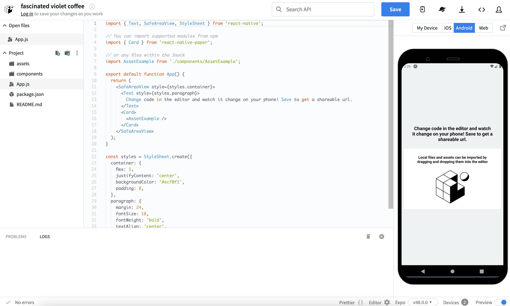
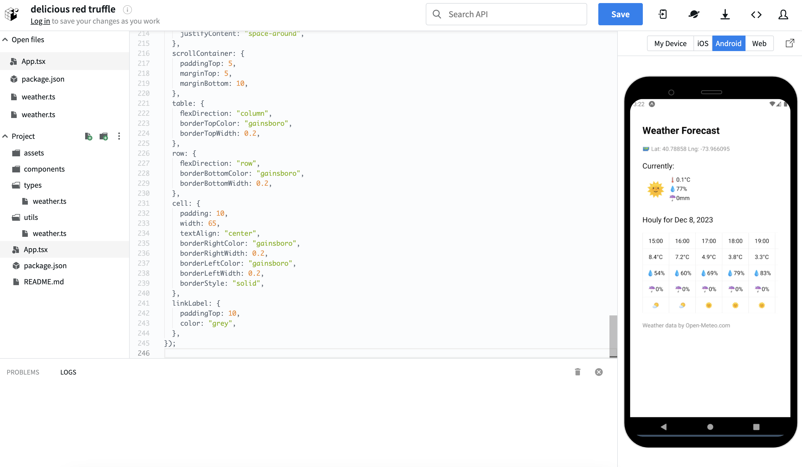

# Hands-on to developing a simple Weather Forecast Mobile app

## สิ่งที่เราจะสร้าง

พัฒนาแอปพยากรณ์อากาศเวอร์ชันมือถือของแอปพลิเคชันที่สร้างไว้ใน [2nd](2nd.md)  
โดยฟังก์ชัน รูปลักษณ์ เงื่อนไข และหมายเหตุ จะเหมือนกันเลย

## สแต็คเทคโนโลยีหลัก

- [Reac Native](https://reactnative.dev/)
  - เฟรมเวิร์กการพัฒนา cross-platform (Android/iOS/เว็บ ฯลฯ) พร้อม React ที่นำไปใช้กับ native UI
    - แอปพลิเคชันมือถือสามารถพัฒนาได้โดยใช้ความรู้และประสบการณ์ในการพัฒนาเว็บ
- [EXPO](https://expo.dev/)
  - เครื่องมือที่ทำให้การพัฒนา React Native ง่ายขึ้นและเร็วขึ้น
- [Typescript](https://www.typescriptlang.org/)
  - JavaScript with syntax for types

## การพัฒนา

### เปิด IDE บนเบราว์เซอร์ที่กำหนดค่า React Native/Expo

เปิด IDE บนเบราว์เซอร์ที่กำหนดค่า React Native/Expo [Snack](https://snack.expo.dev/)

Snack ประกอบด้วยไดเร็กทอรีของไฟล์ในบานหน้าต่างด้านซ้าย การแก้ไขไฟล์ตรงกลาง และหน้าจอแสดงตัวอย่างในบานหน้าต่างด้านขวา ที่ด้านบนของบานหน้าต่างด้านขวา คุณสามารถเลือกโปรแกรมจำลองของอุปกรณ์ที่คุณต้องการทดสอบได้

  

สำหรับการอ้างอิง กรณีของโปรแกรมจำลอง Android มีดังนี้
  
เลือกโปรแกรมจำลอง Android แล้วกด `Tap to play` เพื่อเริ่มการติดตั้งและเปิดใช้งาน (หากคุณเห็นข้อความ `Queue...` โปรดรอสักครู่เพื่อให้การติดตั้งและเริ่มใช้งานได้)

คำแนะนำ/หมายเหตุ:  

- เกี่ยวกับSnack
  - Snack เป็น IDE ที่ใช้เบราว์เซอร์ ดังนั้นจึงไม่จำเป็นต้องติดตั้งหรือกำหนดค่า IDE หรือโปรแกรมจำลอง (สภาพแวดล้อมการทำงานเสมือนสำหรับอุปกรณ์เช่น Android) บนคอมพิวเตอร์ของคุณ
  - บริการนี้ออกแบบมาเพื่อประสบการณ์การพัฒนาที่ง่ายและทันที และไม่เหมาะสำหรับการพัฒนาฟีเจอร์แบบเต็ม
    - สำหรับการพัฒนาจริง โปรดตั้งค่าสภาพแวดล้อมการพัฒนาบนคอมพิวเตอร์ของคุณ
    - เพื่อสร้างสภาพแวดล้อม ขอแนะนำให้ไปที่ [เว็บไซต์อย่างเป็นทางการของ React Native](https://reactnative.dev/docs/environment-setup) หรือ [เว็บไซต์อย่างเป็นทางการของ Expo](https://docs.expo.dev/get-started/installation/)

### กำหนดประเภท

กำหนดประเภทที่จำเป็นสำหรับการตอบกลับที่ส่งกลับโดย API ภายนอก
(นี่เป็นโค้ดเดียวกับ [2nd](2nd.md#กำหนดประเภท))

คลิกไอคอนไฟล์ทางด้านขวาของโปรเจ็คท์ในแถบด้านข้างซ้ายและสร้างไฟล์ `types/weather.ts`

  
เปิดไฟล์ `types/weather.ts` ใน Files ในแถบด้านข้างซ้าย และแทนที่เนื้อหาด้วยโค้ดต่อไปนี้  

```ts
// define type
export type WeatherData = {
  latitude: number;
  longitude: number;
  generationtime_ms: number;
  utc_offset_seconds: number;
  timezone: string;
  timezone_abbreviation: string;
  elevation: number;
  current_units: {
    time: string;
    interval: string;
    temperature_2m: string;
    relative_humidity_2m: string;
    rain: string;
    weather_code: string;
  };
  current: {
    time: string;
    interval: number;
    temperature_2m: number;
    relative_humidity_2m: number;
    rain: number;
    weather_code: number;
  };
  hourly_units: {
    time: string;
    temperature_2m: string;
    relative_humidity_2m: string;
    precipitation_probability: string;
    weather_code: string;
  };
  hourly: {
    time: string[];
    temperature_2m: number[];
    relative_humidity_2m: number[];
    precipitation_probability: number[];
    weather_code: number[];
  };
};

```

### กำหนด utility

กำหนด object ที่จำเป็นในการแปลงรหัสสภาพอากาศในการตอบกลับที่ API ภายนอกส่งคืนเป็นอิโมจิ  
(นี่เป็นโค้ดเดียวกับ [2nd](2nd.md#กำหนด-utility))

คลิกไอคอนไฟล์ทางด้านขวาของ Project ในแถบด้านข้างซ้ายและสร้างไฟล์ `utils/weather.ts`  
เปิดไฟล์ `utils/weather.ts` ใน Project ในแถบด้านข้างซ้าย และแทนที่เนื้อหาด้วยโค้ดต่อไปนี้

```ts
// mapping of weather codes returned in API responses and emojis
export const weatherCodeToEmoji: Record<number, string> = {
  0: "🌞", // Clear sky
  1: "🌤️", // Mainly clear, partly cloudy, and overcast
  2: "🌤️", // Mainly clear, partly cloudy, and overcast
  3: "🌤️", // Mainly clear, partly cloudy, and overcast
  45: "🌫️", // Fog and depositing rime fog
  48: "🌫️", // Fog and depositing rime fog
  51: "🌧️", // Drizzle: Light, moderate, and dense intensity
  53: "🌧️", // Drizzle: Light, moderate, and dense intensity
  55: "🌧️", // Drizzle: Light, moderate, and dense intensity
  56: "🌧️", // Freezing Drizzle: Light and dense intensity
  57: "🌧️", // Freezing Drizzle: Light and dense intensity
  61: "🌧️", // Rain: Slight, moderate and heavy intensity
  63: "🌧️", // Rain: Slight, moderate and heavy intensity
  65: "🌧️", // Rain: Slight, moderate and heavy intensity
  66: "🌧️", // Freezing Rain: Light and heavy intensity
  67: "🌧️", // Freezing Rain: Light and heavy intensity
  71: "🌨️", // Snow fall: Slight, moderate, and heavy intensity
  73: "🌨️", // Snow fall: Slight, moderate, and heavy intensity
  75: "🌨️", // Snow fall: Slight, moderate, and heavy intensity
  77: "🌨️", // Snow grains
  80: "🌧️", // Rain showers: Slight, moderate, and violent
  81: "🌧️", // Rain showers: Slight, moderate, and violent
  82: "🌧️", // Rain showers: Slight, moderate, and violent
  85: "🌨️", // Snow showers slight and heavy
  86: "🌨️", // Snow showers slight and heavy
  95: "⛈️", // Thunderstorm: Slight or moderate
  96: "⛈️", // Thunderstorm with slight and heavy hail
  99: "⛈️", // Thunderstorm with slight and heavy hail
};

```

### การพัฒนาแอปพยากรณ์อากาศ

เปิดเมนูสามจุดทางด้านซ้ายของไฟล์ `App.js` ใน Project ที่แถบด้านข้างซ้าย กด `Rename to App.tsx` แล้วเปลี่ยนชื่อไฟล์ หลังจากเปลี่ยนชื่อไฟล์แล้ว ให้แทนที่เนื้อหาด้วยโค้ดต่อไปนี้

```tsx
import React, { useEffect, useState, useRef } from "react";
import {
  StyleSheet,
  Text,
  View,
  ScrollView,
  ActivityIndicator,
  Linking,
} from "react-native";
import { WeatherData } from "./types/weather";
import { weatherCodeToEmoji } from "./utils/weather";
import * as Location from "expo-location";

export default function App() {
  const now = new Date();
  now.setMinutes(0);
  const currentTime = now.getHours(); // get current time (0-23)
  const currentDate = now.toLocaleDateString("en-US", {
    year: "numeric",
    month: "short",
    day: "numeric",
  });

  const [weatherData, setWeatherData] = useState<WeatherData | null>(null);
  const [errorMessage, setErrorMessage] = useState("");
  const scrollViewRef = useRef<ScrollView>(null);
  const [isLoading, setLoading] = useState(true);

  useEffect(() => {
    (async () => {
      let { status } = await Location.requestForegroundPermissionsAsync();
      if (status !== "granted") {
        setErrorMessage(
          "Failed to get location information. Please check your device settings."
        );
        return;
      }

      // On Snack, using the Location.getCurrentPositionAsync method would not get a response, so the Location.getLastKnownPositionAsync method was used.
      // It is usually better to use Location.getCurrentPositionAsync.
      // See. https://docs.expo.dev/versions/latest/sdk/location/#locationgetlastknownpositionasyncoptions
      const location = await Location.getLastKnownPositionAsync({});

      const { latitude, longitude } = location?.coords || {
        // If the current location could not be obtained, set the location of Tokyo Tower.
        latitude: 35.6586414931039,
        longitude: 139.74540071013897,
      };
      fetch(
        `https://api.open-meteo.com/v1/forecast?latitude=${latitude}&longitude=${longitude}&timezone=auto&current=temperature_2m,relative_humidity_2m,rain,weather_code&hourly=temperature_2m,relative_humidity_2m,precipitation_probability,rain,weather_code&forecast_days=1`
      )
        .then((response) => response.json())
        .then((data) => setWeatherData(data))
        .catch((error) => setErrorMessage(error.message))
        .finally(() => setLoading(false));
    })();
  }, []);

  const handleLayout = () => {
    const columnIndex = currentTime;
    const columnWidth = 65; // set the width of each column
    const scrollPosition = columnIndex * columnWidth; // calculate scroll position
    scrollViewRef.current?.scrollTo({
      x: scrollPosition,
      y: 0,
      animated: true,
    });
  };

  if (errorMessage) {
    return (
      <View style={styles.container}>
        <Text>Error: {errorMessage}</Text>
      </View>
    );
  }

  return (
    <>
      {isLoading ? (
        <ActivityIndicator size="large" style={styles.indicatorContainer} />
      ) : (
        <View style={styles.container}>
          <Text style={styles.title}>Weather Forecast</Text>
          {weatherData && (
            <View>
              <Text style={styles.latLngLabel}>
                🗺️ Lat: {weatherData.latitude} Lng: {weatherData.longitude}
              </Text>
              <Text style={styles.subTitle}>Currently:</Text>
              <View style={styles.currentContainer}>
                <Text style={styles.emojiLabel}>
                  {weatherCodeToEmoji[weatherData.current.weather_code]}
                </Text>
                <View style={styles.currentLabel}>
                  <Text>🌡️{weatherData.current.temperature_2m}°C </Text>
                  <Text>
                    💧
                    {weatherData.current.relative_humidity_2m}%{" "}
                  </Text>
                  <Text>☔{weatherData.current.rain}mm </Text>
                </View>
              </View>
              <Text style={styles.subTitle}>Houly for {currentDate}</Text>
              <ScrollView
                horizontal={true}
                style={styles.scrollContainer}
                ref={scrollViewRef}
                onLayout={handleLayout}
              >
                <View style={styles.table}>
                  <View style={styles.row}>
                    {weatherData.hourly.time.map((time, index) => {
                      const date = new Date(time);
                      const formattedTime = date.toLocaleTimeString([], {
                        hour12: false,
                        hour: "2-digit",
                        minute: "2-digit",
                      });
                      return (
                        <Text key={index} style={styles.cell}>
                          {formattedTime}
                        </Text>
                      );
                    })}
                  </View>
                  <View style={styles.row}>
                    {weatherData.hourly.temperature_2m.map((temp, index) => (
                      <Text key={index} style={styles.cell}>
                        {temp}°C
                      </Text>
                    ))}
                  </View>
                  <View style={styles.row}>
                    {weatherData.hourly.relative_humidity_2m.map(
                      (humidity, index) => (
                        <Text key={index} style={styles.cell}>
                          <Text>💧</Text>
                          {humidity}%
                        </Text>
                      )
                    )}
                  </View>
                  <View style={styles.row}>
                    {weatherData.hourly.precipitation_probability.map(
                      (probability, index) => (
                        <Text key={index} style={styles.cell}>
                          <Text>☔</Text>
                          {probability}%
                        </Text>
                      )
                    )}
                  </View>
                  <View style={styles.row}>
                    {weatherData.hourly.weather_code.map((code, index) => (
                      <Text key={index} style={styles.cell}>
                        {weatherCodeToEmoji[code] || "⭐"}
                      </Text>
                    ))}
                  </View>
                </View>
              </ScrollView>
              <Text
                style={styles.linkLabel}
                onPress={() => Linking.openURL("https://open-meteo.com/")}
              >
                Weather data by Open-Meteo.com
              </Text>
            </View>
          )}
        </View>
      )}
    </>
  );
}

const styles = StyleSheet.create({
  indicatorContainer: {
    flex: 1,
    justifyContent: "center",
    alignItems: "center",
  },
  container: {
    flex: 1,
    backgroundColor: "#fff",
    marginHorizontal: 20,
    paddingVertical: 50,
    paddingHorizontal: 10,
  },
  title: {
    paddingTop: 10,
    fontSize: 24,
    fontWeight: "bold",
  },
  subTitle: {
    fontSize: 18,
    paddingTop: 20,
    paddingBottom: 10,
  },
  latLngLabel: {
    paddingTop: 20,
    color: "grey",
  },
  emojiLabel: {
    fontSize: 36,
    margin: 10,
  },
  currentContainer: {
    flexDirection: "row",
    flexWrap: "wrap",
    marginBottom: 10,
  },
  currentLabel: {
    justifyContent: "space-around",
  },
  scrollContainer: {
    paddingTop: 5,
    marginTop: 5,
    marginBottom: 10,
  },
  table: {
    flexDirection: "column",
    borderTopColor: "gainsboro",
    borderTopWidth: 0.2,
  },
  row: {
    flexDirection: "row",
    borderBottomColor: "gainsboro",
    borderBottomWidth: 0.2,
  },
  cell: {
    padding: 10,
    width: 65,
    textAlign: "center",
    borderRightColor: "gainsboro",
    borderRightWidth: 0.2,
    borderLeftColor: "gainsboro",
    borderLeftWidth: 0.2,
    borderStyle: "solid",
  },
  linkLabel: {
    paddingTop: 10,
    color: "grey",
  },
});


```

คุณจะได้รับข้อความแสดงข้อผิดพลาด (ข้อผิดพลาดที่ไม่ได้กำหนด `expo-location` ในการตั้งค่าการพึ่งพา) ดังที่แสดงในหน้าจอต่อไปนี้ ปฏิบัติตามข้อความและกด `Add dependency`


ในกรณีของโปรแกรมจำลอง Android หน้าจอต่อไปนี้จะปรากฏขึ้นหลังจากการพัฒนา  



หมายเหตุ:  

- โปรแกรมจำลองบน Snack เป็นอุปกรณ์เสมือนและอาจแตกต่างจากตำแหน่งและเวลาปัจจุบันของคุณ
  - สามารถดูตำแหน่งและเวลาปัจจุบันได้ในเวลา แผนที่ และการตั้งค่าของโปรแกรมจำลอง
  - หากคุณต้องการตรวจสอบในสภาพแวดล้อมของคุณ โปรดติดตั้ง [Expo Go](https://expo.dev/client) บนอุปกรณ์ของคุณ (Android/iOS ฯลฯ) และสแกนโค้ด QR สำหรับ `My Device` ใน Snack.
    - หากคุณกำลังตรวจสอบบนอุปกรณ์ของคุณเองและต้องการได้รับตำแหน่งปัจจุบันที่แม่นยำยิ่งขึ้น คุณสามารถเปลี่ยนโค้ดได้ดังนี้
      - before

        ```ts
        const location = await Location.getLastKnownPositionAsync({});
        const { latitude, longitude } = location?.coords || {
          latitude: 35.6586414931039,
          longitude: 139.74540071013897,
        };
        ```

      - after

        ```ts
        const location = await Location.getCurrentPositionAsync({});
        const { latitude, longitude } = location?.coords;
        ```

- ในการตรวจสอบการทำงาน อนุญาตให้เบราว์เซอร์เข้าถึงข้อมูลตำแหน่ง
  - เหมือนกับ [2nd](2nd.md#การพัฒนาแอปพยากรณ์อากาศ) ดังนั้นจึงละเว้น
- เกี่ยวกับการจัดการข้อผิดพลาด API, Componentization
  - เหมือนกับ [2nd](2nd.md#การพัฒนาแอปพยากรณ์อากาศ) ดังนั้นจึงละเว้น

### การตรวจสอบพฤติกรรม

โปรดตรวจสอบการทำงานของแอปพยากรณ์อากาศ บนหน้าจอแสดงตัวอย่างทางด้านขวา

- คุณสมบัติที่เรียบง่าย
  - เหมือนกับ [2nd](2nd.md#การตรวจสอบพฤติกรรม) ดังนั้นจึงละเว้น

### ในปิดท้าย

นี่เป็นการสิ้นสุดเซสชั่นภาค hands-on  
สามารถดูโค้ดได้[ที่นี่](https://github.com/minakamoto/pcshscr2023/tree/main/src/webapp/30min-exp-web-tech/3rd/weather-forecast).  
สามารถดูได้ใน [Snack](https://snack.expo.dev/1KahnBN9w)
