# ภาคปฏิบัติ(hands-on)เพื่อพัฒนา UI ที่ซับซ้อนขึ้นเล็กน้อยและ API ของตัวเอง

## 0. บทนำ

วัตถุประสงค์และเป้าหมายของ hands-on นี้เหมือนกับใน [1st](./1st#0-introduction) และจะถูกข้ามไป

### สิ่งที่เราจะสร้าง

สร้าง API เรียกใช้ และแสดงข้อมูลนั้นบนหน้าจอ สร้าง UI ที่ซับซ้อนกว่า [1st](./1st) เล็กน้อย  
ภาพที่เป็นรูปธรรมคือ UI ที่แสดงเมนูสำหรับโรงอาหารของโรงเรียน โรงอาหารของบริษัท หรือบูธในงานเทศกาลในชุมชน

### สแต็คเทคโนโลยีหลัก

- [Javascript](https://developer.mozilla.org/en-US/docs/Web/JavaScript)/[Typescript](https://www.typescriptlang.org/)
- [Next.js](https://nextjs.org/)
- [Python](https://www.python.org/)
- [FastAPI](https://fastapi.tiangolo.com/)

คำแนะนำ:

- เกี่ยวกับ Next.js
  - Next.js เป็นเฟรมเวิร์ก UI ที่ใช้ React ซึ่งมีคุณสมบัติต่างๆ เช่น SSR/SSG, file-based routing, Fast Refresh, การเพิ่มประสิทธิภาพรูปภาพ, และ zero configuration คุณสมบัติเหล่านี้ช่วยเพิ่มความเร็วในการโหลดหน้าเว็บ มีโครงสร้างที่เป็นมิตรกับ SEO และปรับปรุงประสิทธิภาพการพัฒนา Next.js เป็นเฟรมเวิร์ก frontend ที่ทันสมัยและทรงพลังพร้อมข้อดีหลายประการ
  - [เว็บไซต์ React อย่างเป็นทางการ](https://react.dev/learn/start-a-new-react-project#nextjs) ยังแนะนำ Next.js สำหรับการพัฒนาแอปพลิเคชัน React ทุกขนาด เนื่องจากมีคุณสมบัติที่หลากหลายและมีการสนับสนุนจากชุมชน
- เกี่ยวกับ FastAPI
  - FastAPI มีคุณสมบัติดังต่อไปนี้
    - เร็ว
      - FastAPI ใช้ Starlette และ Uvicorn เพื่อประสิทธิภาพที่รวดเร็วเป็นพิเศษ
        - Starlette เป็นเฟรมเวิร์ก ASGI น้ำหนักเบาที่เขียนด้วย Python ซึ่งช่วยให้สามารถสร้างบริการ asynchronous ที่รวดเร็ว Uvicorn เป็นการใช้งานเซิร์ฟเวอร์ ASGI ที่รวดเร็วมาก FastAPI สร้างขึ้นบน Starlette และสามารถรันได้โดยใช้ Uvicorn
    - ง่าย
      - FastAPI ใช้ไวยากรณ์ง่ายๆ ที่ทำให้โค้ดอ่านและเขียนได้ง่าย
      - FastAPI สามารถใช้ Pydantic เพื่อทำการตรวจสอบคำขอและการตอบกลับ
        - Pydantic เป็นไลบรารีความปลอดภัยของประเภทข้อมูลที่ช่วยให้สามารถกำหนดคำจำกัดความของประเภทข้อมูลได้ ซึ่งช่วยให้ FastAPI สร้างแอปพลิเคชันเว็บที่ปลอดภัยต่อประเภทข้อมูล
          - Type-safe หมายถึง ตรวจพบข้อผิดพลาดของประเภทก่อนที่โปรแกรมจะดำเนินการ สิ่งนี้จะป้องกันข้อผิดพลาดรันไทม์
    - การสร้างเอกสารอัตโนมัติ
      - FastAPI สามารถสร้างเอกสาร API ได้โดยอัตโนมัติโดยใช้ Swagger UI และ ReDoc
        - Swagger UI และ ReDoc เป็นเครื่องมือที่สร้างเอกสาร API ตามข้อกำหนด OpenAPI
    - การสนับสนุนแบบ Asynchronous(อะซิงโครนัส)
      - FastAPI รองรับการประมวลผลแบบอะซิงโครนัส ทำให้ง่ายต่อการเขียนโค้ดแบบอะซิงโครนัส

**หมายเหตุ**:

- เกี่ยวกับ Python Package Manager
  - เครื่องมือจัดการแพ็คเกจ Python ที่ใช้ในการทำ hands-on นี้คือ [rye](https://github.com/mitsuhiko/rye) นั้นเป็นเครื่องมือที่มีประโยชน์ที่สามารถติดตั้งและถอดการติดตั้งของ dependencies และจัดการกับสภาพแวดล้อมเสมือนได้
  - อย่างไรก็ตาม ตอนนี้เครื่องมือนี้อยู่ในสถานะทดลองใช้ (Experimental) ตามคำแสดงความคิดเห็นที่แจ้งไว้ในหน้าเว็บไซต์อย่างเป็นทางการ ในขณะที่เขียนข้อความนี้ มีความพร้อมให้ใช้งาน แต่ความพร้อมในการใช้งานสำหรับกิจกรรม hands-on อาจจะไม่สามารถรับรองได้เป็นอย่างแน่นอน หากไม่สามารถใช้งานได้ โปรดพิจารณาใช้เครื่องมืออื่น ๆ เช่น [poetry](https://python-poetry.org/) หรือ [pip](https://pypi.org/project/pip/) แทน
    > An Experimental Package Management Solution for Python

## 1. การตั้งค่า

### ข้อกำหนดเบื้องต้น

- Node.js 18.17 or above
- Python 3.8 or above
- Code Editor (Visual Studio Code)

**หมายเหตุ**:  
คำแนะนำในการติดตั้งซอฟต์แวร์ที่จำเป็นซึ่งระบุไว้ที่นี่มีไว้สำหรับผู้ใช้ Windows ที่ไม่ได้ใช้ WSL  
เนื่องจากผู้ใช้เป้าหมายรายแรกของ hands-on นี้คือผู้ใช้ Windows ที่ไม่ได้ใช้ WSL  
โปรดทำตามขั้นตอนการติดตั้งซอฟต์แวร์สำหรับสภาพแวดล้อมของคุณเมื่อติดตั้งซอฟต์แวร์จริง

### ขั้นตอนโดยละเอียดสำหรับผู้ใช้ Windows

- ติดตั้ง Node.js
  - ดู [1st](./1st#1-setup)
- ติดตั้ง Python
  - ไปที่ [เว็บไซต์ Python อย่างเป็นทางการ](https://www.python.org/downloads/windows/) และดาวน์โหลดตัวติดตั้ง Python เวอร์ชันล่าสุด (`Windows installer(64-bit)`)
  - เรียกใช้ตัวติดตั้งที่ดาวน์โหลดมา
  - วิซาร์ดการติดตั้งจะปรากฏขึ้น คลิก 'Install Now' หรือ 'Customize installation'
  - หลังจากการติดตั้งเสร็จสมบูรณ์ ให้เปิดพรอมต์คำสั่งแล้วรันคำสั่งต่อไปนี้เพื่อตรวจสอบว่าติดตั้ง Python อย่างถูกต้อง

    ```sh
    python --version
    ```

  - หากติดตั้ง Python ไว้แล้ว สามารถอัปเกรดได้โดยทำตามขั้นตอนด้านบนเพื่อติดตั้ง Python เวอร์ชันล่าสุด อย่างไรก็ตาม หากมีการติดตั้ง Python หลายเวอร์ชันพร้อมกัน คุณจะต้องตรวจสอบการตั้งค่าตัวแปรสภาพแวดล้อมเพื่อให้แน่ใจว่ามีการใช้ Python เวอร์ชันที่เหมาะสม
    - เปิดเมนู Start ค้นหา "View advanced system settings" แล้วเปิดขึ้นมา กล่องโต้ตอบ `System Properties` จะปรากฏขึ้น
    - คลิกที่ปุ่ม 'Environment Variables Path'
    - เลือกตัวแปร `Path` และคลิกปุ่ม 'Edit'
    - เพิ่มค่าของตัวแปร `Path` ไปยังไดเร็กทอรีที่มีไฟล์ปฏิบัติการ Python ที่ติดตั้งใหม่ (โดยปกติคือ `C:\Users\[username]\AppData\Local\Programs\Python\Python [เวอร์ชัน]\`) หากมีเวอร์ชันเก่าอยู่แล้ว ให้เขียนทับด้วยเวอร์ชันที่ใหม่กว่า
    - บันทึกการเปลี่ยนแปลงของคุณและรีสตาร์ทพรอมต์คำสั่ง
    - ตรวจสอบว่ามีการใช้ Python เวอร์ชันใหม่โดยการรันคำสั่งต่อไปนี้

      ```sh
      python --version
      ```

- ติดตั้ง rye
  - ไปที่ [เว็บไซต์อย่างเป็นทางการของ rye](https://rye-up.com/guide/installation/) และดาวน์โหลดไฟล์ exe สำหรับ Windows (`rye-x86_64-windows.exe for 64-bit Intel Windows`) จากนั้นติดตั้ง
    - เมื่อกล่องโต้ตอบ `Windows protected your PC` ปรากฏขึ้น ให้เปิด 'more info' แล้วกดปุ่ม 'Run anyway' เพื่อดำเนินการต่อ
      - เมื่อพรอมต์คำสั่งปรากฏขึ้น ให้ตั้งค่า `Windows Developer Mode` (ดู [เว็บไซต์อย่างเป็นทางการของ rye](https://rye-up.com/guide/faq/#windows-developer-mode)) จากนั้นพิมพ์ `y` และ ดำเนินการต่อ. กรุณากรอก `y` เพื่อดำเนินการต่อ
  - ลงทะเบียน `shims` ในตัวแปรสภาพแวดล้อม `Path` และเพิ่มลำดับความสำคัญตามที่อธิบายไว้ใน [เว็บไซต์อย่างเป็นทางการของ rye](https://rye-up.com/guide/installation/#add-shims-to-path)
  - บันทึกการเปลี่ยนแปลงและรีสตาร์ทพรอมต์คำสั่ง
  - รันคำสั่งต่อไปนี้และตรวจสอบว่ารันโดยไม่มีข้อผิดพลาด

    ```sh
      rye
    ```

- ติดตั้ง Visual Studio Code(VS Code)
  - ดู [1st](./1st#1-setup)
- ติดตั้งและกำหนดค่าส่วนขยาย VS Code

  - เกี่ยวกับ Javascript ดู [1st](./1st#1-setup)
    - (ตัวเลือก)ตั้งค่า ESLint เพื่อแก้ไขโค้ดโดยอัตโนมัติเมื่อบันทึก
      - เปลี่ยนการตั้งค่าของ `Editor: Code Actions On Save`
        - เปิดการตั้งค่า VSCode(File > Preferences > Settings) หรือใช้ทางลัด (Ctrl+,)
        - ค้นหา `Editor: Code Actions On Save` หรือ `editor.codeActionsOnSave` ในการตั้งค่า แล้วกด `Edit in setting.json`
          - **หากคุณไม่ต้องการใช้การตั้งค่านี้นอกเหนือจาก hands-on นี้ ให้เปลี่ยนจากแท็บ `User` เป็นแท็บ `Workspace`**
        - เปลี่ยนเป็นการตั้งค่าต่อไปนี้ อย่าลืมบันทึกไฟล์หลังจากทำการเปลี่ยนแปลง

          ```json
          {
            "editor.codeActionsOnSave": {
              "source.fixAll": true
            }
          }
          ```

  - (ตัวเลือก)สำหรับการพัฒนา Python ขอแนะนำให้คุณติดตั้งส่วนขยายต่อไปนี้เพื่อปรับปรุงประสบการณ์การพัฒนาเว็บแอปของคุณ:
    - เปิด VS Code
    - เปิดแถบด้านข้างส่วนขยายโดยคลิกที่ไอคอนสี่เหลี่ยมในแถบด้านข้างซ้ายหรือกด Ctrl+Shift+X
    - ค้นหาส่วนขยายต่อไปนี้ (ทั้งหมดมาจาก Microsoft) และคลิกปุ่ม `Install` ถัดจากส่วนขยายแต่ละรายการ:
      - Python
        - มี Pylance ด้วย
      - Flake8
        - หากคุณติดตั้งสิ่งนี้ flake8 (Linter) จะทำงานโดยอัตโนมัติเมื่อคุณเปิดไฟล์ Python
      - Black Formatter
    - การเปลี่ยนการตั้งค่าของ `Python: Language Server`
      - เปิดการตั้งค่า VSCode (File > Preferences > Settings) หรือใช้ทางลัด (Ctrl+,)
        - **หากคุณไม่ต้องการใช้การตั้งค่านี้นอกเหนือจาก hands-on นี้ ให้เปลี่ยนจากแท็บ `User` เป็นแท็บ `Workspace`**
      - ค้นหา `python. languageServer` ในการตั้งค่า และตั้งค่าเป็น `Pylance`
        - **หากคุณไม่เห็นการตั้งค่า Python ให้รีสตาร์ท VSCode**
    - ตั้งค่า Black Formatter ให้แก้ไขโค้ดโดยอัตโนมัติเมื่อบันทึกไฟล์ Python
      - กด Ctrl+Shift+P เพื่อเปิด Command palette
      - พิมพ์และเลือก `Preferences: Open User Settings(JSON)` เพื่อเปิดไฟล์ JSON
        - **หากคุณไม่ต้องการใช้การตั้งค่านี้นอกเหนือจาก hands-on นี้ ให้เปิด `Preferences: Open Workspace Settings(JSON)`**
      - เพิ่มโค้ดต่อไปนี้ที่ส่วนท้ายของ JSON
        - หากคุณไม่แน่ใจว่าจะเพิ่มได้อย่างไร ดูตัวอย่างด้านล่างซึ่งมีการตั้งค่าอื่นๆ

        ```js
          "[python]": {
            "editor.defaultFormatter": "ms-python.black-formatter",
            "editor.formatOnSave": true
          }
        ```

        - หากคุณมีการตั้งค่าอื่นๆ มีตัวอย่างต่อไปนี้
          - อย่าลืมใส่ `,` ไว้ท้ายรายการการตั้งค่าเหนือรายการที่คุณเพิ่มไว้
            - ในตัวอย่างด้านล่าง `"python.languageServer": "Pylance"` -> `"python.languageServer": "Pylance",`

          ```js
          {
            "editor.defaultFormatter": "esbenp.prettier-vscode",
            "editor.formatOnSave": true,
            "editor.codeActionsOnSave": {
              "source.fixAll": true
            },
            "python.languageServer": "Pylance",
            "[python]": {
              "editor.defaultFormatter": "ms-python.black-formatter",
              "editor.formatOnSave": true
            }
          }
          ```

### การสร้างโครงการ

#### การสร้างไดเร็กทอรีโครงการ

ตอนแรกให้เริ่ม VSCode  
จากเมนู `File` ให้เลือก `Open Folder` และเลือกไดเร็กทอรี (เช่น `Documents`) ที่คุณต้องการใช้งาน

หลังจากเลือกไดเร็กทอรีที่จะใช้ทำงานแล้ว หากได้รับข้อความว่า `Do you trust the authors of the files in this folder?` ให้คลิก `Yes, I trust the authors`

เรียกใช้ `New Terminal` จากเมนู `Terminal` เพื่อเริ่มเทอร์มินัล  

จากนั้นสร้างไดเร็กทอรี `dish-delight` และสร้างไดเร็กทอรี `frontend` และไดเร็กทอรี `backend` ในนั้น รันคำสั่งต่อไปนี้  
**จากนี้ ให้ใช้ Terminal บน VSCode เพื่อดำเนินการคำสั่ง**

```sh
mkdir dish-delight/backend
mkdir dish-delight/frontend
cd dish-delight
```

#### การสร้างโครง frontend (Next.js)

รันคำสั่งต่อไปนี้

```sh
cd frontend
npx create-next-app .
```

เมื่อข้อความ `OK to proceed? (y)` ปรากฏขึ้น ให้ป้อน `y`

เมื่อคุณรันคำสั่งข้างต้น คุณจะถูกถามคำถามที่พรอมต์คำสั่ง ตอบคำถามดังนี้(คุณสามารถเปลี่ยนคำตอบได้ด้วยปุ่มลูกศรซ้ายและขวา)

```sh
✔ Would you like to use TypeScript? … Yes
✔ Would you like to use ESLint? … Yes
✔ Would you like to use Tailwind CSS? … Yes
✔ Would you like to use `src/` directory? … No
✔ Would you like to use App Router? (recommended) … Yes
✔ Would you like to customize the default import alias? … No
```

**หมายเหตุ**:  
หากคุณได้รับข้อผิดพลาดต่อไปนี้ ให้เรียกใช้ `npm i -g npx` แล้วลองอีกครั้ง สำหรับข้อมูลเพิ่มเติม โปรดดูที่ [ปัญหาทางเทคนิคอย่างเป็นทางการของ Next.js](https://github.com/vercel/next.js/discussions/39997)

```sh
$ npx create-next-app
Debugger attached.
npm ERR! code ENOENT
npm ERR! syscall lstat
npm ERR! path /home/zxytim/.local/npm
npm ERR! errno -2
npm ERR! enoent ENOENT: no such file or directory, lstat '/home/zxytim/.local/npm'
npm ERR! enoent This is related to npm not being able to find a file.
npm ERR! enoent 

npm ERR! A complete log of this run can be found in:
npm ERR!     /home/zxytim/.npm/_logs/2022-08-27T03_37_34_606Z-debug-0.log
Waiting for the debugger to disconnect...
```

#### เริ่มต้นโครงการ backend

รันคำสั่งต่อไปนี้

```sh
cd ../backend
# initialize Project
rye init --no-pin
# specify Python version for this Project
rye pin 3.11
# synchronize and create virtualenv
rye sync
```

รันคำสั่งต่อไปนี้และตรวจสอบว่า `Python 3.11.X` (โดยที่ `X` คือหมายเลขของเวอร์ชันรองล่าสุด ตัวอย่าง: `Python 3.11.3`)

```sh
python --version
```

#### ติดตั้งไลบรารีและเครื่องมือที่จำเป็น

รันคำสั่งต่อไปนี้

```sh
# add required libraries
rye add fastapi uvicorn sqlalchemy
# add necessary development tools
rye add --dev black flake8
# synchronize and install
rye sync
```

## 2. การสร้างหน้าจอ Home และ Menu List และหน้าจอ Menu Detail ไปใช้เฉพาะ frontend

ใช้ Next.js และ Tailwind CSS สร้างหน้าจอ Home และ Menu List และ Menu Detail  
นี่เป็นการใช้งาน frontend เท่านั้นและยังไม่ได้เชื่อมต่อกับ backend

ด้านล่างนี้เป็นรูปภาพ UI ที่ใช้ Figma มีไว้ที่นี่เพื่อใช้อ้างอิงเท่านั้น

| Home  | Menu List  | Menu Detail |
| --- | --- | --- |
| 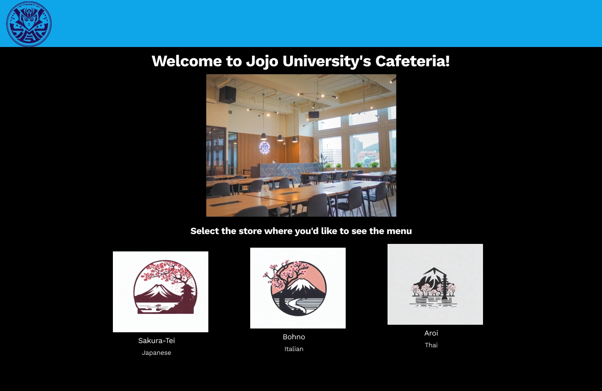 | 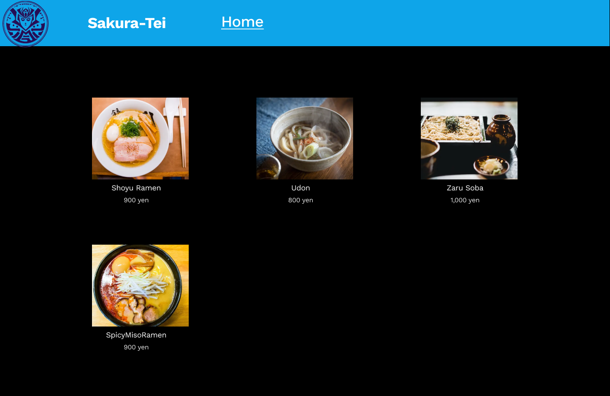 | 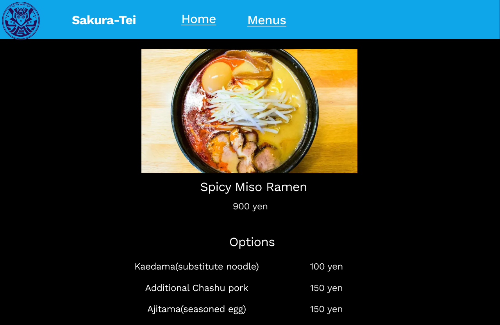 |

**หมายเหตุ**:  
ข้างต้นเป็นการออกแบบร่างจากระยะแนวความคิดแบบลงมือปฏิบัติจริง อาจแตกต่างไปจากการปฏิบัติจริงในบางจุด

คำแนะนำ:

- เกี่ยวกับ Figma
  - [Figma](https://www.figma.com/) เป็นเครื่องมือออกแบบกราฟิกบนเว็บที่ใช้สำหรับการออกแบบ UI/UX การสร้างต้นแบบ และการทำงานร่วมกัน
  - ประโยชน์สำหรับวิศวกรคืออำนวยความสะดวกในการทำงานร่วมกันกับนักออกแบบและการแปลตั้งแต่การออกแบบไปจนถึงการเขียนโค้ดได้อย่างราบรื่น สำหรับ UI ที่เรียบง่าย วิศวกรยังสามารถใช้ Figma เพื่อสร้างการออกแบบเพื่อแบ่งปันรูปภาพกับลูกค้า ฯลฯ

### เปลี่ยนไฟล์การกำหนดค่า

#### เริ่มเซิร์ฟเวอร์การพัฒนา

รันคำสั่งต่อไปนี้

```sh
cd ../frontend
npm run dev
```

เปิดเบราว์เซอร์และไปที่ <http://localhost:3000> และตรวจสอบว่าหน้าจอค่าเริ่มต้นของ Next.js ปรากฏขึ้น

**หมายเหตุ**:  
หากมีการใช้งานพอร์ต 3000 อยู่แล้ว จะมีการระบุพอร์ตอื่น ในกรณีนี้ สิ่งต่อไปนี้จะปรากฏบนบรรทัดคำสั่ง

```sh
- warn Port 3000 is in use, trying 3001 instead.
- ready started server on 0.0.0.0:3001, url: http://localhost:3001
```

กด Ctrl + c เพื่อหยุด

หากคุณได้รับข้อความ `Terminate batch job (Y/N)?` พิมพ์ `Y` แล้วกด `Enter`

#### การปรับเปลี่ยนการตั้งค่า globals.css

แก้ไขการตั้งค่าเริ่มต้น globals.css  
เปิด `dish-delight/frontend/app/globals.css` และแทนที่เนื้อหาด้วยโค้ดต่อไปนี้:

```css
@tailwind base;
@tailwind components;
@tailwind utilities;

body {
  color: rgb(255, 255, 255);
  background: rgb(0, 0, 0);
}
```

คำแนะนำ:

- ครั้งนี้ไม่จำเป็นต้องติดตั้งหรือกำหนดค่า Tailwind CSS เนื่องจากมีการระบุตัวเลือกในการใช้ Tailwind CSS เมื่อสร้างโปรเจ็กต์ Next.js

#### การตั้งค่าไซต์รูปภาพภายนอก

คราวนี้ เราจะใช้ [Image component](https://nextjs.org/docs/pages/building-your-application/optimizing/images) ที่ได้รับจาก Next.js ซึ่งเป็นส่วนขยายของ HTML `` องค์ประกอบ ปรับให้เข้ากับความต้องการของเว็บยุคใหม่ มีการเพิ่มประสิทธิภาพการทำงานในตัวต่างๆ เพื่อให้ได้ Core Web Vitals ที่ดี

เพื่อใช้รูปภาพภายนอกในครั้งนี้ ต้องตั้งค่าคุณสมบัติ `remotePatterns` ใน `next.config.js` สำหรับรายละเอียด โปรดดู [คำอธิบายบนเว็บไซต์อย่างเป็นทางการ](https://nextjs.org/docs/pages/api-reference/components/image#configuration-options)

เปิด `dish-delight/frontend/next.config.js` และแทนที่เนื้อหาด้วยโค้ดต่อไปนี้:

```js
/** @type {import('next').NextConfig} */
const nextConfig = {
  reactStrictMode: true,
  images: {
    remotePatterns: [
      {
        protocol: "https",
        hostname: "images.unsplash.com",
        pathname: "/**",
      },
    ],
  },
};

module.exports = nextConfig;
```

**หมายเหตุ**:

- `Parsing error: Cannot find module 'next/babel'` ใน `next.config.js` สิ่งนี้ไม่ส่งผลกระทบต่อพฤติกรรม แต่หากคุณต้องการแก้ไข ให้เปลี่ยน `.eslintrc.json` เป็นดังต่อไปนี้

  ```js
  {
    "extends": ["next/core-web-vitals", "next/babel"]
  }
  ```

รันคำสั่งต่อไปนี้

```sh
npm run dev
```

เปิดเบราว์เซอร์ของคุณอีกครั้งและไปที่ <http://localhost:3000> และตรวจสอบว่าหน้าจอค่าเริ่มต้นของ Next.js ปรากฏขึ้น

โปรดปล่อยให้เซิร์ฟเวอร์การพัฒนาทำงานต่อไป หากคุณต้องการหยุดคุณสามารถใช้ Ctrl + c บนบรรทัดคำสั่ง

### การสร้างหน้าจอ Home และ Menu List และหน้าจอ Menu Detail

#### การสร้างหน้าจอ Home

วางไฟล์ภาพโลโก้ 4 ไฟล์ที่จะใช้บนหน้าจอใน `dish-delight/frontend/public`:

ภาพเป้าหมายทั้งหมดควรได้รับจาก [Github Repository](https://github.com/minakamoto/pcshscr2023/tree/main/docs/static/img/2nd/logo). มีสี่ไฟล์ต่อไปนี้  
ไฟล์ svg คือโลโก้ที่ใช้ใน Navbar และไฟล์ jpeg คือโลโก้ของแต่ละร้าน โลโก้ของแต่ละร้านค้าระบุไว้ใน img ของ store data

- aroy_logo.jpeg
- buono_logo.jpeg
- logo_jojo_univ.svg
- sakura_tei_logo.jpeg

**หมายเหตุ**:

- รูปภาพเหล่านี้สร้างขึ้นจากภายใน Bing โดยใช้ `Image Creator`(`DALL-E`).

สร้างหน้าจอ Home
เปิด `dish-delight/frontend/app/page.tsx` และแทนที่เนื้อหาด้วยโค้ดต่อไปนี้:

```tsx
// dish-delight/frontend/app/page.tsx
import Image from "next/image";
import Link from "next/link";
import jojoUnivLogo from "../public/logo_jojo_univ.svg";

// type definition of store
type Store = {
  id: number;
  name: string;
  img: string;
  category: string;
};

// Use fixed store data on frontend until connecting to backend
export const stores: Store[] = [
  {
    id: 1,
    name: "Sakura-tei",
    img: "/sakura_tei_logo.jpeg",
    category: "Japanese",
  },
  {
    id: 2,
    name: "Aroy",
    img: "/aroy_logo.jpeg",
    category: "Thai",
  },
  {
    id: 3,
    name: "Buono",
    img: "/buono_logo.jpeg",
    category: "Italian",
  },
];

export default function Home() {
  return (
    <div>
      <nav className="flex items-center justify-between flex-wrap bg-sky-500 p-2">
        <div className="flex items-center flex-shrink-0 text-white mr-6">
          <Image
            src={jojoUnivLogo}
            alt="Logo of Jojo University"
            width={45}
            height={45}
          />
          <span className="font-semibold text-lg tracking-tight pl-2">
            Jojo University Cafeteria
          </span>
        </div>
      </nav>
      <div className="text-center mt-8">
        <h1 className="text-3xl font-bold">
          Welcome to Jojo University Cafeteria!
        </h1>
        {/* Do not display this image for mobile */}
        <Image
          className="hidden md:block mx-auto mt-4"
          src={"https://images.unsplash.com/photo-1567521464027-f127ff144326"}
          alt="University Cafeteria Image"
          width={500}
          height={375}
          priority={false}
        />
      </div>
      <div className="text-center mt-6 mx-2">
        <h2 className="text-xl text-gray-500">
          Select the store where you would like to see the menu
        </h2>
        <div className="grid grid-cols-1 md:grid-cols-2 lg:grid-cols-3 gap-6 p-10">
          {/* For the number of stores list, link to the menu list and display the image component, store name, and category.
           */}
          {stores.map((store) => (
            <Link href={`/stores/${store.id}`} key={store.id}>
              <div className="max-w-sm rounded overflow-hidden shadow-lg mx-auto">
                <Image
                  className="w-full"
                  src={store.img}
                  alt={store.name}
                  width={300}
                  height={300}
                />
                <div className="px-6 py-4">
                  <div className="font-bold text-xl mb-2">{store.name}</div>
                  <p className="text-gray-700 text-base">{store.category}</p>
                </div>
              </div>
            </Link>
          ))}
        </div>
      </div>
    </div>
  );
}
```

- ตรวจสอบว่าลักษณะที่ปรากฏมีดังนี้
  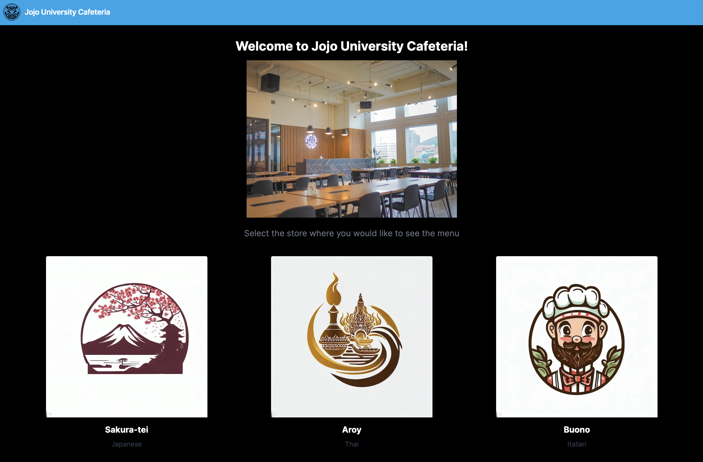
- การคลิกที่การ์ด `Sakura-tei`, `Aroy` หรือ `Buono` จะนำคุณไปยังหน้าจอ Menu List
  - เนื่องจากยังไม่ได้สร้างหน้าจอ ข้อความ "404 This page could not be found" จะปรากฏขึ้น

เค้าโครงแบบ hands-on นี้จะมุ่งเน้นไปที่การออกแบบ UI บนมือถือเป็นหลัก จากจุดนี้เป็นต้นไป เราจะถือว่าจอแสดงผลมีขนาดเท่ากับสมาร์ทโฟน

โปรดปฏิบัติตามคำแนะนำด้านล่างและใช้เครื่องมือสำหรับนักพัฒนาเบราว์เซอร์เพื่อปรับขนาดหน้าจอให้เป็นขนาดของโทรศัพท์มือถือหรือสมาร์ทโฟน

- เปิดเบราว์เซอร์ของคุณแล้วไปที่ `Developer Tools`
  - หากคุณใช้ Chrome ไปที่ "Menu" -> "Other Tools" -> "Developer Tools"
  - หากคุณใช้ Edge ไปที่ "Menu" -> "Other Tools" -> "Developer Tools"
  - หากคุณใช้ Windows ทางลัดจะเหมือนกันสำหรับเบราว์เซอร์ทั้งหมด: `Shift+Ctrl+i`
- ในเครื่องมือสำหรับนักพัฒนา ให้คลิกปุ่มที่มีไอคอนด้านบนซึ่งดูเหมือนคอมพิวเตอร์ตั้งโต๊ะและสมาร์ทโฟนซ้อนทับกัน (ดูด้านขวาของภาพด้านล่าง)
  - ใน Windows ปุ่มลัดคือ `Shift+Ctrl+m`
    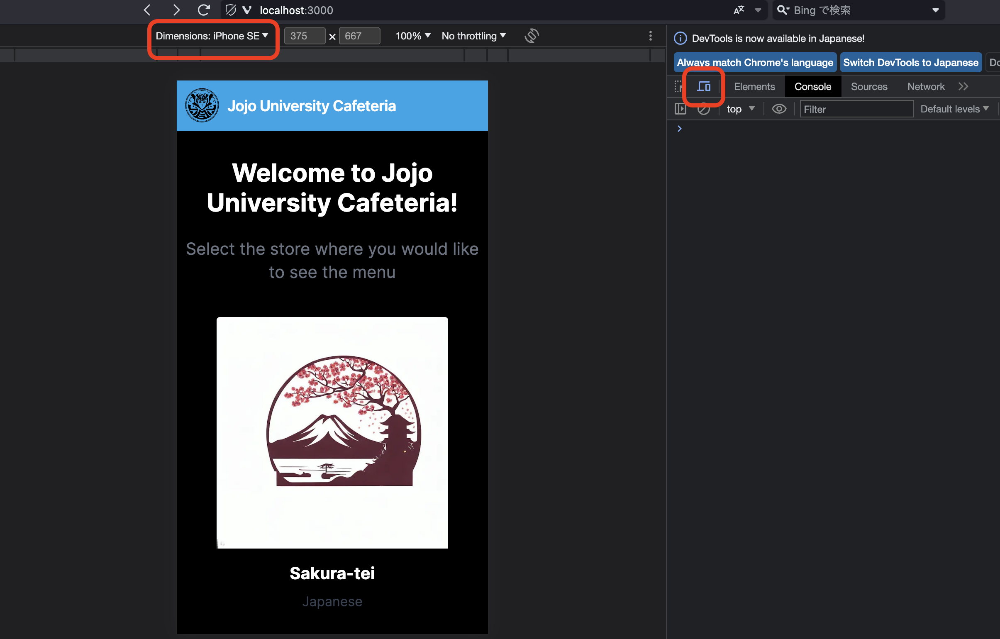
- เลือกเทอร์มินัลที่คุณต้องการจำลองจากเมนูที่ด้านซ้ายบนของหน้าจอ (ดูด้านซ้ายของภาพด้านบน)
  - หรือคุณสามารถปรับขนาดได้ด้วยตัวเองในโหมด "Responsive"

เมื่อคุณทำให้ขนาดเทียบเท่ากับสมาร์ทโฟน ตรวจสอบให้แน่ใจว่ามีลักษณะดังต่อไปนี้

- ต้องอยู่ในเลย์เอาต์ตามภาพที่แสดงข้างบน
- บัตรของร้านค้าจะต้องจัดเรียงในแนวตั้ง
  - `Sakura-tei`, `Aroy`, `Buono` ตามลำดับ

คำแนะนำ:
ถ้าเป็นขนาดแท็บเล็ตจะมีสองคอลัมน์

#### ทำให้ Navbar เป็น component

เพื่อใช้ Navbar เดียวกันในหน้าจอ Menu List และ Menu Detail จงทำ Navbar เป็น component เดียวกัน

สร้างไฟล์ `dish-delight/frontend/components/Navbar.tsx` และแทนที่เนื้อหาด้วยโค้ดต่อไปนี้:

```tsx
// components/Navbar.tsx
import Image from "next/image";
import jojoUnivLogo from "../public/logo_jojo_univ.svg";

// Navbar implemented in dish-delight/frontend/app/page.tsx is defined as a component
export default function Navbar() {
  return (
    <>
      <nav className="flex items-center justify-between flex-wrap bg-sky-500 p-2">
        <div className="flex items-center flex-shrink-0 text-white mr-6">
          <Image
            src={jojoUnivLogo}
            alt="Logo of Jojo University"
            width={45}
            height={45}
          />
          <span className="font-semibold text-lg tracking-tight pl-2">
            Jojo University Cafeteria
          </span>
        </div>
      </nav>
    </>
  );
}
```

เปิด `dish-delight/frontend/app/page.tsx` และแทนที่เนื้อหาด้วยโค้ดต่อไปนี้:

```tsx
// dish-delight/frontend/app/page.tsx
import Image from "next/image";
import Link from "next/link";
import Navbar from "../components/Navbar";

type Store = {
  id: number;
  name: string;
  img: string;
  category: string;
};

export const stores: Store[] = [
  {
    id: 1,
    name: "Sakura-tei",
    img: "/sakura_tei_logo.jpeg",
    category: "Japanese",
  },
  {
    id: 2,
    name: "Aroy",
    img: "/aroy_logo.jpeg",
    category: "Thai",
  },
  {
    id: 3,
    name: "Buono",
    img: "/buono_logo.jpeg",
    category: "Italian",
  },
];

export default function Home() {
  return (
    <div>
      {/* call the Navbar component */}
      <Navbar />
      <div className="text-center mt-8">
        <h1 className="text-3xl font-bold">
          Welcome to Jojo University Cafeteria!
        </h1>
        <Image
          className="hidden md:block mx-auto mt-4"
          src={"https://images.unsplash.com/photo-1567521464027-f127ff144326"}
          alt="University Cafeteria Image"
          width={500}
          height={375}
        />
      </div>
      <div className="text-center mt-6 mx-2">
        <h2 className="text-xl text-gray-500">
          Select the store where you would like to see the menu
        </h2>
        <div className="grid grid-cols-1 md:grid-cols-2 lg:grid-cols-3 gap-6 p-10">
          {stores.map((store) => (
            <Link href={`/stores/${store.id}`} key={store.id}>
              <div className="max-w-sm rounded overflow-hidden shadow-lg mx-auto">
                <Image
                  className="w-full"
                  src={store.img}
                  alt={store.name}
                  width={300}
                  height={300}
                />
                <div className="px-6 py-4">
                  <div className="font-bold text-xl mb-2">{store.name}</div>
                  <p className="text-gray-700 text-base">{store.category}</p>
                </div>
              </div>
            </Link>
          ))}
        </div>
      </div>
    </div>
  );
}
```

เปิดเบราว์เซอร์และตรวจสอบว่าการทำงานหรือรูปลักษณ์ของแอปพลิเคชันไม่มีการเปลี่ยนแปลง

#### การสสร้างหน้าจอ Menu List

สร้างหน้าจอ Menu List ที่แสดงหลังจากเลือกร้านค้าบนหน้าจอ Home

ทีแรก ให้แก้ไข Navbar comonent เพื่อแสดงชื่อร้านค้าและลิงก์ไปยัง Menu List (`MENUS` ใน UI) ใน Navbar บนหน้าจอ Menu List

เปิด `dish-delight/frontend/components/Navbar.tsx` และแทนที่เนื้อหาด้วยโค้ดต่อไปนี้:

```tsx
// dish-delight/frontend/components/Navbar.tsx
import Image from "next/image";
import jojoUnivLogo from "../public/logo_jojo_univ.svg";
import Link from "next/link";

// type definition of props
type NavbarProps = {
  storeName?: string;
  storeId?: number;
};

export default function Navbar({ storeName, storeId }: NavbarProps) {
  return (
    <>
      <nav className="flex items-center justify-between flex-wrap bg-sky-500 p-2">
        <div className="flex items-center flex-shrink-0 text-white mr-6">
          <Link href="/">
            <Image
              src={jojoUnivLogo}
              alt="Logo of Jojo University"
              width={45}
              height={45}
            />
          </Link>
          {/* If the store is not set up (i.e., only for Home), give the name of the university. */}
          {!storeName && (
            <span className="font-semibold text-lg md:text-xl tracking-tight pl-2">
              Jojo University Cafeteria
            </span>
          )}
          {/* Only when the store name is set, the store name and a link to Home are displayed. */}
          {storeName && (
            <>
              <span className="font-semibold text-lg md:text-xl tracking-tight px-2">
                {storeName}
              </span>
              <Link
                href="/"
                className="text-gray-200 text-base ml-3 px-1 hover:bg-sky-600"
              >
                Home
              </Link>
            </>
          )}
          {/* Display a link to the menu list only when the store name and store ID are set */}
          {storeName && storeId && (
            <Link
              href={`/stores/${storeId}`}
              key={storeId}
              className="text-gray-200 text-base ml-3 px-1 hover:bg-sky-600"
            >
              Menus
            </Link>
          )}
        </div>
      </nav>
    </>
  );
}
```

สร้างหน้าจอ Menu List

สร้างไฟล์ `dish-delight/frontend/app/stores/[storeId]/page.tsx` และแทนที่เนื้อหาด้วยโค้ดต่อไปนี้:

```tsx
// dish-delight/frontend/app/stores/[storeId]/page.tsx
import Link from "next/link";
import Navbar from "../../../components/Navbar";
import { stores } from "@/app/page";
import Image from "next/image";

// First, the menu information is kept fixed on the frontend.
// The image uses data from [Unsplash](https://unsplash.com/).
export const menus = [
  {
    id: 1,
    storeId: 1,
    name: "Soy sauce ramen",
    img: "https://images.unsplash.com/photo-1632709810780-b5a4343cebec",
    author: "@5amramen",
    price: "900 yen",
    description:
      "A classic Japanese ramen noodle soup that is made with a soy sauce-based broth.",
    options: [
      {
        name: "Extra noodles",
        price: "100 yen",
      },
      {
        name: "Extra char siu",
        price: "100 yen",
      },
      {
        name: "Barikata(very hard noodles)",
        price: "0 yen",
      },
    ],
  },
  {
    id: 2,
    storeId: 1,
    name: "Sanuki Udon",
    img: "https://images.unsplash.com/photo-1618841557871-b4664fbf0cb3",
    author: "@jinomono",
    price: "800 yen",
    description:
      "A type of thick, chewy udon noodle that is made in Kagawa Prefecture, Japan.",
    options: [
      {
        name: "Chicken tempura",
        price: "100 yen",
      },
      {
        name: "Squid tempura",
        price: "100 yen",
      },
      {
        name: "Vegetable tempura",
        price: "100 yen",
      },
      {
        name: "Large size",
        price: "100 yen",
      },
      {
        name: "Small size",
        price: "-50 yen",
      },
    ],
  },
  {
    id: 3,
    storeId: 1,
    name: "Zaru soba",
    img: "https://images.unsplash.com/photo-1519984388953-d2406bc725e1",
    author: "@gaspanik",
    price: "1,000 yen",
    description: "A cold soba noodle dish served with a dipping sauce.",
    options: [
      {
        name: "Large size",
        price: "200 yen",
      },
    ],
  },
  {
    id: 4,
    storeId: 1,
    name: "Spicy Miso Ramen",
    img: "https://images.unsplash.com/photo-1637024696628-02cb19cc1829",
    author: "@5amramen",
    price: "900 yen",
    description: "A spicy miso ramen with a rich and flavorful broth.",
    options: [
      {
        name: "Large size",
        price: "100 yen",
      },
      {
        name: "Extra char siu",
        price: "100 yen",
      },
      {
        name: "Seasoned egg",
        price: "100 yen",
      },
    ],
  },
  {
    id: 8,
    storeId: 2,
    name: "Khao soi",
    img: "https://images.unsplash.com/photo-1569562211093-4ed0d0758f12",
    author: "@ural_8_low",
    price: "60 baht",
    description:
      "Khao Soi is a Northern Thai curry noodle soup with a rich and flavorful broth.",
  },
];

export default function StoreMenu({ params }: { params: { storeId: string } }) {
  // storeId in params is set to the store ID of the store selected in Home
  const storeId = Number(params.storeId);
  // Get the corresponding store from the store list
  const store = stores.find((store) => store.id === storeId);
  // Get the corresponding menu from the menu list
  const storeMenus = menus.filter((menu) => menu.storeId === storeId);

  // When the store does not exist
  if (!store) {
    return (
      <div>
        <Navbar />
        <div className="m-3">
          <p>
            The store does not exist, please select the store again from HOME.
          </p>
        </div>
      </div>
    );
  }

  // When the menu for the store does not exist
  if (storeMenus.length === 0) {
    return (
      <div>
        <Navbar />
        <div className="m-3">
          <p>
            The menu for that store does not exist, please select the store again from HOME.
          </p>
        </div>
      </div>
    );
  }

  return (
    <div>
      {/* Pass store name and store ID to Navbar */}
      <Navbar storeName={store?.name} storeId={store?.id} />
      <div className="grid grid-cols-1 md:grid-cols-2 lg:grid-cols-3 gap-4 p-4">
        {/* For the number of menus list, link to the menu detail and display the image component, menu.
         */}
        {storeMenus.map((menu) => (
          <Link href={`/stores/${storeId}/menus/${menu.id}`} key={menu.id}>
            <div className="max-w-sm rounded overflow-hidden shadow-lg mx-auto">
              <Image
                className="w-full"
                src={menu.img}
                alt={menu.name}
                width={300}
                height={300}
              />
              <div className="px-6 py-4">
                <div className="font-bold text-xl mb-2">{menu.name}</div>
                <p className="text-gray-700 text-base">{menu.price}</p>
              </div>
            </div>
          </Link>
        ))}
      </div>
    </div>
  );
}
```

ตรวจสอบเพื่อดูว่าสิ่งนี้ทำงานและมีลักษณะอย่างไร

- คลิกที่การ์ด `Sakura-tei` บนหน้าจอ Home เพื่อแสดงหน้าจอ Menu List
  - สี่เมนูจะปรากฏขึ้น
    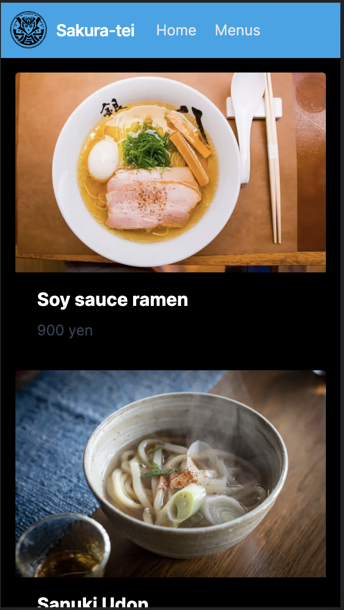
- การกด `HOME` บน Navbar จะนำคุณไปที่หน้าจอ HOME และการกด `MENUS` จะนำคุณไปยังหน้าจอ Menu List
- การคลิก `CARD` ในเมนูใดๆ บนหน้าจอ Menu List จะนำคุณไปยังหน้าจอ Menu Detail
  - เนื่องจากยังไม่ได้สร้างหน้าจอนี้ คุณจะเห็นข้อความ "404 This page could not be found"
- การคลิกที่การ์ด `Aroy` บนหน้าจอ Home จะนำคุณไปยังหน้าจอ Menu List
  - เมนูควรปรากฏขึ้น
- การคลิกที่การ์ด `Bohno` บนหน้าจอ Home จะนำคุณไปยังหน้าจอ Menu List
  - ข้อความแสดงข้อผิดพลาดปรากฏขึ้นเนื่องจากไม่มีเมนู
    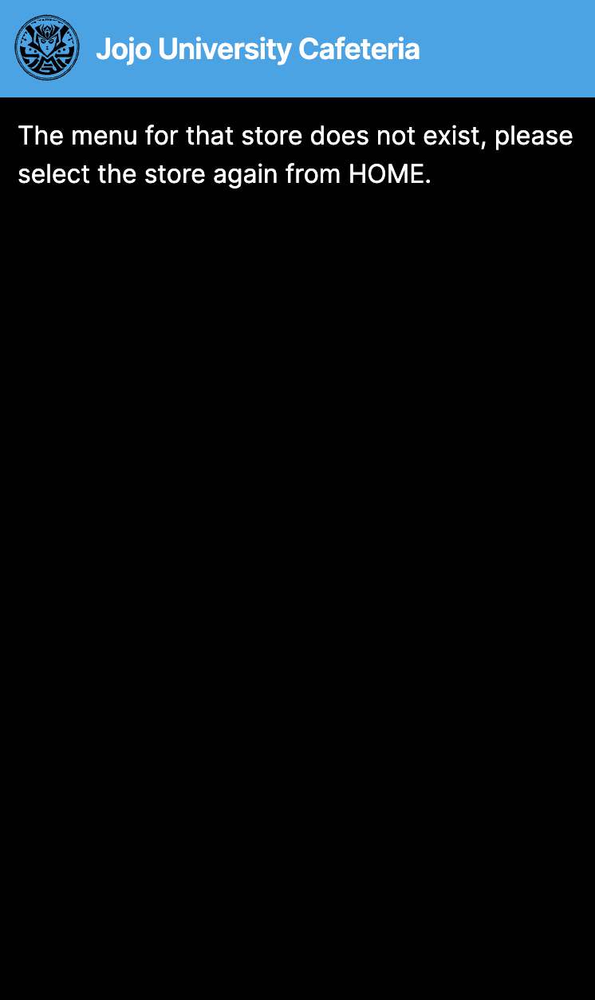
  - เพิ่มการประมวลผลในกรณีที่ไม่มีร้านค้าหรือเมนู
    - ข้างต้นเป็นกรณีที่ไม่มีเมนู แต่โปรดตรวจสอบว่าไม่มีร้านค้าด้วย
      - เขียนโค้ดใหม่ชั่วคราว (เช่น ตั้งค่าข้อมูลที่ได้มาเป็น 0 ลบคำสั่ง if เป็นต้น) เพื่อดูว่าปรากฏขึ้นหรือไม่

**หมายเหตุ**:

- เกี่ยวกับการจัดการข้อยกเว้นใน hands-on นี้
  - ใน hands-on ทั้ง frontend และ backend การจัดการข้อยกเว้นจะถูกนำไปใช้ในวิธีที่ง่ายขึ้น เนื่องจากมุ่งเน้นไปที่ประสบการณ์ในการพัฒนาแอปพลิเคชันเว็บ ในการพัฒนาจริง ๆ โปรดพัฒนาด้วยความเหมาะสมโดยใส่ใจถึงความต้องการและปัจจัยทางเทคนิคครับ

คำแนะนำ:

- เกี่ยวกับการกำหนดเส้นทาง(routing)ใน Next.js (ver.13 or above)
  - การกำหนดเส้นทางใน Next.js (ver.13 or above) เรียกว่า AppRouter และใช้เราเตอร์แบบไฟล์ซึ่งกำหนดเส้นทางตามลำดับชั้นของระบบไฟล์ มันใช้งานได้กับไดเร็กทอรี `app` โฟลเดอร์ (ไดเร็กทอรี) ใช้เพื่อกำหนดเส้นทาง รูท(root)คือพาธ(path)เดียวของโฟลเดอร์ที่ซ้อนกันจากโฟลเดอร์รูทไปยังโฟลเดอร์ลีฟ(leaf)สุดท้ายที่มีไฟล์ page.js ไฟล์ page.js กำหนด UI ที่จะปรากฏในส่วนราก
    - สำหรับข้อมูลเพิ่มเติม โปรดดูที่ [เว็บไซต์ Next.js อย่างเป็นทางการ](https://nextjs.org/docs/app/building-your-application/routing).
    - หากคุณต้องการสร้างเส้นทางจากข้อมูลไดนามิก คุณสามารถทำได้โดยใส่ชื่อโฟลเดอร์ไว้ใน `[]`
    - สำหรับหน้าจอ Menu List ด้านบน `[storeId]` (`storeId` คือรหัสร้านค้าที่เลือกบนหน้าจอหน้า Home) และเส้นทางคือ `app/stores/[storeId]/page.tsx`
      - สำหรับข้อมูลเพิ่มเติม โปรดดูที่ [เว็บไซต์ Next.js อย่างเป็นทางการ](https://nextjs.org/docs/app/building-your-application/routing/dynamic-routes)

#### การ Refactoring (การเตรียมการเรียก backend API)

ขณะนี้ frontend มีข้อมูลที่คงที่ แต่เราจะเปลี่ยนข้อมูลนี้เป็นข้อมูลโดยการเรียก backend API ในขั้นตอนต่อไป

ขั้นตอน (ขั้นตอนโดยละเอียด) ของการ refactoring มีดังนี้
อย่างไรก็ตาม ขั้นตอนนี้จะแสดงเฉพาะขั้นตอนเท่านั้น เช่นเดียวกับเมื่อก่อน โค้ดที่แก้ไขจะอธิบายโดยการเขียนทับแต่ละไฟล์  
หากคุณมีเวลามาก โปรดทำตามขั้นตอนนี้และ refactorโค้ดด้วยตัวเอง และเปรียบเทียบกับโค้ดที่แก้ไข

1. ย้ายข้อมูลร้านค้าคงที่จาก `dish-delight/frontend/app/page.tsx` ไปที่ `dish-delight/frontend/lib/api.tsx`
1. สร้างเมธอด `getStores` ใน `dish-delight/frontend/lib/api.tx` เพื่อส่งคืนข้อมูลร้านค้าทั้งหมด
1. เรียกใช้เมธอด `getStores` ใน `dish-delight/frontend/lib/api.tx` แทนที่จะเรียกข้อมูลร้านค้าคงที่ใน `dish-delight/frontend/app/page.tsx`
1. สร้างเมธอด `getStore` ใน `dish-delight/frontend/lib/api.tsx` เพื่อส่งคืนเฉพาะร้านค้าที่ระบุ
1. เปลี่ยน `dish-delight/frontend/app/stores/[storeId]/page.tsx` จากการเรียก `stores` ใน `dish-delight/frontend/app/page.tsx` เป็น `dish-delight/frontend/lib/api.tx` เพื่อเรียกใช้เมธอด `getStore` ใน `dish-delight/frontend/lib/api.tx`
1. ย้ายข้อมูลคงที่ของเมนูจาก `dish-delight/frontend/app/stores/[storeId]/page.tsx` ไปที่ `dish-delight/frontend/lib/api.tsx`
1. สร้างเมธอด `getMenus` ใน `dish-delight/frontend/lib/api.tsx` เพื่อส่งคืนเมนูทั้งหมดของร้านค้าที่ระบุ
   - เราต้องการระบุประเภทการตอบกลับดังนั้นเราจึงกำหนดประเภทเมนูด้วย
1. เปลี่ยน `dish-delight/frontend/app/stores/[storeId]/page.tsx` จากการเรียก `menus` ใน `dish-delight/frontend/app/page.tsx` เป็นการเรียกเมธอด `getMenus` ใน `dish-delight/frontend/lib/api.tsx`

สร้างไฟล์ `dish-delight/frontend/lib/api.tsx` และแทนที่เนื้อหาด้วยโค้ดต่อไปนี้:

```tsx
// dish-delight/frontend/lib/api.tsx

type Store = {
  id: number;
  name: string;
  img: string;
  category: string;
};

export const stores: Store[] = [
  {
    id: 1,
    name: "Sakura-tei",
    img: "/sakura_tei_logo.jpeg",
    category: "Japanese",
  },
  {
    id: 2,
    name: "Aroy",
    img: "/aroy_logo.jpeg",
    category: "Thai",
  },
  {
    id: 3,
    name: "Buono",
    img: "/buono_logo.jpeg",
    category: "Italian",
  },
];

// type definition of menu
type Menu = {
  id: number;
  storeId: number;
  name: string;
  img: string;
  author: string;
  price: string;
  description: string;
  options?: Option[];
};

// type definition of menu's option
type Option = {
  name: string;
  price: string;
};

export const menus = [
  {
    id: 1,
    storeId: 1,
    name: "Soy sauce ramen",
    img: "https://images.unsplash.com/photo-1632709810780-b5a4343cebec",
    author: "@5amramen",
    price: "900 yen",
    description:
      "A classic Japanese ramen noodle soup that is made with a soy sauce-based broth.",
    options: [
      {
        name: "Extra noodles",
        price: "100 yen",
      },
      {
        name: "Extra char siu",
        price: "100 yen",
      },
      {
        name: "Barikata(very hard noodles)",
        price: "0 yen",
      },
    ],
  },
  {
    id: 2,
    storeId: 1,
    name: "Sanuki Udon",
    img: "https://images.unsplash.com/photo-1618841557871-b4664fbf0cb3",
    author: "@jinomono",
    price: "800 yen",
    description:
      "A type of thick, chewy udon noodle that is made in Kagawa Prefecture, Japan.",
    options: [
      {
        name: "Chicken tempura",
        price: "100 yen",
      },
      {
        name: "Squid tempura",
        price: "100 yen",
      },
      {
        name: "Vegetable tempura",
        price: "100 yen",
      },
      {
        name: "Large size",
        price: "100 yen",
      },
      {
        name: "Small size",
        price: "-50 yen",
      },
    ],
  },
  {
    id: 3,
    storeId: 1,
    name: "Zaru soba",
    img: "https://images.unsplash.com/photo-1519984388953-d2406bc725e1",
    author: "@gaspanik",
    price: "1,000 yen",
    description: "A cold soba noodle dish served with a dipping sauce.",
    options: [
      {
        name: "Large size",
        price: "200 yen",
      },
    ],
  },
  {
    id: 4,
    storeId: 1,
    name: "Spicy Miso Ramen",
    img: "https://images.unsplash.com/photo-1637024696628-02cb19cc1829",
    author: "@5amramen",
    price: "900 yen",
    description: "A spicy miso ramen with a rich and flavorful broth.",
    options: [
      {
        name: "Large size",
        price: "100 yen",
      },
      {
        name: "Extra char siu",
        price: "100 yen",
      },
      {
        name: "Seasoned egg",
        price: "100 yen",
      },
    ],
  },
  {
    id: 8,
    storeId: 2,
    name: "Khao soi",
    img: "https://images.unsplash.com/photo-1569562211093-4ed0d0758f12",
    author: "@ural_8_low",
    price: "60 baht",
    description:
      "Khao Soi is a Northern Thai curry noodle soup with a rich and flavorful broth.",
  },
];

export async function getStores(): Promise<Store[]> {
  return stores;
}

export async function getStore(storeId: number): Promise<Store | undefined> {
  return stores.find((store) => store.id === storeId);
}

export async function getMenus(storeId: number): Promise<Menu[]> {
  return menus.filter((menu) => menu.storeId === storeId);
}
```

**หมายเหตุ**:  
ไม่จำเป็นต้องเพิ่ม async/await สำหรับการประมวลผลแบบ asynchronous เพื่อรับข้อมูลคงที่เลย มีการเพิ่ม async/await เพื่อให้เมื่อมีการแทนที่ backend API จะมีการเปลี่ยนแปลงน้อยลง

เปิด `dish-delight/frontend/app/page.tsx` และแทนที่เนื้อหาด้วยโค้ดต่อไปนี้:

```tsx
// dish-delight/frontend/app/page.tsx
import Image from "next/image";
import Link from "next/link";
import Navbar from "../components/Navbar";
import { getStores } from "@/lib/api";

export default async function Home() {
  const stores = await getStores();
  return (
    <div>
      <Navbar />
      <div className="text-center mt-8">
        <h1 className="text-3xl font-bold">
          Welcome to Jojo University Cafeteria!
        </h1>
        <Image
          className="hidden md:block mx-auto mt-4"
          src={"https://images.unsplash.com/photo-1567521464027-f127ff144326"}
          alt="University Cafeteria Image"
          width={500}
          height={375}
        />
      </div>
      <div className="text-center mt-6 mx-2">
        <h2 className="text-xl text-gray-500">
          Select the store where you would like to see the menu
        </h2>
        <div className="grid grid-cols-1 md:grid-cols-2 lg:grid-cols-3 gap-6 p-10">
          {stores.map((store) => (
            <Link href={`/stores/${store.id}`} key={store.id}>
              <div className="max-w-sm rounded overflow-hidden shadow-lg mx-auto">
                <Image
                  className="w-full"
                  src={store.img}
                  alt={store.name}
                  width={300}
                  height={300}
                />
                <div className="px-6 py-4">
                  <div className="font-bold text-xl mb-2">{store.name}</div>
                  <p className="text-gray-700 text-base">{store.category}</p>
                </div>
              </div>
            </Link>
          ))}
        </div>
      </div>
    </div>
  );
}
```

เปิด `dish-delight/frontend/app/stores/[storeId]/page.tsx` และแทนที่เนื้อหาด้วยโค้ดต่อไปนี้:

```tsx
// dish-delight/frontend/app/stores/[storeId]/page.tsx
import Link from "next/link";
import Navbar from "../../../components/Navbar";
import Image from "next/image";
import { getMenus, getStore } from "@/lib/api";

export default async function StoreMenu({
  params,
}: {
  params: { storeId: string };
}) {
  const storeId = Number(params.storeId);
  const store = await getStore(storeId);
  const menus = await getMenus(storeId);

  // When the store does not exist
  if (!store) {
    return (
      <div>
        <Navbar />
        <div className="m-3">
          <p>
            The store does not exist, please select the store again from HOME.
          </p>
        </div>
      </div>
    );
  }

  // When the menu for the store does not exist
  if (menus.length === 0) {
    return (
      <div>
        <Navbar />
        <div className="m-3">
          <p>
            The menu for that store does not exist, please select the store again from HOME.
          </p>
        </div>
      </div>
    );
  }

  return (
    <div>
      <Navbar storeName={store.name} storeId={store.id} />
      <div className="grid grid-cols-1 md:grid-cols-2 lg:grid-cols-3 gap-4 p-4">
        {menus.map((menu) => (
          <Link href={`/stores/${storeId}/menus/${menu.id}`} key={menu.id}>
            <div className="max-w-sm rounded overflow-hidden shadow-lg mx-auto">
              <Image
                className="w-full"
                src={menu.img}
                alt={menu.name}
                width={300}
                height={300}
              />
              <div className="px-6 py-4">
                <div className="font-bold text-xl mb-2">{menu.name}</div>
                <p className="text-gray-700 text-base">{menu.price}</p>
              </div>
            </div>
          </Link>
        ))}
      </div>
    </div>
  );
}
```

ตรวจสอบว่าไม่มีการเปลี่ยนแปลงพฤติกรรมหรือรูปลักษณ์  

#### การสร้างหน้าจอ Menu Detail

ส่วนนี้จะสร้างหน้าจอ Menu Detail ที่แสดงหลังจากเลือกรายการเมนูจากหน้าจอ Menu List

โครงสร้างไดเรกทอรีของหน้าจอ Menu Detail มีดังนี้ (อ้างอิงเฉพาะไฟล์ที่เกี่ยวข้องเท่านั้น)

```sh
dish-delight/frontend
├── app/
│   ├── index.ts
│   └── stores/
│       ├── [storeId]/
│       │   └── page.tsx
│       └── menus/
│           └── [menuId]/
│               └── page.tsx
├── components/
│   └── Navbar.tsx
├── lib/
│   ├── api.ts                 // Call the backend API
│   └── constants.ts
├── public/
│   ├── aroy_logo.jpeg
│   ├── buono_logo.jpeg
│   ├── logo_jojo_univ.svg
│   └── sakura_tei_logo.jpeg
├── styles/
│   └── globals.css
├── next.config.js
└── tailwind.config.js
```

เพื่อแสดงหน้าจอ Menu Detail ให้เพิ่มฟังก์ชันเพื่อรับเมนูก่อน
เปิดไฟล์ `dish-delight/frontend/lib/api.tsx` และเพิ่มโค้ดต่อไปนี้ที่ด้านล่าง:

```tsx
// lib/api.tsx
export async function getMenu(
  storeId: number,
  menuId: number
): Promise<Menu | undefined> {
  return menus.find((menu) => menu.storeId === storeId && menu.id === menuId);
}
```

การสร้างหน้าจอ Menu Detail
สร้างไฟล์ `dish-delight/frontend/app/stores/[storeId]/menus/[menuId]/page.tsx` และแทนที่เนื้อหาด้วยโค้ดต่อไปนี้:

```tsx
// dish-delight/frontend/app/stores/[storeId]/menus/[menuId]/page.tsx
import Image from "next/image";
import { getMenu, getStore } from "@/lib/api";
import Navbar from "@/components/Navbar";

export default async function Menu({
  params,
}: {
  params: { storeId: string; menuId: string };
}) {
  const storeId = Number(params.storeId);
  const menuId = Number(params.menuId);
  const store = await getStore(storeId);
  const menu = await getMenu(storeId, menuId);

  // When the store does not exist
  if (!store) {
    return (
      <div>
        <Navbar />
        <div className="m-3">
          <p>
            The store does not exist, please select the store again from HOME.
          </p>
        </div>
      </div>
    );
  }

  // When the menu for the store does not exist
  if (!menu) {
    return (
      <div>
        <Navbar />
        <div className="m-3">
          <p>
            The menu for that store does not exist, please select the store again from HOME.
          </p>
        </div>
      </div>
    );
  }

  return (
    <div>
      <Navbar storeName={store.name} storeId={store.id} />
      <div className="max-w-sm rounded overflow-hidden shadow-lg m-4 md:mx-auto">
        <Image
          className="w-full"
          src={menu.img}
          alt={menu.name}
          width={300}
          height={300}
          priority={false}
        />
        <div className="px-6 py-4">
          <div className="font-bold text-xl mb-2">{menu.name}</div>
          <p className="text-gray-500 text-base mt-2">{menu.price}</p>
          <div className="text-base mt-3">{menu.description}</div>
          {menu.options && menu.options.length > 0 && (
            <div>
              <p className="font-bold text-gray-500 text-lg mt-5">Option</p>
              {/* If there are options in the menu, display the number of options */}
              {menu.options.map((option) => (
                <ul key={option.name}>
                  <li className="list-disc list-inside text-base mt-3">
                    {option.name}{" "}
                    <span className="text-gray-500">{option.price}</span>
                  </li>
                </ul>
              ))}
            </div>
          )}
        </div>
      </div>
    </div>
  );
}
```

ตรวจสอบเพื่อดูว่าสิ่งนี้ทำงานและมีลักษณะอย่างไร

- การคลิกที่การ์ดเมนูใดๆ ในหน้าจอ Menu List จะนำผู้ใช้ไปยังหน้าจอ Menu Detail
  - ควรแสดงรูปภาพเมนู คำอธิบาย และตัวเลือกที่เหมาะสม
    - ตัวอย่าง: `Khao Soi` ที่ร้าน `Aroy` (ไม่มีตัวเลือก)
    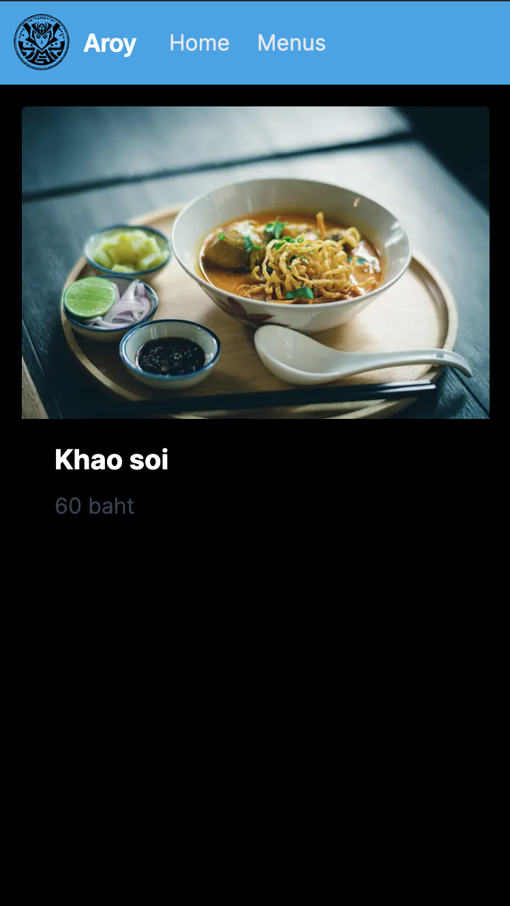
    - ตัวอย่าง: `Sanuki Udon` ที่ร้าน `Sakura-tei` (มีตัวเลือก)
    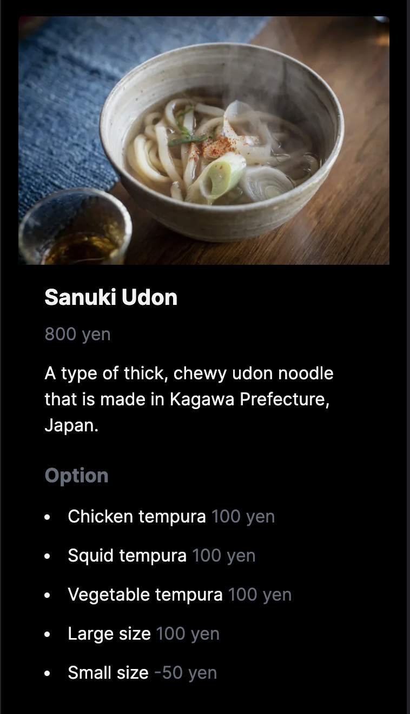
- การกด `HOME` บน Navbar จะนำคุณไปที่หน้าจอ HOME และการกด 'MENUS` จะนำคุณไปยังหน้าจอ Menu List
- หน้าจอแสดงข้อผิดพลาดหากไม่มีร้านค้าหรือเมนู
  - ภาพจะเหมือนกับหน้าจอ Menu List

#### Refactoring (ทำให้หน้าจอข้อผิดพลาดเป็น component เมื่อไม่มีการดึงข้อมูล)

โค้ดเมื่อไม่มีข้อมูลร้านค้าหรือเมนูนั้นซ้ำซ้อนและควรถูกทำให้เป็น component

การ refactoring มีเป้าหมายไปที่หน้าจอสองหน้าจอต่อไปนี้ แต่ละไฟล์มีหน้าจอในกรณีที่ไม่มีร้านค้าหรือเมนูเมื่อดึงข้อมูล สิ่งเหล่านี้จะถูกจัดเป็น component

- `dish-delight/frontend/app/stores/[storeId]/page.tsx`
- `dish-delight/frontend/app/stores/[storeId]/menus/[menuId]/page.tsx`

เพื่อจัดเก็บข้อความคงที่, สร้างไฟล์ `dish-delight/frontend/lib/constants.ts` และแทนที่เนื้อหาด้วยโค้ดต่อไปนี้:

```ts
// dish-delight/frontend/lib/constants.ts

export const DATA_NOT_FOUND_MESSAGE = {
  STORE: "The store does not exist, please select the store again from HOME.",
  MENU: "The menu for that store does not exist, please select the store again from HOME.",
};
```

ทำให้หน้าจอข้อผิดพลาดเป็น component
สร้างไฟล์ `dish-delight/frontend/components/DataNotFound.tsx` และแทนที่เนื้อหาด้วยโค้ดต่อไปนี้:

```tsx
// dish-delight/frontend/components/DataNotFound.tsx

import Navbar from "./Navbar";

type DataNotFoundProps = {
  message: string;
};

// The message will be passed on from the caller.
export default function DataNotFound({ message }: DataNotFoundProps) {
  return (
    <>
      <Navbar />
      <div className="m-3">
        <p>{message}</p>
      </div>
    </>
  );
}
```

แทนที่หน้าจอข้อผิดพลาดในแต่ละหน้าจอด้วย component ที่เพิ่งสร้างขึ้น

เปิด `dish-delight/frontend/app/stores/[storeId]/page.tsx` และแทนที่เนื้อหาด้วยโค้ดต่อไปนี้:

```tsx
// dish-delight/frontend/app/stores/[storeId]/page.tsx
import Link from "next/link";
import Navbar from "../../../components/Navbar";
import Image from "next/image";
import { getMenus, getStore } from "@/lib/api";
import DataNotFound from "@/components/DataNotFound";
import { DATA_NOT_FOUND_MESSAGE } from "@/lib/constants";

export default async function StoreMenu({
  params,
}: {
  params: { storeId: string };
}) {
  const storeId = Number(params.storeId);
  const store = await getStore(storeId);
  const menus = await getMenus(storeId);

  // When the store does not exist
  if (!store) {
    return <DataNotFound message={DATA_NOT_FOUND_MESSAGE.STORE} />;
  }

  // When the menu for the store does not exist
  if (menus.length === 0) {
    return <DataNotFound message={DATA_NOT_FOUND_MESSAGE.MENU} />;
  }

  return (
    <div>
      <Navbar storeName={store.name} storeId={store.id} />
      <div className="grid grid-cols-1 md:grid-cols-2 lg:grid-cols-3 gap-4 p-4">
        {menus.map((menu) => (
          <Link href={`/stores/${storeId}/menus/${menu.id}`} key={menu.id}>
            <div className="max-w-sm rounded overflow-hidden shadow-lg mx-auto">
              <Image
                className="w-full"
                src={menu.img}
                alt={menu.name}
                width={300}
                height={300}
              />
              <div className="px-6 py-4">
                <div className="font-bold text-xl mb-2">{menu.name}</div>
                <p className="text-gray-700 text-base">{menu.price}</p>
              </div>
            </div>
          </Link>
        ))}
      </div>
    </div>
  );
}
```

เปิด `dish-delight/frontend/app/stores/[storeId]/menus/[menuId]/page.tsx` และแทนที่เนื้อหาด้วยโค้ดต่อไปนี้:

```tsx
// dish-delight/frontend/app/stores/[storeId]/menus/[menuId]/page.tsx
import Image from "next/image";
import { getMenu, getStore } from "@/lib/api";
import Navbar from "@/components/Navbar";
import DataNotFound from "@/components/DataNotFound";
import { DATA_NOT_FOUND_MESSAGE } from "@/lib/constants";

export default async function Menu({
  params,
}: {
  params: { storeId: string; menuId: string };
}) {
  const storeId = Number(params.storeId);
  const menuId = Number(params.menuId);
  const store = await getStore(storeId);
  const menu = await getMenu(storeId, menuId);

  // When the store does not exist
  if (!store) {
    return <DataNotFound message={DATA_NOT_FOUND_MESSAGE.STORE} />;
  }

  // When the menu does not exist
  if (!menu) {
    return <DataNotFound message={DATA_NOT_FOUND_MESSAGE.MENU} />;
  }

  return (
    <div>
      <Navbar storeName={store.name} storeId={store.id} />
      <div className="max-w-sm rounded overflow-hidden shadow-lg m-4 md:mx-auto">
        <Image
          className="w-full"
          src={menu.img}
          alt={menu.name}
          width={300}
          height={300}
          priority={false}
        />
        <div className="px-6 py-4">
          <div className="font-bold text-xl mb-2">{menu.name}</div>
          <p className="text-gray-500 text-base mt-2">{menu.price}</p>
          <div className="text-base mt-3">{menu.description}</div>
          {menu.options && menu.options.length > 0 && (
            <div>
              <p className="font-bold text-gray-500 text-lg mt-5">Option</p>
              {menu.options.map((option) => (
                <ul key={option.name}>
                  <li className="list-disc list-inside text-base mt-3">
                    {option.name}{" "}
                    <span className="text-gray-500">{option.price}</span>
                  </li>
                </ul>
              ))}
            </div>
          )}
        </div>
      </div>
    </div>
  );
}
```

ตรวจสอบว่าไม่มีการเปลี่ยนแปลงพฤติกรรมหรือรูปลักษณ์

#### การตั้งชื่อเว็บไซต์และ favicon

ด้านบนคือจุดสิ้นสุดของ frontend แต่ขั้นตอนสุดท้ายคือการเปลี่ยนชื่อไซต์และ favicon เท่านั้น

ปัจจุบัน ชื่อและ favicon เป็นค่าเริ่มต้นของ Nextjs แก้ไขปัญหานี้

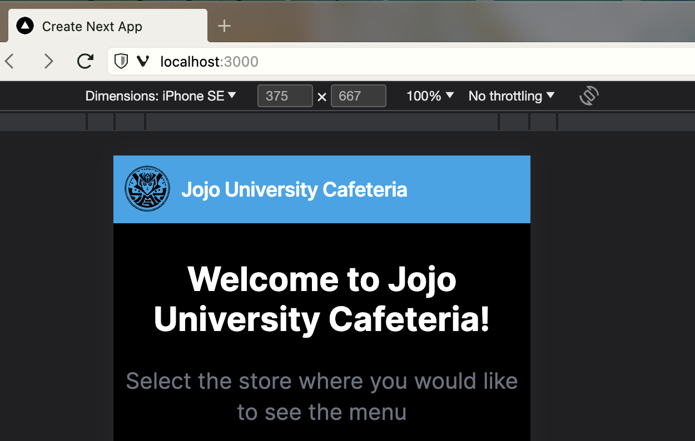

เปิด `dish-delight/frontend/app/layout.tsx` และแทนที่เนื้อหาด้วยโค้ดต่อไปนี้:

```tsx
import "./globals.css";
import type { Metadata } from "next";
import { Inter } from "next/font/google";

const inter = Inter({ subsets: ["latin"] });

export const metadata: Metadata = {
  title: "Jojo University Cafeteria",
  description: "This site shows the menu of Jojo University Cafeteria",
};

export default function RootLayout({
  children,
}: {
  children: React.ReactNode;
}) {
  return (
    <html lang="en">
      <body className={inter.className}>{children}</body>
    </html>
  );
}
```

แทนที่ `dish-delight/frontend/app/favicon.ico`:

ควรได้รับภาพเป้าหมายจาก [Github Repository](https://github.com/minakamoto/pcshscr2023/tree/main/docs/static/img/2nd/favicon.ico).

ตรวจสอบเพื่อดูว่าสิ่งนี้ทำงานและมีลักษณะอย่างไร

- ตรวจสอบให้แน่ใจว่าชื่อไซต์และ favicon เหมือนกับในภาพต่อไปนี้

  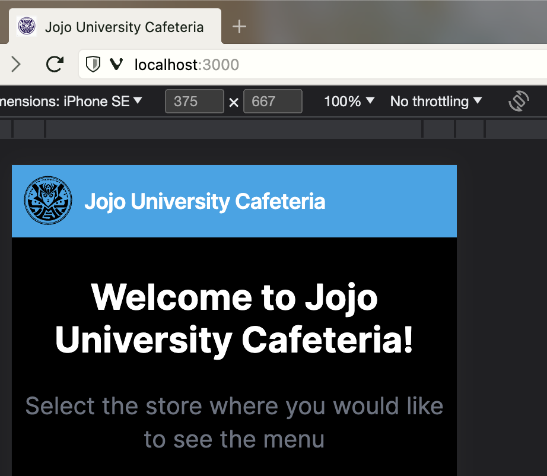

## 3. การเชื่อมต่อกับฐานข้อมูลและการส่งคืนข้อมูล

จากนี้ไปก็ถึงเวลา backend แล้ว เมื่อนำการประมวลผล backend ไปใช้แล้ว ให้แก้ไข frontend และเชื่อมต่อกับแบ็กเอนด์

### กำหนดการตั้งค่าการเชื่อมต่อฐานข้อมูล

เชื่อมต่อกับฐานข้อมูล SQLite โดยใช้ SQLAlchemy ของ ORM

สร้างไฟล์ `dish-delight/backend/src/backend/database.py` และแทนที่เนื้อหาด้วยโค้ดต่อไปนี้:

```py
# dish-delight/backend/src/backend/database.py

# Quoting [เว็บไซต์ FastAPI อย่างเป็นทางการ](https://fastapi.tiangolo.com/ja/tutorial/sql-databases/)

# import the SQLAlchemy parts
from sqlalchemy import create_engine
from sqlalchemy.orm import sessionmaker
from sqlalchemy.ext.declarative import declarative_base

# Create a database URL for SQLAlchemy
# connecting to a SQLite database (opening a file with the SQLite database).
DATABASE_URL = "sqlite:///./university.db"

# Create a SQLAlchemy "engine"
engine = create_engine(DATABASE_URL, connect_args={"check_same_thread": False})

# Create a SessionLocal class.
# Each instance of the SessionLocal class will be a database session.
SessionLocal = sessionmaker(autocommit=False, autoflush=False, bind=engine)

# Create a Base class.
# Later we will inherit from this class to create each of the database models or classes (the ORM models)
Base = declarative_base()

```

คำแนะนำ:

- ORM คืออะไร?
  - ORM ย่อมาจาก Object-Relational Mapping ซึ่งเป็นเทคโนโลยีที่ทำให้การแมประหว่างวัตถุในโปรแกรมกับตารางและบันทึกในฐานข้อมูลเป็นไปโดยอัตโนมัติ ORM เป็นวิธีการทำงานกับฐานข้อมูลเชิงวัตถุ(object-oriented)
- เกี่ยวกับ SQLite
  - SQLite เป็นระบบจัดการฐานข้อมูลเชิงสัมพันธ์แบบฝังตัวน้ำหนักเบา (RDBMS) ที่ไม่ต้องใช้เซิร์ฟเวอร์และทำงานเป็นไฟล์เดียวบนดิสก์ SQLite รวมอยู่ใน Python โดยเป็นส่วนมาตรฐานของ Python ดังนั้นจึงสามารถใช้งานได้โดยอัตโนมัติเมื่อติดตั้ง Python
- เกี่ยวกับ SQLAlchemy
  - เราใช้ SQLAlchemy สำหรับ ORM ที่ hands-on ซึ่งเป็นชุดเครื่องมือ Python SQL และไลบรารี ORM ช่วยให้การดำเนินงานฐานข้อมูลง่ายขึ้นและอนุญาตให้แสดงตารางฐานข้อมูลเป็นคลาส Python ซึ่งช่วยให้การดำเนินการฐานข้อมูลสามารถดำเนินการในรูปแบบการเขียนโปรแกรมเชิงวัตถุ(object-oriented)ของ Python
- โค้ดและคำอธิบายเกี่ยวกับฐานข้อมูล และ SQL นำมาจาก [เว็บไซต์ FastAPI อย่างเป็นทางการ](https://fastapi.tiangolo.com/ja/tutorial/sql-databases) หากคุณต้องการทราบรายละเอียดเพิ่มเติม โปรดตรวจสอบที่นั่น

**หมายเหตุ**:

- จะทำอย่างไรถ้า Pylance ไม่รู้จักสภาพแวดล้อมเสมือน rye ที่สร้างขึ้นอัตโนมัติและเตือนเกี่ยวกับการนำเข้า
  - หากคุณได้รับคำเตือนตามภาพหน้าจอด้านล่าง โปรดลองดำเนินการดังต่อไปนี้
    
  - ในชุดคำสั่ง (command palette) (กด Ctrl+Shift+P) เลือก `Python: Select Interpreter` บน Windows: `{เส้นทางสัมบูรณ์ของไดเร็กทอรีการทำงานของคุณ}/dish-delight/backend/.venv/Scripts/python .exe)` บน Mac: `{เส้นทางสัมบูรณ์ของไดเร็กทอรีการทำงานของคุณ}/dish-delight/backend/.venv/bin/python)`

### กำหนดตารางฐานข้อมูล (database model)

กำหนดตารางฐานข้อมูล (database model) โดยใช้ SQLAlchemy

สร้างไฟล์ `dish-delight/backend/src/backend/models.py` และแทนที่เนื้อหาด้วยโค้ดต่อไปนี้:

```py
# dish-delight/backend/src/backend/models.py

from sqlalchemy import Column, Integer, String, ForeignKey
from sqlalchemy.orm import relationship

# Import Base defined in database.py
from database import Base


# Define a model for each table by inheriting from Base
class Store(Base):
    # Define Store table
    __tablename__ = "stores"

    # Define columns and attributes
    id = Column(Integer, primary_key=True, index=True)
    name = Column(String, index=True)
    img = Column(String)
    category = Column(String)

    # Define the relationship
    menus = relationship("Menu", back_populates="store")


class Menu(Base):
    # Define Menu table
    __tablename__ = "menus"

    id = Column(Integer, primary_key=True, index=True)
    storeId = Column(Integer, ForeignKey("stores.id"))
    name = Column(String, index=True)
    img = Column(String)
    author = Column(String)
    price = Column(String)
    description = Column(String)

    store = relationship("Store", back_populates="menus")
    options = relationship("Option", back_populates="menu")


class Option(Base):
    # Define Option table
    __tablename__ = "options"

    id = Column(Integer, primary_key=True, index=True)
    menuId = Column(Integer, ForeignKey("menus.id"))
    name = Column(String)
    price = Column(String)

    menu = relationship("Menu", back_populates="options")

```

### ลงทะเบียนข้อมูลเริ่มต้นในฐานข้อมูล

ลงทะเบียนข้อมูลเริ่มต้นในฐานข้อมูลท้องถิ่น มีสคริปต์อย่างง่ายสำหรับการลงทะเบียนข้อมูลเริ่มต้นในฐานข้อมูลท้องถิ่น  
ดาวน์โหลดไฟล์ทั้งหมดจาก [Github repository](https://github.com/minakamoto/pcshscr2023/tree/main/src/script/2nd) และวางไว้ใต้ `dish-delight/backend/src/backend`

ไฟล์เป้าหมายมีสี่ไฟล์ต่อไปนี้

- data.json
- insert_data.py
- insert_initial_data.py
- read_json.py

เรียกใช้คำสั่งต่อไปนี้ใน `dish-delight/backend/src/backend`

```sh
python insert_initial_data.py
```

หากไฟล์ `university.db` ถูกสร้างขึ้นใน `dish-delight/backend/src/backend` แสดงว่าคุณทำสำเร็จแล้ว

คำแนะนำ:

- หากคุณต้องการเปลี่ยนแปลงข้อมูลและลงทะเบียนลงในฐานข้อมูลอีกครั้ง ให้ลบไฟล์ `university.db` และรันอีกครั้ง
- โมเดลที่สร้างใน `models.py` เป็นโมเดล SQLAlchemy และใช้สำหรับฐานข้อมูล

**หมายเหตุ**:

- วัตถุประสงค์ของสคริปต์การลงทะเบียนข้อมูลเริ่มต้นมีไว้เพื่อการลงทะเบียนข้อมูลเริ่มต้นเพียงครั้งเดียวสำหรับ hands-on นี้เท่านั้น ในการพัฒนาจริง โปรดพิจารณาติดตั้งเครื่องมือการย้ายข้อมูล (สำหรับ FastAPI, [Alembic](https://alembic.sqlalchemy.org/en/latest/)) เมื่อต้องจัดการกับฐานข้อมูล

### สร้าง API ที่ดึงและส่งคืนรายการร้านค้า รายละเอียดร้านค้า รายการเมนู และข้อมูลรายละเอียดเมนูจากฐานข้อมูล

สร้าง API เพื่อดึงข้อมูลรายการร้านค้า รายละเอียดร้านค้า รายการเมนู และข้อมูลรายละเอียดเมนูจากฐานข้อมูล

ขั้นแรก สร้างโมเดลข้อมูล (Pydantic's model) สำหรับ API
  
สร้างไฟล์ `dish-delight/backend/src/backend/schemas.py` และแทนที่เนื้อหาด้วยโค้ดต่อไปนี้:

```py
# dish-delight/backend/src/backend/schemas.py
from pydantic import BaseModel


# Store type definition
class Store(BaseModel):
    id: int
    name: str
    img: str
    category: str

    class Config:
        from_attributes = True


# Type definition for menu options
class Option(BaseModel):
    id: int
    menuId: int
    name: str
    price: str

    class Config:
        from_attributes = True


# Menu type definition
class Menu(BaseModel):
    id: int
    storeId: int
    name: str
    img: str
    author: str
    price: str
    description: str
    options: list[Option] = []

    class Config:
        from_attributes = True

```

สร้าง API  
สร้างไฟล์ `dish-delight/backend/src/backend/main.py` และแทนที่เนื้อหาด้วยโค้ดต่อไปนี้:

```py
from fastapi import FastAPI, Depends, HTTPException
from sqlalchemy.orm import Session
from database import SessionLocal
import models
from pydantic import BaseModel

app = FastAPI()


# Dependency
# This dependency will create a new SQLAlchemy SessionLocal
# that will be used in a single request,
# and then close it once the request is finished.
def get_db():
    db = SessionLocal()
    try:
        yield db
    finally:
        db.close()


# Store type definition
class Store(BaseModel):
    id: int
    name: str
    img: str
    category: str

    class Config:
        from_attributes = True


# Type definition for menu options
class Option(BaseModel):
    id: int
    menuId: int
    name: str
    price: str

    class Config:
        from_attributes = True


# Menu type definition
class Menu(BaseModel):
    id: int
    storeId: int
    name: str
    img: str
    author: str
    price: str
    description: str
    options: list[Option] = []

    class Config:
        from_attributes = True


# API to get a list of stores
# `@app.get` to indicate that it is a GET method,
# and its first argument specifies the path.
# And We can use response_model to define the response type
@app.get("/stores", response_model=list[Store])
def read_stores(db: Session = Depends(get_db)):
    # Get all items from Store table
    result = db.query(models.Store).all()
    # Exception handling when result does not exist
    if not result:
        raise HTTPException(status_code=404, detail="Store not found")
    return result


# API to get the specified store ID
@app.get("/stores/{store_id}", response_model=Store)
def read_store(store_id: int, db: Session = Depends(get_db)):
    # Get data matching the specified store_id and Id from the Store table
    result = db.query(models.Store).filter(models.Store.id == store_id).first()
    if not result:
        raise HTTPException(status_code=404, detail="Store not found")
    return result


# API to get the menu list of the specified store ID
@app.get("/stores/{store_id}/menus", response_model=list[Menu])
def read_menus(store_id: int, db: Session = Depends(get_db)):
    result = db.query(models.Menu).filter(models.Menu.storeId == store_id).all()
    if not result:
        raise HTTPException(status_code=404, detail="Menus not found")
    return result


# API to get the menu with the specified store ID and menu ID
@app.get("/stores/{store_id}/menus/{menu_id}", response_model=Menu)
def read_menu(store_id: int, menu_id: int, db: Session = Depends(get_db)):
    # To get data, specify multiple conditions in the Menu table.
    condition = [models.Menu.storeId == store_id, models.Menu.id == menu_id]
    result = db.query(models.Menu).filter(*condition).first()
    if not result:
        raise HTTPException(status_code=404, detail="Menu not found")
    return result
```

คำแนะนำ:

- โมเดล Pydantic ใช้เพื่ออ่านและสร้างข้อมูลใน API
- ความแตกต่างระหว่าง hands-on และ [เว็บไซต์อย่างเป็นทางการของ FastAPI](https://fastapi.tiangolo.com/ja/tutorial/sql-databases)
  - [เว็บไซต์อย่างเป็นทางการของ FastAPI](https://fastapi.tiangolo.com/ja/tutorial/sql-databases) อธิบายว่าโมเดล Pydantic ประกอบด้วยคลาส `Base` สำหรับแต่ละคลาสโมเดล (เช่น `UserBase` สำหรับ `User`) คลาส `Create` (เช่น `UserCreate`) และคลาส `Read` ที่สืบทอดมาจากคลาส `Base` (เช่น `UserBase` สำหรับ `User`) ของแต่ละคลาสโมเดล เหตุผลก็คือข้อมูลที่จำเป็นสำหรับ `Create` และ `Read` นั้นแตกต่างกัน และมีข้อมูลที่คุณไม่ต้องการส่งต่อ (เช่น `password`)
    - ใน hands-on นี้ เฉพาะฟังก์ชัน `R(read)` ของ `CRUD` เท่านั้นที่ถูกสร้างขึ้น ดังนั้นจึงมีการสร้างคลาสเดียวเท่านั้น
      - CRUD มาจาก: สร้าง(Create) อ่าน(Read) อัปเดต(Update) และลบ(Delete)
  - ใน [เว็บไซต์ FastAPI อย่างเป็นทางการ](https://fastapi.tiangolo.com/ja/tutorial/sql-databases) พวกเขาสร้างโมดูล Util สำหรับฟังก์ชัน `CRUD` และเรียกใช้ฟังก์ชันเหล่านี้ในแต่ละฟังก์ชัน API สิ่งนี้มีไว้สำหรับการนำโค้ดกลับมาใช้ซ้ำได้ ความง่ายในการทดสอบ และการบำรุงรักษา
    - hands-on นี้เป็นการนำไปปฏิบัติที่เรียบง่ายเพื่อให้ความสำคัญกับประสบการณ์ในการพัฒนาเว็บแอปพลิเคชัน สำหรับการพัฒนาจริง โปรดออกแบบและดำเนินการดูแลข้อกำหนด ฯลฯ

**หมายเหตุ**:

- การใช้งานข้างต้นอ้างอิงจาก [เว็บไซต์ FastAPI อย่างเป็นทางการ](https://fastapi.tiangolo.com/ja/tutorial/sql-databases) ในขณะที่เขียนบทความนี้ ในขณะที่เขียนบทความนี้ มีการอธิบายสิ่งต่อไปนี้ไว้ด้านล่าง และการนำไปปฏิบัติบางอย่างแตกต่างจากคำอธิบายเพื่อรองรับ `Pydantic v2`
  - นอกจากนี้ วัสดุที่ใช้เป็นข้อมูลอ้างอิงในการเตรียมวัสดุ hands-on อาจเปลี่ยนเป็นวัสดุเวอร์ชันใหม่กว่าที่เข้ากันได้กับ `Pydantic v2` ณ เวลาที่ลงมือจริง
    > These docs are about to be updated. 🎉
    >
    > The current version assumes Pydantic v1, and SQLAlchemy versions less than 2.0.
    >
    > The new docs will include Pydantic v2 and will use SQLModel (which is also based on SQLAlchemy) once it is updated to use Pydantic v2 as well.

### ใช้ Swagger UI เพื่อตรวจสอบพฤติกรรมของ API

ตามค่าเริ่มต้น FastAPI จะสร้างเอกสาร API โดยอัตโนมัติตามข้อกำหนด OpenAPI ที่สามารถดูได้ในเว็บเบราว์เซอร์โดยใช้ Swagger UI  
รัน FastAPI

```sh
rye run uvicorn main:app --reload
```

เปิดเบราว์เซอร์และไปที่ <http://127.0.0.1:8000/docs> และตรวจสอบว่าหน้าจอต่อไปนี้ปรากฏขึ้น

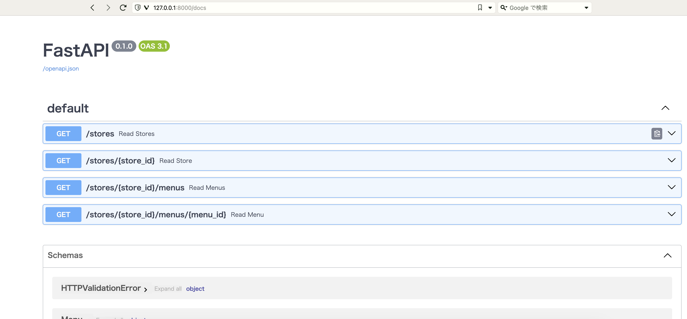

**หมายเหตุ**:

หากมีการใช้งานพอร์ต คุณจะได้รับข้อความแสดงข้อผิดพลาดต่อไปนี้ โปรดตรวจสอบให้แน่ใจว่าไม่มีแอปพลิเคชันอื่นทำงานอยู่

```sh
ERROR:    [Errno 48] Address already in use
```

เปิด API แต่ละรายการแล้วป้อน `Parameters` ตามต้องการเพื่อดูวิธีการทำงาน

ขั้นตอนการทดสอบ

- เปิด API ที่คุณต้องการตรวจสอบ
- กดปุ่ม `Try it out`
- ป้อน `Parameters` ตามสิ่งที่คุณต้องการตรวจสอบ
- กดปุ่ม `Execute`
- ตรวจสอบว่า `Code` คือ 200 และเนื้อหาของ `Details` เป็นข้อมูลที่มุ่งหมาย
  - ข้อมูลที่ลงทะเบียนในฐานข้อมูลมีข้อมูลมากกว่าข้อมูลคงที่ใน frontend โปรดตรวจสอบ `data.json` ที่ดาวน์โหลดใน `dish-delight/backend/src/backend` เพื่อดูเนื้อหาของข้อมูลที่ลงทะเบียน

ตัวอย่าง: การรับเมนูของ API ร้านค้าที่ระบุ (`/stores/{store_id}/menus`) แสดงอยู่ด้านล่าง

- กำหนด `3` ให้กับ `store_id` ใน `Parameters`
  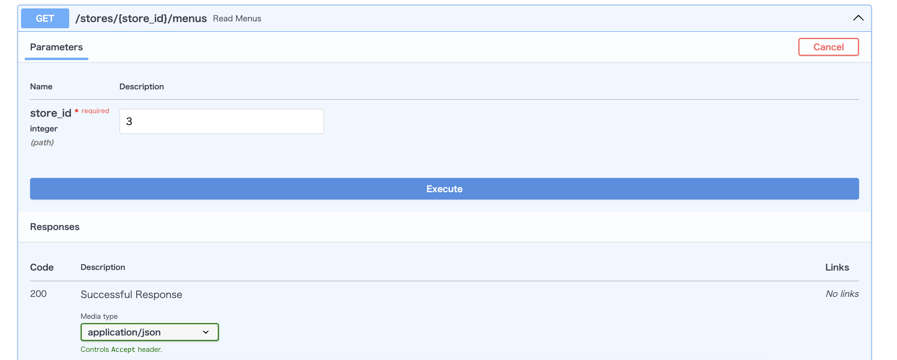
- กดปุ่ม `Execute`
- ตรวจสอบว่า `Code` คือ 200 และเนื้อหาของ `Details` มีดังนี้

  ```sh
  [
  {
    "id": 12,
    "storeId": 3,
    "name": "Margherita",
    "img": "https://images.unsplash.com/photo-1604068549290-dea0e4a305ca",
    "author": "@amir_v_ali",
    "price": "6 Euro",
    "description": "A pizza with tomato sauce, mozzarella cheese, and basil."
  },
  {
    "id": 13,
    "storeId": 3,
    "name": "Bolognese",
    "img": "https://images.unsplash.com/photo-1598866594230-a7c12756260f",
    "author": "@dacakockica",
    "price": "7 Euro",
    "description": "A pasta dish with a meat sauce made with ground beef, pork, and veal."
  },
  {
    "id": 14,
    "storeId": 3,
    "name": "Carbonara",
    "img": "https://images.unsplash.com/photo-1612874742237-6526221588e3",
    "author": "@robwicks",
    "price": "9 Euro",
    "description": "A pasta dish with a cream sauce made with guanciale, eggs, and Parmesan cheese."
  }
  ]
  ```

คำแนะนำ:

- เกี่ยวกับ API

  - API เป็นอินเทอร์เฟซการสื่อสารระหว่างโปรแกรม และโดยทั่วไปจะแบ่งออกเป็น RestAPI และ GraphQL อย่างกว้างๆ
    - RestAPI เป็นรูปแบบสำหรับจัดการทรัพยากรผ่านโปรโตคอล HTTP ในขณะที่ GraphQL เป็นรูปแบบที่ให้ภาษาคิวรีและกลไกสำหรับการรับและจัดการข้อมูลที่ยืดหยุ่น ทั้งสองเป็นวิธีทั่วไปในการแบ่งปันข้อมูลและการสื่อสารระหว่างแอปพลิเคชันและบริการต่างๆ
  - ข้อกำหนด OpenAPI มีวัตถุประสงค์เพื่อรองรับการออกแบบ คำอธิบาย เอกสาร และการทดสอบ RestAPI
  - Swagger UI เป็นเครื่องมือสำหรับตรวจสอบเอกสาร API ด้วยภาพและทดสอบ API ตามข้อกำหนดของ OpenAPI

- เกี่ยวกับ รัน FastAPI
  - เนื่องจากคราวนี้เราใช้ rye เราจะใส่คำว่า `rye run` แต่ถ้าคุณไม่ได้ใช้ rye จะเป็นดังนี้

  ```sh
  uvicorn main:app --reload
  ```

### แก้ไข frontend เพื่อรับข้อมูลจาก backend API

แก้ไข frontend เพื่อรับข้อมูลจาก backend API

เปิด `dish-delight/frontend/lib/api.ts` และแทนที่เนื้อหาด้วยโค้ดต่อไปนี้:

```ts
// dish-delight/frontend/lib/api.ts

type Store = {
  id: number;
  name: string;
  img: string;
  category: string;
};

type Menu = {
  id: number;
  storeId: number;
  name: string;
  img: string;
  author: string;
  price: string;
  description: string;
  options?: Option[];
};

type Option = {
  name: string;
  price: string;
};

const url = "http://127.0.0.1:8000";

export async function getStores(): Promise<Store[]> {
  const res = await fetch(`${url}/stores`);

  if (!res.ok) {
    // This will activate the closest `error.js` Error Boundary
    throw new Error("Failed to fetch data");
  }

  return res.json();
}

export async function getStore(storeId: number): Promise<Store | undefined> {
  const res = await fetch(`${url}/stores/${storeId}`);

  if (!res.ok) {
    // This will activate the closest `error.js` Error Boundary
    throw new Error("Failed to fetch data");
  }

  return res.json();
}

export async function getMenus(storeId: number): Promise<Menu[]> {
  const res = await fetch(`${url}/stores/${storeId}/menus`);

  if (!res.ok) {
    // This will activate the closest `error.js` Error Boundary
    throw new Error("Failed to fetch data");
  }

  return res.json();
}

export async function getMenu(
  storeId: number,
  menuId: number
): Promise<Menu | undefined> {
  const res = await fetch(`${url}/stores/${storeId}/menus/${menuId}`);

  if (!res.ok) {
    // This will activate the closest `error.js` Error Boundary
    throw new Error("Failed to fetch data");
  }

  return res.json();
}
```

ตรวจสอบเพื่อดูว่าสิ่งนี้ทำงานและมีลักษณะอย่างไร  
ลองเปลี่ยนร้านและเมนูเพื่อตรวจสอบการทำงาน ลองใช้ปุ่ม `Navbar` และปุ่ม `Home`

**หมายเหตุ**:

- เกี่ยวกับ URL ที่จะเชื่อมต่อกับ backend
  - ใน hands-on นี้ นี่เป็นการนำไปปฏิบัติอย่างง่ายเพื่อทำงานในสภาพแวดล้อมท้องถิ่นเท่านั้น สำหรับการพัฒนาจริง โปรดกำหนดไว้ในไฟล์ `env` เช่นเดียวกับ backend (FastAPI) (เช่น คุณต้องกำหนดค่า `CORS` เมื่อใช้งาน)

## 4. ในปิดท้าย

นี่เป็นการสิ้นสุดเซสชั่นภาค hands-on ขอขอบคุณสำหรับเวลาของคุณ. สามารถดูรโค้ดทั้งหมดได้ [ที่นี่](https://github.com/minakamoto/pcshscr2023/tree/main/src/webapp/handson-for-catchup/src/2nd/dish-delight).  

การกำหนดค่า VSCode (สำหรับ Workspace) มีไว้เพื่อเป็นข้อมูลอ้างอิงของคุณด้วย ตั้งอยู่ในไดเร็กทอรี `.vscode`
