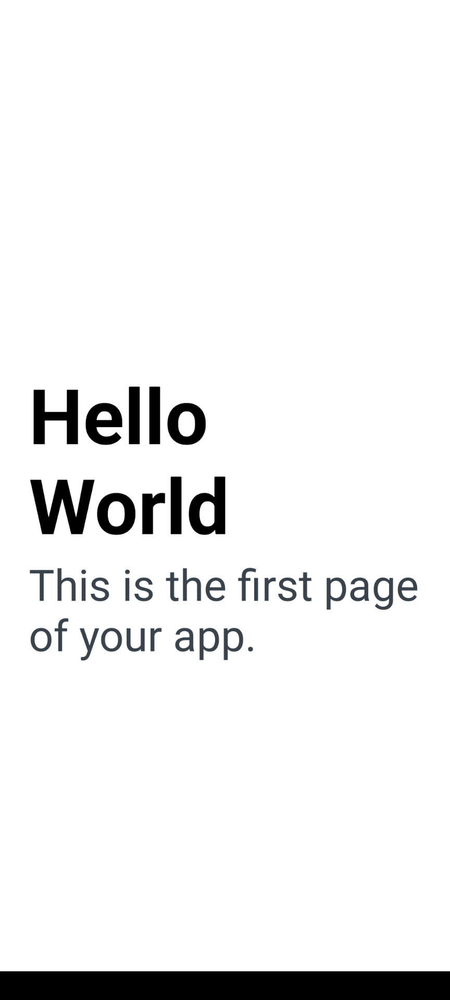
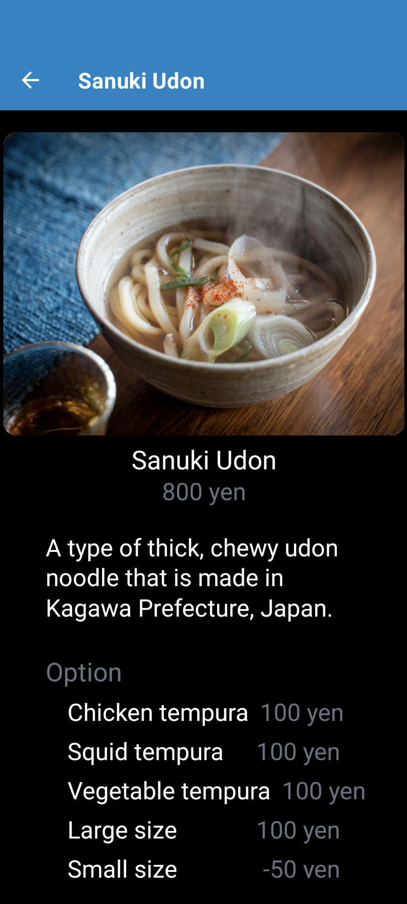

# ภาคปฏิบัติ(hands-on) เพื่อพัฒนาแอพมือถือโดยใช้สแต็คเทคโนโลยีเว็บแอพที่มีประสบการณ์ใน hands-on ครั้งที่ 1 และ 2

## 0. บทนำ

ใน hands-on นี้ คุณจะได้ประสบการณ์การพัฒนาแอปมือถือโดยใช้เทคโนโลยีการพัฒนาเว็บแอป (โดยเฉพาะ JavaScript/TypeScript และ React) ที่ใช้ในเซสชัน hands-on ครั้งที่ 1 และ 2 เช่นเดียวกับ [1st](1st.md) และ [2nd](2nd.md) เป้าหมายหลักคือการเพลิดเพลินไปกับประสบการณ์การพัฒนาและทำให้ผู้เข้าร่วมสนใจเทคโนโลยีการพัฒนาเว็บแอป

ด้วยเหตุนี้จึงไม่ได้อธิบายให้ละเอียดมากนัก นอกจากนี้ยังมีให้เฉพาะการเขียนโปรแกรมอย่างง่ายเท่านั้น คำแนะนำและลิงก์ไปยังไซต์อ้างอิงมีให้ในกรณีที่จำเป็น

### สิ่งที่เราจะสร้าง

โดยเรียก backend API ที่สร้างขึ้นใน [2nd](2nd.md) และแสดงข้อมูลในแอปมือถือ ฟังก์ชั่นและ UI เกือบจะเหมือนกับเว็บแอปที่พัฒนาใน [2nd](2nd.md)

### สแต็คเทคโนโลยีหลัก

- [Javascript](https://developer.mozilla.org/en-US/docs/Web/JavaScript)/[Typescript](https://www.typescriptlang.org/)
- [React Native](https://reactnative.dev/)/[Expo](https://expo.dev/)

คำแนะนำ:

- เกี่ยวกับ React Native
  - React Native เป็น cross-platform framework สำหรับการพัฒนาแอปมือถือโดยใช้ JavaScript (TypeScript) โค้ดเพียงชิ้นเดียวสามารถใช้พัฒนาทั้งแอปพลิเคชัน iOS และ Android แม้ว่า React Native และ React.js จะมีบทบาทที่แตกต่างกัน แต่ก็มีความคล้ายคลึงกันหลายประการ เช่น สัญลักษณ์โค้ด(code notation)และแนวคิดของ component ต่างๆ
  - นอกจาก React Native แล้ว [Flutter](https://flutter.dev/) ยังเป็น cross-platform framework ยอดนิยมสำหรับการพัฒนาแอปมือถือ
    - Flutter เป็น framework ที่ใหม่กว่า React Native และความแตกต่างที่สำคัญคือภาษาโปรแกรมที่ใช้และความยืดหยุ่นในการออกแบบ
  - เมื่อเปรียบเทียบกับ native app ใช้ [Swift(iOS)](https://www.swift.org/) หรือ [Kotlin(Android)](https://kotlinlang.org/) cross-platform app มีข้อเสียคือ สามารถพัฒนาฟีเจอร์ระบบปฏิบัติการล่าสุดหรือแอพที่ซับซ้อนได้

- เกี่ยวกับ Expo
  - Expo เป็นชุดเครื่องมือสำหรับการพัฒนาแอปมือถือที่โดยใช้ React Native เมื่อใช้ Expo คุณสามารถพัฒนาแอปมือถือที่ได้ง่ายกว่า React Native เพียงอย่างเดียว
  - คุณสมบัติหลักของ Expo มีดังนี้:
    - Expo SDK
      - Expo SDK มี JavaScript API เพื่อเข้าถึงฟีเจอร์ดั้งเดิมของอุปกรณ์ เช่น กล้อง มาตรความเร่ง(accelerometers) และแผนที่
    - Expo Go
      - Expo Go เป็นแอปพลิเคชันไคลเอ็นต์บนมือถือสำหรับทดสอบแอปที่อยู่ระหว่างการพัฒนา
    - Snack
      - Snack เป็น online editor สำหรับการสร้างและดำเนินโครงการ Expo ในเบราว์เซอร์ของคุณ

## 1. การตั้งค่า

### ข้อกำหนดเบื้องต้น

- Node.js 18+ or 20+
- Code Editor (e.g., Visual Studio Code)
- [2nd](2nd.md#3-connecting-to-the-database-and-returning-data) backend API ต้องได้รับการพัฒนาในคอมพิวเตอร์ของคุณ

**หมายเหตุ**:  
คำแนะนำในการติดตั้งซอฟต์แวร์ที่จำเป็นซึ่งระบุไว้ที่นี่มีไว้สำหรับผู้ใช้ Windows  
เนื่องจากผู้ใช้เป้าหมายรายแรกของ hands-on นี้คือผู้ใช้ Windows  
โปรดทำตามขั้นตอนการติดตั้งซอฟต์แวร์สำหรับสภาพแวดล้อมของคุณเมื่อติดตั้งซอฟต์แวร์จริง

### ขั้นตอนโดยละเอียดสำหรับผู้ใช้ Windows

- ติดตั้ง Node.js
  - ดู [1st](./1st.md#1-setup)
- ติดตั้ง Visual Studio Code(VS Code)
  - ดู [1st](./1st.md#1-setup)
- ติดตั้งและกำหนดค่าส่วนขยาย VS Code
  - ดู [2st](2nd.md#1-setup)
- ติดตั้ง Expo Go
  - [Expo Go](https://expo.dev/client) ใช้เพื่อทดสอบแอปบนมือถือ Expo Go ช่วยให้คุณสามารถเรียกใช้แอพมือถือที่คุณกำลังพัฒนาบนอุปกรณ์ของคุณได้ทันที (Android, iOS)คุณสามารถดาวน์โหลดได้จาก Google Play หรือ App Store ทั้งนี้ขึ้นอยู่กับอุปกรณ์ที่คุณมี (คุณสามารถดูลิงก์ได้ที่ [เว็บไซต์ Expo Go อย่างเป็นทางการ](https://expo.dev/client))

## 2. การพัฒนาแอพมือถือ

### การสร้างโครงการ Expo

ในเทอร์มินัล (command prompt, PowerShell, WSL bash) ให้ย้ายไปยังไดเร็กทอรี `dish-delight` ที่คุณสร้างใน [2nd](2nd.md#1-setup) ตรวจสอบให้แน่ใจว่าคุณอยู่ในไดเร็กทอรี 'dish-delight' จากนั้นเรียกใช้คำสั่งต่อไปนี้

```sh
npx create-expo-app mobile  -t blank-typescript@49 
```

**หมายเหตุ**:  
hands-on นี้จะใช้ Expo SDK49, Expo SDK ได้รับการอัปเดตปีละ 3 ครั้ง เวอร์ชันถัดไป SDK50 มีการเปลี่ยนแปลงล่าสุดและฟีเจอร์ใหม่มากมาย ดังนั้นโปรดตรวจสอบเว็บไซต์อย่างเป็นทางการล่าสุดเพื่อการพัฒนาจริง

### ติดตั้งไลบรารี่ที่จำเป็น

ติดตั้งไลบรารี่ที่จำเป็น  
รันคำสั่งต่อไปนี้

```sh
cd mobile
npx expo install expo-router react-native-safe-area-context react-native-screens expo-linking expo-constants expo-status-bar react-native-gesture-handler
npm install react-native-paper
```

คำแนะนำ:

- เกี่ยวกับ [Expo Router](https://docs.expo.dev/router/introduction/)
  - ใน hands-on นี้ เราจะใช้ Expo Router สำหรับการกำหนดเส้นทาง(routing) Expo Router เป็นเราเตอร์แบบไฟล์สำหรับ React Native และเว็บแอป
    - โดยใช้แนวคิดที่ว่าเมื่อคุณเพิ่มไฟล์ลงในไดเร็กทอรีของแอป ไฟล์นั้นจะกลายเป็นรากของการนำทางโดยอัตโนมัติ นี่เป็นแนวคิดเดียวกับที่ใช้โดย [Next.js](https://nextjs.org/)
  - Expo Router ใช้ [React Navigation](https://reactnavigation.org/) และนำเสนอฟังก์ชันการทำงานหลักที่เหมือนกัน แต่มีแนวทางที่แตกต่างออกไป
  - ในทางกลับกัน React Navigation ได้รับการออกแบบมาสำหรับแอปพลิเคชันมือถือ และนำเสนอโมเดลการนำทางแบบสแต็กที่คล้ายกับการนำทางในแอปมือถือแบบเนทีฟ
    - หากคุณคุ้นเคยกับระบบแบบไฟล์ คุณอาจคิดว่า React Navigation มีโค้ดจำนวนมากในการกำหนดเส้นทาง
- เกี่ยวกับ [React Native Paper](https://reactnativepaper.com/)
  - React Native Paper เป็นไลบรารีสำหรับการพัฒนา UI ของแอป React Native ตามหลักการออกแบบ Material ของ Google เพื่อช่วยให้คุณสร้างแอปที่ดูดีและใช้งานง่ายได้อย่างง่ายดาย

หมายเหตุ:  
ในกรณีนี้ ไลบรารีที่จำเป็นจะถูกติดตั้งด้วยตนเอง  
อีกวิธีหนึ่งคือ `Quick Start` การติดตั้งไลบรารีที่จำเป็นและการกำหนดค่าที่จะดำเนินการในขั้นตอนถัดไปจะดำเนินการโดยอัตโนมัติ อย่างไรก็ตาม อาจมีการติดตั้งไลบรารีที่ไม่ได้ใช้ และสร้างไฟล์ที่ไม่จำเป็น  
สำหรับคุณสมบัติที่จะพัฒนาในครั้งนี้ ให้เลือกการติดตั้งด้วยตนเองเนื่องจากถือว่าใช้เวลาน้อยกว่าและมีผลกระทบน้อยกว่า หากคุณต้องการทราบรายละเอียดเพิ่มเติมเกี่ยวกับวิธีการติดตั้ง โปรดตรวจสอบ [เว็บไซต์อย่างเป็นทางการ](https://docs.expo.dev/router/installation/)

### ปรับเปลี่ยนการตั้งค่า

ปรับเปลี่ยนการตั้งค่าที่จำเป็นโดยการแนะนำ Expo Router

หมายเหตุ:  
เฉพาะส่วนที่จำเป็นเท่านั้นที่ได้รับการปรับเปลี่ยนสำหรับ hands-on นี้ สำหรับการพัฒนาจริง โปรดตรวจสอบ [เว็บไซต์อย่างเป็นทางการ](https://docs.expo.dev/router/installation/) เพื่อดูการตั้งค่าที่จำเป็น

#### ปรับเปลี่ยนจุดเข้า(entry point)

ปรับเปลี่ยนจุดเข้า เปิด `dish-delight/mobile/package.json` และแก้ไขค่าของ `"main"` ในบรรทัดที่ 4 ดังนี้

```json
  "main": "expo-router/entry",
```

`dish-delight/mobile/package.json` ทั้งหมดจะมีลักษณะดังนี้

หมายเหตุ:  
เวอร์ชันรองของไลบรารี (เช่น ส่วน `49.XX.XX` ของ `"expo"`) จะแตกต่างกันไปขึ้นอยู่กับเวลาในการติดตั้ง ดังนั้นค่าจะไม่เหมือนกันทุกประการ

```json
{
  "name": "mobile",
  "version": "1.0.0",
  "main": "expo-router/entry",
  "scripts": {
    "start": "expo start",
    "android": "expo start --android",
    "ios": "expo start --ios",
    "web": "expo start --web"
  },
  "dependencies": {
    "expo": "~49.0.18",
    "expo-constants": "~14.4.2",
    "expo-linking": "~5.0.2",
    "expo-router": "^2.0.0",
    "expo-status-bar": "~1.6.0",
    "react": "18.2.0",
    "react-native": "0.72.6",
    "react-native-gesture-handler": "~2.12.0",
    "react-native-paper": "^5.11.6",
    "react-native-safe-area-context": "4.6.3",
    "react-native-screens": "~3.22.0"
  },
  "devDependencies": {
    "@babel/core": "^7.20.0",
    "@types/react": "~18.2.14",
    "typescript": "^5.1.3"
  },
  "private": true
}
```

#### ปรับเปลี่ยนการตั้งค่าโครงการ

เปิด `dish-delight/mobile/app.json` และแทนที่เนื้อหาด้วยโค้ดต่อไปนี้:  

```json
{
  "expo": {
    "name": "mobile",
    "slug": "mobile",
    "scheme": "dish-delight",
    "version": "1.0.0",
    "orientation": "portrait",
    "icon": "./assets/icon.png",
    "userInterfaceStyle": "light",
    "splash": {
      "image": "./assets/splash.png",
      "resizeMode": "contain",
      "backgroundColor": "#ffffff"
    },
    "assetBundlePatterns": ["**/*"],
    "ios": {
      "supportsTablet": true
    },
    "android": {
      "adaptiveIcon": {
        "foregroundImage": "./assets/adaptive-icon.png",
        "backgroundColor": "#ffffff"
      }
    },
    "web": {
      "favicon": "./assets/favicon.png"
    },
    "plugins": ["expo-router"]
  }
}
```

#### ปรับเปลี่ยน babel.config.js

เปิด `dish-delight/mobile/babel.config.js` และแทนที่เนื้อหาด้วยโค้ดต่อไปนี้:

```js
module.exports = function (api) {
  api.cache(true);
  return {
    presets: ['babel-preset-expo'],
    plugins: ['expo-router/babel'],
  };
};
```

คำแนะนำ:

- babel.config.js คืออะไร?
  - [Babel](https://babeljs.io/docs/) เป็นเครื่องมือ (transpiler) ที่แปลง JavaScript ล่าสุด (ES2015+) ให้เป็นรูปแบบที่สามารถเรียกใช้บนเบราว์เซอร์รุ่นเก่าได้
  - [babel.config.js](https://babeljs.io/docs/configuration) เป็นไฟล์การกำหนดค่าสำหรับ Babel ที่มีการตั้งค่าที่ควบคุมวิธีการแปลงโค้ด JavaScript ซึ่งช่วยให้โค้ดทำงานในเบราว์เซอร์รุ่นเก่าได้ในขณะที่ยังคงใช้คุณสมบัติ JavaScript ล่าสุด

### เริ่มเซิร์ฟเวอร์การพัฒนา

เริ่มต้นเซิร์ฟเวอร์การพัฒนาด้วยแอปเริ่มต้นและตรวจสอบว่าสามารถเริ่มแอปบนอุปกรณ์ของคุณได้

รันคำสั่งต่อไปนี้

```sh
npm run start -c
```

เชื่อมต่ออุปกรณ์ iOS หรือ Android ที่ติดตั้งแอป Expo Go เข้ากับเครือข่ายไร้สายเดียวกันกับคอมพิวเตอร์ที่คุณใช้งานอยู่  
สำหรับ Android ให้ใช้แอป Expo Go เพื่อสแกนโค้ด QR ที่แสดงบนเทอร์มินัลของคอมพิวเตอร์และเปิดโปรเจ็กต์ สำหรับ iOS ให้ใช้แอปกล้องเริ่มต้นของ iOS สแกนโค้ด QR และเปิดโปรเจ็กต์

ตรวจสอบว่าหน้าจอเริ่มต้นของ Expo Router ที่แสดงด้านล่างปรากฏขึ้น เมื่อปรากฏขึ้น ให้กดปุ่ม `touch app/index.js` ที่ด้านล่าง


ตรวจสอบให้แน่ใจว่าเมื่อคุณกดปุ่ม `touch app/index.js` คุณจะได้รับสิ่งต่อไปนี้

- เปลี่ยนเป็นหน้าจอต่อไปนี้
- เมื่อคุณกลับไปที่ VSCode ควรสร้าง `dish-delight/mobile/app/index.tsx`



### ปรับแต่งรูปภาพ เช่น หน้าจอเริ่มต้น(splash screen)

เปลี่ยนหน้าจอเริ่มต้น โลโก้แอป ฯลฯ ที่แสดงเมื่อเปิดแอปเป็นเวอร์ชัน hands-on นี้ นอกจากนี้ รับและวางโลโก้ของแต่ละร้าน (ไฟล์รูปภาพเดียวกันกับใน [2nd](2nd.md#2-frontend-only-home-and-menu-list-and-menu-detail-screen-implementation)).

รูปภาพเป้าหมายทั้งหมดควรได้รับจาก [Github Repository](https://github.com/minakamoto/pschs2023/tree/main/docs/static/img/3rd/assets) 7 ไฟล์ต่อไปนี้  

- adaptive-icon.png
- aroy_logo.jpeg
- buono_logo.jpeg
- icon_jojo.png
- logo_jojo.png
- sakura_tei_logo.jpeg
- splash_jojo.png

วาง (เขียนทับ) ไฟล์ที่ดาวน์โหลดด้านบนใน `dish-delight/mobile/assets`  

เปิด `dish-delight/mobile/app.json` และแทนที่เนื้อหาด้วยโค้ดต่อไปนี้:

```json
{
  "expo": {
    "name": "Jojo University Cafeteria",
    "slug": "jojoUnivCafe",
    "scheme": "dish-delight",
    "version": "1.0.0",
    "orientation": "portrait",
    "icon": "./assets/icon_jojo.png",
    "userInterfaceStyle": "light",
    "splash": {
      "image": "./assets/splash_jojo.png",
      "resizeMode": "contain",
      "backgroundColor": "#000000"
    },
    "assetBundlePatterns": ["**/*"],
    "ios": {
      "supportsTablet": true
    },
    "android": {
      "adaptiveIcon": {
        "foregroundImage": "./assets/adaptive-icon.png",
        "backgroundColor": "#ffffff"
      }
    },
    "web": {
      "favicon": "./assets/favicon.png"
    },
    "plugins": ["expo-router"]
  }
}
```

เปิดแอปมือถืออีกครั้งด้วย Expo GO บนอุปกรณ์ของคุณ และตรวจสอบว่าหน้าจอเริ่มต้น(splash screen) เปลี่ยนแปลงเมื่อเปิดแอป


คำแนะนำ:

- วิธี reload แอพมือถือบน Expo GO
  1. กด `r` บนเทอร์มินัลระหว่างการเริ่มต้นเซิร์ฟเวอร์การพัฒนาแอปมือถือ (`npm run start`)
  1. ขณะที่เซิร์ฟเวอร์การพัฒนาแอปมือถือกำลังทำงาน (`npm run start`) ให้กด `j` บนเทอร์มินัลเพื่อเริ่ม DevTool ของ Expo GO (หรือ debugger) แล้วกดปุ่ม `Reload`
  1. เขย่าอุปกรณ์ของคุณ (Android: เขย่าในแนวตั้ง, iOS: เขย่าเบา ๆ หรือสัมผัสหน้าจอด้วย 3 นิ้ว) เปิด Expo GO DevTool (หรือ debugger) แล้วกดปุ่ม `Reload`
  - หากต้องการข้อมูลเพิ่มเติม โปรดดูที่ [เว็บไซต์ Expo อย่างเป็นทางการ](https://docs.expo.dev/debugging/tools/#developer-menu)
- DevTool ของ Expo GO มีคุณสมบัติที่หลากหลาย รวมถึงความสามารถในการแก้ไขจุดบกพร่องด้วย Chrome Devtool หากคุณสนใจ โปรดดูที่ [เว็บไซต์ Expo อย่างเป็นทางการ](https://docs.expo.dev/debugging/tools/)

### การสร้างหน้าจอสามหน้าจอที่แสดงข้อความคงที่และการเปลี่ยนภาพ

เช่นเดียวกับ [2nd](2nd.md) มีสามหน้าจอที่สร้างขึ้นด้วย hands-on นี้: Home, Menu List, Menu Detail ตอนแรก เรามาสัมผัสประสบการณ์การพัฒนาการเปลี่ยนหน้าจอมือถือกันก่อน: ก่อนที่จะรับข้อมูลจาก API และ สร้างหน้าจอตามนั้น เราจะสร้างการเปลี่ยนหน้าจอสำหรับทั้งสามหน้าจอ แสดงเฉพาะข้อความคงที่

เปิด `dish-delight/mobile/app/index.tsx` และแทนที่เนื้อหาด้วยโค้ดต่อไปนี้:

```tsx
import { Link } from "expo-router";
import { StyleSheet, View } from "react-native";

export default function Home() {
  return (
    <View style={styles.container}>
      <Link
        style={styles.title}
        href={{
          pathname: "/stores/[storeId]",
          // Fixed values are passed to params for the only purpose of experiencing screen transitions.
          params: { storeName: "Sakura-tei", storeId: "1" },
        }}
      >
        Sakura-tei
      </Link>
    </View>
  );
}

const styles = StyleSheet.create({
  container: {
    flex: 1,
    alignItems: "center",
    justifyContent: "center",
    padding: 24,
  },
  title: {
    fontSize: 36,
    fontWeight: "bold",
  },
});

```

เปิดแอปมือถือใน Expo GO และตรวจสอบว่าหน้าจอต่อไปนี้ปรากฏขึ้น


นอกจากนี้ ตรวจสอบให้แน่ใจว่าหน้าจอข้อผิดพลาดเริ่มต้น (`Unmatched Route`) ปรากฏขึ้นเมื่อคุณแตะ `Sakura-tei`


หลังจากหน้าจอข้อผิดพลาดปรากฏขึ้น ให้ปัดไปทางซ้ายเพื่อกลับไปยังหน้าจอ Home ที่แสดง `Sakura-tei`

สร้างไฟล์ `dish-delight/mobile/app/stores/[storeId]/index.tsx` และแทนที่เนื้อหาด้วยโค้ดต่อไปนี้:

```tsx
import { Link } from "expo-router";
import { StyleSheet, View } from "react-native";

export default function StoreMenu() {
  return (
    <View style={styles.container}>
      <Link
        style={styles.title}
        href={{
          pathname: "/stores/[storeId]/menus/[menuId]",
          params: { storeId: "1", menuName: "ramen", menuId: "1" },
        }}
      >
        Soy sauce ramen
      </Link>
    </View>
  );
}

const styles = StyleSheet.create({
  container: {
    flex: 1,
    alignItems: "center",
    justifyContent: "center",
    padding: 24,
  },
  title: {
    fontSize: 36,
    fontWeight: "bold",
  },
});

```

สร้างไฟล์ `dish-delight/mobile/app/stores/[storeId]/menus/[menuId]/index.tsx` และแทนที่เนื้อหาด้วยโค้ดต่อไปนี้:

```tsx
import { StyleSheet, Text, View } from "react-native";

export default function MenuDetail() {
  return (
    <View style={styles.container}>
      <Text style={styles.title}>Menu Detail</Text>
    </View>
  );
}

const styles = StyleSheet.create({
  container: {
    flex: 1,
    alignItems: "center",
    justifyContent: "center",
    padding: 24,
  },
  title: {
    fontSize: 36,
    fontWeight: "bold",
  },
});
```

เปิดแอปมือถือใน Expo GO และตรวจสอบว่าสามหน้าจอต่อไปนี้สามารถแสดงและเปลี่ยนได้ (แตะข้อความคงที่หรือการปัด)

| Home  | Menu List  | Menu Detail |
| --- | --- | --- |
|  |  |  |

### สร้าง Navbar ที่แสดงข้อความคงที่

สร้าง Navbar ที่สอดคล้องกับสามหน้าจอที่แสดงข้อความคงที่ที่สร้างก่อนหน้านี้

สร้างไฟล์ `dish-delight/mobile/app/_layout.tsx` และแทนที่เนื้อหาด้วยโค้ดต่อไปนี้:

```tsx
import { Stack } from "expo-router";

export default function Layout() {
  return (
    <Stack
      initialRouteName="Home"
      // common setting
      screenOptions={{
        headerStyle: {
          backgroundColor: "#0284c7",
        },
        headerTintColor: "#fff",
        headerTitleStyle: {
          fontWeight: "bold",
        },
      }}
    />
  );
}
```

เปิด `dish-delight/mobile/app/index.tsx` และแทนที่เนื้อหาด้วยโค้ดต่อไปนี้:

```tsx
import { Link, Stack } from "expo-router";
import { StyleSheet, View } from "react-native";

export default function Home() {
  return (
    <View style={styles.container}>
      <Stack.Screen options={{ title: "Home" }} />
      <Link
        style={styles.title}
        href={{
          pathname: "/stores/[storeId]",
          // Fixed values are passed to params for the purpose of experiencing screen transitions only.
          params: { storeName: "Sakura-tei", storeId: "1" },
        }}
      >
        Sakura-tei
      </Link>
    </View>
  );
}

const styles = StyleSheet.create({
  container: {
    flex: 1,
    alignItems: "center",
    justifyContent: "center",
    padding: 24,
  },
  title: {
    fontSize: 36,
    fontWeight: "bold",
  },
});
```

คำแนะนำ:  
ความแตกต่างเพียงอย่างเดียวใน index.tsx สำหรับแต่ละหน้าจอคือส่วนต่อไปนี้

```tsx
<Stack.Screen options={{ ... }} />
```

เปิด `dish-delight/mobile/app/stores/[storeId]/index.tsx` และแทนที่เนื้อหาด้วยโค้ดต่อไปนี้:

```tsx
import { Link, Stack } from "expo-router";
import { StyleSheet, View } from "react-native";

export default function StoreMenu() {
  return (
    <View style={styles.container}>
      <Stack.Screen
        options={{
          title: "Sakura-tei",
        }}
      />
      <Link
        style={styles.title}
        href={{
          pathname: "/stores/[storeId]/menus/[menuId]",
          params: { storeId: "1", menuName: "ramen", menuId: "1" },
        }}
      >
        Soy sauce ramen
      </Link>
    </View>
  );
}

const styles = StyleSheet.create({
  container: {
    flex: 1,
    alignItems: "center",
    justifyContent: "center",
    padding: 24,
  },
  title: {
    fontSize: 36,
    fontWeight: "bold",
  },
});

```

เปิด `dish-delight/mobile/app/stores/[storeId]/menus/[menuId]/index.tsx` และแทนที่เนื้อหาด้วยโค้ดต่อไปนี้:

```tsx
import { Stack } from "expo-router";
import { StyleSheet, Text, View } from "react-native";

export default function MenuDetail() {
  return (
    <View style={styles.container}>
      <Stack.Screen
        options={{
          title: "Soy sauce ramen",
        }}
      />
      <Text style={styles.title}>Menu Detail</Text>
    </View>
  );
}

const styles = StyleSheet.create({
  container: {
    flex: 1,
    alignItems: "center",
    justifyContent: "center",
    padding: 24,
  },
  title: {
    fontSize: 36,
    fontWeight: "bold",
  },
});

```

เปิดแอปมือถือใน Expo GO แล้วตรวจสอบทั้งสามหน้าจอดังนี้

| Home  | Menu List  | Menu Detail |
| --- | --- | --- |
|  |  |  |

### เปลี่ยน Navbar บนหน้าจอ Home

เปิด `dish-delight/mobile/app/index.tsx` และแทนที่เนื้อหาด้วยโค้ดต่อไปนี้:

```tsx
import { Stack } from "expo-router";
import { Image, StyleSheet, View } from "react-native";
import { Text } from "react-native-paper";

function LogoTitle() {
  return (
    <View style={styles.logoContainer}>
      <Image
        style={styles.logoImage}
        source={require("./../assets/logo_jojo.png")}
      />
      <Text style={styles.logoText}>Jojo University Cafeteria</Text>
    </View>
  );
}

export default function Home() {
  return (
    <View style={styles.container}>
      <Stack.Screen
        options={{
          // refs. https://reactnavigation.org/docs/headers#setting-the-header-title
          title: "Jojo Univ Cafeteria's Home",
          // refs. https://reactnavigation.org/docs/headers#replacing-the-title-with-a-custom-component
          headerTitle: () => <LogoTitle />,
        }}
      />
      <Text variant="headlineMedium" style={styles.title}>
        Welcome to Jojo University Cafeteria!
      </Text>
      <Text variant="titleMedium" style={styles.subTitle}>
        Select the store where you would like to see the menu
      </Text>
    </View>
  );
}

const styles = StyleSheet.create({
  container: {
    flex: 1,
    backgroundColor: "black",
  },
  title: {
    textAlign: "center",
    marginTop: 32,
    color: "#fff",
  },
  subTitle: {
    textAlign: "center",
    marginTop: 10,
    marginBottom: 20,
    marginHorizontal: 6,
    color: "#6b7280",
  },
  logoContainer: {
    flexDirection: "row",
    width: "100%",
  },
  logoImage: {
    width: 50,
    height: 50,
    alignSelf: "flex-start",
  },
  logoText: {
    textAlignVertical: "center",
    marginVertical: 10, // for iOS
    paddingStart: 8,
    fontWeight: "bold",
    fontSize: 18,
    color: "#fff",
  },
});
```

เปิดแอปมือถือใน Expo GO และตรวจสอบว่าหน้าจอต่อไปนี้ปรากฏขึ้น (แสดงเฉพาะ Navbar และข้อความคงที่)  


### สร้างการเรียก API บนฝั่งมือถือด้วยข้อมูลคงที่

ใน [2nd](2nd.md) แต่ละ component หน้าจอมีข้อมูลและประเภทคงที่ก่อน และหลังจากการ refactoring component ที่เรียก API ถูกสร้างขึ้น อย่างไรก็ตาม ในครั้งนี้ เราสร้าง component การเรียก API ด้วยข้อมูลคงที่ก่อน (โค้ดเดียวกันกับใน [2nd](2nd.md))  
หากคุณไม่เข้าใจกระบวน refactoring ดูที่ [2nd](2nd.md)

สร้างไฟล์ `dish-delight/mobile/lib/api.tsx` และแทนที่เนื้อหาด้วยโค้ดต่อไปนี้:

```tsx
// dish-delight/frontend/lib/api.tsx

export type Store = {
  id: number;
  name: string;
  img: string;
  category: string;
};

const stores: Store[] = [
  {
    id: 1,
    name: "Sakura-tei",
    img: "/sakura_tei_logo.jpeg",
    category: "Japanese",
  },
  {
    id: 2,
    name: "Aroy",
    img: "/aroy_logo.jpeg",
    category: "Thai",
  },
  {
    id: 3,
    name: "Buono",
    img: "/buono_logo.jpeg",
    category: "Italian",
  },
];

// type definition of menu
export type Menu = {
  id: number;
  storeId: number;
  name: string;
  img: string;
  author: string;
  price: string;
  description: string;
  options?: Option[];
};

// type definition of menu's option
type Option = {
  name: string;
  price: string;
};

const menus = [
  {
    id: 1,
    storeId: 1,
    name: "Soy sauce ramen",
    img: "https://images.unsplash.com/photo-1632709810780-b5a4343cebec",
    author: "@5amramen",
    price: "900 yen",
    description:
      "A classic Japanese ramen noodle soup that is made with a soy sauce-based broth.",
    options: [
      {
        name: "Extra noodles",
        price: "100 yen",
      },
      {
        name: "Extra char siu",
        price: "100 yen",
      },
      {
        name: "Barikata(very hard noodles)",
        price: "0 yen",
      },
    ],
  },
  {
    id: 2,
    storeId: 1,
    name: "Sanuki Udon",
    img: "https://images.unsplash.com/photo-1618841557871-b4664fbf0cb3",
    author: "@jinomono",
    price: "800 yen",
    description:
      "A type of thick, chewy udon noodle that is made in Kagawa Prefecture, Japan.",
    options: [
      {
        name: "Chicken tempura",
        price: "100 yen",
      },
      {
        name: "Squid tempura",
        price: "100 yen",
      },
      {
        name: "Vegetable tempura",
        price: "100 yen",
      },
      {
        name: "Large size",
        price: "100 yen",
      },
      {
        name: "Small size",
        price: "-50 yen",
      },
    ],
  },
  {
    id: 3,
    storeId: 1,
    name: "Zaru soba",
    img: "https://images.unsplash.com/photo-1519984388953-d2406bc725e1",
    author: "@gaspanik",
    price: "1,000 yen",
    description: "A cold soba noodle dish served with a dipping sauce.",
    options: [
      {
        name: "Large size",
        price: "200 yen",
      },
    ],
  },
  {
    id: 4,
    storeId: 1,
    name: "Spicy Miso Ramen",
    img: "https://images.unsplash.com/photo-1637024696628-02cb19cc1829",
    author: "@5amramen",
    price: "900 yen",
    description: "A spicy miso ramen with a rich and flavorful broth.",
    options: [
      {
        name: "Large size",
        price: "100 yen",
      },
      {
        name: "Extra char siu",
        price: "100 yen",
      },
      {
        name: "Seasoned egg",
        price: "100 yen",
      },
    ],
  },
  {
    id: 8,
    storeId: 2,
    name: "Khao soi",
    img: "https://images.unsplash.com/photo-1569562211093-4ed0d0758f12",
    author: "@ural_8_low",
    price: "60 baht",
    description:
      "Khao Soi is a Northern Thai curry noodle soup with a rich and flavorful broth.",
  },
];

export async function getStores(): Promise<Store[]> {
  return stores;
}

export async function getStore(storeId: number): Promise<Store | undefined> {
  return stores.find((store) => store.id === storeId);
}

export async function getMenus(storeId: number): Promise<Menu[]> {
  return menus.filter((menu) => menu.storeId === storeId);
}

export async function getMenu(
  storeId: number,
  menuId: number
): Promise<Menu | undefined> {
  return menus.find((menu) => menu.storeId === storeId && menu.id === menuId);
}
```

### Implement a component for when no data exists

As with API calls, the componentization is done first, although it was done after the refactoring in [2nd](2nd.md).  
If you do not understand the refactoring process, please refer to [2nd](2nd.md).

สร้างไฟล์ `dish-delight/mobile/lib/constants.ts` และแทนที่เนื้อหาด้วยโค้ดต่อไปนี้:

```ts
// dish-delight/mobile/lib/constants.ts

export const DATA_NOT_FOUND_MESSAGE = {
  // This message is not used because frontend and data are not executed on each Screen, but are passed between screens (difference between Next.js and React Native/Expo).
  STORE: "The store does not exist, please select the store again from HOME.",
  MENU: "The menu for that store does not exist, please select the store again from HOME.",
};
```

สร้างไฟล์ `dish-delight/mobile/components/DataNotFound.tsx` และแทนที่เนื้อหาด้วยโค้ดต่อไปนี้:

```tsx
// dish-delight/mobile/components/DataNotFound.tsx

import { StyleSheet, View } from "react-native";
import { Text } from "react-native-paper";

type DataNotFoundProps = {
  message: string;
};

// The message will be passed on from the caller.
export default function DataNotFound({ message }: DataNotFoundProps) {
  return (
    <View style={styles.notFoundContainer}>
      <Text variant="titleLarge" style={styles.notFoundText}>
        {message}
      </Text>
    </View>
  );
}

const styles = StyleSheet.create({
  notFoundContainer: {
    flex: 1,
    backgroundColor: "black",
    alignItems: "center",
    justifyContent: "center",
  },
  notFoundText: {
    textAlign: "center",
    color: "#fff",
    marginHorizontal: 10,
  },
});

```

**หมายเหตุ**:

- เกี่ยวกับการจัดการข้อยกเว้น
  - As with other hands-on, in this hands-on,  exception handling is implemented in a simplified way because the focus is on the experience of web application development. In actual development, please implement it appropriately, taking into account requirements and technical factors.

### Display the Home screen with fixed data

Like [2nd](2nd.md), it displays fixed data held on the frontend before retrieving data from the backend API.

เปิด `dish-delight/mobile/app/index.tsx` และแทนที่เนื้อหาด้วยโค้ดต่อไปนี้:

```tsx
// dish-delight/mobile/app/index.tsx

import { Stack, router } from "expo-router";
import { useEffect, useState } from "react";
import { Image, ScrollView, StyleSheet, View } from "react-native";
import { Card, Text } from "react-native-paper";
import { Store, getStores } from "../lib/api";

const assetLogoImages = [
  { name: "Sakura-tei", source: require("./../assets/sakura_tei_logo.jpeg") },
  { name: "Aroy", source: require("./../assets/aroy_logo.jpeg") },
  { name: "Buono", source: require("./../assets/buono_logo.jpeg") },
];

function getStoreImage(storeName: string) {
  const imageSource = assetLogoImages.find((image) => image.name === storeName);
  return imageSource
    ? imageSource.source
    : require("./../assets/icon_jojo.png"); // If no matching image is found
}

function LogoTitle() {
  return (
    <View style={styles.logoContainer}>
      <Image
        style={styles.logoImage}
        source={require("./../assets/logo_jojo.png")}
      />
      <Text style={styles.logoText}>Jojo University Cafeteria</Text>
    </View>
  );
}

export default function Home() {
  const [stores, setStores] = useState<Store[]>([]);

  // see. https://reactnative.dev/docs/next/network#using-fetch
  const getStoreList = async () => {
    try {
      const data = await getStores();
      setStores(data);
    } catch (error) {
      console.error(error);
    }
  };

  useEffect(() => {
    getStoreList();
  }, []);

  return (
    <ScrollView style={styles.container}>
      <Stack.Screen
        options={{
          // refs. https://reactnavigation.org/docs/headers#setting-the-header-title
          title: "Jojo Univ Cafeteria's Home",
          // refs. https://reactnavigation.org/docs/headers#replacing-the-title-with-a-custom-component
          headerTitle: () => <LogoTitle />,
        }}
      />
      <Text variant="headlineMedium" style={styles.title}>
        Welcome to Jojo University Cafeteria!
      </Text>
      <Text variant="titleMedium" style={styles.subTitle}>
        Select the store where you would like to see the menu
      </Text>
      {stores.map((store) => (
        <Card
          key={store.id}
          accessible={true}
          accessibilityLabel={`Card for${store.name}`}
          style={styles.cardContainer}
          onPress={() =>
            router.push({
              pathname: "/stores/[storeId]",
              params: { storeName: store.name, storeId: store.id },
            })
          }
        >
          <Card.Cover
            accessible={true}
            accessibilityLabel={`Cover image for${store.name}`}
            alt={`Cover image for${store.name}`}
            source={getStoreImage(store.name)}
            style={styles.cardCover}
          />
          <Card.Title
            title={store.name}
            subtitle={store.category}
            titleVariant="headlineSmall"
            subtitleVariant="titleLarge"
            titleStyle={styles.cardTitle}
            subtitleStyle={styles.cardSubTitle}
            style={{
              backgroundColor: "black",
            }}
          ></Card.Title>
        </Card>
      ))}
    </ScrollView>
  );
}

const styles = StyleSheet.create({
  container: {
    flex: 1,
    backgroundColor: "black",
  },
  title: {
    textAlign: "center",
    marginTop: 32,
    color: "#fff",
  },
  subTitle: {
    textAlign: "center",
    marginTop: 10,
    marginBottom: 20,
    marginHorizontal: 6,
    color: "#6b7280",
  },
  logoContainer: {
    flexDirection: "row",
    width: "100%",
  },
  logoImage: {
    width: 50,
    height: 50,
    alignSelf: "flex-start",
  },
  logoText: {
    textAlignVertical: "center",
    marginVertical: 10, // for iOS
    paddingStart: 8,
    fontWeight: "bold",
    fontSize: 18,
    color: "#fff",
  },
  cardContainer: {
    alignSelf: "center",
    marginBottom: 20,
    marginHorizontal: 30,
    height: 350,
    width: 370,
  },
  cardCover: {
    height: 280,
    width: 370,
  },
  cardTitle: {
    textAlign: "center",
    color: "#fff",
  },
  cardSubTitle: {
    textAlign: "center",
    color: "#6b7280",
  },
});
```

Verify the following

- Open the mobile app in Expo GO and the following screen should appear  

- Clicking on the `Sakura-tei`, `Aroy`, or `Buono` card will display the menu list screen.
  - The implementation of the menu list screen has not been changed yet, so you will see the fixed text `Soy sauce ramen` when you click on any store.

### Display the menu list screen with fixed data

Like the Home screen, the menu list screen should display fixed data held on the frontend.

เปิด `dish-delight/mobile/app/stores/[storeId]/index.tsx` และแทนที่เนื้อหาด้วยโค้ดต่อไปนี้:

```tsx
// dish-delight/mobile/app/stores/[storeId]/index.tsx

import { Stack, router, useLocalSearchParams } from "expo-router";
import { useEffect, useState } from "react";
import { FlatList, StyleSheet, View } from "react-native";
import { Menu, getMenus } from "../../../lib/api";
import { ActivityIndicator, Card } from "react-native-paper";
import DataNotFound from "../../../components/DataNotFound";
import { DATA_NOT_FOUND_MESSAGE } from "../../../lib/constants";

export default function StoreMenu() {
  // Get the parameter specified at router push.
  const params = useLocalSearchParams();
  const storeName = params.storeName as string;
  const storeId = Number(params.storeId);

  const [isLoading, setLoading] = useState(true);
  const [menus, setMenus] = useState<Menu[]>([]);

  const getMenuList = async () => {
    try {
      const data = await getMenus(storeId);
      setMenus(data);
    } catch (error) {
      console.error(error);
    } finally {
      setLoading(false);
    }
  };

  useEffect(() => {
    getMenuList();
  }, [storeId]);

  // This function is provided to Flatlist's "renderItem".
  // "renderItem" is a function that defines how each item in the list should be drawn.
  // In other words, it determines how each item in the list will look like.
  const renderCard = (item: Menu) => (
    <>
      <Card
        key={item.id}
        accessible={true}
        accessibilityLabel={`Card for${item.name}`}
        style={styles.cardContainer}
        onPress={() =>
          router.push({
            pathname: "/stores/[storeId]/menus/[menuId]",
            params: { storeId: storeId, menuName: item.name, menuId: item.id },
          })
        }
      >
        <Card.Cover
          accessible={true}
          accessibilityLabel={`Cover image for${item.name}`}
          alt={`Card image for${item.name}`}
          source={{ uri: item.img }}
          style={styles.cardCover}
        />
        <Card.Title
          title={item.name}
          subtitle={item.price}
          titleVariant="headlineSmall"
          subtitleVariant="titleLarge"
          titleStyle={styles.cardTitle}
          subtitleStyle={styles.cardSubTitle}
          style={styles.cardTitleContainer}
        ></Card.Title>
      </Card>
    </>
  );

  // If data does not exist, an error screen is displayed
  if (!isLoading && menus.length === 0) {
    return <DataNotFound message={DATA_NOT_FOUND_MESSAGE.MENU} />;
  }

  return (
    <View style={styles.container}>
      <Stack.Screen
        options={{
          title: storeName,
        }}
      />
      {isLoading ? (
        // Display Loading until data is available
        <ActivityIndicator
          size={"large"}
          color="#0284c7"
          style={styles.indicator}
        />
      ) : (
        // FlatList is a component for efficient display of long lists. It is a tool for creating scrollable lists, which is especially useful when dealing with large amounts of data.
        <FlatList
          style={styles.container}
          data={menus}
          renderItem={({ item }) => renderCard(item)}
        ></FlatList>
      )}
    </View>
  );
}

const styles = StyleSheet.create({
  container: {
    flex: 1,
    backgroundColor: "black",
  },
  indicator: {
    flex: 1,
    backgroundColor: "black",
    alignItems: "center",
    justifyContent: "center",
  },
  cardContainer: {
    alignItems: "center",
    marginHorizontal: 20,
    marginTop: 28,
    height: 350,
    backgroundColor: "black",
  },
  cardCover: {
    height: 280,
    width: 370,
  },
  cardTitleContainer: {
    backgroundColor: "black",
  },
  cardTitle: {
    textAlign: "center",
    color: "#fff",
  },
  cardSubTitle: {
    textAlign: "center",
    color: "#6b7280",
  },
});

```

ตรวจสอบเพื่อดูว่าสิ่งนี้ทำงานและมีลักษณะอย่างไร

- Clicking on the `Sakura-tei` card on the Home screen will display the menu list screen.
  - Four menus should appear.
    
- Clicking on the Card of any menu item in the menu list screen will display the menu details screen.
  - The screen still displays the fixed text, so any click on it will display "Menu Detail".
- Clicking on the `Aroy` card on the Home screen will display the menu list screen.
  - One menu should appear.
- Clicking on the `Buono` card on the Home screen will display the menu list screen.
  - Error messages should be displayed due to lack of menus.
    

### Display the menu detail screen with fixed data

Like the Home and Menu List screens, the Menu Detail screen should display fixed data held on the frontend.

เปิด `dish-delight/mobile/app/stores/[storeId]/menus/[menuId]/index.tsx` และแทนที่เนื้อหาด้วยโค้ดต่อไปนี้:

```tsx
// dish-delight/mobile/app/stores/[storeId]/menus/[menuId]/index.tsx

import { Stack, useLocalSearchParams } from "expo-router";
import { useEffect, useState } from "react";
import { StyleSheet, View } from "react-native";
import { Menu, getMenu } from "../../../../../lib/api";
import DataNotFound from "../../../../../components/DataNotFound";
import { DATA_NOT_FOUND_MESSAGE } from "../../../../../lib/constants";
import { Card, Text } from "react-native-paper";

export default function MenuDetail() {
  // Get the parameter specified at router push.
  const params = useLocalSearchParams();
  const menuName = params.menuName as string;
  const menuId = Number(params.menuId);
  const storeId = Number(params.storeId);
  const [menu, setMenu] = useState<Menu>();
  // Since there is only one data item in the menu detail screen, Loading process would be skipped.

  const getMenuDetail = async () => {
    try {
      const data = await getMenu(storeId, menuId);
      setMenu(data);
    } catch (error) {
      console.error(error);
    }
  };

  useEffect(() => {
    getMenuDetail();
  }, [storeId, menuId]);

  // If data does not exist, an error screen is displayed
  if (!menu) {
    return <DataNotFound message={DATA_NOT_FOUND_MESSAGE.MENU} />;
  }

  return (
    <View style={styles.container}>
      <Stack.Screen
        options={{
          title: menuName,
        }}
      />
      <Card
        key={menu?.id}
        style={styles.cardContainer}
        accessible={true}
        accessibilityLabel={`Card for${menu?.name}`}
      >
        <Card.Cover
          accessible={true}
          accessibilityLabel={`Cover image for${menu?.name}`}
          alt={`Card image for${menu?.name}`}
          source={{ uri: menu?.img }}
          style={styles.cardCover}
        />
        <Card.Title
          title={menu?.name}
          subtitle={menu?.price}
          titleVariant="headlineSmall"
          subtitleVariant="titleLarge"
          titleStyle={styles.cardTitle}
          subtitleStyle={styles.cardSubTitle}
          style={styles.cardTitleContainer}
        ></Card.Title>
      </Card>
      <Text variant="titleLarge" style={styles.menuDescription}>
        {menu?.description}
      </Text>
      {menu?.options && menu.options.length > 0 && (
        <View style={styles.menuOptionContainer}>
          <Text variant="headlineSmall" style={styles.menuOptionTitle}>
            Option
          </Text>
          {menu.options.map((option) => (
            // If there are options in the menu, display the number of options
            <View
              key={option.name}
              style={styles.menuOptionInnerContainer}
              accessible={true}
            >
              <Text variant="titleLarge" style={styles.menuOptionName}>
                {option.name}
              </Text>
              <Text variant="titleLarge" style={styles.menuOptionPrice}>
                {option.price}
              </Text>
            </View>
          ))}
        </View>
      )}
    </View>
  );
}

const styles = StyleSheet.create({
  container: {
    flex: 1,
    backgroundColor: "black",
  },
  cardContainer: {
    alignItems: "center",
    marginHorizontal: 20,
    marginVertical: 20,
    height: 350,
    backgroundColor: "black",
  },
  cardCover: {
    height: 280,
    width: 370,
  },
  cardTitleContainer: {
    backgroundColor: "black",
  },
  cardTitle: {
    textAlign: "center",
    color: "#fff",
  },
  cardSubTitle: {
    textAlign: "center",
    color: "#6b7280",
  },
  menuDescription: {
    color: "white",
    marginHorizontal: 42,
  },
  menuOptionContainer: {
    marginHorizontal: 42,
    marginTop: 28,
  },
  menuOptionTitle: {
    color: "#6b7280",
  },
  menuOptionInnerContainer: {
    flexDirection: "row",
    justifyContent: "space-between",
    marginHorizontal: 20,
    marginTop: 8,
  },
  menuOptionName: {
    color: "white",
  },
  menuOptionPrice: {
    color: "#6b7280",
    marginLeft: 10,
  },
});
```

ตรวจสอบเพื่อดูว่าสิ่งนี้ทำงานและมีลักษณะอย่างไร

- Click any of the menu cards on the Menu List screen to go to the Menu Details screen.
  - The appropriate menu image, description and option should be displayed.
    - Example: `Khao Soi` at the `Aroy` store (without Option)
    
    - Example: `Sanuki Udon` at the `Sakura-tei` store (with options)
    
- Error screen if store or menu does not exist
  - The image is the same as the Menu List screen

### Check the IP address of the PC you are working on and launch the backend API

Check the IP address of the PC you are working on and launch the backend API.

First, check the IP address of the PC you are working on.  
There are several ways to check the IP address, including running commands in the control panel or terminal.  
This time, when you start the mobile app development server (`npm run start`), your IP address (the `xxx.xxx.xxx.xxx.xxx.xxx` part of `Metro waiting on exp://xxx.xxx.xxx.xxx.8081`) should appear on the terminal as follows, please check it.

```sh
› Metro waiting on exp://xxx.xxx.xxx.xxx:8081
› Scan the QR code above with Expo Go (Android) or the Camera app (iOS)

› Using Expo Go
› Press s │ switch to development build

› Press a │ open Android
› Press i │ open iOS simulator
› Press w │ open web

› Press j │ open debugger
› Press r │ reload app
› Press m │ toggle menu
› Press o │ open project code in your editor

› Press ? │ show all commands
```

Next, launch the backend API.  
Open a terminal other than the one running the mobile app development server and move to the `dish-delight/backend` directory that you created in [2nd](2nd.md#1-setup). Verify that you have moved to the `dish-delight/backend` directory and run the following commands.

```sh
rye run uvicorn main:app --reload --host xxx.xxx.xxx.xxx
```

Replace `xxx.xxx.xxx.xxx.xxx` with the IP address of your PC that you have just checked.

### Modify API calls on the mobile side

Modify the API call component that was returning fixed data, to call the backend API.

เปิด `dish-delight/mobile/lib/api.tsx` และแทนที่เนื้อหาด้วยโค้ดต่อไปนี้:

```tsx
// dish-delight/mobile/lib/api.tsx

export type Store = {
  id: number;
  name: string;
  img: string;
  category: string;
};

export type Menu = {
  id: number;
  storeId: number;
  name: string;
  img: string;
  author: string;
  price: string;
  description: string;
  options?: Option[];
};

type Option = {
  name: string;
  price: string;
};

// FIXME Please set the IP address of your local PC.
const url = "http://xxx.xxx.xxx.xxx:8000";

export async function getStores(): Promise<Store[]> {
  const res = await fetch(`${url}/stores`);

  if (!res.ok) {
    // This will activate the closest `error.js` Error Boundary
    throw new Error("Failed to fetch data");
  }

  return res.json();
}

export async function getStore(storeId: number): Promise<Store | undefined> {
  const res = await fetch(`${url}/stores/${storeId}`);

  if (!res.ok) {
    // This will activate the closest `error.js` Error Boundary
    throw new Error("Failed to fetch data");
  }

  return res.json();
}

export async function getMenus(storeId: number): Promise<Menu[]> {
  const res = await fetch(`${url}/stores/${storeId}/menus`);

  if (!res.ok) {
    // This will activate the closest `error.js` Error Boundary
    throw new Error("Failed to fetch data");
  }

  return res.json();
}

export async function getMenu(
  storeId: number,
  menuId: number
): Promise<Menu | undefined> {
  const res = await fetch(`${url}/stores/${storeId}/menus/${menuId}`);

  if (!res.ok) {
    // This will activate the closest `error.js` Error Boundary
    throw new Error("Failed to fetch data");
  }

  return res.json();
}
```

Before checking the working, replace `xxx.xxx.xxx.xxx.xxx` in line 27 with the IP address of your PC that you have just checked.

ตรวจสอบเพื่อดูว่าสิ่งนี้ทำงานและมีลักษณะอย่างไร  
Try changing the store and the menu to check the operation. Since the data is being fetched from the database, it should be more than the fixed data content held in the frontend that we just checked. (e.g. the store `Buono` also has menu).

## 3. ในปิดท้าย

This concludes the hands-on session. Thank you for your time. The complete code can be found [here](https://github.com/minakamoto/pcshscr2023/tree/main/src/webapp/handson-for-catchup/src/3rd/dish-delight).
You have experienced a bit that mobile apps can be developed in the same atmosphere as web apps. If you are interested, please check the sites of the links presented or develop your own application with your own ideas.
