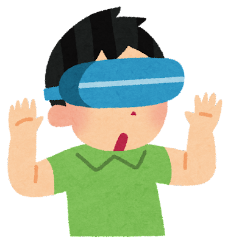

# บทนำเกี่ยวกับกรณี XR ต่างๆ

## บทนำ

เอกสารนี้มีวัตถุประสงค์เพื่อแนะนำตัวอย่างแอปพลิเคชัน XR ให้กับนักเรียนมัธยมต้นที่เรียนรู้พื้นฐานของ ICT และเพื่อส่งเสริมความสนใจในเทคโนโลยี ICT

## TIPS

### XR คืออะไร

XR ย่อมาจาก **Extensed Reality** และเป็นคำทั่วไปสำหรับเทคโนโลยีที่ผสานโลกแห่งความจริงเข้ากับโลกเสมือนจริง เพื่อให้สามารถรับรู้ถึงสิ่งที่ไม่ใช่เรื่องจริง ดังนั้นเทคโนโลยีอย่าง **VR** (Virtual Reality) **AR** (Augmented Reality) และ **MR** (Mixed Reality) รวมอยู่ใน XR

#### VR คืออะไร

**VR** ย่อมาจาก **Virtual Reality** ซึ่งเป็นเทคโนโลยีที่ช่วยให้ผู้ใช้สัมผัสกับพื้นที่เสมือนจริงโดยการปิดกั้นโลกแห่งความจริงโดยสิ้นเชิง ด้วยการสวมอุปกรณ์เช่นจอแสดงผลแบบสวมศีรษะ (HMD) หรือแว่นตา คุณจะได้สัมผัสโลกเสมือนจริงแบบ 360 องศา VR ใช้ในการเล่นเกมและฝึกซ้อม

#### AR คืออะไร

**AR** ย่อมาจาก **Augmented Reality** ซึ่งเป็นเทคโนโลยีที่เพิ่มความเป็นจริงโดยการซ้อนทับข้อมูลเสมือนจริงในโลกแห่งความเป็นจริง AR ใช้สำหรับการนำทาง การโฆษณา และแอปพลิเคชันอื่นๆ

 by Irasutoya")

#### MR คืออะไร

**MR** ย่อมาจาก **Mixed Reality** ซึ่งเป็นเทคโนโลยีที่ผสมผสานโลกจริงและโลกเสมือนเข้าด้วยกันเพื่อสร้างประสบการณ์ที่ราบรื่นและต่อเนื่องของโลกจริงและโลกเสมือนพร้อมกันโดยใช้อุปกรณ์ต่างๆ เช่น HMDs และแว่นตาอัจฉริยะ MR ใช้ในด้านการผลิต การแพทย์ ฯลฯ

XR ถูกนำมาใช้ในการเล่นเกมและความบันเทิงแล้ว และคาดว่าจะใช้ในด้านการศึกษา การแพทย์ การผลิต ธุรกิจ และสาขาอื่นๆ อีกมากมาย

### WebXR คืออะไร

WebXR เป็น API ที่ช่วยให้ผู้ใช้สัมผัสประสบการณ์เนื้อหา XR ผ่านเว็บเบราว์เซอร์ WebXR ช่วยให้สัมผัสประสบการณ์เนื้อหา XR บนอุปกรณ์หลากหลายประเภทได้อย่างง่ายดาย รวมถึงสมาร์ทโฟน แท็บเล็ต และพีซี โดยไม่จำเป็นต้องติดตั้งอุปกรณ์หรือซอฟต์แวร์พิเศษใดๆ นอกจากนี้ เนื่องจากได้รับการพัฒนาเป็นโอเพ่นซอร์ส ทุกคนจึงสามารถมีส่วนร่วมในการพัฒนาได้อย่างอิสระ และยังมีการพัฒนาฟีเจอร์และแอพพลิเคชั่นที่หลากหลายอีกด้วย

เนื่องจากคุณสมบัติเหล่านี้ WebXR จึงคาดว่าจะมีส่วนช่วยในการเผยแพร่เนื้อหา XR อย่างมาก คาดว่าเนื้อหา XR ต่างๆ ที่ใช้ WebXR จะได้รับการพัฒนาและใช้งานในด้านต่างๆ ในอนาคต

## กรณีศึกษา XR

### กรณีศึกษา 1

TBD

### กรณีศึกษา 2

TBD
