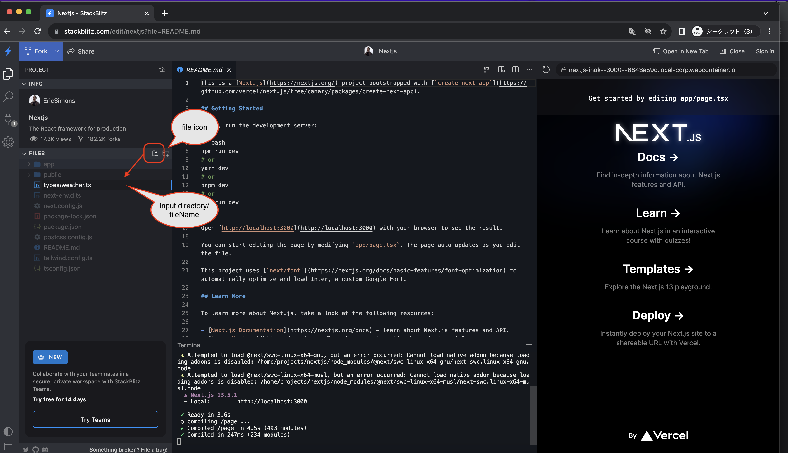
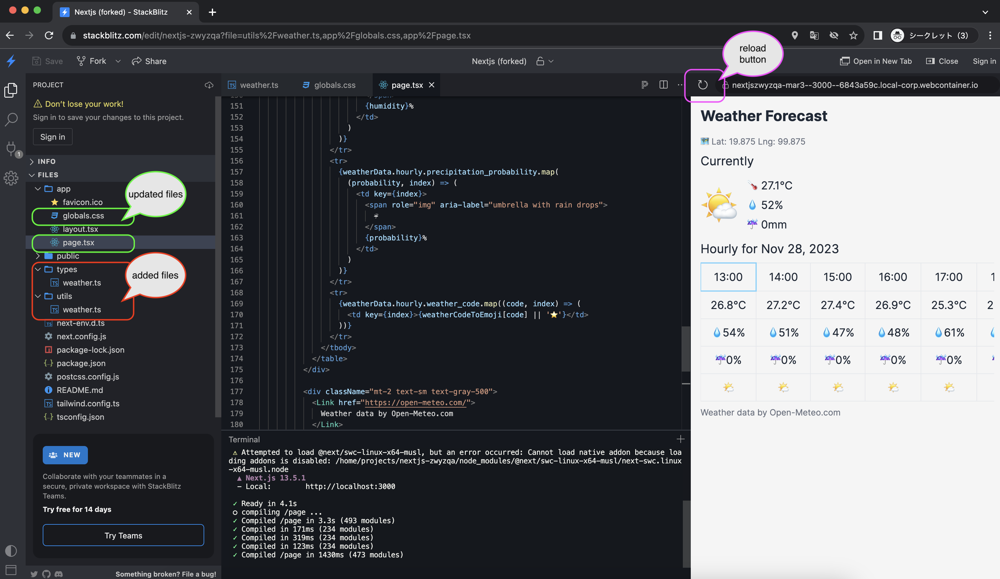

# Hands-on to developing a simple Weather Forecast app

## What we make

We will develop a simple Weather Forecast app with the following functions.

- Get current location from browser, call external API, and display on screen
  - Get the current weather and hourly weather forecast for the current day with the external API
  - The weather forecast API uses [Open-Meteo](https://open-meteo.com/).
    - No user registration is required for non-commercial use, and it can be used up to 10,000 times for free.
- Only one screen is used, and no modals are used.
- External API is a simple implementation that only makes calls and does not handle errors.

NOTE:  
When actually developing, please select an appropriate external API according to your requirements.  
In order to provide a casual experience of web application development, we focus on the convenience of hands-on participants (free of charge and no user registration required).

## Main Technology Stack

Same as [1st](./1st.md#main-technology-stack)

## Development

### Open Next.js installation configured browser-based IDE

Open the Next.js installation configured browser-based IDE [stackblitz template](https://stackblitz.com/edit/nextjs).

For a description of the stackblitz screen, see [1st](./1st.md#open-nextjs-installation-configured-browser-based-ide).

### Setting CSS

Open the file `app/globals.css` in Files in the left sidebar and replace its contents with the following code.  
Press `Ctrl + s` (or `Command + s` on the Mac) after making changes to ensure that the content is saved.

```css
@import 'tailwindcss/base';
@import 'tailwindcss/components';
@import 'tailwindcss/utilities';

body {
  @apply bg-neutral-100 text-gray-800;
}

h1 {
  @apply text-2xl font-bold mb-4;
}

h2 {
  @apply text-xl my-2;
}

p {
  @apply my-1;
}

table {
  @apply w-full text-left border-collapse;
}

th,
td {
  @apply text-lg border py-2 px-4 text-center whitespace-nowrap;
}
```

### Define the type

Define the required type for the responses returned by the external API.

Click on the file icon to the right of Files in the left sidebar and create the `types/weather.ts` file.  
  
Open the file `types/weather.ts` in Files in the left sidebar and replace its contents with the following code.  
Press `Ctrl + s` (or `Command + s` on the Mac) after making changes to ensure that the content is saved.

```ts
// define type
export type WeatherData = {
  latitude: number;
  longitude: number;
  generationtime_ms: number;
  utc_offset_seconds: number;
  timezone: string;
  timezone_abbreviation: string;
  elevation: number;
  current_units: {
    time: string;
    interval: string;
    temperature_2m: string;
    relative_humidity_2m: string;
    rain: string;
    weather_code: string;
  };
  current: {
    time: string;
    interval: number;
    temperature_2m: number;
    relative_humidity_2m: number;
    rain: number;
    weather_code: number;
  };
  hourly_units: {
    time: string;
    temperature_2m: string;
    relative_humidity_2m: string;
    precipitation_probability: string;
    weather_code: string;
  };
  hourly: {
    time: string[];
    temperature_2m: number[];
    relative_humidity_2m: number[];
    precipitation_probability: number[];
    weather_code: number[];
  };
};

```

### Define the utility

Define the objects needed to convert weather codes in responses returned by the external API to emoji.

Click on the file icon to the right of Files in the left sidebar and create the `utils/weather.ts` file.  
Open the file `utils/weather.ts` in Files in the left sidebar and replace its contents with the following code.  
Press `Ctrl + s` (or `Command + s` on the Mac) after making changes to ensure that the content is saved.

```ts
// mapping of weather codes returned in API responses and emojis
export const weatherCodeToEmoji: Record<number, string> = {
  0: "🌞", // Clear sky
  1: "🌤️", // Mainly clear, partly cloudy, and overcast
  2: "🌤️", // Mainly clear, partly cloudy, and overcast
  3: "🌤️", // Mainly clear, partly cloudy, and overcast
  45: "🌫️", // Fog and depositing rime fog
  48: "🌫️", // Fog and depositing rime fog
  51: "🌧️", // Drizzle: Light, moderate, and dense intensity
  53: "🌧️", // Drizzle: Light, moderate, and dense intensity
  55: "🌧️", // Drizzle: Light, moderate, and dense intensity
  56: "🌧️", // Freezing Drizzle: Light and dense intensity
  57: "🌧️", // Freezing Drizzle: Light and dense intensity
  61: "🌧️", // Rain: Slight, moderate and heavy intensity
  63: "🌧️", // Rain: Slight, moderate and heavy intensity
  65: "🌧️", // Rain: Slight, moderate and heavy intensity
  66: "🌧️", // Freezing Rain: Light and heavy intensity
  67: "🌧️", // Freezing Rain: Light and heavy intensity
  71: "🌨️", // Snow fall: Slight, moderate, and heavy intensity
  73: "🌨️", // Snow fall: Slight, moderate, and heavy intensity
  75: "🌨️", // Snow fall: Slight, moderate, and heavy intensity
  77: "🌨️", // Snow grains
  80: "🌧️", // Rain showers: Slight, moderate, and violent
  81: "🌧️", // Rain showers: Slight, moderate, and violent
  82: "🌧️", // Rain showers: Slight, moderate, and violent
  85: "🌨️", // Snow showers slight and heavy
  86: "🌨️", // Snow showers slight and heavy
  95: "⛈️", // Thunderstorm: Slight or moderate
  96: "⛈️", // Thunderstorm with slight and heavy hail
  99: "⛈️", // Thunderstorm with slight and heavy hail
};

```

### Developing Weather Forecast App

Open the file `app/page.tsx` in Files in the left sidebar and replace its contents with the following code.  
Press `Ctrl + s` (or `Command + s` on the Mac) after making changes to ensure that the content is saved.

```tsx
"use client";
import Link from "next/link";
import { useEffect, useRef, useState } from "react";
import { WeatherData } from "../types/weather";
import { weatherCodeToEmoji } from "../utils/weather";

const Home = () => {
  // Define current time only once at rendering
  const now = new Date();
  // round down to the nearest hour
  now.setMinutes(0);
  const currentTime = now.toLocaleTimeString([], {
    hour: "2-digit",
    minute: "2-digit",
  });
  const currentDate = now.toLocaleDateString("en-US", {
    year: "numeric",
    month: "short",
    day: "numeric",
  });

  const [weatherData, setWeatherData] = useState<WeatherData | null>(null);
  const [errorMessage, setErrorMessage] = useState("");
  const timeRefs = useRef<{ [key: string]: HTMLTableCellElement | null }>({});
  const scrollContainer = useRef<HTMLDivElement>(null);
  // Define the width of the fixed columns
  // This should be adjusted based on your actual layout
  const fixedColumnsWidth = 100;
  useEffect(() => {
    navigator.geolocation.getCurrentPosition(
      async (position) => {
        const { latitude, longitude } = position.coords;
        // Simple coding, so fetch error handling is not implemented.
        const response = await fetch(
          `https://api.open-meteo.com/v1/forecast?latitude=${latitude}&longitude=${longitude}&timezone=auto&current=temperature_2m,relative_humidity_2m,rain,weather_code&hourly=temperature_2m,relative_humidity_2m,precipitation_probability,rain,weather_code&forecast_days=1`
        );
        const data = await response.json();
        setWeatherData(data);
      },
      (error) => {
        // Error handling when location information cannot be obtained
        setErrorMessage(
          "Failed to get location information. Please check your browser settings."
        );
      }
    );
  }, []);

  // To move to the column corresponding to the current time
  useEffect(() => {
    const currentTimeColumn = timeRefs.current[currentTime];
    if (currentTimeColumn && scrollContainer.current) {
      // Calculate the scroll position
      const scrollPosition = currentTimeColumn.offsetLeft + fixedColumnsWidth;
      // Scroll to the calculated position
      scrollContainer.current.scrollLeft = scrollPosition;
    }
    timeRefs.current[currentTime]?.scrollIntoView({
      behavior: "auto",
      block: "nearest",
      inline: "start",
    });
  }, [currentTime, weatherData]);

  // Simplified message and screen if location information could not be obtained
  if (errorMessage) {
    return <p>{errorMessage}</p>;
  }

  return (
    <div className="container mx-auto p-4">
      {weatherData && (
        <div>
          <h1>Weather Forecast</h1>
          <p className="mt-2 text-sm text-gray-500">
            <span role="img" aria-label="map">
              🗺️{" "}
            </span>
            Lat: {weatherData.latitude} Lng: {weatherData.longitude}
          </p>
          <h2>Currently</h2>
          <div className="flex items-center space-x-4">
            <div className="text-6xl">
              {weatherCodeToEmoji[weatherData.current.weather_code] ||
                weatherData.current.weather_code}
            </div>
            <div className="text-lg">
              <p>
                <span role="img" aria-label="thermometer">
                  🌡️
                </span>{" "}
                {weatherData.current.temperature_2m}°C
              </p>
              <p>
                <span role="img" aria-label="droplet">
                  💧
                </span>{" "}
                {weatherData.current.relative_humidity_2m}%
              </p>
              <p>
                <span role="img" aria-label="umbrella">
                  ☔
                </span>{" "}
                {weatherData.current.rain}mm
              </p>
            </div>
          </div>

          <h2>Hourly for {currentDate}</h2>
          <div className="overflow-x-auto" ref={scrollContainer}>
            <table className="table-auto">
              <thead>
                <tr>
                  {weatherData.hourly.time.map((time, index) => {
                    const date = new Date(time);
                    const formattedTime = date.toLocaleTimeString([], {
                      hour: "2-digit",
                      minute: "2-digit",
                    });
                    // Constant definition to change the style if it is the current time
                    const isCurrent = formattedTime === currentTime;
                    return (
                      <td
                        key={time}
                        ref={(ref) => (timeRefs.current[formattedTime] = ref)}
                        className={
                          isCurrent
                            ? "border-solid border-2 border-sky-300"
                            : ""
                        }
                      >
                        {formattedTime}
                      </td>
                    );
                  })}
                </tr>
              </thead>
              <tbody>
                <tr>
                  {weatherData.hourly.temperature_2m.map((temp, index) => (
                    <td key={index}>{temp}°C</td>
                  ))}
                </tr>
                <tr>
                  {weatherData.hourly.relative_humidity_2m.map(
                    (humidity, index) => (
                      <td key={index}>
                        <span role="img" aria-label="droplet">
                          💧
                        </span>
                        {humidity}%
                      </td>
                    )
                  )}
                </tr>
                <tr>
                  {weatherData.hourly.precipitation_probability.map(
                    (probability, index) => (
                      <td key={index}>
                        <span role="img" aria-label="umbrella with rain drops">
                          ☔
                        </span>
                        {probability}%
                      </td>
                    )
                  )}
                </tr>
                <tr>
                  {weatherData.hourly.weather_code.map((code, index) => (
                    <td key={index}>{weatherCodeToEmoji[code] || "⭐"}</td>
                  ))}
                </tr>
              </tbody>
            </table>
          </div>

          <div className="mt-2 text-sm text-gray-500">
            <Link href="https://open-meteo.com/">
              Weather data by Open-Meteo.com
            </Link>
          </div>
        </div>
      )}
    </div>
  );
};

export default Home;

```

After development, the following screen is shown.



NOTE:  

- If the screen remains the same as the default Nextjs screen after development, press the refresh button on the preview screen.
- In the operation check, allow the browser to access location information.
  - During the operation check, a pop-up window will appear asking if you want to allow it or not.
  - If you do not allow it, a simple error message will appear on the screen because the latitude and longitude cannot be obtained and the external API cannot be called.
- About API Error Handling
  - Error handling is simplified in this hands-on session. For actual development, please use appropriate error handling.
    - To simplify development, no error handling is performed when calling external APIs.
    - Error handling when retrieving location information is simplified.
- Componentization
  - This hands-on is a simplified development. For actual development, it is recommended to design components appropriately.
    - For more information about components, see [hands-on materials for teachers](./teachers/1st.md) explains a little about components.

### Checking the behavior

Please check the behavior of the Todo List app on the preview screen on the right.

- Simple features
  - Latitude and longitude of the current location are displayed at the top
  - The current weather is displayed in the middle.
  - Hourly weather forecast for the current date is displayed at the bottom
    - Automatic scrolling to the column corresponding to the current time

### 終わりに

### Wrap up

This concludes the hands-on session.  
The code can be viewed [here](https://github.com/minakamoto/pcshscr2023/tree/main/src/webapp/30min-exp-web-tech/2nd/weather-foecast).  

If you are interested, follow the links above to check out the code and modify it as you like.  
[Open-Meteo](https://open-meteo.com/) allows you to get forecasts not only for the day, but also for the next 16 days. It might be a good idea to create your own 10-day weather forecast.  
It might be a good idea to create your own weather forecast application using your favorite API.
