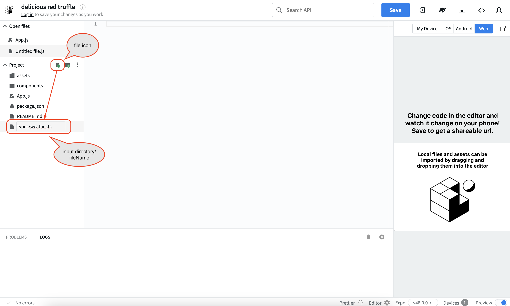

# Hands-on to developing a simple Weather Forecast Mobile app

## What we make

Develop a mobile version of a simple weather forecasting application created in [2nd](2nd.md).  
The functionality, look, conditions and notes are almost the same.

## Main Technology Stack

- [Reac Native](https://reactnative.dev/)
  - Cross-platform (Android/iOS/Web, etc.) development framework with React applied to native UI
    - Mobile apps can be developed using knowledge and experience in web development.
- [EXPO](https://expo.dev/)
  - Tools to make React Native development easier and faster
- [Typescript](https://www.typescriptlang.org/)
  - JavaScript with syntax for types

## Development

### Open React Native/Expo configured browser-based IDE

Open  configured browser-based IDE [Snack](https://snack.expo.dev/).

Snack consists of a directory of files in the left pane, file editing in the middle, and a preview screen in the right pane. At the top of the right pane, you can select the emulator of the device you want to test.

  

For reference, the case of the Android emulator is as follows.
  
Select the Android emulator and press `Tap to play` to start the installation and launch. (If you see the message `Queue...` message, please wait a moment for the installation and launch to begin)

TIPS/NOTE:  

- About Snack
  - Snack is a browser-based IDE, so there is no need to install or configure an IDE or emulator (a virtual execution environment for devices like Android) on your PC.
  - This service is designed for easy and immediate development experience, and is not suitable for full-spec feature development.
    - For actual development, please set up a development environment on your PC.
    - To build the environment, it is recommended to visit the [React Native official website](https://reactnative.dev/docs/environment-setup) or the [Expo official website](https://docs.expo.dev/get-started/installation/).

### Define the type

Define the required type for the responses returned by the external API.
(This is exactly the same code as [2nd](2nd.md#define-the-type).)

Click on the file icon to the right of Project in the left sidebar and create the `types/weather.ts` file.  

  
Open the file `types/weather.ts` in Files in the left sidebar and replace its contents with the following code.  

```ts
// define type
export type WeatherData = {
  latitude: number;
  longitude: number;
  generationtime_ms: number;
  utc_offset_seconds: number;
  timezone: string;
  timezone_abbreviation: string;
  elevation: number;
  current_units: {
    time: string;
    interval: string;
    temperature_2m: string;
    relative_humidity_2m: string;
    rain: string;
    weather_code: string;
  };
  current: {
    time: string;
    interval: number;
    temperature_2m: number;
    relative_humidity_2m: number;
    rain: number;
    weather_code: number;
  };
  hourly_units: {
    time: string;
    temperature_2m: string;
    relative_humidity_2m: string;
    precipitation_probability: string;
    weather_code: string;
  };
  hourly: {
    time: string[];
    temperature_2m: number[];
    relative_humidity_2m: number[];
    precipitation_probability: number[];
    weather_code: number[];
  };
};

```

### Define the utility

Define the objects needed to convert weather codes in responses returned by the external API to emoji.  
(This is exactly the same code as [2nd](2nd.md#define-the-utility).)

Click on the file icon to the right of Project in the left sidebar and create the `utils/weather.ts` file.  
Open the file `utils/weather.ts` in Files in the left sidebar and replace its contents with the following code.

```ts
// mapping of weather codes returned in API responses and emojis
export const weatherCodeToEmoji: Record<number, string> = {
  0: "🌞", // Clear sky
  1: "🌤️", // Mainly clear, partly cloudy, and overcast
  2: "🌤️", // Mainly clear, partly cloudy, and overcast
  3: "🌤️", // Mainly clear, partly cloudy, and overcast
  45: "🌫️", // Fog and depositing rime fog
  48: "🌫️", // Fog and depositing rime fog
  51: "🌧️", // Drizzle: Light, moderate, and dense intensity
  53: "🌧️", // Drizzle: Light, moderate, and dense intensity
  55: "🌧️", // Drizzle: Light, moderate, and dense intensity
  56: "🌧️", // Freezing Drizzle: Light and dense intensity
  57: "🌧️", // Freezing Drizzle: Light and dense intensity
  61: "🌧️", // Rain: Slight, moderate and heavy intensity
  63: "🌧️", // Rain: Slight, moderate and heavy intensity
  65: "🌧️", // Rain: Slight, moderate and heavy intensity
  66: "🌧️", // Freezing Rain: Light and heavy intensity
  67: "🌧️", // Freezing Rain: Light and heavy intensity
  71: "🌨️", // Snow fall: Slight, moderate, and heavy intensity
  73: "🌨️", // Snow fall: Slight, moderate, and heavy intensity
  75: "🌨️", // Snow fall: Slight, moderate, and heavy intensity
  77: "🌨️", // Snow grains
  80: "🌧️", // Rain showers: Slight, moderate, and violent
  81: "🌧️", // Rain showers: Slight, moderate, and violent
  82: "🌧️", // Rain showers: Slight, moderate, and violent
  85: "🌨️", // Snow showers slight and heavy
  86: "🌨️", // Snow showers slight and heavy
  95: "⛈️", // Thunderstorm: Slight or moderate
  96: "⛈️", // Thunderstorm with slight and heavy hail
  99: "⛈️", // Thunderstorm with slight and heavy hail
};

```

### Developing Weather Forecast App

Open the three-dot menu to the left of the `App.js` file in Project on the left sidebar, press `Rename to App.tsx` and rename the file. After renaming the file, replace its contents with the following code

```tsx
import React, { useEffect, useState, useRef } from "react";
import {
  StyleSheet,
  Text,
  View,
  ScrollView,
  ActivityIndicator,
  Linking,
} from "react-native";
import { WeatherData } from "./types/weather";
import { weatherCodeToEmoji } from "./utils/weather";
import * as Location from "expo-location";

export default function App() {
  const now = new Date();
  now.setMinutes(0);
  const currentTime = now.getHours(); // get current time (0-23)
  const currentDate = now.toLocaleDateString("en-US", {
    year: "numeric",
    month: "short",
    day: "numeric",
  });

  const [weatherData, setWeatherData] = useState<WeatherData | null>(null);
  const [errorMessage, setErrorMessage] = useState("");
  const scrollViewRef = useRef<ScrollView>(null);
  const [isLoading, setLoading] = useState(true);

  useEffect(() => {
    (async () => {
      let { status } = await Location.requestForegroundPermissionsAsync();
      if (status !== "granted") {
        setErrorMessage(
          "Failed to get location information. Please check your device settings."
        );
        return;
      }

      // On Snack, using the Location.getCurrentPositionAsync method would not get a response, so the Location.getLastKnownPositionAsync method was used.
      // It is usually better to use Location.getCurrentPositionAsync.
      // See. https://docs.expo.dev/versions/latest/sdk/location/#locationgetlastknownpositionasyncoptions
      const location = await Location.getLastKnownPositionAsync({});

      const { latitude, longitude } = location?.coords || {
        // If the current location could not be obtained, set the location of Tokyo Tower.
        latitude: 35.6586414931039,
        longitude: 139.74540071013897,
      };
      fetch(
        `https://api.open-meteo.com/v1/forecast?latitude=${latitude}&longitude=${longitude}&timezone=auto&current=temperature_2m,relative_humidity_2m,rain,weather_code&hourly=temperature_2m,relative_humidity_2m,precipitation_probability,rain,weather_code&forecast_days=1`
      )
        .then((response) => response.json())
        .then((data) => setWeatherData(data))
        .catch((error) => setErrorMessage(error.message))
        .finally(() => setLoading(false));
    })();
  }, []);

  const handleLayout = () => {
    const columnIndex = currentTime;
    const columnWidth = 65; // set the width of each column
    const scrollPosition = columnIndex * columnWidth; // calculate scroll position
    scrollViewRef.current?.scrollTo({
      x: scrollPosition,
      y: 0,
      animated: true,
    });
  };

  if (errorMessage) {
    return (
      <View style={styles.container}>
        <Text>Error: {errorMessage}</Text>
      </View>
    );
  }

  return (
    <>
      {isLoading ? (
        <ActivityIndicator size="large" style={styles.indicatorContainer} />
      ) : (
        <View style={styles.container}>
          <Text style={styles.title}>Weather Forecast</Text>
          {weatherData && (
            <View>
              <Text style={styles.latLngLabel}>
                🗺️ Lat: {weatherData.latitude} Lng: {weatherData.longitude}
              </Text>
              <Text style={styles.subTitle}>Currently:</Text>
              <View style={styles.currentContainer}>
                <Text style={styles.emojiLabel}>
                  {weatherCodeToEmoji[weatherData.current.weather_code]}
                </Text>
                <View style={styles.currentLabel}>
                  <Text>🌡️{weatherData.current.temperature_2m}°C </Text>
                  <Text>
                    💧
                    {weatherData.current.relative_humidity_2m}%{" "}
                  </Text>
                  <Text>☔{weatherData.current.rain}mm </Text>
                </View>
              </View>
              <Text style={styles.subTitle}>Houly for {currentDate}</Text>
              <ScrollView
                horizontal={true}
                style={styles.scrollContainer}
                ref={scrollViewRef}
                onLayout={handleLayout}
              >
                <View style={styles.table}>
                  <View style={styles.row}>
                    {weatherData.hourly.time.map((time, index) => {
                      const date = new Date(time);
                      const formattedTime = date.toLocaleTimeString([], {
                        hour12: false,
                        hour: "2-digit",
                        minute: "2-digit",
                      });
                      return (
                        <Text key={index} style={styles.cell}>
                          {formattedTime}
                        </Text>
                      );
                    })}
                  </View>
                  <View style={styles.row}>
                    {weatherData.hourly.temperature_2m.map((temp, index) => (
                      <Text key={index} style={styles.cell}>
                        {temp}°C
                      </Text>
                    ))}
                  </View>
                  <View style={styles.row}>
                    {weatherData.hourly.relative_humidity_2m.map(
                      (humidity, index) => (
                        <Text key={index} style={styles.cell}>
                          <Text>💧</Text>
                          {humidity}%
                        </Text>
                      )
                    )}
                  </View>
                  <View style={styles.row}>
                    {weatherData.hourly.precipitation_probability.map(
                      (probability, index) => (
                        <Text key={index} style={styles.cell}>
                          <Text>☔</Text>
                          {probability}%
                        </Text>
                      )
                    )}
                  </View>
                  <View style={styles.row}>
                    {weatherData.hourly.weather_code.map((code, index) => (
                      <Text key={index} style={styles.cell}>
                        {weatherCodeToEmoji[code] || "⭐"}
                      </Text>
                    ))}
                  </View>
                </View>
              </ScrollView>
              <Text
                style={styles.linkLabel}
                onPress={() => Linking.openURL("https://open-meteo.com/")}
              >
                Weather data by Open-Meteo.com
              </Text>
            </View>
          )}
        </View>
      )}
    </>
  );
}

const styles = StyleSheet.create({
  indicatorContainer: {
    flex: 1,
    justifyContent: "center",
    alignItems: "center",
  },
  container: {
    flex: 1,
    backgroundColor: "#fff",
    marginHorizontal: 20,
    paddingVertical: 50,
    paddingHorizontal: 10,
  },
  title: {
    paddingTop: 10,
    fontSize: 24,
    fontWeight: "bold",
  },
  subTitle: {
    fontSize: 18,
    paddingTop: 20,
    paddingBottom: 10,
  },
  latLngLabel: {
    paddingTop: 20,
    color: "grey",
  },
  emojiLabel: {
    fontSize: 36,
    margin: 10,
  },
  currentContainer: {
    flexDirection: "row",
    flexWrap: "wrap",
    marginBottom: 10,
  },
  currentLabel: {
    justifyContent: "space-around",
  },
  scrollContainer: {
    paddingTop: 5,
    marginTop: 5,
    marginBottom: 10,
  },
  table: {
    flexDirection: "column",
    borderTopColor: "gainsboro",
    borderTopWidth: 0.2,
  },
  row: {
    flexDirection: "row",
    borderBottomColor: "gainsboro",
    borderBottomWidth: 0.2,
  },
  cell: {
    padding: 10,
    width: 65,
    textAlign: "center",
    borderRightColor: "gainsboro",
    borderRightWidth: 0.2,
    borderLeftColor: "gainsboro",
    borderLeftWidth: 0.2,
    borderStyle: "solid",
  },
  linkLabel: {
    paddingTop: 10,
    color: "grey",
  },
});


```

You will get an error message (error that `expo-location` is not defined in the dependency settings) as shown in the following screen. Follow the message and press `Add dependency`.


In the case of the Android emulator, the following screen will be displayed after development.  


NOTE:  

- The emulator on Snack is a virtual device and may differ from your current location and time.
  - The current location and time can be found in the emulator's time, map, and settings.
  - If you want to check it in your environment, please install [Expo Go](https://expo.dev/client) on your device (Android/iOS etc.) and scan the QR code for `My Device` in Snack.
    - If you are checking on your own device and want to get a more accurate current position, you can change the code as follows.
      - before

        ```ts
        const location = await Location.getLastKnownPositionAsync({});
        const { latitude, longitude } = location?.coords || {
          latitude: 35.6586414931039,
          longitude: 139.74540071013897,
        };
        ```

      - after

        ```ts
        const location = await Location.getCurrentPositionAsync({});
        const { latitude, longitude } = location?.coords;
        ```

- In the operation check, allow the browser to access location information.
  - Same as [2nd](2nd.md#developing-weather-forecast-app), so omitted.
- About API Error Handling, Componentization
  - Same as [2nd](2nd.md#developing-weather-forecast-app), so omitted.

### Checking the behavior

Please check the behavior of the Weather Forecast app on the preview screen on the right.

- Simple features
  - Same as [2nd](2nd.md#checking-the-behavior), so omitted.

### Wrap up

This concludes the hands-on session.  
The code can be viewed [here](https://github.com/minakamoto/pcshscr2023/tree/main/src/webapp/30min-exp-web-tech/3rd/weather-forecast).  
It can also be seen on [Snack](https://snack.expo.dev/1KahnBN9w).
