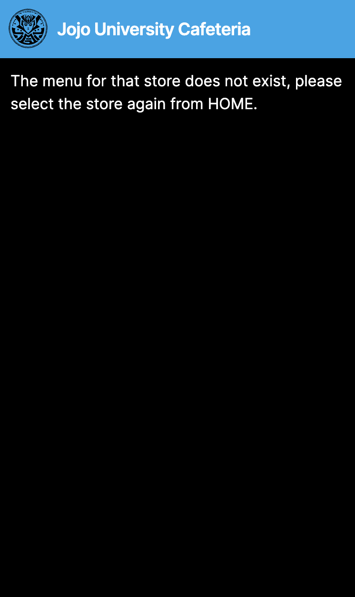
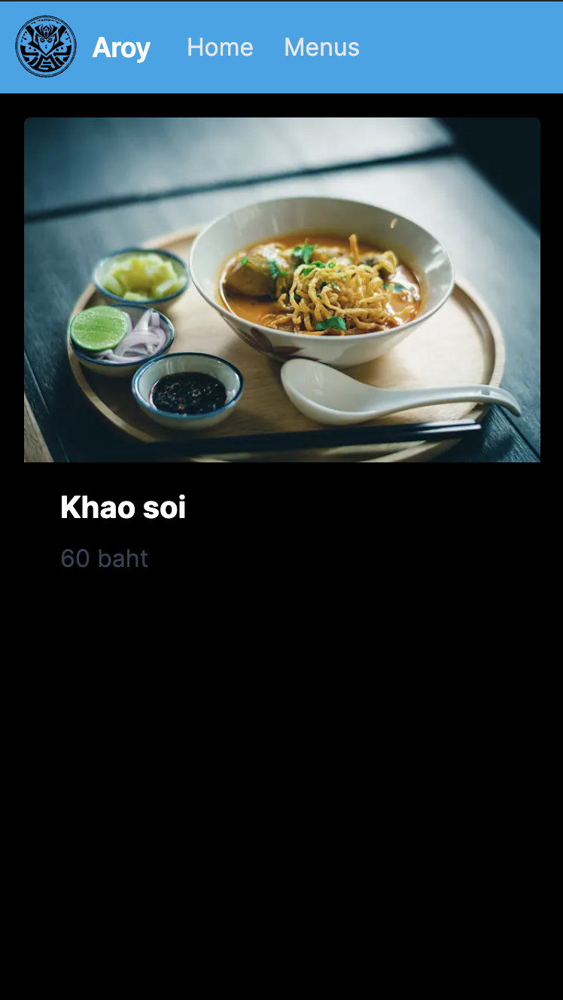
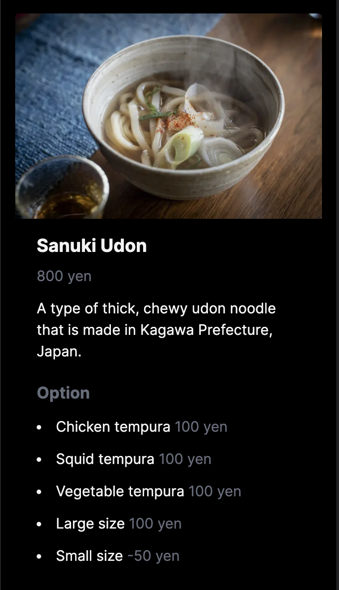

# Hands-on to develop a slightly more complex UI & own API

## 0. Introduction

The purpose and objectives of this hands-on are the same as in [1st](./1st#0-introduction) and will therefore be omitted.

### What we make

Create APIs, call them, and display that information on the screen. Build a UI that is slightly more complex than [1st](./1st).  
A concrete image is a UI that displays menus for a school cafeteria, a company cafeteria, or a booth at a neighborhood festival.

### Main Technology Stack

- [Javascript](https://developer.mozilla.org/en-US/docs/Web/JavaScript)/[Typescript](https://www.typescriptlang.org/)
- [Next.js](https://nextjs.org/)
- [Python](https://www.python.org/)
- [FastAPI](https://fastapi.tiangolo.com/)

TIPS:

- About Next.js
  - Next.js is a React-based UI framework that provides features such as SSR/SSG, file-based routing, Fast Refresh, image optimization, and zero configuration. These features speed up the loading of web pages, provide SEO-friendly structures, and improve development efficiency. Next.js is a modern and powerful frontend framework with a variety of advantages.
  - The [official React website](https://react.dev/learn/start-a-new-react-project#nextjs) also recommends Next.js for development of React apps of all sizes because of its rich features and community support.
- About FastAPI
  - FastAPI has the following features
    - Fast
      - FastAPI is based on Starlette and Uvicorn for extremely fast performance.
        - Starlette is a lightweight ASGI framework written in Python that allows building fast asynchronous services; Uvicorn is an ASGI server implementation that is very fast; FastAPI is built on top of Starlette and can be run using Uvicorn.
    - Easy
      - FastAPI uses a simple syntax that makes the code easy to read and write.
      - FastAPI can use Pydantic to perform request and response validation.
        - Pydantic is a data type safety library that allows declarative definition of data types, which helps FastAPI to build type-safe web applications.
          - Type-safe means that type errors are detected before the program is executed. This prevents runtime errors.
    - Automatic Documentation Generation
      - FastAPI can automatically generate API documentation using Swagger UI and ReDoc.
        - Swagger UI and ReDoc are tools that generate API documentation based on the OpenAPI specification.
    - Asynchronous Support
      - FastAPI supports asynchronous processing, making it easy to write asynchronous code.

**NOTE**:

- About the Python Package Manager
  - The Python package manager used in this hands-on is [rye](https://github.com/mitsuhiko/rye). It is a useful tool that can install and uninstall dependencies and manage virtual environments.
  - However, it is in Experimental status, as the following comment is stated on its official page. It is available at the time of this writing, but its availability for hands-on activities cannot be guaranteed. If it is not available, please consider using other tools such as [poetry](https://python-poetry.org/) or [pip](https://pypi.org/project/pip/).
    > An Experimental Package Management Solution for Python

## 1. Setup

### Prerequisites

- Node.js 18.17 or above
- Python 3.8 or above
- Code Editor (Visual Studio Code)

**NOTE**:  
The required software installation instructions listed here are intended for Windows users who do not use WSL.
This is because the first target users of this hands-on are Windows users who do not use  WSL. Please follow the installation procedure for your environment when actually installing the software.

### Detailed procedure for Windows users

- Install Node.js
  - See [1st](./1st#1-setup)
- Install Python
  - Go to the [official Python website](https://www.python.org/downloads/windows/) and download the latest version of Python installer (`Windows installer(64-bit)`).
  - Run the downloaded installer.
  - The installation wizard will appear. Click `Install Now` or `Customize installation`.
  - After the installation is complete, open a command prompt and run the following command to verify that Python is installed correctly.

    ```sh
    python --version
    ```

  - If Python is already installed, it can be upgraded by following the procedure above to install the latest version of Python. However, if multiple versions of Python are installed at the same time, you will need to check the environment variable settings to ensure that the appropriate version of Python is being used.
    - Open the Start menu, search for `View advanced system settings` and open it. The `System Properties` dialog will appear.
    - Click on the `Environment Variables Path` button
    - Select the `Path` variable and click the `Edit` button.
    - Add to the value of the `Path` variable the directory where the newly installed Python executable is located (usually `C:\Users\[username]\AppData\Local\Programs\Python\Python [Version]\`). If an older version already exists, overwrite it with the newer version.
    - Save your changes and restart the command prompt.
    - Verify that a new version of Python is used by running the following command

      ```sh
      python --version
      ```

- Install rye
  - Go to [rye's official website](https://rye-up.com/guide/installation/) and download the exe file for Windows (`rye-x86_64-windows.exe for 64-bit Intel Windows`), install it.
    - When the `Windows protected your PC` dialog appears, open `more info` and press the `Run anyway` button to continue.
      - As the command prompt appears, set `Windows Developer Mode` (see [rye's official website](https://rye-up.com/guide/faq/#windows-developer-mode)), then type `y` and continue. Please enter `y` to continue.
  - Register `shims` in the environment variable `Path` and increase its priority as described on [rye's official website](https://rye-up.com/guide/installation/#add-shims-to-path).
  - Save the changes and restart the command prompt.
  - Run the following command and verify that it runs, without errors.

    ```sh
      rye
    ```

- Install Visual Studio Code(VS Code)
  - See [1st](./1st#1-setup)
- Install and configure VS Code extensions

  - About Javascript, see [1st](./1st#1-setup)
    - (Option)Set up ESLint to automatically modify code on save.
      - Change the setting of `Editor: Code Actions On Save`
        - Open the VSCode settings (File > Preferences > Settings) or use the shortcut (Ctrl+,).
        - Search for `Editor: Code Actions On Save` or `editor.codeActionsOnSave` in the settings and press `Edit in setting.json`.
          - **If you do not want to use this setting outside of this hands-on, switch from the `User` tab to the `Workspace` tab.**
        - Change to the following settings. Remember to save the file after making the changes.

          ```json
          {
            "editor.codeActionsOnSave": {
              "source.fixAll": true
            }
          }
          ```

  - (Option)For Python development, it is recommended that you install the following extensions to enhance your web app development experience:
    - Launch VS Code
    - Open the Extensions sidebar by clicking on the square icon in the left sidebar or pressing Ctrl+Shift+X.
    - Search for the following extensions (all from Microsoft) and click the `Install` button next to each extension:
      - Python
        - Pylance is included.
      - Flake8
        - If you install this one, flake8 (Linter) will run automatically when you open a Python file.
      - Black Formatter
    - Changing the settings of the `Python: Language Server`
      - Open the VSCode settings (File > Preferences > Settings) or use the shortcut (Ctrl+,).
        - **If you do not want to use these settings outside of this hands-on, switch from the `User` tab to the `Workspace` tab.**
      - Find `python.languageServer` in the settings and set the value to `Pylance`.
    - Set Black Formatter to automatically modify code when saving Python files.
      - Press Ctrl+Shift+P to open the command palette.
      - Type and select `Preferences: Open User Settings(JSON)` to open the JSON file.
        - **If you do not want to use this setting outside of this hands-on, open `Preferences: Open Workspace Settings(JSON)`.**
      - Add the following code to the end of the JSON

        ```js
          "[python]": {
            "editor.defaultFormatter": "ms-python.black-formatter",
            "editor.formatOnSave": true
          }
        ```

        - If other settings are also in place, the following applies.

          ```js
          {
            "editor.defaultFormatter": "esbenp.prettier-vscode",
            "editor.formatOnSave": true,
            "editor.codeActionsOnSave": {
              "source.fixAll": true
            },
            "python.languageServer": "Pylance",
            "[python]": {
              "editor.defaultFormatter": "ms-python.black-formatter",
              "editor.formatOnSave": true
            }
          }
          ```

### Creating a project

#### Creating a project directory

First, start VSCode.  
From the `File` menu, select `Open Folder` and choose a directory (e.g. `Documents`) in you want to work.

If, after selecting a directory in which to work in, you get a dialog with the message `Do you trust the authors of the files in this folder?`, click `Yes, I trust the authors`.

Run `New Terminal` from the `Terminal` menu to start the terminal.

Then create a `dish-delight` directory and create a `frontend` directory and a `backend` directory in it. Run the following commands.  
**From now on, use the terminal on VSCode to execute the commands.**

```sh
mkdir dish-delight/backend
mkdir dish-delight/frontend
cd dish-delight
```

#### Creating a frontend(Next.js) project

Run the following commands.

```sh
cd frontend
npx create-next-app .
```

When the message `OK to proceed? (y)` appears, enter `y`.

When you run the above commands, you will be asked a question at the command prompt. Answer the questions as follows(You can change your answer with the left and right arrow keys.)

```sh
✔ Would you like to use TypeScript? … Yes
✔ Would you like to use ESLint? … Yes
✔ Would you like to use Tailwind CSS? … Yes
✔ Would you like to use `src/` directory? … No
✔ Would you like to use App Router? (recommended) … Yes
✔ Would you like to customize the default import alias? … No
```

**NOTE**:  
If you get the following error, run `npm i -g npx` and try again. For more information, see the [Next.js official issue](https://github.com/vercel/next.js/discussions/39997).

```sh
$ npx create-next-app
Debugger attached.
npm ERR! code ENOENT
npm ERR! syscall lstat
npm ERR! path /home/zxytim/.local/npm
npm ERR! errno -2
npm ERR! enoent ENOENT: no such file or directory, lstat '/home/zxytim/.local/npm'
npm ERR! enoent This is related to npm not being able to find a file.
npm ERR! enoent 

npm ERR! A complete log of this run can be found in:
npm ERR!     /home/zxytim/.npm/_logs/2022-08-27T03_37_34_606Z-debug-0.log
Waiting for the debugger to disconnect...
```

#### Initialize the backend project

Run the following command.

```sh
cd ../backend
# initialize Project
rye init --no-pin
# specify Python version for this Project
rye pin 3.11
# synchronize and create virtualenv
rye sync
```

Run the following command and verify that `Python 3.11.X` (where `X` is the number of the latest minor version. Example: `Python 3.11.3`).

```sh
python --version
```

#### Install necessary libraries and tools

Run the following commands.

```sh
# add required libraries
rye add fastapi uvicorn sqlalchemy
# add necessary development tools
rye add --dev black flake8
# synchronize and install
rye sync
```

## 2. Frontend only Home and Menu List and Menu Detail screen implementation

Using Next.js and Tailwind CSS, create Home and Menu List and Menu Detail screens.  
This is a frontend only implementation and does not connect to the backend yet.

Below is a UI image using Figma. It is provided here for reference only.

| Home  | Menu List  | Menu Detail |
| --- | --- | --- |
|  |  |  |

**NOTE**:  
The above is a draft design from the hands-on conceptual phase. It may differ in some points from the hands-on implementation.

TIPS:

- About Figma
  - [Figma](https://www.figma.com/) is a web-based graphic design tool used for UI/UX design, prototyping, and collaboration.
  - A benefit for engineers is that it facilitates collaboration with designers and smooth translation from design to code. For a simple UI, engineers can also use Figma to create designs to share images with customers, etc.

### Change configuration file

#### Start the development server

Run the following commands.

```sh
cd ../frontend
npm run dev
```

Open a browser and go to <http://localhost:3000> and verify that the Next.js default screen appears.

**NOTE**:  
If port 3000 is already in use, a different port is specified. In this case, the following will appear on the command line.

```sh
- warn Port 3000 is in use, trying 3001 instead.
- ready started server on 0.0.0.0:3001, url: http://localhost:3001
```

Press Ctrl + c to stop.

If you get the message `Terminate batch job (Y/N)? , type`Y` and press `Enter`.

#### Modifying the globals.css settings

Edit the default globals.css settings.  
Open `dish-delight/frontend/app/globals.css` and replace its contents with the following code:

```css
@tailwind base;
@tailwind components;
@tailwind utilities;

body {
  color: rgb(255, 255, 255);
  background: rgb(0, 0, 0);
}
```

TIPS:

- This time, there is no need to install or configure Tailwind CSS, because the option to use Tailwind CSS is specified when the Next.js project is created.

#### External Image Site Setup

This time, we will use the [Image component](https://nextjs.org/docs/pages/building-your-application/optimizing/images) provided by Next.js, which is an extension of the HTML `` element, adapted to the needs of the modern web. Various built-in performance optimizations are included to achieve good Core Web Vitals.

To use external images this time, the `remotePatterns` property must be set in `next.config.js`. For details, see the [description on the official website](https://nextjs.org/docs/pages/api-reference/components/image#configuration-options).

Open `dish-delight/frontend/next.config.js` and replace its contents with the following code:

```js
/** @type {import('next').NextConfig} */
const nextConfig = {
  reactStrictMode: true,
  images: {
    remotePatterns: [
      {
        protocol: "https",
        hostname: "images.unsplash.com",
        pathname: "/**",
      },
    ],
  },
};

module.exports = nextConfig;
```

**NOTE**:

- `Parsing error: Cannot find module 'next/babel'` in `next.config.js`. This does not affect the behavior, but if you want to fix it, change `.eslintrc.json` to the following.

  ```js
  {
    "extends": ["next/core-web-vitals", "next/babel"]
  }
  ```

Run the following command.

```sh
npm run dev
```

Open your browser again and go to <http://localhost:3000> and verify that the Next.js default screen appears.

Please leave the development server running. If you want to stop it, you can use Ctrl + c on the command line.

### Creating the Home, Menu List, and Menu Detail Screens

#### Implementing the Home Screen

Place 4 logo image files to be used on the screens in `dish-delight/frontend/public`:

All target images should be obtained from the [Github Repository](https://github.com/minakamoto/pcshscr2023/tree/main/docs/static/img/2nd/logo). The following four files are available.  
The svg file is the logo used in Navbar, and the jpeg file is the logo of each store. The logo of each store is specified in the img of the store data.

- aroy_logo.jpeg
- buono_logo.jpeg
- logo_jojo_univ.svg
- sakura_tei_logo.jpeg

**NOTE**:

- These images were created from within Bing using `Image Creator` (`DALL-E`).

Implement the Home screen.
Open `dish-delight/frontend/app/page.tsx` and replace its contents with the following code:

```tsx
// dish-delight/frontend/app/page.tsx
import Image from "next/image";
import Link from "next/link";
import jojoUnivLogo from "../public/logo_jojo_univ.svg";

// type definition of store
type Store = {
  id: number;
  name: string;
  img: string;
  category: string;
};

// Use fixed store data on frontend until connecting to backend
export const stores: Store[] = [
  {
    id: 1,
    name: "Sakura-tei",
    img: "/sakura_tei_logo.jpeg",
    category: "Japanese",
  },
  {
    id: 2,
    name: "Aroy",
    img: "/aroy_logo.jpeg",
    category: "Thai",
  },
  {
    id: 3,
    name: "Buono",
    img: "/buono_logo.jpeg",
    category: "Italian",
  },
];

export default function Home() {
  return (
    <div>
      <nav className="flex items-center justify-between flex-wrap bg-sky-500 p-2">
        <div className="flex items-center flex-shrink-0 text-white mr-6">
          <Image
            src={jojoUnivLogo}
            alt="Logo of Jojo University"
            width={45}
            height={45}
          />
          <span className="font-semibold text-lg tracking-tight pl-2">
            Jojo University Cafeteria
          </span>
        </div>
      </nav>
      <div className="text-center mt-8">
        <h1 className="text-3xl font-bold">
          Welcome to Jojo University Cafeteria!
        </h1>
        {/* Do not display this image for mobile */}
        <Image
          className="hidden md:block mx-auto mt-4"
          src={"https://images.unsplash.com/photo-1567521464027-f127ff144326"}
          alt="University Cafeteria Image"
          width={500}
          height={375}
          priority={false}
        />
      </div>
      <div className="text-center mt-6 mx-2">
        <h2 className="text-xl text-gray-500">
          Select the store where you would like to see the menu
        </h2>
        <div className="grid grid-cols-1 md:grid-cols-2 lg:grid-cols-3 gap-6 p-10">
          {/* For the number of stores list, link to the menu list and display the image component, store name, and category.
           */}
          {stores.map((store) => (
            <Link href={`/stores/${store.id}`} key={store.id}>
              <div className="max-w-sm rounded overflow-hidden shadow-lg mx-auto">
                <Image
                  className="w-full"
                  src={store.img}
                  alt={store.name}
                  width={300}
                  height={300}
                />
                <div className="px-6 py-4">
                  <div className="font-bold text-xl mb-2">{store.name}</div>
                  <p className="text-gray-700 text-base">{store.category}</p>
                </div>
              </div>
            </Link>
          ))}
        </div>
      </div>
    </div>
  );
}
```

- Verify that the appearance is as follows
  
- Clicking on the `Sakura-tei`, `Aroy` or `Buono` card should take you to the Menu List screen.
  - Since the screen has not been created yet, "404 This page could not be found" will be displayed.

This hands-on layout will focus on mobile-first UI design. From this point on, we will assume that the display is confirmed to be smartphone size.

Please follow the instructions below and use the browser's developer tools to resize the screen to the size of a mobile phone or smartphone.

- Open your browser and go to `Developer Tools`
  - If you are using Chrome, go to "Menu" -> "Other Tools" -> "Developer Tools"
  - If you are using Edge, go to "Menu" -> "Other Tools" -> "Developer Tools"
  - If you are on Windows, the shortcut is the same for all browsers: `Shift+Ctrl+i`.
- In Developer Tools, click the button with the icon at the top that looks like a PC and a smartphone overlapped (see the right side of the image below).
  - In Windows, the shortcut key is `Shift+Ctrl+m`.
    
- Select the terminal to you want to simulate from the menu at the top left of the screen (see the left side of the image above).
  - Or you can adjust the size yourself in `Responsive` mode.

When you make the size equivalent to a smartphone, make sure it has the following appearance

- To be in the layout of the above capture.
- The store's Card must be arranged vertically.
  - `Sakura-tei`, `Aroy`, `Buono` in that order.

TIPS:
If it is tablet size, there are two columns.

#### Making the Navbar into a component

To use the same Navbar in the Menu List and menu detail screens, make the Navbar into a component.

Create the `dish-delight/frontend/components/Navbar.tsx` file and replace its contents with the following code:

```tsx
// components/Navbar.tsx
import Image from "next/image";
import jojoUnivLogo from "../public/logo_jojo_univ.svg";

// Navbar implemented in dish-delight/frontend/app/page.tsx is defined as a component
export default function Navbar() {
  return (
    <>
      <nav className="flex items-center justify-between flex-wrap bg-sky-500 p-2">
        <div className="flex items-center flex-shrink-0 text-white mr-6">
          <Image
            src={jojoUnivLogo}
            alt="Logo of Jojo University"
            width={45}
            height={45}
          />
          <span className="font-semibold text-lg tracking-tight pl-2">
            Jojo University Cafeteria
          </span>
        </div>
      </nav>
    </>
  );
}
```

Open `dish-delight/frontend/app/page.tsx` and replace its contents with the following code:

```tsx
// dish-delight/frontend/app/page.tsx
import Image from "next/image";
import Link from "next/link";
import Navbar from "../components/Navbar";

type Store = {
  id: number;
  name: string;
  img: string;
  category: string;
};

export const stores: Store[] = [
  {
    id: 1,
    name: "Sakura-tei",
    img: "/sakura_tei_logo.jpeg",
    category: "Japanese",
  },
  {
    id: 2,
    name: "Aroy",
    img: "/aroy_logo.jpeg",
    category: "Thai",
  },
  {
    id: 3,
    name: "Buono",
    img: "/buono_logo.jpeg",
    category: "Italian",
  },
];

export default function Home() {
  return (
    <div>
      {/* call the Navbar component */}
      <Navbar />
      <div className="text-center mt-8">
        <h1 className="text-3xl font-bold">
          Welcome to Jojo University Cafeteria!
        </h1>
        <Image
          className="hidden md:block mx-auto mt-4"
          src={"https://images.unsplash.com/photo-1567521464027-f127ff144326"}
          alt="University Cafeteria Image"
          width={500}
          height={375}
        />
      </div>
      <div className="text-center mt-6 mx-2">
        <h2 className="text-xl text-gray-500">
          Select the store where you would like to see the menu
        </h2>
        <div className="grid grid-cols-1 md:grid-cols-2 lg:grid-cols-3 gap-6 p-10">
          {stores.map((store) => (
            <Link href={`/stores/${store.id}`} key={store.id}>
              <div className="max-w-sm rounded overflow-hidden shadow-lg mx-auto">
                <Image
                  className="w-full"
                  src={store.img}
                  alt={store.name}
                  width={300}
                  height={300}
                />
                <div className="px-6 py-4">
                  <div className="font-bold text-xl mb-2">{store.name}</div>
                  <p className="text-gray-700 text-base">{store.category}</p>
                </div>
              </div>
            </Link>
          ))}
        </div>
      </div>
    </div>
  );
}
```

Open the browser and verify that the operation or appearance of the application has not changed.

#### Implementing the Menu List screen

Implement the Menu List screen that is displayed after a store is selected on the Home screen.

First modify the Navbar component to display the store name and a link to the Menu List (`MENUS` in the UI) in the Navbar on the Menu List screen.

Open `dish-delight/frontend/components/Navbar.tsx` and replace its contents with the following code:

```tsx
// dish-delight/frontend/components/Navbar.tsx
import Image from "next/image";
import jojoUnivLogo from "../public/logo_jojo_univ.svg";
import Link from "next/link";

// type definition of props
type NavbarProps = {
  storeName?: string;
  storeId?: number;
};

export default function Navbar({ storeName, storeId }: NavbarProps) {
  return (
    <>
      <nav className="flex items-center justify-between flex-wrap bg-sky-500 p-2">
        <div className="flex items-center flex-shrink-0 text-white mr-6">
          <Link href="/">
            <Image
              src={jojoUnivLogo}
              alt="Logo of Jojo University"
              width={45}
              height={45}
            />
          </Link>
          {/* If the store is not set up (i.e., only for Home), give the name of the university. */}
          {!storeName && (
            <span className="font-semibold text-lg md:text-xl tracking-tight pl-2">
              Jojo University Cafeteria
            </span>
          )}
          {/* Only when the store name is set, the store name and a link to Home are displayed. */}
          {storeName && (
            <>
              <span className="font-semibold text-lg md:text-xl tracking-tight px-2">
                {storeName}
              </span>
              <Link
                href="/"
                className="text-gray-200 text-base ml-3 px-1 hover:bg-sky-600"
              >
                Home
              </Link>
            </>
          )}
          {/* Display a link to the menu list only when the store name and store ID are set */}
          {storeName && storeId && (
            <Link
              href={`/stores/${storeId}`}
              key={storeId}
              className="text-gray-200 text-base ml-3 px-1 hover:bg-sky-600"
            >
              Menus
            </Link>
          )}
        </div>
      </nav>
    </>
  );
}
```

Implement the Menu List screen

Create the `dish-delight/frontend/app/stores/[storeId]/page.tsx` file and replace its contents with the following code:

```tsx
// dish-delight/frontend/app/stores/[storeId]/page.tsx
import Link from "next/link";
import Navbar from "../../../components/Navbar";
import { stores } from "@/app/page";
import Image from "next/image";

// First, the menu information is kept fixed on the frontend.
// The image uses data from [Unsplash](https://unsplash.com/).
export const menus = [
  {
    id: 1,
    storeId: 1,
    name: "Soy sauce ramen",
    img: "https://images.unsplash.com/photo-1632709810780-b5a4343cebec",
    author: "@5amramen",
    price: "900 yen",
    description:
      "A classic Japanese ramen noodle soup that is made with a soy sauce-based broth.",
    options: [
      {
        name: "Extra noodles",
        price: "100 yen",
      },
      {
        name: "Extra char siu",
        price: "100 yen",
      },
      {
        name: "Barikata(very hard noodles)",
        price: "0 yen",
      },
    ],
  },
  {
    id: 2,
    storeId: 1,
    name: "Sanuki Udon",
    img: "https://images.unsplash.com/photo-1618841557871-b4664fbf0cb3",
    author: "@jinomono",
    price: "800 yen",
    description:
      "A type of thick, chewy udon noodle that is made in Kagawa Prefecture, Japan.",
    options: [
      {
        name: "Chicken tempura",
        price: "100 yen",
      },
      {
        name: "Squid tempura",
        price: "100 yen",
      },
      {
        name: "Vegetable tempura",
        price: "100 yen",
      },
      {
        name: "Large size",
        price: "100 yen",
      },
      {
        name: "Small size",
        price: "-50 yen",
      },
    ],
  },
  {
    id: 3,
    storeId: 1,
    name: "Zaru soba",
    img: "https://images.unsplash.com/photo-1519984388953-d2406bc725e1",
    author: "@gaspanik",
    price: "1,000 yen",
    description: "A cold soba noodle dish served with a dipping sauce.",
    options: [
      {
        name: "Large size",
        price: "200 yen",
      },
    ],
  },
  {
    id: 4,
    storeId: 1,
    name: "Spicy Miso Ramen",
    img: "https://images.unsplash.com/photo-1637024696628-02cb19cc1829",
    author: "@5amramen",
    price: "900 yen",
    description: "A spicy miso ramen with a rich and flavorful broth.",
    options: [
      {
        name: "Large size",
        price: "100 yen",
      },
      {
        name: "Extra char siu",
        price: "100 yen",
      },
      {
        name: "Seasoned egg",
        price: "100 yen",
      },
    ],
  },
  {
    id: 8,
    storeId: 2,
    name: "Khao soi",
    img: "https://images.unsplash.com/photo-1569562211093-4ed0d0758f12",
    author: "@ural_8_low",
    price: "60 baht",
    description:
      "Khao Soi is a Northern Thai curry noodle soup with a rich and flavorful broth.",
  },
];

export default function StoreMenu({ params }: { params: { storeId: string } }) {
  // storeId in params is set to the store ID of the store selected in Home
  const storeId = Number(params.storeId);
  // Get the corresponding store from the store list
  const store = stores.find((store) => store.id === storeId);
  // Get the corresponding menu from the menu list
  const storeMenus = menus.filter((menu) => menu.storeId === storeId);

  // When the store does not exist
  if (!store) {
    return (
      <div>
        <Navbar />
        <div className="m-3">
          <p>
            The store does not exist, please select the store again from HOME.
          </p>
        </div>
      </div>
    );
  }

  // When the menu for the store does not exist
  if (storeMenus.length === 0) {
    return (
      <div>
        <Navbar />
        <div className="m-3">
          <p>
            The menu for that store does not exist, please select the store again from HOME.
          </p>
        </div>
      </div>
    );
  }

  return (
    <div>
      {/* Pass store name and store ID to Navbar */}
      <Navbar storeName={store?.name} storeId={store?.id} />
      <div className="grid grid-cols-1 md:grid-cols-2 lg:grid-cols-3 gap-4 p-4">
        {/* For the number of menus list, link to the menu detail and display the image component, menu.
         */}
        {storeMenus.map((menu) => (
          <Link href={`/stores/${storeId}/menus/${menu.id}`} key={menu.id}>
            <div className="max-w-sm rounded overflow-hidden shadow-lg mx-auto">
              <Image
                className="w-full"
                src={menu.img}
                alt={menu.name}
                width={300}
                height={300}
              />
              <div className="px-6 py-4">
                <div className="font-bold text-xl mb-2">{menu.name}</div>
                <p className="text-gray-700 text-base">{menu.price}</p>
              </div>
            </div>
          </Link>
        ))}
      </div>
    </div>
  );
}
```

Check to see how this works and looks.

- Click on the `Sakura-tei` card on the Home screen to display the Menu List screen.
  - Four menus are displayed.
    
- Pressing `HOME` on the Navbar should take you to the HOME screen, and pressing `MENUS` should take you to the Menu List screen.
- Clicking `CARD` on any of the menus on the Menu List screen should take you to the Menu Details screen.
  - Since this screen has not yet been created, you will see the  "404 This page could not be found" message.
- Clicking on the `Aroy` card on the Home screen will take you to the Menu List screen.
  - A menu should appear.
- Clicking the `Bohno` card on the Home screen, it should take you to the Menu list screen.
  - An error message appears because there is no menu.
    
  - Added processing for cases where the store or menu does not exist.
    - The above is the case where the menu does not exist, but please also check if the store does not exist.
      - Temporarily rewrite the code (e.g., set the acquired data to 0, remove the if statement, etc.) to see if it appears.

**NOTE**:

- About Exception Handling in this Hands-on
  - In this hands-on, both frontend and backend, exception handling is implemented in a simplified way because the focus is on the experience of web application development. In actual development, please implement it appropriately, taking into account requirements and technical factors.

TIPS:

- About Routing in Next.js(ver.13 or above)
  - Routing in Next.js(ver.13 or above) is called AppRouter and uses a file-based router that defines routes based on the file system hierarchy. It works with `app` directories. Folders (directories) are used to define routes. The root is a single path of nested folders from the root folder to the last leaf folder containing the page.js file. page.js file defines the UI that will appear in the root segment.
    - For more information, see the [official Next.js website](https://nextjs.org/docs/app/building-your-application/routing).
    - If you want to create a route from dynamic data, you can do so by enclosing the folder name in `[]`.
    - For the Menu List screen above, `[storeId]` (`storeId` is the store ID selected on the HOME screen) and the path is `app/stores/[storeId]/page.tsx`.
      - For more information, see the [official Next.js website](https://nextjs.org/docs/app/building-your-application/routing/dynamic-routes)

#### Refactoring (preparing for backend API calls)

Currently, the frontend has fixed data, but we will change this to data by calling the backend API in a later step.

The flow (detailed steps) of the refactoring is as follows.  
However, this flow only shows the steps. As before, the modified code is described by overwriting each file.  
If you have more time, please follow this flow and refactor the code by yourself and compare it to the modified code.

1. move the fixed store data from `dish-delight/frontend/app/page.tsx` to `dish-delight/frontend/lib/api.tsx`.
1. create a `getStores` method in `dish-delight/frontend/lib/api.tx` to return all store data.
1. call the `getStores` method in `dish-delight/frontend/lib/api.tx` instead of calling fixed store data in `dish-delight/frontend/app/page.tsx`.
1. create a `getStore` method in `dish-delight/frontend/lib/api.tsx` to return only the specified stores.
1. change `dish-delight/frontend/app/stores/[storeId]/page.tsx` from calling `stores` in `dish-delight/frontend/app/page.tsx` to `dish-delight/frontend/lib/api.tx` to call `getStore` method in `dish-delight/frontend/lib/api.tx`.
1. move the menu fixed data from `dish-delight/frontend/app/stores/[storeId]/page.tsx` to `dish-delight/frontend/lib/api.tsx.
1. create a `getMenus` method in `dish-delight/frontend/lib/api.tsx` to return all menus of the specified store.
   - We want to specify the type of response, so we also define the type of menu.
1. change `dish-delight/frontend/app/stores/[storeId]/page.tsx` from calling `menus` in `dish-delight/frontend/app/page.tsx` to calling `getMenus` method in `dish-delight/frontend/lib/api.tsx`

Create the `dish-delight/frontend/lib/api.tsx` file and replace its contents with the following code:

```tsx
// dish-delight/frontend/lib/api.tsx

type Store = {
  id: number;
  name: string;
  img: string;
  category: string;
};

export const stores: Store[] = [
  {
    id: 1,
    name: "Sakura-tei",
    img: "/sakura_tei_logo.jpeg",
    category: "Japanese",
  },
  {
    id: 2,
    name: "Aroy",
    img: "/aroy_logo.jpeg",
    category: "Thai",
  },
  {
    id: 3,
    name: "Buono",
    img: "/buono_logo.jpeg",
    category: "Italian",
  },
];

// type definition of menu
type Menu = {
  id: number;
  storeId: number;
  name: string;
  img: string;
  author: string;
  price: string;
  description: string;
  options?: Option[];
};

// type definition of menu's option
type Option = {
  name: string;
  price: string;
};

export const menus = [
  {
    id: 1,
    storeId: 1,
    name: "Soy sauce ramen",
    img: "https://images.unsplash.com/photo-1632709810780-b5a4343cebec",
    author: "@5amramen",
    price: "900 yen",
    description:
      "A classic Japanese ramen noodle soup that is made with a soy sauce-based broth.",
    options: [
      {
        name: "Extra noodles",
        price: "100 yen",
      },
      {
        name: "Extra char siu",
        price: "100 yen",
      },
      {
        name: "Barikata(very hard noodles)",
        price: "0 yen",
      },
    ],
  },
  {
    id: 2,
    storeId: 1,
    name: "Sanuki Udon",
    img: "https://images.unsplash.com/photo-1618841557871-b4664fbf0cb3",
    author: "@jinomono",
    price: "800 yen",
    description:
      "A type of thick, chewy udon noodle that is made in Kagawa Prefecture, Japan.",
    options: [
      {
        name: "Chicken tempura",
        price: "100 yen",
      },
      {
        name: "Squid tempura",
        price: "100 yen",
      },
      {
        name: "Vegetable tempura",
        price: "100 yen",
      },
      {
        name: "Large size",
        price: "100 yen",
      },
      {
        name: "Small size",
        price: "-50 yen",
      },
    ],
  },
  {
    id: 3,
    storeId: 1,
    name: "Zaru soba",
    img: "https://images.unsplash.com/photo-1519984388953-d2406bc725e1",
    author: "@gaspanik",
    price: "1,000 yen",
    description: "A cold soba noodle dish served with a dipping sauce.",
    options: [
      {
        name: "Large size",
        price: "200 yen",
      },
    ],
  },
  {
    id: 4,
    storeId: 1,
    name: "Spicy Miso Ramen",
    img: "https://images.unsplash.com/photo-1637024696628-02cb19cc1829",
    author: "@5amramen",
    price: "900 yen",
    description: "A spicy miso ramen with a rich and flavorful broth.",
    options: [
      {
        name: "Large size",
        price: "100 yen",
      },
      {
        name: "Extra char siu",
        price: "100 yen",
      },
      {
        name: "Seasoned egg",
        price: "100 yen",
      },
    ],
  },
  {
    id: 8,
    storeId: 2,
    name: "Khao soi",
    img: "https://images.unsplash.com/photo-1569562211093-4ed0d0758f12",
    author: "@ural_8_low",
    price: "60 baht",
    description:
      "Khao Soi is a Northern Thai curry noodle soup with a rich and flavorful broth.",
  },
];

export async function getStores(): Promise<Store[]> {
  return stores;
}

export async function getStore(storeId: number): Promise<Store | undefined> {
  return stores.find((store) => store.id === storeId);
}

export async function getMenus(storeId: number): Promise<Menu[]> {
  return menus.filter((menu) => menu.storeId === storeId);
}
```

**NOTE**:  
There is no need at all to add async/await for asynchronous processing to get fixed data. The async/await is added so that when the backend APIs are replaced, there are fewer changes.

Open `dish-delight/frontend/app/page.tsx` and replace its contents with the following code:

```tsx
// dish-delight/frontend/app/page.tsx
import Image from "next/image";
import Link from "next/link";
import Navbar from "../components/Navbar";
import { getStores } from "@/lib/api";

export default async function Home() {
  const stores = await getStores();
  return (
    <div>
      <Navbar />
      <div className="text-center mt-8">
        <h1 className="text-3xl font-bold">
          Welcome to Jojo University Cafeteria!
        </h1>
        <Image
          className="hidden md:block mx-auto mt-4"
          src={"https://images.unsplash.com/photo-1567521464027-f127ff144326"}
          alt="University Cafeteria Image"
          width={500}
          height={375}
        />
      </div>
      <div className="text-center mt-6 mx-2">
        <h2 className="text-xl text-gray-500">
          Select the store where you would like to see the menu
        </h2>
        <div className="grid grid-cols-1 md:grid-cols-2 lg:grid-cols-3 gap-6 p-10">
          {stores.map((store) => (
            <Link href={`/stores/${store.id}`} key={store.id}>
              <div className="max-w-sm rounded overflow-hidden shadow-lg mx-auto">
                <Image
                  className="w-full"
                  src={store.img}
                  alt={store.name}
                  width={300}
                  height={300}
                />
                <div className="px-6 py-4">
                  <div className="font-bold text-xl mb-2">{store.name}</div>
                  <p className="text-gray-700 text-base">{store.category}</p>
                </div>
              </div>
            </Link>
          ))}
        </div>
      </div>
    </div>
  );
}
```

Open `dish-delight/frontend/app/stores/[storeId]/page.tsx` and replace its contents with the following code:

```tsx
// dish-delight/frontend/app/stores/[storeId]/page.tsx
import Link from "next/link";
import Navbar from "../../../components/Navbar";
import Image from "next/image";
import { getMenus, getStore } from "@/lib/api";

export default async function StoreMenu({
  params,
}: {
  params: { storeId: string };
}) {
  const storeId = Number(params.storeId);
  const store = await getStore(storeId);
  const menus = await getMenus(storeId);

  // When the store does not exist
  if (!store) {
    return (
      <div>
        <Navbar />
        <div className="m-3">
          <p>
            The store does not exist, please select the store again from HOME.
          </p>
        </div>
      </div>
    );
  }

  // When the menu for the store does not exist
  if (menus.length === 0) {
    return (
      <div>
        <Navbar />
        <div className="m-3">
          <p>
            The menu for that store does not exist, please select the store again from HOME.
          </p>
        </div>
      </div>
    );
  }

  return (
    <div>
      <Navbar storeName={store.name} storeId={store.id} />
      <div className="grid grid-cols-1 md:grid-cols-2 lg:grid-cols-3 gap-4 p-4">
        {menus.map((menu) => (
          <Link href={`/stores/${storeId}/menus/${menu.id}`} key={menu.id}>
            <div className="max-w-sm rounded overflow-hidden shadow-lg mx-auto">
              <Image
                className="w-full"
                src={menu.img}
                alt={menu.name}
                width={300}
                height={300}
              />
              <div className="px-6 py-4">
                <div className="font-bold text-xl mb-2">{menu.name}</div>
                <p className="text-gray-700 text-base">{menu.price}</p>
              </div>
            </div>
          </Link>
        ))}
      </div>
    </div>
  );
}
```

Verify that there are no changes in behavior or appearance.  

#### Implementing the Menu Detail screen

This section implements the Menu Detail screen that is displayed after a menu item is selected from the Menu List screen.

The directory structure of the Menu Detail screen is as follows (only relevant files are quoted).

```sh
dish-delight/frontend
├── app/
│   ├── index.ts
│   └── stores/
│       ├── [storeId]/
│       │   └── page.tsx
│       └── menus/
│           └── [menuId]/
│               └── page.tsx
├── components/
│   └── Navbar.tsx
├── lib/
│   ├── api.ts                 // Call the backend API
│   └── constants.ts
├── public/
│   ├── aroy_logo.jpeg
│   ├── buono_logo.jpeg
│   ├── logo_jojo_univ.svg
│   └── sakura_tei_logo.jpeg
├── styles/
│   └── globals.css
├── next.config.js
└── tailwind.config.js
```

To display the menu details screen, first implement the menu get function.
Open the `dish-delight/frontend/lib/api.tsx` file and add the following code at the bottom:

```tsx
// lib/api.tsx
export async function getMenu(
  storeId: number,
  menuId: number
): Promise<Menu | undefined> {
  return menus.find((menu) => menu.storeId === storeId && menu.id === menuId);
}
```

Implement the Menu Detail screen.
Create the `dish-delight/frontend/app/stores/[storeId]/menus/[menuId]/page.tsx` file and replace its contents with the following code:

```tsx
// dish-delight/frontend/app/stores/[storeId]/menus/[menuId]/page.tsx
import Image from "next/image";
import { getMenu, getStore } from "@/lib/api";
import Navbar from "@/components/Navbar";

export default async function Menu({
  params,
}: {
  params: { storeId: string; menuId: string };
}) {
  const storeId = Number(params.storeId);
  const menuId = Number(params.menuId);
  const store = await getStore(storeId);
  const menu = await getMenu(storeId, menuId);

  // When the store does not exist
  if (!store) {
    return (
      <div>
        <Navbar />
        <div className="m-3">
          <p>
            The store does not exist, please select the store again from HOME.
          </p>
        </div>
      </div>
    );
  }

  // When the menu for the store does not exist
  if (!menu) {
    return (
      <div>
        <Navbar />
        <div className="m-3">
          <p>
            The menu for that store does not exist, please select the store again from HOME.
          </p>
        </div>
      </div>
    );
  }

  return (
    <div>
      <Navbar storeName={store.name} storeId={store.id} />
      <div className="max-w-sm rounded overflow-hidden shadow-lg m-4 md:mx-auto">
        <Image
          className="w-full"
          src={menu.img}
          alt={menu.name}
          width={300}
          height={300}
          priority={false}
        />
        <div className="px-6 py-4">
          <div className="font-bold text-xl mb-2">{menu.name}</div>
          <p className="text-gray-500 text-base mt-2">{menu.price}</p>
          <div className="text-base mt-3">{menu.description}</div>
          {menu.options && menu.options.length > 0 && (
            <div>
              <p className="font-bold text-gray-500 text-lg mt-5">Option</p>
              {/* If there are options in the menu, display the number of options */}
              {menu.options.map((option) => (
                <ul key={option.name}>
                  <li className="list-disc list-inside text-base mt-3">
                    {option.name}{" "}
                    <span className="text-gray-500">{option.price}</span>
                  </li>
                </ul>
              ))}
            </div>
          )}
        </div>
      </div>
    </div>
  );
}
```

Check to see how this works and looks.

- Clicking on any of the menu cards in the Menu List screen should take the user to the Menu Detail screen.
  - The appropriate menu image, description and option should be displayed.
    - Example: `Khao Soi` at the `Aroy` store (without Option)
    
    - Example: `Sanuki Udon` at the `Sakura-tei` store (with options)
    
- Pressing `HOME` on the Navbar should take you to the HOME screen, and pressing `MENUS` should take you to the Menu List screen.
- Error screen if store or menu does not exist
  - The image is the same as the Menu List screen

#### Refactoring (componentization of error screen for data fetching)

The code when store or menu data did not exist is redundant and should be made into a component.

The refactoring targets the following two screens. Each of them implements a screen for the case that the store or menu does not exist when data is fetched. These will be componentized.

- `dish-delight/frontend/app/stores/[storeId]/page.tsx`
- `dish-delight/frontend/app/stores/[storeId]/menus/[menuId]/page.tsx`

To store fixed messages, Create the `dish-delight/frontend/lib/constants.ts` file and replace its contents with the following code:

```ts
// dish-delight/frontend/lib/constants.ts

export const DATA_NOT_FOUND_MESSAGE = {
  STORE: "The store does not exist, please select the store again from HOME.",
  MENU: "The menu for that store does not exist, please select the store again from HOME.",
};
```

Componentize error screen.
Create the `dish-delight/frontend/components/DataNotFound.tsx` file and replace its contents with the following code:

```tsx
// dish-delight/frontend/components/DataNotFound.tsx

import Navbar from "./Navbar";

type DataNotFoundProps = {
  message: string;
};

// The message will be passed on from the caller.
export default function DataNotFound({ message }: DataNotFoundProps) {
  return (
    <>
      <Navbar />
      <div className="m-3">
        <p>{message}</p>
      </div>
    </>
  );
}
```

Replace the error screen on each screen with the component just created.

Open `dish-delight/frontend/app/stores/[storeId]/page.tsx` and replace its contents with the following code:

```tsx
// dish-delight/frontend/app/stores/[storeId]/page.tsx
import Link from "next/link";
import Navbar from "../../../components/Navbar";
import Image from "next/image";
import { getMenus, getStore } from "@/lib/api";
import DataNotFound from "@/components/DataNotFound";
import { DATA_NOT_FOUND_MESSAGE } from "@/lib/constants";

export default async function StoreMenu({
  params,
}: {
  params: { storeId: string };
}) {
  const storeId = Number(params.storeId);
  const store = await getStore(storeId);
  const menus = await getMenus(storeId);

  // When the store does not exist
  if (!store) {
    return <DataNotFound message={DATA_NOT_FOUND_MESSAGE.STORE} />;
  }

  // When the menu for the store does not exist
  if (menus.length === 0) {
    return <DataNotFound message={DATA_NOT_FOUND_MESSAGE.MENU} />;
  }

  return (
    <div>
      <Navbar storeName={store.name} storeId={store.id} />
      <div className="grid grid-cols-1 md:grid-cols-2 lg:grid-cols-3 gap-4 p-4">
        {menus.map((menu) => (
          <Link href={`/stores/${storeId}/menus/${menu.id}`} key={menu.id}>
            <div className="max-w-sm rounded overflow-hidden shadow-lg mx-auto">
              <Image
                className="w-full"
                src={menu.img}
                alt={menu.name}
                width={300}
                height={300}
              />
              <div className="px-6 py-4">
                <div className="font-bold text-xl mb-2">{menu.name}</div>
                <p className="text-gray-700 text-base">{menu.price}</p>
              </div>
            </div>
          </Link>
        ))}
      </div>
    </div>
  );
}
```

Open `dish-delight/frontend/app/stores/[storeId]/menus/[menuId]/page.tsx` and replace its contents with the following code:

```tsx
// dish-delight/frontend/app/stores/[storeId]/menus/[menuId]/page.tsx
import Image from "next/image";
import { getMenu, getStore } from "@/lib/api";
import Navbar from "@/components/Navbar";
import DataNotFound from "@/components/DataNotFound";
import { DATA_NOT_FOUND_MESSAGE } from "@/lib/constants";

export default async function Menu({
  params,
}: {
  params: { storeId: string; menuId: string };
}) {
  const storeId = Number(params.storeId);
  const menuId = Number(params.menuId);
  const store = await getStore(storeId);
  const menu = await getMenu(storeId, menuId);

  // When the store does not exist
  if (!store) {
    return <DataNotFound message={DATA_NOT_FOUND_MESSAGE.STORE} />;
  }

  // When the menu does not exist
  if (!menu) {
    return <DataNotFound message={DATA_NOT_FOUND_MESSAGE.MENU} />;
  }

  return (
    <div>
      <Navbar storeName={store.name} storeId={store.id} />
      <div className="max-w-sm rounded overflow-hidden shadow-lg m-4 md:mx-auto">
        <Image
          className="w-full"
          src={menu.img}
          alt={menu.name}
          width={300}
          height={300}
          priority={false}
        />
        <div className="px-6 py-4">
          <div className="font-bold text-xl mb-2">{menu.name}</div>
          <p className="text-gray-500 text-base mt-2">{menu.price}</p>
          <div className="text-base mt-3">{menu.description}</div>
          {menu.options && menu.options.length > 0 && (
            <div>
              <p className="font-bold text-gray-500 text-lg mt-5">Option</p>
              {menu.options.map((option) => (
                <ul key={option.name}>
                  <li className="list-disc list-inside text-base mt-3">
                    {option.name}{" "}
                    <span className="text-gray-500">{option.price}</span>
                  </li>
                </ul>
              ))}
            </div>
          )}
        </div>
      </div>
    </div>
  );
}
```

Verify that there are no changes in behavior or appearance.

#### Setting the site title and favicon

The above is the end of the frontend part, but the last step is to change only the site title and favicon.

Currently, the title and favicon are Next.js defaults. Fix this.


Open `dish-delight/frontend/app/layout.tsx` and replace its contents with the following code:

```tsx
import "./globals.css";
import type { Metadata } from "next";
import { Inter } from "next/font/google";

const inter = Inter({ subsets: ["latin"] });

export const metadata: Metadata = {
  title: "Jojo University Cafeteria",
  description: "This site shows the menu of Jojo University Cafeteria",
};

export default function RootLayout({
  children,
}: {
  children: React.ReactNode;
}) {
  return (
    <html lang="en">
      <body className={inter.className}>{children}</body>
    </html>
  );
}
```

Replace `dish-delight/frontend/app/favicon.ico`:

Target images should be obtained from [Github Repository](https://github.com/minakamoto/pcshscr2023/tree/main/docs/static/img/2nd/favicon.ico).

Check to see how this works and looks.

- Make sure the site title and favicon are the same as in the following image.

  

## 3. Connecting to the database and returning data

From here, it is time to implement the backend. Once the backend processing is implemented, modify the frontend and connect it to the backend.

### Configure database connection settings

Connect to a SQLite database using ORM's SQLAlchemy.

Create the `dish-delight/backend/src/backend/database.py` file and replace its contents with the following code:

```py
# dish-delight/backend/src/backend/database.py

# Quoting the official [FastAPI website](https://fastapi.tiangolo.com/ja/tutorial/sql-databases/)

# import the SQLAlchemy parts
from sqlalchemy import create_engine
from sqlalchemy.orm import sessionmaker
from sqlalchemy.ext.declarative import declarative_base

# Create a database URL for SQLAlchemy
# connecting to a SQLite database (opening a file with the SQLite database).
DATABASE_URL = "sqlite:///./university.db"

# Create a SQLAlchemy "engine"
engine = create_engine(DATABASE_URL, connect_args={"check_same_thread": False})

# Create a SessionLocal class.
# Each instance of the SessionLocal class will be a database session.
SessionLocal = sessionmaker(autocommit=False, autoflush=False, bind=engine)

# Create a Base class.
# Later we will inherit from this class to create each of the database models or classes (the ORM models)
Base = declarative_base()

```

TIPS:

- What is ORM?
  - ORM stands for Object-Relational Mapping, a technology that automates the mapping between objects in a program and tables and records in a database. ORM is an object-oriented way of working with databases.
- About SQLite
  - SQLite is a lightweight, embedded relational database management system (RDBMS) that requires no server and runs as a single file on disk. SQLite is included in Python as a standard part of Python, so it can be used automatically when Python is installed.
- About SQLAlchemy
  - We use SQLAlchemy for our hands-on ORM, which is a Python SQL toolkit and ORM library. It simplifies database operations and allows database tables to be represented as Python classes. This allows database operations to be performed in Python's object-oriented programming style.
- Code and explanations about databases and SQL are taken from [FastAPI official website](https://fastapi.tiangolo.com/ja/tutorial/sql-databases). If you want to know more details, please check there.

**NOTE**:

- What to do if Pylance does not recognize the rye auto-built virtual environment and warns on import
  - If you get the warning shown in the screenshot below, please try the following actions.
    
  - In the command palette (press Ctrl+Shift+P), select `Python: Select Interpreter`, on Windows: `{absolute path to your working directory}/dish-delight/backend/.venv/Scripts/python .exe)`, on Mac: `{absolute path of your working directory}/dish-delight/backend/.venv/bin/python)`.

### Define the tables (database model)

Define the tables (database model) using SQLAlchemy.

Create the `dish-delight/backend/src/backend/models.py` file and replace its contents with the following code:

```py
# dish-delight/backend/src/backend/models.py

from sqlalchemy import Column, Integer, String, ForeignKey
from sqlalchemy.orm import relationship

# Import Base defined in database.py
from database import Base


# Define a model for each table by inheriting from Base
class Store(Base):
    # Define Store table
    __tablename__ = "stores"

    # Define columns and attributes
    id = Column(Integer, primary_key=True, index=True)
    name = Column(String, index=True)
    img = Column(String)
    category = Column(String)

    # Define the relationship
    menus = relationship("Menu", back_populates="store")


class Menu(Base):
    # Define Menu table
    __tablename__ = "menus"

    id = Column(Integer, primary_key=True, index=True)
    storeId = Column(Integer, ForeignKey("stores.id"))
    name = Column(String, index=True)
    img = Column(String)
    author = Column(String)
    price = Column(String)
    description = Column(String)

    store = relationship("Store", back_populates="menus")
    options = relationship("Option", back_populates="menu")


class Option(Base):
    # Define Option table
    __tablename__ = "options"

    id = Column(Integer, primary_key=True, index=True)
    menuId = Column(Integer, ForeignKey("menus.id"))
    name = Column(String)
    price = Column(String)

    menu = relationship("Menu", back_populates="options")

```

### Register initial data in the database

Register initial data in the local database. A simple script is provided for registering initial data in the local database.  
Download all the files from [Github repository](https://github.com/minakamoto/pcshscr2023/tree/main/src/script/2nd) and put them under `dish-delight/backend/src/backend`.

The target files are the following four.

- data.json
- insert_data.py
- insert_initial_data.py
- read_json.py

Run the following command in `dish-delight/backend/src/backend`.

```sh
python insert_initial_data.py
```

If the `university.db` file is created in `dish-delight/backend/src/backend`, you have succeeded.

TIPS:

- If you want to change the data and register it to the database again, delete the `university.db` file and run it again.
- The models created in `models.py` are SQLAlchemy models and are for the database.

**NOTE**:

- The purpose of the initial data registration script is only for the one-time initial data registration for this hands-on. In actual development, please consider installing a migration tool (for FastAPI, [Alembic](https://alembic.sqlalchemy.org/en/latest/)) when dealing with databases.

### Create the APIs that retrieve and return store lists, store detail, menu list, and menu detail data from the database

Create the APIs to retrieve store lists, store detail, menu list, and menu detail data from the database.

First, create a data model (Pydantic's model) for the APIs.
  
Create the `dish-delight/backend/src/backend/schemas.py` file and replace its contents with the following code:

```py
# dish-delight/backend/src/backend/schemas.py
from pydantic import BaseModel


# Store type definition
class Store(BaseModel):
    id: int
    name: str
    img: str
    category: str

    class Config:
        from_attributes = True


# Type definition for menu options
class Option(BaseModel):
    id: int
    menuId: int
    name: str
    price: str

    class Config:
        from_attributes = True


# Menu type definition
class Menu(BaseModel):
    id: int
    storeId: int
    name: str
    img: str
    author: str
    price: str
    description: str
    options: list[Option] = []

    class Config:
        from_attributes = True

```

Create the APIs.  
Create the `dish-delight/backend/src/backend/main.py` file and replace its contents with the following code:

```py
from fastapi import FastAPI, Depends, HTTPException
from sqlalchemy.orm import Session
from database import SessionLocal
import models
from pydantic import BaseModel

app = FastAPI()


# Dependency
# This dependency will create a new SQLAlchemy SessionLocal
# that will be used in a single request,
# and then close it once the request is finished.
def get_db():
    db = SessionLocal()
    try:
        yield db
    finally:
        db.close()


# Store type definition
class Store(BaseModel):
    id: int
    name: str
    img: str
    category: str

    class Config:
        from_attributes = True


# Type definition for menu options
class Option(BaseModel):
    id: int
    menuId: int
    name: str
    price: str

    class Config:
        from_attributes = True


# Menu type definition
class Menu(BaseModel):
    id: int
    storeId: int
    name: str
    img: str
    author: str
    price: str
    description: str
    options: list[Option] = []

    class Config:
        from_attributes = True


# API to get a list of stores
# `@app.get` to indicate that it is a GET method,
# and its first argument specifies the path.
# And We can use response_model to define the response type
@app.get("/stores", response_model=list[Store])
def read_stores(db: Session = Depends(get_db)):
    # Get all items from Store table
    result = db.query(models.Store).all()
    # Exception handling when result does not exist
    if not result:
        raise HTTPException(status_code=404, detail="Store not found")
    return result


# API to get the specified store ID
@app.get("/stores/{store_id}", response_model=Store)
def read_store(store_id: int, db: Session = Depends(get_db)):
    # Get data matching the specified store_id and Id from the Store table
    result = db.query(models.Store).filter(models.Store.id == store_id).first()
    if not result:
        raise HTTPException(status_code=404, detail="Store not found")
    return result


# API to get the menu list of the specified store ID
@app.get("/stores/{store_id}/menus", response_model=list[Menu])
def read_menus(store_id: int, db: Session = Depends(get_db)):
    result = db.query(models.Menu).filter(models.Menu.storeId == store_id).all()
    if not result:
        raise HTTPException(status_code=404, detail="Menus not found")
    return result


# API to get the menu with the specified store ID and menu ID
@app.get("/stores/{store_id}/menus/{menu_id}", response_model=Menu)
def read_menu(store_id: int, menu_id: int, db: Session = Depends(get_db)):
    # To get data, specify multiple conditions in the Menu table.
    condition = [models.Menu.storeId == store_id, models.Menu.id == menu_id]
    result = db.query(models.Menu).filter(*condition).first()
    if not result:
        raise HTTPException(status_code=404, detail="Menu not found")
    return result
```

TIPS:

- Pydantic models are used to read and create data in the API.
- Differences between hands-on and [FastAPI's official website](https://fastapi.tiangolo.com/ja/tutorial/sql-databases)
  - The [official website of FastAPI](https://fastapi.tiangolo.com/ja/tutorial/sql-databases) explains that a Pydantic model consists of a `Base` class for each model class (e.g. `UserBase` for `User`), a `Create` class (e.g. `UserCreate`) and a `Read` class that inherit from the `Base` class (e.g. `UserBase` for `User`) of each model class. The reason for this is that the information required for `Create` and `Read` is different, as well as the information you do not want to pass on (e.g. `password`).
    - In this hands-on, only `R(read)` of the `CRUD` function is created. So, only one class is created.
      - CRUD comes from: Create, Read, Update, and Delete.
  - On [the official FastAPI website](https://fastapi.tiangolo.com/ja/tutorial/sql-databases), they create a Util module for the `CRUD` functions and call them in each API function. This is for code reusability, ease of testing, and maintainability.
    - This hands-on session is a simple implementation to give priority to experience in developing web applications. For actual development, please design and implement taking care of requirements, etc.

**NOTE**:

- The above implementation is based on the [official FastAPI website](https://fastapi.tiangolo.com/ja/tutorial/sql-databases) at the time of this writing. At the time of this writing, the following is described below, and some implementations are different from the description in order to support `Pydantic v2`.
  - In addition, the materials used as references when preparing the hands-on materials may have changed to a newer version of the materials that are compatible with `Pydantic v2` at the time of the hands-on.
    > These docs are about to be updated. 🎉
    >
    > The current version assumes Pydantic v1, and SQLAlchemy versions less than 2.0.
    >
    > The new docs will include Pydantic v2 and will use SQLModel (which is also based on SQLAlchemy) once it is updated to use Pydantic v2 as well.

### Use Swagger UI to check API behavior

By default, FastAPI automatically generates API documentation based on the OpenAPI specification that can be viewed in a web browser using the Swagger UI.
Run FastAPI.

```sh
rye run uvicorn main:app --reload
```

Open a browser and go to <http://127.0.0.1:8000/docs> and verify that the following screen appears


**NOTE**:

If the port is in use, you will receive the following error message. Please make sure that no other application is running.

```sh
ERROR:    [Errno 48] Address already in use
```

Open each API and enter `Parameters` as needed to see how it works.

Testing Procedure

- Open the API you want to check
- Press the `Try it out` button.
- Enter `Parameters` according to what you want to check.
- Press the `Execute` button.
- Verify that `Code` is 200 and that the contents of `Details` are the intended data.
  - The data registered in the database is more data than the fixed data in the frontend. Please check the `data.json` downloaded in `dish-delight/backend/src/backend` for the content of the registered data.

Example: Getting the menus of a specified store API (`/stores/{store_id}/menus`) is shown below.

- Assign `3` to `store_id` in `Parameters`.
  
- Press the `Execute` button.
- Verify that the `Code` is 200 and the contents of the `Details` are as follows

  ```sh
  [
  {
    "id": 12,
    "storeId": 3,
    "name": "Margherita",
    "img": "https://images.unsplash.com/photo-1604068549290-dea0e4a305ca",
    "author": "@amir_v_ali",
    "price": "6 Euro",
    "description": "A pizza with tomato sauce, mozzarella cheese, and basil."
  },
  {
    "id": 13,
    "storeId": 3,
    "name": "Bolognese",
    "img": "https://images.unsplash.com/photo-1598866594230-a7c12756260f",
    "author": "@dacakockica",
    "price": "7 Euro",
    "description": "A pasta dish with a meat sauce made with ground beef, pork, and veal."
  },
  {
    "id": 14,
    "storeId": 3,
    "name": "Carbonara",
    "img": "https://images.unsplash.com/photo-1612874742237-6526221588e3",
    "author": "@robwicks",
    "price": "9 Euro",
    "description": "A pasta dish with a cream sauce made with guanciale, eggs, and Parmesan cheese."
  }
  ]
  ```

TIPS:

- About API

  - APIs are communication interfaces between programs and are generally broadly divided into RestAPI and GraphQL.
    - RestAPI is a format for manipulating resources over the HTTP protocol, while GraphQL is a format that provides a query language and engine for flexible data acquisition and manipulation. Both are common means of sharing information and communicating between different applications and services.
  - The OpenAPI specification is intended to support the design, description, documentation, and testing of RestAPI.
  - Swagger UI is a tool for visually reviewing API documentation and testing APIs based on the OpenAPI specification.

- About running FastAPI
  - Since we're using rye this time, we'll put `rye run`, but if you're not using rye, the following is the case.

  ```sh
  uvicorn main:app --reload
  ```

### Modify the frontend to get data from the backend API

Modify the frontend to get data from the backend API.

Open `dish-delight/frontend/lib/api.ts` and replace its contents with the following code:

```ts
// dish-delight/frontend/lib/api.ts

type Store = {
  id: number;
  name: string;
  img: string;
  category: string;
};

type Menu = {
  id: number;
  storeId: number;
  name: string;
  img: string;
  author: string;
  price: string;
  description: string;
  options?: Option[];
};

type Option = {
  name: string;
  price: string;
};

const url = "http://127.0.0.1:8000";

export async function getStores(): Promise<Store[]> {
  const res = await fetch(`${url}/stores`);

  if (!res.ok) {
    // This will activate the closest `error.js` Error Boundary
    throw new Error("Failed to fetch data");
  }

  return res.json();
}

export async function getStore(storeId: number): Promise<Store | undefined> {
  const res = await fetch(`${url}/stores/${storeId}`);

  if (!res.ok) {
    // This will activate the closest `error.js` Error Boundary
    throw new Error("Failed to fetch data");
  }

  return res.json();
}

export async function getMenus(storeId: number): Promise<Menu[]> {
  const res = await fetch(`${url}/stores/${storeId}/menus`);

  if (!res.ok) {
    // This will activate the closest `error.js` Error Boundary
    throw new Error("Failed to fetch data");
  }

  return res.json();
}

export async function getMenu(
  storeId: number,
  menuId: number
): Promise<Menu | undefined> {
  const res = await fetch(`${url}/stores/${storeId}/menus/${menuId}`);

  if (!res.ok) {
    // This will activate the closest `error.js` Error Boundary
    throw new Error("Failed to fetch data");
  }

  return res.json();
}
```

Check to see how this works and looks.  
Try changing the store and the menu to check the operation. Try using the `Navbar` button as well as the `Home` button.

**NOTE**:

- About the URL to connect to the backend
  - In this hands-on, this is a simple implementation to work in the local environment only. For actual development, please define it in an `env` file. The same goes for the backend (FastAPI) (e.g., you need to configure `CORS` when deploying it).

## 4. At the end

This concludes the hands-on session. Thank you for your time. The complete code can be found [here](https://github.com/minakamoto/pcshscr2023/tree/main/src/webapp/handson-for-catchup/src/2nd/dish-delight).  

The VSCode configuration (for Workspace) is also committed for your reference. It is located in the `.vscode` directory.
