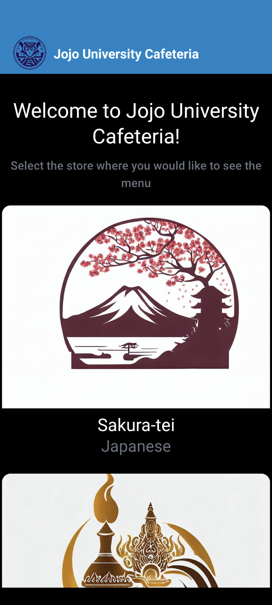
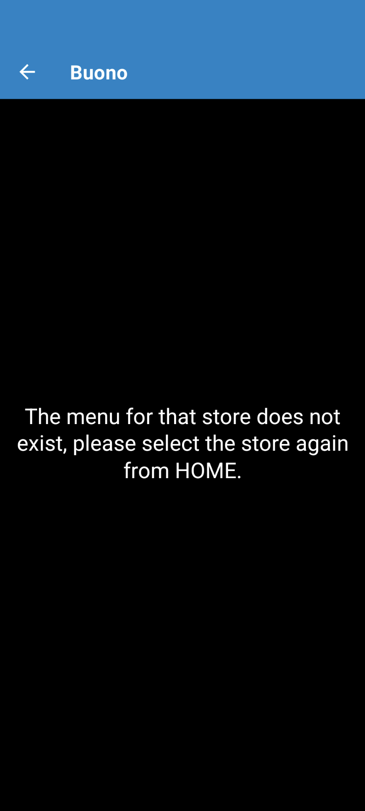
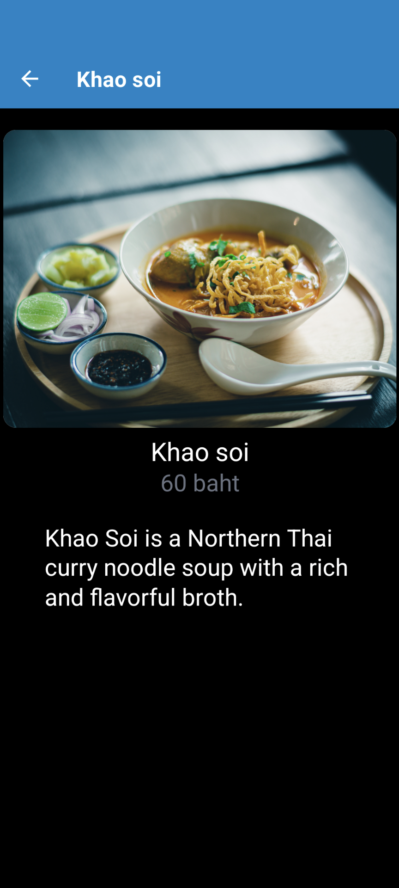

# Hands-on mobile app development using web app technology stacks experienced in the 1st and 2nd

## 0. Introduction

In this hands-on, you will experience mobile app development using the web app development technologies (mainly JavaScript/TypeScript and React) used in the 1st and 2nd hands-on sessions. Similar to [1st](1st.md) and [2nd](2nd.md), the main goal is to enjoy the development experience and get participants interested in web app development technologies.

For this reason, it is not explained in much detail. Also, only a simple implementation is provided. TIPS and links to reference sites are provided where necessary.

### What we make

It calls the backend API created in [2nd](2nd.md) and displays the information in the mobile app. The functionality and UI are almost the same as the web app developed in [2nd](2nd.md).

### Main Technology Stack

- [Javascript](https://developer.mozilla.org/en-US/docs/Web/JavaScript)/[Typescript](https://www.typescriptlang.org/)
- [React Native](https://reactnative.dev/)/[Expo](https://expo.dev/)

TIPS:

- About React Native
  - React Native is a cross-platform framework for developing mobile applications using JavaScript (TypeScript). A single piece of code can be used to develop both iOS and Android applications. While React Native and React.js play different roles, they share many similarities, such as code notation and the concept of components.
  - In addition to React Native, [Flutter](https://flutter.dev/) is  a popular cross-platform framework for developing mobile applications.
    - Flutter is a later framework than React Native, and the main differences are the language used and the design flexibility.
  - Compared to native apps using [Swift(iOS)](https://www.swift.org/) or [Kotlin(Android)](https://kotlinlang.org/), cross-platform apps have the disadvantage of not being able to develop the latest OS features or sophisticated apps.

- About Expo
  - Expo is a set of tools for developing mobile apps based on React Native; using Expo, you can develop mobile apps more easily than with React Native alone.
  - The main features of Expo are as follows:
    - Expo SDK
      - Expo SDK provides a JavaScript API to access native device features such as cameras, accelerometers, and maps.
    - Expo Go
      - Expo Go is a mobile client application for testing apps under development.
    - Snack
      - Snack is an online editor for creating and running Expo projects in your browser.

## 1. Setup

### Prerequisites

- Node.js 18+ or 20+
- Code Editor (e.g., Visual Studio Code)
- [2nd](2nd.md#3-connecting-to-the-database-and-returning-data) backend API must be implemented locally

**NOTE**：  
The required software installation instructions listed here are intended for Windows users.
This is because the first target users of this hands-on are Windows users. Please follow the installation procedure for your environment when actually installing the software.

### Detailed procedure for Windows users

- Install Node.js
  - See [1st](./1st.md#1-setup)
- Install Visual Studio Code(VS Code)
  - See [1st](./1st.md#1-setup)
- Install and configure VS Code extensions
  - See [2st](2nd.md#1-setup)
- Install Expo Go
  - [Expo Go](https://expo.dev/client) is used to test mobile apps. Expo Go allows you to immediately run the mobile app you are developing on your device (Android, iOS). Depending on the device you have, you can download it from Google Play or the App Store (you can find the link on the [official Expo Go website](https://expo.dev/client)).

## 2. mobile app development

### Creating an Expo project

In a terminal (command prompt, PowerShell, WSL bash), move to the `dish-delight` directory that you created in [2nd](2nd.md#1-setup). Make sure that you are in the `dish-delight` directory, and then run the following command

```sh
npx create-expo-app mobile  -t blank-typescript@49 
```

**NOTE**：  
This hands-on will use Expo SDK49, Expo SDK is updated 3 times a year. The next version, SDK50, has many breaking changes and new features, so please check to the latest official website for actual development.

### Install necessary libraries

Install the necessary libraries.  
Run the following commands.

```sh
cd mobile
npx expo install expo-router react-native-safe-area-context react-native-screens expo-linking expo-constants expo-status-bar react-native-gesture-handler
npm install react-native-paper
```

TIPS:

- About [Expo Router](https://docs.expo.dev/router/introduction/)
  - In this hands-on, we will use Expo Router for routing; Expo Router is a file-based router for React Native and web applications.
    - It uses the concept that when you add a file to the app's directory, that file automatically becomes the root of the navigation. This is the same concept used by [Next.js](https://nextjs.org/).
  - Expo Router is based on [React Navigation](https://reactnavigation.org/) and offers the same core functionality, but with a different approach.
  - React Navigation, on the other hand, is designed for mobile applications and provides a stack-based navigation model similar to native mobile app navigation.
    - If you are used to file-based systems, you might think that React Navigation has a lot of code to define routes.
- About [React Native Paper](https://reactnativepaper.com/)
  - React Native Paper is a library for developing React Native app UIs, based on Google's Material Design principles to help you easily create great-looking, easy-to-use apps.

NOTE:  
In this case, the necessary libraries are installed manually.  
Another method is `Quick Start`. The installation of necessary libraries and the configuration to be done in the next step will be done automatically. However, unused libraries may be installed and unnecessary files may be created.  
For the features to be developed this time, manual installation was chosen because it was judged to be less time-consuming and less impactful. If you would like to know more details about the installation method, please check the [official website](https://docs.expo.dev/router/installation/).

### Modify settings

Modify the settings required by the introduction of Expo Router.

NOTE:  
Only the necessary parts are modified for this hands-on. For actual development, please check [official website](https://docs.expo.dev/router/installation/) for necessary settings.

#### Modify Entry Points

Modify the entry point. Open `dish-delight/mobile/package.json` and modify the value of `"main"` in line 4 as follows

```json
  "main": "expo-router/entry",
```

The entire `dish-delight/mobile/package.json` will look like below.

NOTE:  
The minor version of the library (e.g. the `49.XX.XX` part of `"expo"`) varies depending on the time of installation, so the values will not be exactly the same.

```json
{
  "name": "mobile",
  "version": "1.0.0",
  "main": "expo-router/entry",
  "scripts": {
    "start": "expo start",
    "android": "expo start --android",
    "ios": "expo start --ios",
    "web": "expo start --web"
  },
  "dependencies": {
    "expo": "~49.0.18",
    "expo-constants": "~14.4.2",
    "expo-linking": "~5.0.2",
    "expo-router": "^2.0.0",
    "expo-status-bar": "~1.6.0",
    "react": "18.2.0",
    "react-native": "0.72.6",
    "react-native-gesture-handler": "~2.12.0",
    "react-native-paper": "^5.11.6",
    "react-native-safe-area-context": "4.6.3",
    "react-native-screens": "~3.22.0"
  },
  "devDependencies": {
    "@babel/core": "^7.20.0",
    "@types/react": "~18.2.14",
    "typescript": "^5.1.3"
  },
  "private": true
}
```

#### Modify project settings

Open `dish-delight/mobile/app.json` and replace its contents with the following code:  

```json
{
  "expo": {
    "name": "mobile",
    "slug": "mobile",
    "scheme": "dish-delight",
    "version": "1.0.0",
    "orientation": "portrait",
    "icon": "./assets/icon.png",
    "userInterfaceStyle": "light",
    "splash": {
      "image": "./assets/splash.png",
      "resizeMode": "contain",
      "backgroundColor": "#ffffff"
    },
    "assetBundlePatterns": ["**/*"],
    "ios": {
      "supportsTablet": true
    },
    "android": {
      "adaptiveIcon": {
        "foregroundImage": "./assets/adaptive-icon.png",
        "backgroundColor": "#ffffff"
      }
    },
    "web": {
      "favicon": "./assets/favicon.png"
    },
    "plugins": ["expo-router"]
  }
}
```

#### babel.config.jsの修正

Open `dish-delight/mobile/babel.config.js` and replace its contents with the following code:

```js
module.exports = function (api) {
  api.cache(true);
  return {
    presets: ['babel-preset-expo'],
    plugins: ['expo-router/babel'],
  };
};
```

TIPS:

- What is babel.config.js?
  - [Babel](https://babeljs.io/docs/) is a tool (transpiler) that converts the latest JavaScript (ES2015+) into a format that can be run on older browsers.
  - The [babel.config.js](https://babeljs.io/docs/configuration) is a configuration file for Babel that contains settings that control how the JavaScript code is converted. This allows the code to run in older browsers while still using the latest JavaScript features.

### Start the development server

Start the development server with the default app and verify that the app can be started on your device.

Run the following command

```sh
npm run start -c
```

Connect an iOS or Android device with the Expo Go app installed to the same wireless network as the PC you are working on.  
For Android, use the Expo Go app to scan the QR code displayed on the PC terminal and open the project; for iOS, use the default iOS camera app, scan the QR code, and open the project.

Verify that the Expo Router default screen shown below appears. When it appears, press the `touch app/index.js` button at the bottom.


Make sure that when you press the `touch app/index.js` button, you get the following

- To change to the following screen
- When you return to VSCode, `dish-delight/mobile/app/index.tx` should be created.


### Customize images such as the splash screen

Change the splash screen, app logo, etc. that are displayed when the app is launched to this hands-on version. Also, get and place the logo of each store (the same image files as in [2nd](2nd.md#2-frontend-only-home-and-menu-list-and-menu-detail-screen-implementation)).

All target images should be obtained from the [Github Repository](https://github.com/minakamoto/pschs2023/tree/main/docs/static/img/3rd/assets). The following 7 files.  

- adaptive-icon.png
- aroy_logo.jpeg
- buono_logo.jpeg
- icon_jojo.png
- logo_jojo.png
- sakura_tei_logo.jpeg
- splash_jojo.png

Place (overwrite) the file downloaded above in `dish-delight/mobile/assets`.  

Open `dish-delight/mobile/app.json` and replace its contents with the following code:

```json
{
  "expo": {
    "name": "Jojo University Cafeteria",
    "slug": "jojoUnivCafe",
    "scheme": "dish-delight",
    "version": "1.0.0",
    "orientation": "portrait",
    "icon": "./assets/icon_jojo.png",
    "userInterfaceStyle": "light",
    "splash": {
      "image": "./assets/splash_jojo.png",
      "resizeMode": "contain",
      "backgroundColor": "#000000"
    },
    "assetBundlePatterns": ["**/*"],
    "ios": {
      "supportsTablet": true
    },
    "android": {
      "adaptiveIcon": {
        "foregroundImage": "./assets/adaptive-icon.png",
        "backgroundColor": "#ffffff"
      }
    },
    "web": {
      "favicon": "./assets/favicon.png"
    },
    "plugins": ["expo-router"]
  }
}
```

Re-launch the mobile app with Expo GO on your device and verify that the Splash Screen changes when the app is launched.


TIPS:

- How to reload mobile apps on Expo GO
  1. Press `r` on the terminal during starting the mobile app development server (`npm run start`)
  1. While the mobile app development server is running (`npm run start`), press `j` on the terminal to start Expo GO's DevTool (or debugger) and press `Reload` button.
  1. Shake your device (Android: shake vertically, iOS: shake gently  or touch the screen with 3 fingers), launch the Expo GO DevTool (or debugger) and press the `Reload` button
  - For more information, check the [official Expo website](https://docs.expo.dev/debugging/tools/#developer-menu).
- Expo GO's DevTool has a variety of features, including the ability to debug with the Chrome Devtool. If you are interested, please check the [official Expo website](https://docs.expo.dev/debugging/tools/).

### Implement three screens displaying fixed text and their screen transitions

As with [2nd](2nd.md), there are three screens to be built with this hands-on: Home, Menu List, and Menu Details. First, let's experience the development of mobile screen transitions: before acquiring data from the API and implementing screens accordingly, we will implement screen transitions for the three screens, displaying only fixed text.

Open `dish-delight/mobile/app/index.tsx` and replace its contents with the following code:

```tsx
import { Link } from "expo-router";
import { StyleSheet, View } from "react-native";

export default function Home() {
  return (
    <View style={styles.container}>
      <Link
        style={styles.title}
        href={{
          pathname: "/stores/[storeId]",
          // Fixed values are passed to params for the only purpose of experiencing screen transitions.
          params: { storeName: "Sakura-tei", storeId: "1" },
        }}
      >
        Sakura-tei
      </Link>
    </View>
  );
}

const styles = StyleSheet.create({
  container: {
    flex: 1,
    alignItems: "center",
    justifyContent: "center",
    padding: 24,
  },
  title: {
    fontSize: 36,
    fontWeight: "bold",
  },
});

```

Open the mobile app in Expo GO and verify that the following screen appears


Also, make sure that the default error screen (`Unmached Route`) is displayed when you tap `Sakura-tei`.


After the error screen is displayed, swipe left to return to the Home screen where `Sakura-tei` is displayed.

Create the `dish-delight/mobile/app/stores/[storeId]/index.tsx` file and replace its contents with the following code:

```tsx
import { Link } from "expo-router";
import { StyleSheet, View } from "react-native";

export default function StoreMenu() {
  return (
    <View style={styles.container}>
      <Link
        style={styles.title}
        href={{
          pathname: "/stores/[storeId]/menus/[menuId]",
          params: { storeId: "1", menuName: "ramen", menuId: "1" },
        }}
      >
        Soy sauce ramen
      </Link>
    </View>
  );
}

const styles = StyleSheet.create({
  container: {
    flex: 1,
    alignItems: "center",
    justifyContent: "center",
    padding: 24,
  },
  title: {
    fontSize: 36,
    fontWeight: "bold",
  },
});

```

Create the `dish-delight/mobile/app/stores/[storeId]/menus/[menuId]/index.tsx` file and replace its contents with the following code:

```tsx
import { StyleSheet, Text, View } from "react-native";

export default function MenuDetail() {
  return (
    <View style={styles.container}>
      <Text style={styles.title}>Menu Detail</Text>
    </View>
  );
}

const styles = StyleSheet.create({
  container: {
    flex: 1,
    alignItems: "center",
    justifyContent: "center",
    padding: 24,
  },
  title: {
    fontSize: 36,
    fontWeight: "bold",
  },
});
```

Open the mobile app in Expo GO and verify that the following three screens can be displayed and transitioned (tapping fixed text or swiping).

| Home  | Menu List  | Menu Detail |
| --- | --- | --- |
|  |  |  |

### Implement Navbar to display fixed text

Implement the Navbar corresponding to the three screens that display the fixed text implemented earlier.

Create the `dish-delight/mobile/app/_layout.tsx` file and replace its contents with the following code:

```tsx
import { Stack } from "expo-router";

export default function Layout() {
  return (
    <Stack
      initialRouteName="Home"
      // common setting
      screenOptions={{
        headerStyle: {
          backgroundColor: "#0284c7",
        },
        headerTintColor: "#fff",
        headerTitleStyle: {
          fontWeight: "bold",
        },
      }}
    />
  );
}
```

Open `dish-delight/mobile/app/index.tsx` and replace its contents with the following code:

```tsx
import { Link, Stack } from "expo-router";
import { StyleSheet, View } from "react-native";

export default function Home() {
  return (
    <View style={styles.container}>
      <Stack.Screen options={{ title: "Home" }} />
      <Link
        style={styles.title}
        href={{
          pathname: "/stores/[storeId]",
          // Fixed values are passed to params for the purpose of experiencing screen transitions only.
          params: { storeName: "Sakura-tei", storeId: "1" },
        }}
      >
        Sakura-tei
      </Link>
    </View>
  );
}

const styles = StyleSheet.create({
  container: {
    flex: 1,
    alignItems: "center",
    justifyContent: "center",
    padding: 24,
  },
  title: {
    fontSize: 36,
    fontWeight: "bold",
  },
});
```

TIPS:  
The only difference in index.tsx for each screen is the following part.

```tsx
<Stack.Screen options={{ ... }} />
```

Open `dish-delight/mobile/app/stores/[storeId]/index.tsx` and replace its contents with the following code:

```tsx
import { Link, Stack } from "expo-router";
import { StyleSheet, View } from "react-native";

export default function StoreMenu() {
  return (
    <View style={styles.container}>
      <Stack.Screen
        options={{
          title: "Sakura-tei",
        }}
      />
      <Link
        style={styles.title}
        href={{
          pathname: "/stores/[storeId]/menus/[menuId]",
          params: { storeId: "1", menuName: "ramen", menuId: "1" },
        }}
      >
        Soy sauce ramen
      </Link>
    </View>
  );
}

const styles = StyleSheet.create({
  container: {
    flex: 1,
    alignItems: "center",
    justifyContent: "center",
    padding: 24,
  },
  title: {
    fontSize: 36,
    fontWeight: "bold",
  },
});

```

Open `dish-delight/mobile/app/stores/[storeId]/menus/[menuId]/index.tsx` and replace its contents with the following code:

```tsx
import { Stack } from "expo-router";
import { StyleSheet, Text, View } from "react-native";

export default function MenuDetail() {
  return (
    <View style={styles.container}>
      <Stack.Screen
        options={{
          title: "Soy sauce ramen",
        }}
      />
      <Text style={styles.title}>Menu Detail</Text>
    </View>
  );
}

const styles = StyleSheet.create({
  container: {
    flex: 1,
    alignItems: "center",
    justifyContent: "center",
    padding: 24,
  },
  title: {
    fontSize: 36,
    fontWeight: "bold",
  },
});

```

Open the mobile app in Expo GO and verify the three screens are as follows

| Home  | Menu List  | Menu Detail |
| --- | --- | --- |
|  |  |  |

### Change the Navbar on the Home screen

Open `dish-delight/mobile/app/index.tsx` and replace its contents with the following code:

```tsx
import { Stack } from "expo-router";
import { Image, StyleSheet, View } from "react-native";
import { Text } from "react-native-paper";

function LogoTitle() {
  return (
    <View style={styles.logoContainer}>
      <Image
        style={styles.logoImage}
        source={require("./../assets/logo_jojo.png")}
      />
      <Text style={styles.logoText}>Jojo University Cafeteria</Text>
    </View>
  );
}

export default function Home() {
  return (
    <View style={styles.container}>
      <Stack.Screen
        options={{
          // refs. https://reactnavigation.org/docs/headers#setting-the-header-title
          title: "Jojo Univ Cafeteria's Home",
          // refs. https://reactnavigation.org/docs/headers#replacing-the-title-with-a-custom-component
          headerTitle: () => <LogoTitle />,
        }}
      />
      <Text variant="headlineMedium" style={styles.title}>
        Welcome to Jojo University Cafeteria!
      </Text>
      <Text variant="titleMedium" style={styles.subTitle}>
        Select the store where you would like to see the menu
      </Text>
    </View>
  );
}

const styles = StyleSheet.create({
  container: {
    flex: 1,
    backgroundColor: "black",
  },
  title: {
    textAlign: "center",
    marginTop: 32,
    color: "#fff",
  },
  subTitle: {
    textAlign: "center",
    marginTop: 10,
    marginBottom: 20,
    marginHorizontal: 6,
    color: "#6b7280",
  },
  logoContainer: {
    flexDirection: "row",
    width: "100%",
  },
  logoImage: {
    width: 50,
    height: 50,
    alignSelf: "flex-start",
  },
  logoText: {
    textAlignVertical: "center",
    marginVertical: 10, // for iOS
    paddingStart: 8,
    fontWeight: "bold",
    fontSize: 18,
    color: "#fff",
  },
});
```

Open the mobile app in Expo GO and verify that the following screen appears (only the Navbar and fixed text are shown).  


### Implement API calls on the mobile side with fixed data

In [2nd](2nd.md), each screen component first had fixed data and types, and after refactoring, an API call component was created. This time, however, we create the API call component with fixed data first (same code as in [2nd](2nd.md)).  
If you do not understand the refactoring process, please refer to [2nd](2nd.md).

Create the `dish-delight/mobile/lib/api.tsx` file and replace its contents with the following code:

```tsx
// dish-delight/frontend/lib/api.tsx

export type Store = {
  id: number;
  name: string;
  img: string;
  category: string;
};

const stores: Store[] = [
  {
    id: 1,
    name: "Sakura-tei",
    img: "/sakura_tei_logo.jpeg",
    category: "Japanese",
  },
  {
    id: 2,
    name: "Aroy",
    img: "/aroy_logo.jpeg",
    category: "Thai",
  },
  {
    id: 3,
    name: "Buono",
    img: "/buono_logo.jpeg",
    category: "Italian",
  },
];

// type definition of menu
export type Menu = {
  id: number;
  storeId: number;
  name: string;
  img: string;
  author: string;
  price: string;
  description: string;
  options?: Option[];
};

// type definition of menu's option
type Option = {
  name: string;
  price: string;
};

const menus = [
  {
    id: 1,
    storeId: 1,
    name: "Soy sauce ramen",
    img: "https://images.unsplash.com/photo-1632709810780-b5a4343cebec",
    author: "@5amramen",
    price: "900 yen",
    description:
      "A classic Japanese ramen noodle soup that is made with a soy sauce-based broth.",
    options: [
      {
        name: "Extra noodles",
        price: "100 yen",
      },
      {
        name: "Extra char siu",
        price: "100 yen",
      },
      {
        name: "Barikata(very hard noodles)",
        price: "0 yen",
      },
    ],
  },
  {
    id: 2,
    storeId: 1,
    name: "Sanuki Udon",
    img: "https://images.unsplash.com/photo-1618841557871-b4664fbf0cb3",
    author: "@jinomono",
    price: "800 yen",
    description:
      "A type of thick, chewy udon noodle that is made in Kagawa Prefecture, Japan.",
    options: [
      {
        name: "Chicken tempura",
        price: "100 yen",
      },
      {
        name: "Squid tempura",
        price: "100 yen",
      },
      {
        name: "Vegetable tempura",
        price: "100 yen",
      },
      {
        name: "Large size",
        price: "100 yen",
      },
      {
        name: "Small size",
        price: "-50 yen",
      },
    ],
  },
  {
    id: 3,
    storeId: 1,
    name: "Zaru soba",
    img: "https://images.unsplash.com/photo-1519984388953-d2406bc725e1",
    author: "@gaspanik",
    price: "1,000 yen",
    description: "A cold soba noodle dish served with a dipping sauce.",
    options: [
      {
        name: "Large size",
        price: "200 yen",
      },
    ],
  },
  {
    id: 4,
    storeId: 1,
    name: "Spicy Miso Ramen",
    img: "https://images.unsplash.com/photo-1637024696628-02cb19cc1829",
    author: "@5amramen",
    price: "900 yen",
    description: "A spicy miso ramen with a rich and flavorful broth.",
    options: [
      {
        name: "Large size",
        price: "100 yen",
      },
      {
        name: "Extra char siu",
        price: "100 yen",
      },
      {
        name: "Seasoned egg",
        price: "100 yen",
      },
    ],
  },
  {
    id: 8,
    storeId: 2,
    name: "Khao soi",
    img: "https://images.unsplash.com/photo-1569562211093-4ed0d0758f12",
    author: "@ural_8_low",
    price: "60 baht",
    description:
      "Khao Soi is a Northern Thai curry noodle soup with a rich and flavorful broth.",
  },
];

export async function getStores(): Promise<Store[]> {
  return stores;
}

export async function getStore(storeId: number): Promise<Store | undefined> {
  return stores.find((store) => store.id === storeId);
}

export async function getMenus(storeId: number): Promise<Menu[]> {
  return menus.filter((menu) => menu.storeId === storeId);
}

export async function getMenu(
  storeId: number,
  menuId: number
): Promise<Menu | undefined> {
  return menus.find((menu) => menu.storeId === storeId && menu.id === menuId);
}
```

### Implement a component for when no data exists

As with API calls, the componentization is done first, although it was done after the refactoring in [2nd](2nd.md).  
If you do not understand the refactoring process, please refer to [2nd](2nd.md).

Create the `dish-delight/mobile/lib/constants.ts` file and replace its contents with the following code:

```ts
// dish-delight/mobile/lib/constants.ts

export const DATA_NOT_FOUND_MESSAGE = {
  // This message is not used because frontend and data are not executed on each Screen, but are passed between screens (difference between Next.js and React Native/Expo).
  STORE: "The store does not exist, please select the store again from HOME.",
  MENU: "The menu for that store does not exist, please select the store again from HOME.",
};
```

Create the `dish-delight/mobile/components/DataNotFound.tsx` file and replace its contents with the following code:

```tsx
// dish-delight/mobile/components/DataNotFound.tsx

import { StyleSheet, View } from "react-native";
import { Text } from "react-native-paper";

type DataNotFoundProps = {
  message: string;
};

// The message will be passed on from the caller.
export default function DataNotFound({ message }: DataNotFoundProps) {
  return (
    <View style={styles.notFoundContainer}>
      <Text variant="titleLarge" style={styles.notFoundText}>
        {message}
      </Text>
    </View>
  );
}

const styles = StyleSheet.create({
  notFoundContainer: {
    flex: 1,
    backgroundColor: "black",
    alignItems: "center",
    justifyContent: "center",
  },
  notFoundText: {
    textAlign: "center",
    color: "#fff",
    marginHorizontal: 10,
  },
});

```

**NOTE**:

- About Exception Handling
  - As with other hands-on, in this hands-on,  exception handling is implemented in a simplified way because the focus is on the experience of web application development. In actual development, please implement it appropriately, taking into account requirements and technical factors.

### Display the Home screen with fixed data

Like [2nd](2nd.md), it displays fixed data held on the frontend before retrieving data from the backend API.

Open `dish-delight/mobile/app/index.tsx` and replace its contents with the following code:

```tsx
// dish-delight/mobile/app/index.tsx

import { Stack, router } from "expo-router";
import { useEffect, useState } from "react";
import { Image, ScrollView, StyleSheet, View } from "react-native";
import { Card, Text } from "react-native-paper";
import { Store, getStores } from "../lib/api";

const assetLogoImages = [
  { name: "Sakura-tei", source: require("./../assets/sakura_tei_logo.jpeg") },
  { name: "Aroy", source: require("./../assets/aroy_logo.jpeg") },
  { name: "Buono", source: require("./../assets/buono_logo.jpeg") },
];

function getStoreImage(storeName: string) {
  const imageSource = assetLogoImages.find((image) => image.name === storeName);
  return imageSource
    ? imageSource.source
    : require("./../assets/icon_jojo.png"); // If no matching image is found
}

function LogoTitle() {
  return (
    <View style={styles.logoContainer}>
      <Image
        style={styles.logoImage}
        source={require("./../assets/logo_jojo.png")}
      />
      <Text style={styles.logoText}>Jojo University Cafeteria</Text>
    </View>
  );
}

export default function Home() {
  const [stores, setStores] = useState<Store[]>([]);

  // see. https://reactnative.dev/docs/next/network#using-fetch
  const getStoreList = async () => {
    try {
      const data = await getStores();
      setStores(data);
    } catch (error) {
      console.error(error);
    }
  };

  useEffect(() => {
    getStoreList();
  }, []);

  return (
    <ScrollView style={styles.container}>
      <Stack.Screen
        options={{
          // refs. https://reactnavigation.org/docs/headers#setting-the-header-title
          title: "Jojo Univ Cafeteria's Home",
          // refs. https://reactnavigation.org/docs/headers#replacing-the-title-with-a-custom-component
          headerTitle: () => <LogoTitle />,
        }}
      />
      <Text variant="headlineMedium" style={styles.title}>
        Welcome to Jojo University Cafeteria!
      </Text>
      <Text variant="titleMedium" style={styles.subTitle}>
        Select the store where you would like to see the menu
      </Text>
      {stores.map((store) => (
        <Card
          key={store.id}
          accessible={true}
          accessibilityLabel={`Card for${store.name}`}
          style={styles.cardContainer}
          onPress={() =>
            router.push({
              pathname: "/stores/[storeId]",
              params: { storeName: store.name, storeId: store.id },
            })
          }
        >
          <Card.Cover
            accessible={true}
            accessibilityLabel={`Cover image for${store.name}`}
            alt={`Cover image for${store.name}`}
            source={getStoreImage(store.name)}
            style={styles.cardCover}
          />
          <Card.Title
            title={store.name}
            subtitle={store.category}
            titleVariant="headlineSmall"
            subtitleVariant="titleLarge"
            titleStyle={styles.cardTitle}
            subtitleStyle={styles.cardSubTitle}
            style={{
              backgroundColor: "black",
            }}
          ></Card.Title>
        </Card>
      ))}
    </ScrollView>
  );
}

const styles = StyleSheet.create({
  container: {
    flex: 1,
    backgroundColor: "black",
  },
  title: {
    textAlign: "center",
    marginTop: 32,
    color: "#fff",
  },
  subTitle: {
    textAlign: "center",
    marginTop: 10,
    marginBottom: 20,
    marginHorizontal: 6,
    color: "#6b7280",
  },
  logoContainer: {
    flexDirection: "row",
    width: "100%",
  },
  logoImage: {
    width: 50,
    height: 50,
    alignSelf: "flex-start",
  },
  logoText: {
    textAlignVertical: "center",
    marginVertical: 10, // for iOS
    paddingStart: 8,
    fontWeight: "bold",
    fontSize: 18,
    color: "#fff",
  },
  cardContainer: {
    alignSelf: "center",
    marginBottom: 20,
    marginHorizontal: 30,
    height: 350,
    width: 370,
  },
  cardCover: {
    height: 280,
    width: 370,
  },
  cardTitle: {
    textAlign: "center",
    color: "#fff",
  },
  cardSubTitle: {
    textAlign: "center",
    color: "#6b7280",
  },
});
```

Verify the following

- Open the mobile app in Expo GO and the following screen should appear  

- Clicking on the `Sakura-tei`, `Aroy`, or `Buono` card will display the menu list screen.
  - The implementation of the menu list screen has not been changed yet, so you will see the fixed text `Soy sauce ramen` when you click on any store.

### Display the menu list screen with fixed data

Like the Home screen, the menu list screen should display fixed data held on the frontend.

Open `dish-delight/mobile/app/stores/[storeId]/index.tsx` and replace its contents with the following code:

```tsx
// dish-delight/mobile/app/stores/[storeId]/index.tsx

import { Stack, router, useLocalSearchParams } from "expo-router";
import { useEffect, useState } from "react";
import { FlatList, StyleSheet, View } from "react-native";
import { Menu, getMenus } from "../../../lib/api";
import { ActivityIndicator, Card } from "react-native-paper";
import DataNotFound from "../../../components/DataNotFound";
import { DATA_NOT_FOUND_MESSAGE } from "../../../lib/constants";

export default function StoreMenu() {
  // Get the parameter specified at router push.
  const params = useLocalSearchParams();
  const storeName = params.storeName as string;
  const storeId = Number(params.storeId);

  const [isLoading, setLoading] = useState(true);
  const [menus, setMenus] = useState<Menu[]>([]);

  const getMenuList = async () => {
    try {
      const data = await getMenus(storeId);
      setMenus(data);
    } catch (error) {
      console.error(error);
    } finally {
      setLoading(false);
    }
  };

  useEffect(() => {
    getMenuList();
  }, [storeId]);

  // This function is provided to Flatlist's "renderItem".
  // "renderItem" is a function that defines how each item in the list should be drawn.
  // In other words, it determines how each item in the list will look like.
  const renderCard = (item: Menu) => (
    <>
      <Card
        key={item.id}
        accessible={true}
        accessibilityLabel={`Card for${item.name}`}
        style={styles.cardContainer}
        onPress={() =>
          router.push({
            pathname: "/stores/[storeId]/menus/[menuId]",
            params: { storeId: storeId, menuName: item.name, menuId: item.id },
          })
        }
      >
        <Card.Cover
          accessible={true}
          accessibilityLabel={`Cover image for${item.name}`}
          alt={`Card image for${item.name}`}
          source={{ uri: item.img }}
          style={styles.cardCover}
        />
        <Card.Title
          title={item.name}
          subtitle={item.price}
          titleVariant="headlineSmall"
          subtitleVariant="titleLarge"
          titleStyle={styles.cardTitle}
          subtitleStyle={styles.cardSubTitle}
          style={styles.cardTitleContainer}
        ></Card.Title>
      </Card>
    </>
  );

  // If data does not exist, an error screen is displayed
  if (!isLoading && menus.length === 0) {
    return <DataNotFound message={DATA_NOT_FOUND_MESSAGE.MENU} />;
  }

  return (
    <View style={styles.container}>
      <Stack.Screen
        options={{
          title: storeName,
        }}
      />
      {isLoading ? (
        // Display Loading until data is available
        <ActivityIndicator
          size={"large"}
          color="#0284c7"
          style={styles.indicator}
        />
      ) : (
        // FlatList is a component for efficient display of long lists. It is a tool for creating scrollable lists, which is especially useful when dealing with large amounts of data.
        <FlatList
          style={styles.container}
          data={menus}
          renderItem={({ item }) => renderCard(item)}
        ></FlatList>
      )}
    </View>
  );
}

const styles = StyleSheet.create({
  container: {
    flex: 1,
    backgroundColor: "black",
  },
  indicator: {
    flex: 1,
    backgroundColor: "black",
    alignItems: "center",
    justifyContent: "center",
  },
  cardContainer: {
    alignItems: "center",
    marginHorizontal: 20,
    marginTop: 28,
    height: 350,
    backgroundColor: "black",
  },
  cardCover: {
    height: 280,
    width: 370,
  },
  cardTitleContainer: {
    backgroundColor: "black",
  },
  cardTitle: {
    textAlign: "center",
    color: "#fff",
  },
  cardSubTitle: {
    textAlign: "center",
    color: "#6b7280",
  },
});

```

Check to see how this works and looks.

- Clicking on the `Sakura-tei` card on the Home screen will display the menu list screen.
  - Four menus should appear.
    
- Clicking on the Card of any menu item in the menu list screen will display the menu details screen.
  - The screen still displays the fixed text, so any click on it will display "Menu Detail".
- Clicking on the `Aroy` card on the Home screen will display the menu list screen.
  - One menu should appear.
- Clicking on the `Buono` card on the Home screen will display the menu list screen.
  - Error messages should be displayed due to lack of menus.
    

### Display the menu detail screen with fixed data

Like the Home and Menu List screens, the Menu Detail screen should display fixed data held on the frontend.

Open `dish-delight/mobile/app/stores/[storeId]/menus/[menuId]/index.tsx` and replace its contents with the following code:

```tsx
// dish-delight/mobile/app/stores/[storeId]/menus/[menuId]/index.tsx

import { Stack, useLocalSearchParams } from "expo-router";
import { useEffect, useState } from "react";
import { StyleSheet, View } from "react-native";
import { Menu, getMenu } from "../../../../../lib/api";
import DataNotFound from "../../../../../components/DataNotFound";
import { DATA_NOT_FOUND_MESSAGE } from "../../../../../lib/constants";
import { Card, Text } from "react-native-paper";

export default function MenuDetail() {
  // Get the parameter specified at router push.
  const params = useLocalSearchParams();
  const menuName = params.menuName as string;
  const menuId = Number(params.menuId);
  const storeId = Number(params.storeId);
  const [menu, setMenu] = useState<Menu>();
  // Since there is only one data item in the menu detail screen, Loading process would be skipped.

  const getMenuDetail = async () => {
    try {
      const data = await getMenu(storeId, menuId);
      setMenu(data);
    } catch (error) {
      console.error(error);
    }
  };

  useEffect(() => {
    getMenuDetail();
  }, [storeId, menuId]);

  // If data does not exist, an error screen is displayed
  if (!menu) {
    return <DataNotFound message={DATA_NOT_FOUND_MESSAGE.MENU} />;
  }

  return (
    <View style={styles.container}>
      <Stack.Screen
        options={{
          title: menuName,
        }}
      />
      <Card
        key={menu?.id}
        style={styles.cardContainer}
        accessible={true}
        accessibilityLabel={`Card for${menu?.name}`}
      >
        <Card.Cover
          accessible={true}
          accessibilityLabel={`Cover image for${menu?.name}`}
          alt={`Card image for${menu?.name}`}
          source={{ uri: menu?.img }}
          style={styles.cardCover}
        />
        <Card.Title
          title={menu?.name}
          subtitle={menu?.price}
          titleVariant="headlineSmall"
          subtitleVariant="titleLarge"
          titleStyle={styles.cardTitle}
          subtitleStyle={styles.cardSubTitle}
          style={styles.cardTitleContainer}
        ></Card.Title>
      </Card>
      <Text variant="titleLarge" style={styles.menuDescription}>
        {menu?.description}
      </Text>
      {menu?.options && menu.options.length > 0 && (
        <View style={styles.menuOptionContainer}>
          <Text variant="headlineSmall" style={styles.menuOptionTitle}>
            Option
          </Text>
          {menu.options.map((option) => (
            // If there are options in the menu, display the number of options
            <View
              key={option.name}
              style={styles.menuOptionInnerContainer}
              accessible={true}
            >
              <Text variant="titleLarge" style={styles.menuOptionName}>
                {option.name}
              </Text>
              <Text variant="titleLarge" style={styles.menuOptionPrice}>
                {option.price}
              </Text>
            </View>
          ))}
        </View>
      )}
    </View>
  );
}

const styles = StyleSheet.create({
  container: {
    flex: 1,
    backgroundColor: "black",
  },
  cardContainer: {
    alignItems: "center",
    marginHorizontal: 20,
    marginVertical: 20,
    height: 350,
    backgroundColor: "black",
  },
  cardCover: {
    height: 280,
    width: 370,
  },
  cardTitleContainer: {
    backgroundColor: "black",
  },
  cardTitle: {
    textAlign: "center",
    color: "#fff",
  },
  cardSubTitle: {
    textAlign: "center",
    color: "#6b7280",
  },
  menuDescription: {
    color: "white",
    marginHorizontal: 42,
  },
  menuOptionContainer: {
    marginHorizontal: 42,
    marginTop: 28,
  },
  menuOptionTitle: {
    color: "#6b7280",
  },
  menuOptionInnerContainer: {
    flexDirection: "row",
    justifyContent: "space-between",
    marginHorizontal: 20,
    marginTop: 8,
  },
  menuOptionName: {
    color: "white",
  },
  menuOptionPrice: {
    color: "#6b7280",
    marginLeft: 10,
  },
});
```

Check to see how this works and looks.

- Click any of the menu cards on the Menu List screen to go to the Menu Details screen.
  - The appropriate menu image, description and option should be displayed.
    - Example: `Khao Soi` at the `Aroy` store (without Option)
    
    - Example: `Sanuki Udon` at the `Sakura-tei` store (with options)
    
- Error screen if store or menu does not exist
  - The image is the same as the Menu List screen

### Check the IP address of the PC you are working on and launch the backend API

Check the IP address of the PC you are working on and launch the backend API.

First, check the IP address of the PC you are working on.  
There are several ways to check the IP address, including running commands in the control panel or terminal.  
This time, when you start the mobile app development server (`npm run start`), your IP address (the `xxx.xxx.xxx.xxx.xxx.xxx` part of `Metro waiting on exp://xxx.xxx.xxx.xxx.8081`) should appear on the terminal as follows, please check it.

```sh
› Metro waiting on exp://xxx.xxx.xxx.xxx:8081
› Scan the QR code above with Expo Go (Android) or the Camera app (iOS)

› Using Expo Go
› Press s │ switch to development build

› Press a │ open Android
› Press i │ open iOS simulator
› Press w │ open web

› Press j │ open debugger
› Press r │ reload app
› Press m │ toggle menu
› Press o │ open project code in your editor

› Press ? │ show all commands
```

Next, launch the backend API.  
Open a terminal other than the one running the mobile app development server and move to the `dish-delight/backend` directory that you created in [2nd](2nd.md#1-setup). Verify that you have moved to the `dish-delight/backend` directory and run the following commands.

```sh
rye run uvicorn main:app --reload --host xxx.xxx.xxx.xxx
```

Replace `xxx.xxx.xxx.xxx.xxx` with the IP address of your PC that you have just checked.

### Modify API calls on the mobile side

Modify the API call component that was returning fixed data, to call the backend API.

Open `dish-delight/mobile/lib/api.tsx` and replace its contents with the following code:

```tsx
// dish-delight/mobile/lib/api.tsx

export type Store = {
  id: number;
  name: string;
  img: string;
  category: string;
};

export type Menu = {
  id: number;
  storeId: number;
  name: string;
  img: string;
  author: string;
  price: string;
  description: string;
  options?: Option[];
};

type Option = {
  name: string;
  price: string;
};

// FIXME Please set the IP address of your local PC.
const url = "http://xxx.xxx.xxx.xxx:8000";

export async function getStores(): Promise<Store[]> {
  const res = await fetch(`${url}/stores`);

  if (!res.ok) {
    // This will activate the closest `error.js` Error Boundary
    throw new Error("Failed to fetch data");
  }

  return res.json();
}

export async function getStore(storeId: number): Promise<Store | undefined> {
  const res = await fetch(`${url}/stores/${storeId}`);

  if (!res.ok) {
    // This will activate the closest `error.js` Error Boundary
    throw new Error("Failed to fetch data");
  }

  return res.json();
}

export async function getMenus(storeId: number): Promise<Menu[]> {
  const res = await fetch(`${url}/stores/${storeId}/menus`);

  if (!res.ok) {
    // This will activate the closest `error.js` Error Boundary
    throw new Error("Failed to fetch data");
  }

  return res.json();
}

export async function getMenu(
  storeId: number,
  menuId: number
): Promise<Menu | undefined> {
  const res = await fetch(`${url}/stores/${storeId}/menus/${menuId}`);

  if (!res.ok) {
    // This will activate the closest `error.js` Error Boundary
    throw new Error("Failed to fetch data");
  }

  return res.json();
}
```

Before checking the working, replace `xxx.xxx.xxx.xxx.xxx` in line 27 with the IP address of your PC that you have just checked.

Check to see how this works and looks.  
Try changing the store and the menu to check the operation. Since the data is being fetched from the database, it should be more than the fixed data content held in the frontend that we just checked. (e.g. the store `Buono` also has menu).

## 3. At the end

This concludes the hands-on session. Thank you for your time. The complete code can be found [here](https://github.com/minakamoto/pcshscr2023/tree/main/src/webapp/handson-for-catchup/src/3rd/dish-delight).
You have experienced a bit that mobile apps can be developed in the same atmosphere as web apps. If you are interested, please check the sites of the links presented or develop your own application with your own ideas.
