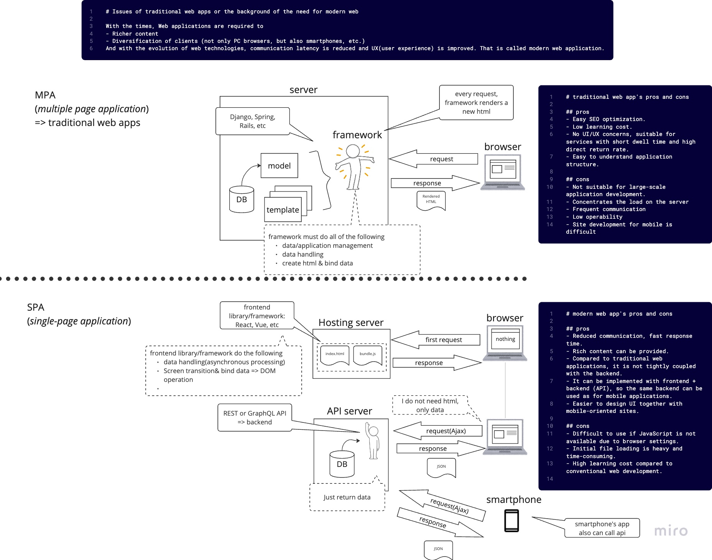

# Introduction

- This is a session to look at the differences between modern and traditional web app architecture and the technology stack required for modern web app development.
  - Please take a look at the information listed, talk to other attendees, and find out what you're interested in. Try to get a feel for what modern web app development is like.
- This session is expected to last about 2 hours.
  - You may not know what it is the first time you see it, but that's okay. It is enough to know that web development in the past and today are very different, and that the amount and breadth of the technology stack for modern web development is broad.
  - You may find this helpful to come back and look at it again after you've done some hands-on activities, etc.


# 1. Overview of Web App Technology Stack Evolution

## The differences between web app technology stacks from 20 years ago and today.

### Focus on multiple HTML pages vs. single-page apps:



### All differences between web app technology stacks from 20 years ago and today.

This diagram that illustrates some of the key differences between web app development about 20 years ago and modern web app development from chatGPT:
```
                   +---------------------------------------------+
                   |                 20 Years Ago                  |
                   +---------------------------------------------+
                     |                     |                     |
                     |                     |                     |
    +----------------+------+  +-----------+-----------+  +------+-----------------+
    |  Multiple HTML pages  |  | Heavy reliance on server |  |   Basic JavaScript   |
    +----------------+------+  +-----------+-----------+  +------+-----------------+
                     |                     |                     |
                     |                     |                     |
                     |                     |                     |
                     |                     |                     |
    +----------------+------+  +-----------+-----------+  +------+-----------------+
    |   Simple HTML and CSS  |  |           Limited           |  |    Basic CSS     |
    +----------------+------+  +-----------+-----------+  +------+-----------------+
                     |                     |                     |
                     |                     |                     |
                     |                     |                     |
                     |                     |                     |
    +----------------+------+  +-----------+-----------+  +------+-----------------+
    |  Manual DOM manipulation  |  |   Limited interactivity   |  | Limited data transfer|
    +----------------+------+  +-----------+-----------+  +------+-----------------+
                     |                     |                     |
                     |                     |                     |
                     |                     |                     |
                     |                     |                     |
    +----------------+------+  +-----------+-----------+  +------+-----------------+
    |     No frameworks      |  | Limited code organization |  |     Basic forms      |
    +----------------+------+  +-----------+-----------+  +------+-----------------+

                   +---------------------------------------------+
                   |                   Today                       |
                   +---------------------------------------------+
                     |                     |                     |
                     |                     |                     |
    +----------------+------+  +-----------+-----------+  +------+-----------------+
    |   Single-page apps     |  |     Serverless architecture      |  |  Advanced JavaScript |
    +----------------+------+  +-----------+-----------+  +------+-----------------+
                     |                     |                     |
                     |                     |                     |
                     |                     |                     |
                     |                     |                     |
    +----------------+------+  +-----------+-----------+  +------+-----------------+
    |       React & JSX      |  |      GraphQL and REST APIs      |  |  Advanced CSS/SCSS  |
    +----------------+------+  +-----------+-----------+  +------+-----------------+
                     |                     |                     |
                     |                     |                     |
                     |                     |                     |
                     |                     |                     |
    +----------------+------+  +-----------+-----------+  +------+-----------------+
    |  Declarative programming  |  |          Real-time           |  |      Data APIs      |
    +----------------+------+  +-----------+-----------+  +------+-----------------+
                     |                     |                     |
                     |                     |                     |
                     |                     |                     |
                     |                     |                     |
    +----------------+------+  +-----------+-----------+  +------+-----------------+
    |  Frameworks and libraries |  |  Advanced code organization  |  | Advanced form libraries |
    +----------------+------+  +-----------+-----------+  +------+-----------------+
```

This diagram provides an overview of some of the key differences between web app development about 20 years ago and modern web app development. Some of the notable differences include:

- multiple HTML pages vs. single-page apps:
  - The standard for web app development about 20 years ago involved using multiple HTML pages, where each page was a separate HTML file and the user had to reload the entire page to navigate between pages. This resulted in slower load times and a less fluid user experience. In contrast, single-page apps (SPAs) have become increasingly popular in modern web app development. SPAs are faster, offer a more seamless user experience, and better performance, but can be more complex to develop and require more advanced technologies like React, Vue, or Angular. SPAs may also have issues with SEO. The shift towards SPAs reflects a larger trend towards building web apps that prioritize user experience and performance, but also require more sophisticated development skills and considerations.
- AJAX: 
  - In the past, AJAX was a new technology that allowed web applications to dynamically update content without requiring a page refresh. Today, AJAX is widely used and is considered a standard part of web development.
- Responsive design: 
  - In the past, web applications were typically designed with a fixed layout that did not adjust to different screen sizes. Today, responsive design is the norm, and web applications are expected to look good and work well on a variety of devices, including desktops, tablets, and smartphones.
- Mobile-first design: 
  - With the rise of smartphones and tablets, many web applications today are designed with a mobile-first approach. This means that the design is optimized for mobile devices, with desktop and tablet layouts being built on top of the mobile design.
- Accessibility: 
  - In the past, web applications often lacked accessibility features, making them difficult or impossible to use for people with disabilities. Today, accessibility is considered a critical part of web development, and web applications are expected to be designed with accessibility in mind.
- Security: 
  - With the rise of cyber threats, security is now a top concern for web applications. Today, web applications are designed with security features such as SSL encryption, two-factor authentication, and cross-site scripting (XSS) protection.
- Cloud computing: 
  - In the past, web applications were typically hosted on physical servers that had to be maintained and updated by the development team. Today, cloud computing has revolutionized web hosting, making it easier and more affordable to host web applications in the cloud.
- DevOps: 
  - DevOps is a relatively new concept that combines development and operations into a single, cohesive team. In the past, development and operations were often separate teams with different goals and priorities. Today, DevOps is considered a best practice for web development, with development and operations teams working closely together to build, deploy, and maintain web applications.


# 2. Modern Web App Technology Stack

## Provide an overview and correlation diagram of the technology stack required for modern web apps.

TODO
```
The technology stack required for modern web apps is a combination of frontend, backend, mobile, UI/UX, and infrastructure technologies that work together to create a seamless user experience. These technologies are often interdependent and require collaboration between different teams to ensure successful development and deployment of the application.

At a high level, the technology stack can be visualized as a series of layers, with frontend technologies at the top and infrastructure technologies at the bottom. The layers are:

Frontend: This layer consists of the technologies that make up the user interface, including HTML, CSS, JavaScript, and various frontend frameworks/libraries such as React, Vue, Angular, etc.

Backend: This layer consists of the server-side technologies that handle the business logic and data storage of the application, such as programming languages like Python, Ruby, Java, and various frameworks such as Django, Ruby on Rails, Spring, etc.

Mobile: This layer consists of the technologies used for mobile app development, including native app development frameworks like Swift, Kotlin, Java, or cross-platform development frameworks like React Native, Flutter, etc.

UI/UX: This layer consists of the technologies that help create a seamless and visually appealing user experience, including design tools like Sketch, Figma, Adobe XD, and user testing tools like UserTesting, Hotjar, etc.

Infrastructure: This layer consists of the technologies that support the application's deployment, scaling, and management, including cloud platforms like AWS, Azure, GCP, DevOps tools like Docker, Kubernetes, Ansible, Terraform, etc.

Additionally, to ensure successful development and deployment of the application, there is a need for team collaboration and project management. This includes Agile, XP, TDD, Git, and various project management tools such as Jira, Asana, Trello, etc.

Overall, the technology stack required for modern web apps is complex and constantly evolving, but understanding how the different technologies work together can help developers build better applications and deliver better user experiences.
```

## Create a diagram showing the correlation between team collaboration, frontend, backend, mobile, UI/UX, and infra at a granular level.

## Create a diagram with detailed names of technology stacks required for modern web apps as sticky notes.