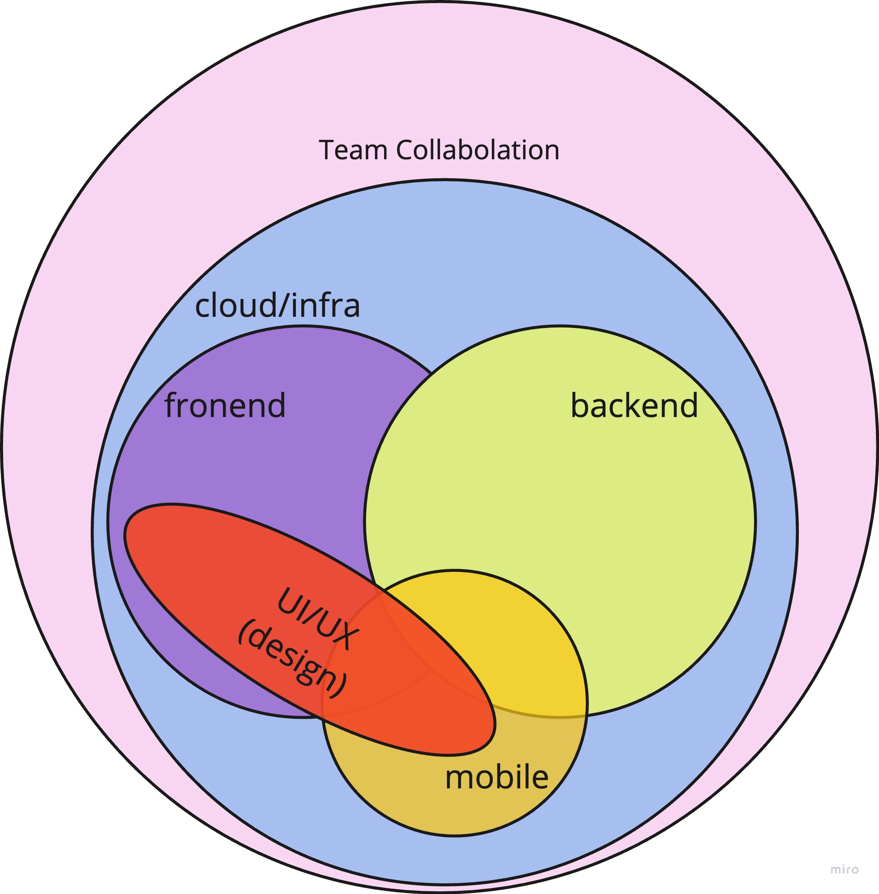

# 0. Introduction

This is a session to look at the differences between modern and traditional web app architecture and the technology stack required for modern web app development.
  - Please take a look at the information listed, talk to other attendees, and find out what you're interested in. Try to get a feel for what modern web app development is like.
  - You may not know what it is the first time you see it, but that's okay. It is enough to know that web development in the past and today are very different, and that the amount and breadth of the technology stack for modern web development is broad.
  - You may find this helpful to come back and look at it again after you've done some hands-on activities, etc.

# 1. Overview of Web App Technology Stack Evolution

## The differences between web app technology stacks from 20 years ago and today.

### Focus on multiple HTML pages vs. single-page apps:

Have a look at the following diagram to get an idea of how this works. More details will be explained in the next chapter.

### Overall differences between web app technology stacks from 20 years ago and today.

This table summarizes the key differences between web app development 20 years ago and today:

|          Aspect         | 20 Years Ago | Today                      |
|:-----------------------:|:------------:|:--------------------------:|
|    Application Architecture | Multiple HTML pages | Single-page apps |
|       Backend Architecture | Monolithic	| Monolithic, Microservices|
|    Frontend Technology Stack | Simple HTML, CSS, JavaScript | Advanced HTML, CSS, JavaScript(include library/framework like React, Angular, Vue.js, etc.) |
|       Backend Technology Stack | PHP, Perl, etc. |  JavaScript(Node.js), Python, Go, Rust, etc.|
|         Database           | RDB	| RDB, NoSQL| 
|        User Interface     | Static, page-based | Dynamic, interactive |
|        User Experience    | Not a priority | Responsive, intuitive, user-friendly |
|     Mobile-first approach | Not common | Optimized for mobile devices first |
|         Data Handling     | Server-side rendering | Client-side rendering |
|         Data Transfer     | Limited | GraphQL, RestAPI |
|          Performance      | Slow load times, page refreshes | Fast load times, smooth transitions |
|         Collaboration     | Mostly solo | Team-based using Git, Jira, Slack, etc. |
|   Development Process     | Waterfall model | Agile development methodologies |
|       Cloud Computing     | Physical servers | AWS, Azure, Google Cloud, etc. |
|          Deployment       | Manual deployment | Continuous deployment and delivery |

Some of the notable differences include:

- multiple HTML pages vs. single-page apps:
  - The standard for web app development about 20 years ago involved using multiple HTML pages, where each page was a separate HTML file and the user had to reload the entire page to navigate between pages. This resulted in slower load times and a less fluid user experience. In contrast, single-page apps (SPAs) have become increasingly popular in modern web app development. SPAs are faster, offer a more seamless user experience, and better performance, but can be more complex to develop and require more advanced technologies like React, Vue, or Angular. SPAs may also have issues with SEO. The shift towards SPAs reflects a larger trend towards building web apps that prioritize user experience and performance, but also require more sophisticated development skills and considerations.
- AJAX: 
  - AJAX(Asynchronous JavaScript and XML) is a technology that allows web applications to dynamically update content without reloading the entire page. AJAX is a powerful technique that can be used to improve the user experience of web pages. AJAX is an essential technology for modern web application development.
- Responsive design: 
  - In the past, web applications were typically designed with a fixed layout that did not adjust to different screen sizes. Today, responsive design is the norm, and web applications are expected to look good and work well on a variety of devices, including desktops, tablets, and smartphones.
- Mobile-first design: 
  - With the rise of smartphones and tablets, many web applications today are designed with a mobile-first approach. This means that the design is optimized for mobile devices, with desktop and tablet layouts being built on top of the mobile design.
- Security: 
  - With the rise of cyber threats, security is now a top concern for web applications. Today, web applications are designed with security features such as SSL encryption, two-factor authentication, and cross-site scripting (XSS) protection.
- Cloud computing: 
  - In the past, web applications were typically hosted on physical servers that had to be maintained and updated by the development team. Today, cloud computing has revolutionized web hosting, making it easier and more affordable to host web applications in the cloud.

# 2. Modern Web App Technology Stack

## a brief overview and correlation of the technology stack required to build modern web applications.

The technology stack required for modern web apps is composed of different layers, including frontend, backend, mobile, UI/UX, and infrastructure technologies, which work together to create a seamless user experience. Although the composition of the team may vary depending on the size of the organization and other factors, successful development and deployment of the application require effective collaboration and communication between team members and external stakeholders, such as clients and users. Agile, XP, TDD, Git, and various project management tools such as Jira, Asana, and Trello can aid in this collaboration and management.

### a brief description of each technology layer in the modern web app development stack:

- Frontend: 
  - This layer is responsible for creating the user interface and user experience of the application, using technologies such as HTML, CSS, JavaScript, and various frontend frameworks like React, Vue, and Angular.
- Backend: 
  - This layer is responsible for handling the business logic and data storage of the application. It uses server-side technologies such as programming languages like Node.js, Python, Ruby, and Java, and various frameworks like Express.js, Nest.js, Django, FastAPI, Spring, Ruby on Rails.
- Mobile: 
  - This layer is responsible for developing mobile applications that work in tandem with the web app. It uses native app development frameworks like Swift, Kotlin, and Java, or cross-platform development frameworks like React Native and Flutter.
- UI/UX: 
  - This layer is responsible for creating a visually appealing and seamless user experience for the application. It uses design tools like Sketch, Figma, and Adobe XD.
- Infrastructure: 
  - This layer is responsible for the deployment, scaling, and management of the application. It uses cloud platforms like AWS, Azure, and GCP, and DevOps tools like Docker, Kubernetes, Ansible, and Terraform.

Each layer requires a different set of skills and expertise, and collaboration between different teams is essential to ensure successful development and deployment of the application.

## a diagram with detailed names (as examples only) of technology stacks required for modern web apps as sticky notes.

The detailed names of the technology stacks required for modern web application development are shown in the examples on the sticky notes. These are just examples; the author has posted stickies with the names of technology stacks that came to mind quickly at the time of writing. Please note that technology is constantly evolving and this information may become outdated at any time.

# 3. Links
- [MDN Web Docs](https://developer.mozilla.org/en-US/docs/Learn)
  - Information about web technologies is collected. There are also tutorials for beginners.
- [microsoft/Web-Dev-For-Beginners](https://microsoft.github.io/Web-Dev-For-Beginners/#/)
  - A curriculum for beginners in Web development offered by Microsoft.
    - [Additional content](https://learn.microsoft.com/en-us/users/wirelesslife/collections/p1ddcy5jwy0jkm) to the above curriculum
      - In addition to the above content, there is a variety of content available on [Microsoft Learn](https://learn.microsoft.com/en-us/training/).
- [web.dev](https://web.dev/)
  - Guidance for modern web development, provided by Google.
- [Developer Roadmaps](https://roadmap.sh/)
  - It provides a collection of roadmaps that guide learners through different paths of web development. Additionally, the roadmaps are updated regularly to keep up with the latest trends and technologies in the field.
- [The State of JS](https://2022.stateofjs.com/en-US/)
  - This website is a compilation of surveys collected from web developers around the world every year.It is a good reference to see the trends and status around JavaScript.Note that the URL changes every year.
