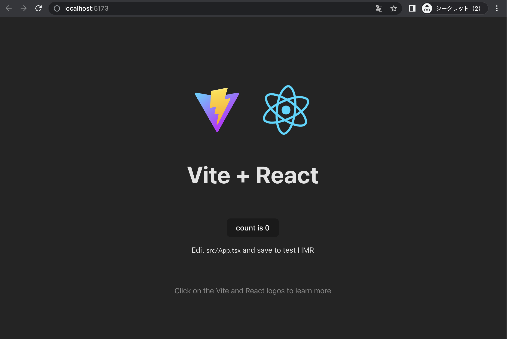
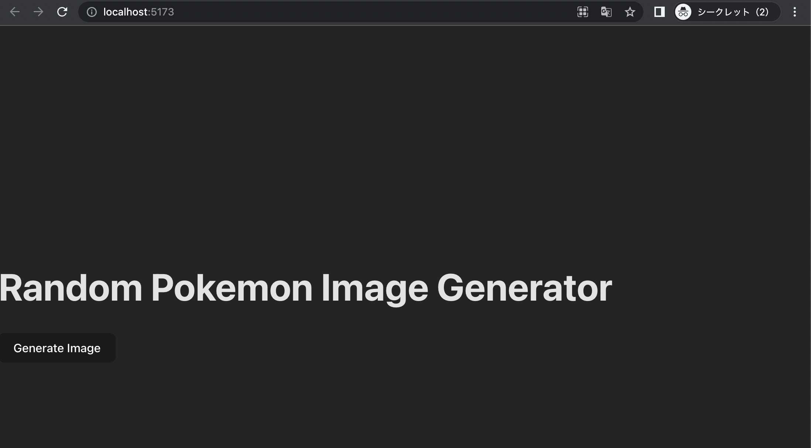

# 0. บทนำ

คอร์ส hands-on นี้ถูกออกแบบมาสำหรับผู้เริ่มต้นในการพัฒนาเว็บแอปพลิเคชันสมัยใหม่ จุดมุ่งหมายไม่ใช่เพื่อเรียนรู้ความรู้จากเนื้อหานี้ แต่เพื่อให้คุณสนใจในการพัฒนาเว็บแอปพลิเคชันสมัยใหม่และทักษะและความรู้ที่จำเป็นสำหรับการพัฒนาด้วยประสบการณ์การพัฒนา
ดังนั้น เราจะไม่อธิบายมากเกี่ยวกับภาษาโปรแกรม tools libraries หรือ โค้ด ลำดับความสำคัญของเราคือการให้คุณได้สัมผัสประสบการณ์ในการพัฒนาเว็บแอปพลิเคชันใช้งานได้ตามที่อธิบายไว้
ลิงค์ไปยังเว็บไซต์ที่สามารถใช้เป็นข้อมูลอ้างอิงจะมีให้ตามความจำเป็น

## สิ่งที่เราจะสร้าง

สร้าง UI อย่างง่ายที่เรียกใช้ API ภายนอกและแสดงข้อมูลนั้นบนหน้าจอ

**หมายเหตุ**:
API ภายนอกสำหรับ hands-on นี้ คือ [PokéAPI](https://pokeapi.co/)  API นี้สามารถใช้งานได้ในขณะที่เขียนข้อความนี้ แต่ไม่สามารถรับประกันความพร้อมใช้งานของ API เมื่อทำ hands-on ในกรณีนี้ กรุณาแทนที่ด้วย API อื่นและนำไปใช้

## สแต็คเทคโนโลยีหลัก

- [Javascript](https://developer.mozilla.org/en-US/docs/Web/JavaScript)/[Typescript](https://www.typescriptlang.org/)
- [React](https://react.dev/)
- [Vite](https://vitejs.dev/)

---
- คำแนะนำ:
  - เหตุผลที่ Typescript ถูกเลือกสำหรับ hands-on และเหตุผลที่ผู้เริ่มต้น JavaScript ควรเรียนรู้ Typescript
    - มีหลายเหตุผลที่ผู้เริ่มต้น JavaScript ควรเรียนรู้ Typescript พร้อมกับ JavaScript
      - Typescript เป็น superset ของ JavaScript ดังนั้นหากคุณมีความรู้เกี่ยวกับ JavaScript คุณสามารถเรียนรู้ Typescript ได้โดยรวดเร็ว
      - Typescript เป็นภาษาที่มีการกำหนดชนิดแบบ statically ทำให้ง่ายต่อการตรวจสอบข้อผิดพลาดเมื่อเทียบกับ JavaScript ซึ่งสามารถเพิ่มประสิทธิภาพในการพัฒนาและป้องกันข้อบกพร่องได้
      - Typescript สามารถทำให้โค้ดใช้ซ้ำง่ายขึ้นด้วยการใช้ไฟล์นิยามชนิด (type definition) ซึ่งสามารถเพิ่มประสิทธิภาพในการบำรุงรักษาโค้ดได้
    - ดังนั้น Typescript เป็นภาษาที่ดีที่มีต้นทุนการเรียนรู้ต่ำ ช่วยเพิ่มประสิทธิภาพในการพัฒนาและการบำรุงรักษาโค้ด และเหมาะสำหรับผู้เริ่มต้น JavaScript อีกทั้งในปัจจุบัน TypeScript ยังเป็นมาตรฐานโดยพฤตินัยในโลกของการพัฒนา
    - หากคุณกำลังเรียนรู้ JavaScript โปรดเรียนรู้ Typescript ด้วย
  - frameworks/libraries สำหรับ UI
    - React เป็นหนึ่งใน frameworks/libraries สำหรับสร้าง UI ยังมี [Vue.js](https://vuejs.org/), [Svelte](https://svelte.dev/), และ [Angular](https://angular.io/) อีกด้วย
    - นอกจากนี้ยังมี Next.js, Nuxt.js, และ SvelteKit เป็น frameworks/libraries สำหรับสร้าง UI โดย frameworks เหล่านี้สร้างบน React, Vue, และ Svelte ตามลำดับและให้คุณสามารถใช้คุณสมบัติเพิ่มเติม เช่น SSR และ tools ที่สะดวก
  - เหตุผลในการใช้ Vite
    - Vite เป็น build tool ที่ให้ความสะดวกในการพัฒนา frontend รวดเร็วและมีประสิทธิภาพ
    - Vite มอบประสบการณ์นักพัฒนาที่มีประสิทธิภาพสูงและสนุกสนานโดยให้เวลาเริ่มต้นที่รวดเร็ว การเปลี่ยน module ด่วนทันที และการรวมและการโหลดซ้ำที่คล่องตัว ส่งผลให้ workflow การพัฒนาราบรื่นและมีประสิทธิภาพ
      - (ในตอนแรก hands-on นี้สร้างขึ้นโดยใช้ React เท่านั้น แต่เพิ่ม Vite เพื่อให้สะดวกและสนุกยิ่งขึ้น)

# 1. การตั้งค่า

## ข้อกำหนดเบื้องต้น

- Node.js 16 หรือสูงกว่า
- Code Editor (เช่น Visual Studio Code)

**หมายเหตุ**:<br>
คำแนะนำในการติดตั้งซอฟต์แวร์ที่จำเป็นซึ่งระบุไว้ที่นี่มีไว้สำหรับผู้ใช้ Windows ที่ไม่ได้ใช้ Powershell หรือ WSL<br>
เนื่องจากผู้ใช้เป้าหมายรายแรกของ hands-on นี้คือผู้ใช้ Windows ที่ไม่ได้ใช้ Powershell หรือ WSL<br>
โปรดทำตามขั้นตอนการติดตั้งซอฟต์แวร์สำหรับสภาพแวดล้อมของคุณเมื่อติดตั้งซอฟต์แวร์จริง


## ขั้นตอนโดยละเอียดสำหรับผู้ใช้ windows

- ติดตั้ง Node.js
  - ไปที่[เว็บไซต์ Node.js](https://nodejs.org/en/) และดาวน์โหลด LTS (Long-Term Support) ล่าสุดของ Node.js สำหรับ Windows เรียกใช้ตัวติดตั้งและปฏิบัติตามคำแนะนำในการติดตั้ง Node.js ในระบบของคุณ
  - เปิด command prompt และยืนยันว่า Node.js และ npm (Node Package Manager) ติดตั้งถูกต้องโดยเรียกใช้คำสั่งต่อไปนี้:
  ```sh
  node --version
  npm --version
  ```
  - ทั้งสองคำสั่งควรแสดง version ที่ติดตั้งบนระบบของคุณ
- ติดตั้ง Visual Studio Code (VS Code)
  - ไปที่ [เว็บไซต์ Visual Studio Code](https://code.visualstudio.com/) และดาวน์โหลดเวอร์ชันล่าสุดของ Visual Studio Code สำหรับ Windows เรียกใช้ตัวติดตั้งและปฏิบัติตามคำแนะนำในการติดตั้ง Visual Studio Code ในระบบของคุณ
- ติดตั้งส่วนขยาย VS Code
  - เมื่อคุณได้ติดตั้ง Visual Studio Code เสร็จแล้ว คุณควรติดตั้งส่วนขยายต่อไปนี้เพื่อเพิ่มประสบการณ์ในการพัฒนาเว็บแอปของคุณ:
  - เปิด Visual Studio Code
  - เปิดแถบส่วนขยายโดยคลิกที่ไอคอนสี่เหลี่ยมด้านซ้ายหรือกดปุ่ม Ctrl+Shift+X
  - ค้นหาส่วนขยายต่อไปนี้และคลิกปุ่ม "Install" ถัดจากแต่ละส่วนขยาย:
    - ESLint
    - Prettier
    - ES7 React/Redux/GraphQL
    - JavaScript (ES6) code snippets
    - **โปรดทราบว่าเทคโนโลยีมีการพัฒนาอย่างต่อเนื่อง และข้อมูลเหล่านี้อาจล้าสมัยได้ทุกเมื่อ**
- (ตัวเลือก) เปิดใช้งาน auto-formatting ใน VSCode
  - **หมายเหตุ**: คุณสามารถใช้ Prettier เพื่อจัดรูปแบบไฟล์โดยอัตโนมัติเมื่อบันทึกใน VSCode มันจะทำการจัดรูปแบบที่น่ารำคาญโดยอัตโนมัติ
  - เปลี่ยนการตั้งค่า "Default Formatter"("defaultFormatter")
    - เปิดการตั้งค่า VSCode (File > Preferences > Settings) หรือใช้ทางลัด (Ctrl+,)
    - ในการตั้งค่า ค้นหา "Default Formatter" หรือ "defaultformatter" และเลือก "Prettier - Code formatter" เป็นตัวจัดรูปแบบเริ่มต้น
  - เปลี่ยนการตั้งค่า "Editor: Format On Save"
    - เปิดการตั้งค่า VSCode (File > Preferences > Settings) หรือใช้ทางลัด (Ctrl+,)
    - ในการตั้งค่า ค้นหา "Editor: Format On Save" หรือ "save" และเปิดใช้งาน "Editor: Format On Save" ตัวเลือกนี้จะจัดรูปแบบโค้ดโดยอัตโนมัติเมื่อคุณบันทึกไฟล์
  - คุณสามารถกำหนดค่า Prettier เพื่อจัดรูปแบบโค้ดตามความต้องการของคุณเอง [โปรดคลิกที่นี่เพื่อดูข้อมูลเพิ่มเติม](https://marketplace.visualstudio.com/items?itemName=esbenp.prettier-vscode)

# 2. ส่วนหลัก (สร้าง UI)

## เริ่มต้นโปรเจกต์ React ใหม่

### 1. สร้างโปรเจกต์ React ใหม่โดยใช้คำสั่ง create-vite

เรียกใช้คำสั่งต่อไปนี้เพื่อเริ่มต้นโครงการ React ใหม่โดยใช้ Create Vite tool:

``` sh
npm create vite@latest first-app -- --template react-ts
```

### 2. เมื่อการติดตั้งเสร็จสิ้น โปรเจกต์ของคุณจะถูกตั้งค่าด้วยพื้นฐาน React+Vite template

ปฏิบัติคำสั่งต่อไปนี้เพื่อเริ่มต้นและตรวจสอบออก

``` sh
cd first-app
npm install
npm run dev
```

คำสั่งนี้จะเริ่มต้นเซิร์ฟเวอร์ Node.js และเปิดหน้าต่างเบราว์เซอร์ใหม่เพื่อแสดงแอปของคุณ



คุณสามารถใช้ Ctrl + c เพื่อหยุดการทำงานของแอป React+Vite ใน command line ของคุณ

### 3. ติดตั้ง axios library เพื่อทำ HTTP requests:

```sh
npm install axios
```

คุณยังสามารถเปิด terminal อื่นเพื่อปฏิบัติคำสั่งด้านบนโดยไม่ต้องหยุดแอป React

## สร้าง component เพื่อแสดง Pokemon แบบสุ่ม

### 1. เปิดไฟล์ src/App.tsx และแทนที่เนื้อหาด้วยโค้ดต่อไปนี้:

```jsx
import { useState } from "react";
import axios from "axios";

// กำหนดของ Pokemon Interface ซึ่งอธิบายโครงสร้างของ Pokemon object ที่ได้รับจาก API
interface Pokemon {
  name: string;
  imageUrl: string;
}

function App() {
  // กำหนดตัวแปรสถานะ pokemon โดยใช้ useState hook
  const [pokemon, setPokemon] = useState<Pokemon | null>(null);
  
  // กำหนดฟังก์ชัน handleClick ที่เรียกใช้เมื่อคลิกปุ่ม "Generate Image"
  const handleClick = async () => {
    try {
      // สร้าง Pokemon ID แบบสุ่มจาก 1~1000 เนื่องจากในปัจจุบันมี Pokémon ประมาณ 1000 ตัว
      const randomId = Math.floor(Math.random() * 1000) + 1;
      // ใช้ axios library เพื่อทำ GET request ไปยัง API ภายนอกที่ส่งคืนข้อมูล Pokemon สำหรับ ID นั้น
      const response = await axios.get(
        `https://pokeapi.co/api/v2/pokemon/${randomId}`
      );
      // ข้อมูลตอบกลับจะถูกเก็บไว้ในตัวแปรสถานะ pokemon โดยใช้ฟังก์ชัน setPokemon
      setPokemon({
        name: response.data.name,
        imageUrl: response.data.sprites.front_default,
      });
    } catch (error) {
      console.error("Error fetching Pokemon:", error);
    }
  };

  // UI ของแอปประกอบด้วยส่วนหัว ปุ่ม "Generate Image" และรูปภาพและชื่อ Pokemon (ถ้ามี) ที่แสดงเมื่อคลิกปุ่ม
  // ตัวแปรสถานะ pokemon ถูกใช้เพื่อแสดงภาพและชื่อ pokemon แบบมีเงื่อนไขโดยใช้ตัวดำเนินการ && หาก pokemon ไม่เป็น null ภาพและชื่อจะแสดงโดยใช้องค์ประกอบ img และ p
  return (
    <div>
      <h1>Random Pokemon Image Generator</h1>
      <button onClick={handleClick}>Generate Image</button>
      {pokemon && (
        <div>
          
          {pokemon.imageUrl && <p>{pokemon.name}</p>}
        </div>
      )}
    </div>
  );
}

export default App;
```

- **หมายเหตุ**:
  - ฉันได้เขียนคำอธิบายของโค้ดในคอมเมนต์ในโค้ดไม่เป็นไรถ้าคุณยังไม่เข้าใจคำอธิบายของโค้ดได้ดีในขณะนี้
- คำแนะนำ:
  - เกี่ยวกับ Component
    - คำอธิบายอย่างตรงไปตรงมาของ React Component คือองค์ประกอบ UI ที่นำมาใช้ซ้ำได้
    - แนวคิดของ component เป็นแนวคิดทั่วไปใน frameworks และ libraries UI สมัยใหม่อื่นๆ เช่น Vue.js, Svelte, Angular เป็นต้น

### 2. เปิดเบราว์เซอร์และไปที่ http://localhost:5173 เพื่อดูแอปพลิเคชัน คลิกที่ปุ่ม "Get Random Pokémon" เพื่อดึงข้อมูล Pokemon สุ่มจาก PokeAPI และแสดงชื่อและรูปภาพของ  Pokemon

หากคุณหยุดแอปไปแล้ว คุณสามารถเรียกใช้คำสั่งต่อไปนี้ได้<br>
ตรวจสอบให้แน่ใจว่าไดเร็กทอรีปัจจุบันอยู่ภายใต้โปรเจ็กต์ React ที่คุณสร้างขึ้นโดยตรง

```sh
npm run dev
```



- **หมายเหตุ**:
  - ได้ปรับใช้ CSS ของเทมเพลตแล้ว เราจะปรับใช้การออกแบบเล็กน้อยในขั้นตอนต่อไป ดังนั้นเราจะปล่อยไว้ตามที่เป็นอยู่

## การ Refactoring

เมื่อเขียนโค้ด สิ่งสำคัญคือต้องจัดระเบียบและอ่านง่าย การ Refactoring คือกระบวนการปรับปรุงโครงสร้างของโค้ดที่มีอยู่โดยไม่เปลี่ยนลักษณะการทำงาน ซึ่งจะทำให้โค้ดง่ายต่อการเข้าใจ บำรุงรักษา และต่อยอดในอนาคต

ในกรณีของเรา เราเริ่มต้นด้วยการเขียนกระบวนการแสดงรูปภาพและเนื้อหาของ Pokemon โดยตรงในไฟล์ App.tsx อย่างไรก็ตาม เมื่อแอปพลิเคชันเริ่มซับซ้อนมากขึ้น เป็นความคิดที่ดีที่จะแยกมันออกเป็นไฟล์ของตัวเองในรูปแบบของ component เพื่อให้โค้ดเป็นระเบียบและเป็นโมดูล

- คำแนะนำ:
    - เกี่ยวกับการ Refactoring ของ component
      - การแยกส่วนรายละเอียดของโค้ดเป็นคอมโพเนนต์สนับสนุนการใช้ซ้ำ การแยกงาน และการบำรุงรักษา อย่างไรก็ตาม การแยกส่วนนี้อาจมีความซับซ้อนและภาระการทำงานเพิ่มขึ้น การตัดสินใจว่าจะแยกส่วนอย่างไรขึ้นอยู่กับขนาด ความซับซ้อน และความต้องการเฉพาะของแอปพลิเคชันของคุณ

### 1. นิยามทุกอย่างที่เกี่ยวข้องกับกระบวนการแสดงรูปภาพแบบสุ่มในไฟล์ App.tsx เป็นฟังก์ชันแยกต่างหากในไฟล์ App.tsx

- **หมายเหตุ**:<br>
การ Refactoring ถูกทำครั้งเดียวในไฟล์เดียวเพื่อทำให้โค้ดง่ายต่อการติดตาม<br>
ขั้นตอนนี้สามารถข้ามไปยังขั้นตอนถัดไปได้

### เปิดไฟล์ src/App.tsx และแทนที่เนื้อหาด้วยโค้ดต่อไปนี้:

```jsx
// App.tsx

import { useState } from "react";
import axios from "axios";

// นิยาม PokemonContainer component
// ทุกสิ่งที่เกี่ยวข้องกับกระบวนการแสดงรูปภาพแบบสุ่มในไฟล์ App.tsx ถูกนิยามใน component นี้
function PokemonContainer() {
  interface Pokemon {
    name: string;
    imageUrl: string;
  }

  const [pokemon, setPokemon] = useState<Pokemon | null>(null);
  
  const handleClick = async () => {
    try {
      const randomId = Math.floor(Math.random() * 1000) + 1;
      const response = await axios.get(
        `https://pokeapi.co/api/v2/pokemon/${randomId}`
      );
      setPokemon({
        name: response.data.name,
        imageUrl: response.data.sprites.front_default,
      });
    } catch (error) {
      console.error("Error fetching Pokemon:", error);
    }
  };

  return (
    <div>
      <h1>Random Pokemon Image Generator</h1>
      <button onClick={handleClick}>Generate Image</button>
      {pokemon && (
        <div>
          
          {pokemon.imageUrl && <p>{pokemon.name}</p>}
        </div>
      )}
    </div>
  );
}

// ใช้ PokemonContainer component
function App() {
  return (
    <div>
      <PokemonContainer />
    </div>
  );
}

export default App;
```

#### เปิดเบราว์เซอร์ของคุณและตรวจสอบแอปพลิเคชันว่ามีการเปลี่ยนแปลงในพฤติกรรมหรือไม่

### 2. แยก PokemonContainer component จาก App.tsx

#### สร้างไฟล์ src/PokemonContainer.tsx และแทนที่เนื้อหาด้วยโค้ดต่อไปนี้:

```jsx
// PokemonContainer.tsx

// ย้ายทุกส่วนที่เกี่ยวข้องกับ PokemonContainer  component ใน App.tsx ไปยังไฟล์นี้
import { useState } from "react";
import axios from "axios";

function PokemonContainer() {
  interface Pokemon {
    name: string;
    imageUrl: string;
  }
  const [pokemon, setPokemon] = useState<Pokemon | null>(null);
  
  const handleClick = async () => {
    try {
      const randomId = Math.floor(Math.random() * 1000) + 1;
      const response = await axios.get(
        `https://pokeapi.co/api/v2/pokemon/${randomId}`
      );
      setPokemon({
        name: response.data.name,
        imageUrl: response.data.sprites.front_default,
      });
    } catch (error) {
      console.error("Error fetching Pokemon:", error);
    }
  };

  return (
    <div>
      <h1>Random Pokemon Image Generator</h1>
      <button onClick={handleClick}>Generate Image</button>
      {pokemon && (
        <div>
          
          {pokemon.imageUrl && <p>{pokemon.name}</p>}
        </div>
      )}
    </div>
  );
}

// สามารถเรียกใช้จาก component อื่นได้
export default PokemonContainer;
```

### เปิดไฟล์ src/App.tsx และแทนที่เนื้อหาด้วยโค้ดต่อไปนี้:

```jsx
// App.tsx

// ลบคำสั่ง import ที่ไม่จำเป็นอีกต่อไป
// PokemonContainer component ถูกนำเข้าเพื่อใช้ใน App.tsx
import PokemonContainer from "./PokemonContainer";

function App() {
  return (
    <div>
      <PokemonContainer />
    </div>
  );
}

export default App;
```

#### เปิดเบราว์เซอร์ของคุณและตรวจสอบแอปพลิเคชันว่ามีการเปลี่ยนแปลงในพฤติกรรมหรือไม่

### 3. แยกกระบวนการที่เกี่ยวข้องกับการแสดงภาพและชื่อออกจาก PokemonContainer.tsx เป็น component ที่แยกต่างหาก

- **หมายเหตุ**:
